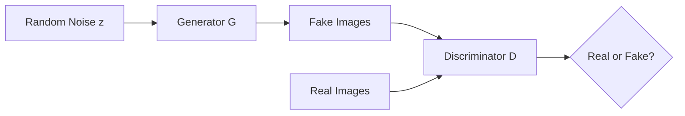

# 图像生成 (Image Generation)

## 1. 背景介绍

### 1.1 问题的由来
随着人工智能技术的快速发展,特别是深度学习的兴起,计算机视觉领域取得了巨大的突破。从图像分类、目标检测到语义分割,深度学习模型展现出了超越人类的性能。然而,这些任务主要是理解和分析现有的图像,而如何让计算机生成逼真、多样化的图像,一直是一个巨大的挑战。图像生成旨在让计算机学会自主创作图像,具有重要的理论意义和应用前景。

### 1.2 研究现状
近年来,图像生成领域涌现出许多创新性的工作。其中最具代表性的是生成对抗网络(Generative Adversarial Networks, GANs)[1]。GANs 由生成器和判别器组成,通过两个网络的对抗学习,生成器可以生成以假乱真的图像。此后,各种改进的 GAN 模型不断涌现,如 DCGAN[2], WGAN[3], BigGAN[4]等,生成图像的质量和分辨率不断提高。

除了 GANs,还有很多其他的图像生成方法。变分自编码器(Variational Autoencoders, VAEs)[5]通过隐变量建模,学习数据的概率分布。扩散模型(Diffusion Models)[6]通过迭代的高斯噪声扰动过程生成高质量图像。自回归模型如 PixelRNN[7]逐像素地生成图像。flow-based 模型[8]学习可逆映射变换。这些方法各有特点,推动了图像生成技术的发展。

### 1.3 研究意义
图像生成具有广泛的应用前景,主要体现在以下几个方面:

1. 计算机辅助设计:自动生成各类图像素材,如服装设计、工业设计等,提高设计效率。
2. 虚拟现实:生成逼真的虚拟场景和人物形象,应用于游戏、电影等娱乐领域。  
3. 数据增强:合成更多训练数据,缓解标注成本,提升其他视觉任务的性能。
4. 创意助手:激发人类灵感,人机协同创作出更加新颖的视觉作品。
5. 图像编辑:通过对隐空间的操控实现图像编辑,如改变人脸属性、图像风格化等。

### 1.4 本文结构
本文将重点介绍图像生成领域的核心概念、主要算法、数学原理以及实践案例。第2部分阐述图像生成的核心概念。第3部分详细讲解 GAN 的算法原理和训练流程。第4部分介绍 GAN 相关的数学模型和理论分析。第5部分以 DCGAN 为例,分享源代码实现和效果展示。第6部分总结图像生成技术的应用场景。第7部分推荐相关学习资源。第8部分展望图像生成的未来发展方向和挑战。

## 2. 核心概念与联系

在介绍具体的图像生成算法之前,我们先来了解一些核心概念:

- 生成式模型:通过学习数据的内在分布,可以生成与训练数据相似的新样本。常见的生成式模型有 GAN、VAE、flow-based 模型等。它与判别式模型相对,后者主要用于分类和回归任务。
- 隐空间:又称为潜在空间,是一个低维连续向量空间,用于表征数据的高层语义特征。生成模型通过从隐空间采样,然后解码生成图像。隐空间的结构和分布对生成质量至关重要。
- 对抗学习:GANs 的核心思想。生成器试图生成以假乱真的样本欺骗判别器,判别器则要尽可能分辨真假样本。两个网络互相博弈,最终达到纳什均衡,生成器可生成逼真的图像。

这些概念环环相扣,共同构建起图像生成的理论基础。生成式模型定义了问题的框架,隐空间是生成过程的中间表征,对抗学习则是优化生成模型的重要方法。

## 3. 核心算法原理 & 具体操作步骤

### 3.1 算法原理概述

GAN 由生成器(Generator)和判别器(Discriminator)组成,如 Fig 1 所示。生成器 G 将随机噪声 z 映射为生成图像 G(z),判别器 D 将图像映射为 (0,1) 之间的标量,代表输入为真实图像的概率。训练过程中,生成器 G 试图最小化目标函数,而判别器 D 试图最大化目标函数,两个网络互相对抗,最终达到纳什均衡。

Fig 1. GAN 结构示意图

形式化地,GAN 的目标函数可以表示为:

$$\min_G \max_D V(D,G) = \mathbb{E}_{x \sim p_{data}(x)}[\log D(x)] + \mathbb{E}_{z \sim p_z(z)}[\log (1-D(G(z)))]$$

其中 $p_{data}$ 为真实数据分布, $p_z$ 为隐空间的先验分布,通常为各向同性的高斯分布或均匀分布。

### 3.2 算法步骤详解

GAN 的训练流程可分为以下步骤:

1. 初始化生成器 G 和判别器 D 的参数
2. 重复以下步骤直到收敛:
   a. 从真实数据分布 $p_{data}$ 中采样一批真实图像样本 $\{x^{(1)}, \dots, x^{(m)}\}$
   b. 从先验分布 $p_z$ 中采样一批随机噪声 $\{z^{(1)}, \dots, z^{(m)}\}$
   c. 生成一批假图像样本 $\{\tilde{x}^{(1)}, \dots, \tilde{x}^{(m)}\}$,其中 $\tilde{x}^{(i)} = G(z^{(i)})$  
   d. 更新判别器 D 的参数,最大化目标函数:
      $$\nabla_{\theta_d} \frac{1}{m} \sum_{i=1}^m [\log D(x^{(i)}) + \log (1-D(\tilde{x}^{(i)}))]$$
   e. 更新生成器 G 的参数,最小化目标函数: 
      $$\nabla_{\theta_g} \frac{1}{m} \sum_{i=1}^m \log (1-D(G(z^{(i)})))$$

其中 $\theta_d$ 和 $\theta_g$ 分别表示判别器和生成器的参数, m 为小批量样本数。步骤 d 和 e 可以用梯度上升/下降等优化算法实现。

### 3.3 算法优缺点

GAN 的优点主要有:
1. 生成图像质量高,细节丰富,接近真实分布
2. 可以生成新颖多样的图像,具有一定创造性
3. 通过隐空间插值、编辑实现图像操控
4. 可扩展到多种数据形态,如视频、音频等

GAN 的缺点包括:
1. 训练不稳定,容易出现模式崩溃等问题  
2. 评价生成质量缺乏统一的指标
3. 难以控制生成图像的语义
4. 需要大量数据和算力支持

### 3.4 算法应用领域

GAN 在很多领域得到了应用,例如:

- 图像翻译:在两个图像域之间建立映射,如风格迁移、图像去噪等
- 图像编辑:通过改变隐向量实现改变人脸属性、表情等
- 超分辨率:从低分辨率图像生成高分辨率图像
- 图像补全:根据图像的局部信息填补缺失区域
- 文本到图像生成:根据文本描述生成相应的图像

## 4. 数学模型和公式 & 详细讲解 & 举例说明

### 4.1 数学模型构建

GAN 的数学模型可以用博弈论中的二人零和博弈来描述。生成器 G 和判别器 D 是两个玩家,每个玩家试图最大化自己的收益。博弈的均衡点就是纳什均衡,此时任一玩家都无法单方面改变策略以获得更高收益。

我们定义生成器 G 的策略为 $p_g$,即生成数据的分布。判别器 D 的策略为 $D(x)$,代表将输入 x 判别为真实样本的概率。则博弈的收益函数可以表示为:

$$U(p_g, D) = \mathbb{E}_{x \sim p_{data}}[\log D(x)] + \mathbb{E}_{x \sim p_g}[\log (1-D(x))]$$

生成器 G 的目标是最小化该函数,而判别器 D 的目标是最大化该函数。

### 4.2 公式推导过程

下面我们推导 GAN 的目标函数。首先考虑对于固定的生成器 G,判别器 D 的最优策略。对 $U(p_g, D)$ 求关于 $D(x)$ 的变分导数,并令其等于0:

$$\frac{\delta U}{\delta D(x)} = \frac{p_{data}(x)}{D(x)} - \frac{p_g(x)}{1-D(x)} = 0$$

解得:

$$D^*(x) = \frac{p_{data}(x)}{p_{data}(x) + p_g(x)}$$

这就是判别器的最优策略,即真实数据的后验概率。将 $D^*(x)$ 代入 $U(p_g, D)$,得到:

$$\begin{aligned}
C(G) &= \max_D U(p_g, D) \\
&= \mathbb{E}_{x \sim p_{data}}[\log \frac{p_{data}(x)}{p_{data}(x) + p_g(x)}] + \mathbb{E}_{x \sim p_g}[\log \frac{p_g(x)}{p_{data}(x) + p_g(x)}] \\
&= -\log 4 + 2 \cdot JSD(p_{data} \| p_g)
\end{aligned}$$

其中 $JSD$ 表示 Jensen-Shannon 散度,是一种衡量两个分布之间差异的度量。当 $p_g=p_{data}$ 时,JSD 取得最小值 $-\log 4$。因此,生成器 G 的目标就是最小化 $JSD(p_{data} \| p_g)$,使生成分布 $p_g$ 尽可能接近真实分布 $p_{data}$。

### 4.3 案例分析与讲解

我们以判别二维高斯分布为例,直观展示 GAN 的训练过程。设真实数据服从均值为 (0,0),协方差矩阵为单位矩阵的二维高斯分布。生成器 G 和判别器 D 都是三层的多层感知机。

Fig 2 展示了训练过程中生成器的变化。初始时,生成样本几乎覆盖整个空间。随着训练的进行,生成样本逐渐向真实分布聚拢,最终与真实分布基本重合。判别器的决策边界也逐渐贴合真实分布的轮廓。

 
Fig 2. GAN 生成二维高斯分布的训练过程

### 4.4 常见问题解答

Q: GAN 训练不稳定的原因是什么?应该如何改进?

A: GAN 训练的不稳定性主要来自以下几个方面:
1. 判别器训练过强,导致生成器梯度消失。解决方法包括控制判别器的更新频率,使用 Wasserstein 距离等。
2. 生成器更新方向与真实分布相悖。可以给判别器添加噪声,限制其能力。
3. 模式崩溃,生成器只生成少数几种图像。可以用 minibatch discrimination、MRGAN 等方法缓解。

此外,一些训练技巧如 feature matching、historical averaging 等也有助于提升 GAN 的稳定性。

Q: GAN 和 VAE 的区别和联系是什么?

A: GAN 和 VAE 都是生成式模型,但原理不同。GAN 通过判别器指导生成器学习,是一种隐式生成模型,没有显式定义生成分布。VAE