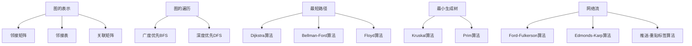

# 图算法 原理与代码实例讲解

## 1. 背景介绍

### 1.1 问题的由来

在现实世界中,许多复杂的系统和问题都可以用图(Graph)的数据结构来表示和建模。图广泛应用于社交网络、网络拓扑、Web结构、交通路线规划、计算机网络等诸多领域。随着大数据时代的到来,处理大规模复杂图结构数据的需求与日俱增。因此,高效的图算法对于解决实际问题至关重要。

### 1.2 研究现状

图算法是算法理论研究的重要分支,已有数十年的研究历史。经典的图算法包括最短路径算法(如Dijkstra算法)、最小生成树算法(如Kruskal算法和Prim算法)、网络流算法、图遍历算法(如BFS和DFS)等。随着计算能力的提高和应用场景的扩展,近年来图算法的研究也不断深入,涌现出一些新的算法和优化技术。

### 1.3 研究意义

研究高效的图算法具有重要的理论意义和应用价值:

- 理论意义:图算法是算法设计和复杂性分析的重要研究对象,对算法理论的发展具有深远影响。
- 应用价值:高效的图算法可以解决许多现实问题,如网络路由、社交网络分析、Web搜索排名等,对科技发展和社会进步具有重要意义。

### 1.4 本文结构

本文将全面介绍图算法的核心概念、算法原理、数学模型、代码实现和应用场景。内容包括:

1. 图的基本概念和表示方法
2. 经典图算法(如最短路径、最小生成树等)的原理和实现
3. 图算法相关的数学模型和公式推导
4. 基于实际项目的代码示例和详细解释
5. 图算法在各领域的应用实践
6. 相关工具、资源和发展趋势探讨

## 2. 核心概念与联系



图(Graph)是一种重要的非线性数据结构,由一组顶点(Vertex)和连接顶点的边(Edge)组成。图可以表示多种现实系统和复杂关系,是研究图算法的基础。

常用的图表示方法有:

- 邻接矩阵(Adjacency Matrix)
- 邻接表(Adjacency List) 
- 关联矩阵(Incidence Matrix)

图的遍历是图算法的基础操作,包括广度优先遍历(BFS)和深度优先遍历(DFS)。

常见的经典图算法包括:

- 最短路径算法:Dijkstra、Bellman-Ford、Floyd等
- 最小生成树算法:Kruskal、Prim等  
- 网络流算法:Ford-Fulkerson、Edmonds-Karp、推送-重贴标签等

这些算法在不同场景下具有各自的优缺点和适用性,相互之间也存在内在联系。掌握图的核心概念和经典算法原理是深入研究图算法的基础。

## 3. 核心算法原理 & 具体操作步骤  

### 3.1 算法原理概述

#### 3.1.1 最短路径算法

**Dijkstra算法**

Dijkstra算法用于计算加权正图(非负权值)中单源最短路径问题。算法基于贪心策略,每次从源点出发扩展到离源点最近的顶点,直到找到目标顶点为止。时间复杂度为O(E*logV),其中E为边数,V为顶点数。

**Bellman-Ford算法** 

Bellman-Ford算法可以处理有负权值的图,用于解决单源最短路径问题。算法基于动态规划思想,通过边权值的松弛操作逐步更新最短路径估计值,直到所有最短路径确定为止。时间复杂度为O(V*E)。

**Floyd算法**

Floyd算法用于求解任意两点间的最短路径,可以处理有负权值的图(但不能有负权回路)。算法基于动态规划,通过k个中间点逐步缩小最短路径的范围,最终得到所有最短路径。时间复杂度为O(V^3)。

#### 3.1.2 最小生成树算法

**Kruskal算法**

Kruskal算法用于求解加权无向连通图的最小生成树。算法基于贪心策略,按照边的权值从小到大依次选取不构成回路的边,直到所有顶点被连通为止。时间复杂度为O(E*logE)。

**Prim算法**

Prim算法也用于求解加权无向连通图的最小生成树。与Kruskal不同,Prim算法是以点为中心,每次从已选取的顶点集合中选取与未选取顶点集合之间权值最小的边。时间复杂度为O(E*logV)。

#### 3.1.3 网络流算法

**Ford-Fulkerson算法**

Ford-Fulkerson算法用于求解网络中的最大流量。算法基于增广路径思想,反复寻找残留网络中的增广路径并沿着该路径增广流量,直到找不到增广路径为止。

**Edmonds-Karp算法**

Edmonds-Karp算法是Ford-Fulkerson算法的改进版本,在寻找增广路径时采用BFS策略,可以更快地找到流量最大的增广路径。

**推送-重贴标签算法**

推送-重贴标签算法也是求解网络最大流的算法,基于前缀路径思想。算法通过推送和重贴标签操作来调节流量,从而达到最大化网络流量。

### 3.2 算法步骤详解

#### 3.2.1 Dijkstra算法步骤

输入:加权正图G(V,E)和源点s
输出:从s到其他每个顶点v的最短路径估计值d[v]

1) 初始化:
    对所有顶点v∈V,设置d[v]=∞
    设置d[s]=0,s为已知最短路径顶点

2) 循环:
    选取未被访问的d[u]最小值的顶点u
    将u加入已访问顶点集合
    对u的每个邻居v:
        如果d[v] > d[u] + w(u,v) 
            更新d[v] = d[u] + w(u,v)

3) 重复2)直到所有顶点都被访问过

4) 返回d数组作为最终结果

```python
from collections import defaultdict
import heapq

def dijkstra(graph, source):
    # 初始化距离字典
    distances = {node: float('inf') for node in graph}
    distances[source] = 0

    # 创建优先队列
    pq = [(0, source)]

    while pq:
        # 取出当前距离最小的节点
        current_dist, current_node = heapq.heappop(pq)

        # 如果当前节点已经处理过,则跳过
        if current_dist > distances[current_node]:
            continue

        # 更新当前节点的邻居节点距离
        for neighbor, weight in graph[current_node].items():
            distance = current_dist + weight
            if distance < distances[neighbor]:
                distances[neighbor] = distance
                heapq.heappush(pq, (distance, neighbor))

    return distances
```

上述Python代码实现了Dijkstra算法,使用优先队列(堆)来高效地选取当前距离最小的节点。时间复杂度为O(E*logV)。

#### 3.2.2 Kruskal算法步骤 

输入:加权无向连通图G(V,E)
输出:最小生成树的边集合T

1) 初始化:
    按照边的权值从小到大对所有边进行排序
    初始化并查集,每个顶点自成一个集合

2) 遍历所有边e(u,v):
    如果u和v不在同一个集合中:
        将u和v所在集合合并
        将边e加入最小生成树T

3) 重复2)直到遍历完所有边

4) 返回T作为最小生成树

```python
from collections import defaultdict

class Graph:
    def __init__(self, vertices):
        self.vertices = vertices
        self.edges = []
        self.graph = defaultdict(list)

    def add_edge(self, u, v, weight):
        self.graph[u].append((v, weight))
        self.graph[v].append((u, weight))
        self.edges.append((weight, u, v))

    def find(self, parent, i):
        if parent[i] == i:
            return i
        return self.find(parent, parent[i])

    def union(self, parent, rank, x, y):
        xroot = self.find(parent, x)
        yroot = self.find(parent, y)

        if rank[xroot] < rank[yroot]:
            parent[xroot] = yroot
        elif rank[xroot] > rank[yroot]:
            parent[yroot] = xroot
        else:
            parent[yroot] = xroot
            rank[xroot] += 1

    def kruskal(self):
        result = []
        i = 0
        e = 0
        self.edges = sorted(self.edges, key=lambda x: x[0])
        parent = []
        rank = []

        for node in range(self.vertices):
            parent.append(node)
            rank.append(0)

        while e < self.vertices - 1:
            u, v, w = self.edges[i]
            i += 1
            x = self.find(parent, u)
            y = self.find(parent, v)

            if x != y:
                e += 1
                result.append([u, v, w])
                self.union(parent, rank, x, y)

        return result
```

上述Python代码实现了Kruskal算法,使用并查集数据结构来高效合并集合。时间复杂度为O(E*logE)。

#### 3.2.3 Ford-Fulkerson算法步骤

输入:流量网络G(V,E)、源点s、汇点t
输出:最大流量值

1) 初始化:
    所有边的流量值初始化为0
    残留网络R = G

2) 在残留网络R中寻找从s到t的增广路径p
    如果找不到增广路径,算法结束

3) 计算增广路径p的残余容量c
    c = min{所有边(u,v)∈p的残余容量}

4) 沿着增广路径p增广流量c
    对每条边(u,v)∈p:
        如果(u,v)∈E(G),则f(u,v) += c
        如果(v,u)∈E(G),则f(v,u) -= c
    更新残留网络R

5) 重复2)-4)直到找不到增广路径

6) 返回所有边的流量之和作为最大流量

```python
from collections import defaultdict, deque

def ford_fulkerson(graph, source, sink):
    flow = defaultdict(int)
    max_flow = 0

    def bfs(source, sink, parent):
        visited = defaultdict(bool)
        queue = deque()
        queue.append(source)
        visited[source] = True

        while queue:
            u = queue.popleft()

            for v in graph[u]:
                if not visited[v] and graph[u][v] > 0:
                    queue.append(v)
                    visited[v] = True
                    parent[v] = u

        return True if visited[sink] else False

    def min_flow(source, sink, parent):
        flow = float('inf')
        s = sink

        while s != source:
            flow = min(flow, graph[parent[s]][s])
            s = parent[s]

        return flow

    parent = defaultdict(int)

    while bfs(source, sink, parent):
        path_flow = min_flow(source, sink, parent)
        max_flow += path_flow

        v = sink
        while v != source:
            u = parent[v]
            flow[u][v] += path_flow
            flow[v][u] -= path_flow
            v = u

    return max_flow
```

上述Python代码实现了Ford-Fulkerson算法,使用BFS寻找增广路径,时间复杂度为O(E*|f|),其中|f|为最大流量值。

### 3.3 算法优缺点

#### 3.3.1 Dijkstra算法

优点:
- 算法思路简单,容易理解和实现
- 可以高效解决单源最短路径问题
- 适用于加权正图

缺点:
- 无法处理负权值边
- 对于大规模图,时间复杂度较高

#### 3.3.2 Kruskal算法

优点:
- 算法思路简单,容易理解和实现
- 可以高效求解最小生成