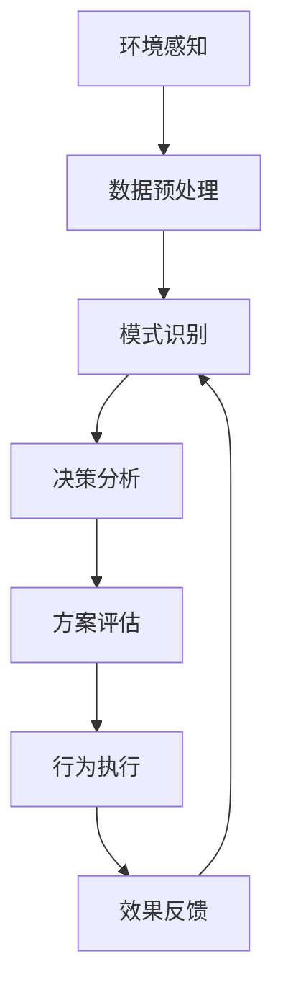

# 在智慧城市中部署AI代理的工作流与应用

## 1. 背景介绍

### 1.1 问题的由来

随着城市化进程的加快,人口的快速集聚使得城市面临着交通拥堵、环境污染、能源消耗等一系列挑战。为了应对这些挑战,智慧城市(Smart City)的概念应运而生。智慧城市旨在利用物联网(IoT)、大数据分析、人工智能(AI)等新兴技术,实现城市运营的智能化和可持续发展。

在智慧城市的建设中,人工智能代理(AI Agent)扮演着关键角色。AI代理是指具有一定自主性、可以感知环境并作出决策的软件实体。它们可以部署在智慧城市的各个领域,如交通管理、环境监测、能源优化等,协助人类管理和优化城市运营。

### 1.2 研究现状

目前,已有一些城市开始探索在特定领域部署AI代理的应用。例如,在交通管理领域,AI代理可以根据实时交通数据动态调整信号灯时间,缓解拥堵;在环境监测领域,AI代理可以分析空气质量数据,预测污染热点并提出应对措施。

然而,在全面推广AI代理应用之前,我们仍需要解决一些关键问题,如AI代理的工作流程设计、与现有系统的集成、安全性和可解释性等。此外,不同应用场景对AI代理的需求也有所不同,需要进行个性化的设计和优化。

### 1.3 研究意义

成功部署AI代理将为智慧城市建设带来诸多益处:
1. 提高城市运营效率,优化资源配置;
2. 增强城市的适应能力,更好应对不确定性挑战;
3. 促进人工智能技术在实际场景中的应用,推动技术创新。

因此,研究AI代理在智慧城市中的工作流程和应用具有重要的理论和实践意义。

### 1.4 本文结构  

本文将从以下几个方面对智慧城市中AI代理的工作流程和应用进行深入探讨:

1. 核心概念与联系
2. 核心算法原理与具体操作步骤  
3. 数学模型和公式详细讲解与案例分析
4. 项目实践:代码实例和详细解释说明
5. 实际应用场景分析
6. 工具和资源推荐
7. 未来发展趋势与挑战总结
8. 常见问题与解答

## 2. 核心概念与联系

在探讨AI代理的工作流程和应用之前,我们需要明确几个核心概念及其内在联系。

### 2.1 智慧城市(Smart City)

智慧城市是一种新型城市发展模式,它利用物联网、云计算、大数据和人工智能等新兴信息技术,将城市的各种资源进行智能化整合,从而实现城市运营的高效、绿色、智能和可持续发展。

智慧城市的核心是通过采集和分析海量数据,深入了解城市运行状态,发现问题,并提出智能化解决方案。这就需要AI代理等智能系统的支持。

### 2.2 人工智能代理(AI Agent)

人工智能代理是指能够自主感知环境、分析数据、做出决策并执行行为的智能软件实体。AI代理通常由以下几个关键模块组成:

- **感知模块**: 从环境中获取数据,如视频流、传感器数据等。
- **知识库**: 存储领域知识、规则、历史数据等。  
- **决策模块**: 基于感知数据、知识库和决策算法做出判断和决策。
- **执行模块**: 根据决策结果执行相应的行为,如控制actuator等。
- **交互模块**: 与人类或其他代理进行交互,接收指令或发送报告。
- **学习模块**: 根据反馈数据持续优化决策模型。

AI代理可以部署在智慧城市的各个领域,如交通管理、环境监测、能源优化等,协助人类实现智能化运营。

### 2.3 多代理系统(Multi-Agent System)

在复杂的智慧城市场景中,通常需要多个AI代理协同工作,形成多代理系统(Multi-Agent System)。多代理系统中的代理可以是同构的(执行相同任务)或异构的(执行不同任务),它们通过协作、竞争或谈判等方式相互影响,共同完成复杂任务。

设计高效的多代理系统需要解决代理之间的通信、协作、任务分配、冲突解决等问题,这是一个具有挑战性的研究领域。

### 2.4 AI代理工作流程

AI代理的工作流程通常包括以下几个主要阶段:

1. **环境感知**: 通过各种传感器获取环境数据,如交通流量、空气质量等。
2. **数据预处理**: 对原始数据进行清洗、融合、标准化等预处理,为后续分析做准备。  
3. **模式识别**: 应用机器学习算法识别数据中的模式和规律,如交通拥堵模式、污染扩散模式等。
4. **决策分析**: 基于模式识别结果、领域知识和决策算法(如规则引擎、优化算法等)生成一个或多个决策方案。
5. **方案评估**: 根据预定义的目标函数(如效率、成本、环境影响等)评估各个决策方案的优劣。
6. **行为执行**: 选择最优决策方案并执行相应的行为,如控制红绿灯、调度清洁车辆等。
7. **效果反馈**: 监测执行效果,收集反馈数据,用于持续优化决策模型。

该工作流程环环相扣,并可根据具体应用场景进行定制化设计。接下来我们将详细介绍其中的核心算法原理和数学模型。

## 3. 核心算法原理与具体操作步骤

### 3.1 算法原理概述

AI代理的核心算法主要包括以下几个方面:

1. **机器学习算法**: 用于从环境数据中发现模式和规律,如交通流量预测、空气质量评估等。常用的算法有神经网络、决策树、聚类分析等。

2. **规则引擎**: 将领域知识和专家经验形式化为一系列规则,用于指导决策过程。规则引擎能够处理复杂的业务逻辑,并具有良好的可解释性。

3. **优化算法**: 在满足一定约束条件下,寻找最优化的决策方案。常用的算法有线性规划、动态规划、启发式搜索等。

4. **多智能体协作算法**: 在多代理系统中,需要设计合理的协作机制,如基于拍卖的任务分配、基于契约网的协作等。

5. **强化学习算法**: AI代理可以通过不断尝试和反馈,优化自身的决策策略,实现持续自我完善。常用算法有Q-Learning、策略梯度等。

上述算法往往需要相互配合,共同完成AI代理的感知、决策和执行任务。接下来我们将重点介绍其中的机器学习算法和优化算法的具体原理和步骤。

### 3.2 算法步骤详解

#### 3.2.1 机器学习算法

以交通流量预测为例,机器学习算法的步骤如下:

1. **数据收集**:从路侧感应器、视频监控等设备收集历史交通流量数据。

2. **数据预处理**:对原始数据进行清洗、标准化、切分等,将其转换为算法可识别的格式。

3. **特征工程**:从原始数据中提取对预测目标有影响的特征,如路段属性、天气、时间等。

4. **模型构建**:选择合适的机器学习算法(如ARIMA、LSTM等)构建预测模型,并在训练数据上进行模型训练。

5. **模型评估**:在测试数据上评估模型的预测性能,如均方根误差(RMSE)等指标。

6. **模型优化**:根据评估结果,通过调整超参数、特征选择等方式优化模型。

7. **模型部署**:将优化后的模型部署到AI代理的生产环境中,用于实时预测。

8. **持续优化**:持续收集新的交通数据,定期重新训练模型以提高预测准确性。

在实际应用中,我们还需要考虑模型的在线更新、异常处理、可解释性等问题。

#### 3.2.2 优化算法

以交通路径规划为例,优化算法的步骤如下:

1. **问题建模**:将路径规划问题形式化为一个优化问题,确定目标函数(如行程时间、拥堵程度等)和约束条件(如单向路、限高限重等)。

2. **图构建**:将道路网络抽象为一个加权图,节点代表路口,边代表路段及其属性(长度、限速等)。

3. **算法选择**:根据问题特点选择合适的优化算法,如Dijkstra算法(无权最短路径)、A*算法(最短路径)、蚁群算法(动态路径规划)等。

4. **算法实现**:按照算法流程,编写代码实现路径搜索过程。

5. **结果评估**:将算法输出的最优路径与实际情况进行对比,评估其优化效果。

6. **算法优化**:根据评估结果,通过调整算法参数、启发式函数等方式优化算法性能。

7. **算法部署**:将优化后的算法集成到AI代理的决策模块中,用于实时路径规划。

8. **动态调整**:持续监测路况变化,及时更新图结构和边权重,动态调整规划路径。

优化算法的设计需要权衡目标函数、约束条件、计算复杂度等多个因素,并根据具体场景进行算法选型和定制化优化。

### 3.3 算法优缺点

上述算法在智慧城市AI代理中的应用具有以下优缺点:

**优点**:
- 机器学习算法能够自动从海量数据中发现隐藏的模式和规律,提高预测和决策的准确性。
- 优化算法能够在满足多重约束条件的情况下,寻找最优解,最大化资源利用效率。
- 规则引擎和多智能体协作算法赋予了AI代理一定的自主决策和协作能力。
- 强化学习算法使AI代理具备持续学习和自我完善的能力,适应复杂动态环境。

**缺点**:
- 机器学习算法存在"黑盒"问题,决策过程缺乏可解释性,可能导致不可预测的风险。
- 优化算法通常基于理想化的模型和假设,在实际复杂场景中可能效果不佳。
- 规则引擎和多智能体协作算法的设计复杂,需要大量的领域知识和人工经验。
- 强化学习算法收敛慢,在探索和利用之间寻求平衡具有一定挑战性。

因此,在实际应用中需要根据场景特点,权衡各种算法的优缺点,并进行有效的集成和优化。

### 3.4 算法应用领域

AI代理的核心算法可以应用于智慧城市的多个领域,包括但不限于:

1. **交通管理**:交通流量预测、路径规划、信号控制等。
2. **环境监测**:空气/水质量评估、污染源追踪、生态监测等。
3. **能源优化**:用能需求预测、智能调度、可再生能源集成等。  
4. **公共安全**:犯罪预测、视频监控、应急响应等。
5. **城市规划**:人口迁移模拟、设施选址、土地利用优化等。
6. **智慧医疗**:疾病风险评估、就医路径规划、智能辅助诊断等。
7. **智能制造**:工艺流程优化、产品质量预测、供应链管理等。

上述领域中的具体应用场景在后续章节中将有更详细的介绍和案例分析。

## 4. 数学模型和公式详细讲解与举例说明  

在AI代理的算法中,通常需要构建数学模型