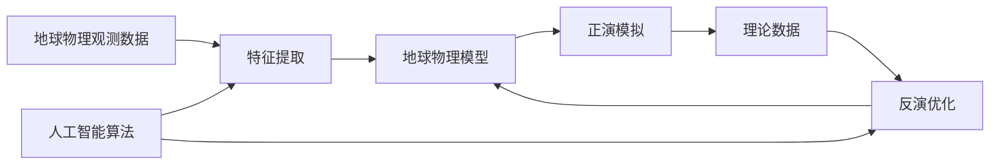

# 地球物理模型与人工智能

关键词：地球物理、人工智能、机器学习、深度学习、数学模型、地震勘探、油气开采

## 1. 背景介绍

### 1.1 问题的由来
地球物理学是研究地球内部结构、物理性质和动力学过程的科学。传统的地球物理勘探和资源开发依赖于对地下介质的物理性质进行测量和分析,如地震波速度、电阻率、密度等。然而,地下介质的物理性质通常具有非线性、非均匀、各向异性等复杂特征,给地球物理反演和解释带来了巨大挑战。

### 1.2 研究现状
近年来,人工智能技术的快速发展为解决复杂地球物理问题提供了新的思路和方法。机器学习和深度学习算法可以从海量地球物理数据中自动提取特征,建立高精度的地下介质物性预测模型。国内外学者已经在地震成像、油气藏表征、岩性预测等领域取得了显著进展。但目前的研究大多局限于单一物理量的分析,缺乏多物理场联合反演的有效方法。

### 1.3 研究意义 
地球物理模型与人工智能的结合有望突破传统方法的局限性,实现地下介质物性参数的高精度预测和油气资源的高效开发。一方面,机器学习可以充分利用不同尺度、不同物理场的观测数据,揭示地下介质的内在规律。另一方面,深度学习网络可以学习地球物理正反演中的复杂非线性映射关系,大幅提高反演精度和计算效率。这对于油气勘探开发、地下工程建设、地震灾害预警等领域具有重要意义。

### 1.4 本文结构
本文将系统阐述地球物理模型与人工智能的融合应用。第2节介绍相关的核心概念。第3节讨论机器学习在地球物理反演中的算法原理和实现步骤。第4节建立地球物理多尺度联合反演的数学模型,并给出公式推导和案例分析。第5节展示基于深度学习的地震成像和油气藏预测的代码实现。第6节总结地球物理与人工智能结合的实际应用场景和未来展望。第7节推荐相关学习资源和开发工具。第8节对全文进行总结,并指出未来的发展趋势和挑战。第9节列出常见问题解答。

## 2. 核心概念与联系

地球物理模型是描述地下介质物理性质空间分布的数学表达式,常见的物理量包括:
- 地震波速度(P波、S波) 
- 密度
- 电阻率
- 磁化率
- 介电常数

这些物理量与地下岩性、孔隙度、流体性质等地质属性密切相关。地球物理正演是根据已知的介质模型计算理论观测响应的过程,如合成地震记录、视电阻率曲线等。反演则是利用实际观测数据估计介质模型参数的过程。

人工智能是研究、开发用于模拟、延伸和扩展人的智能的理论、方法、技术及应用系统的技术科学。机器学习是人工智能的核心,它通过对数据进行统计分析,从中学习规律和知识,并对未知数据进行预测。常见的机器学习算法包括:
- 监督学习:支持向量机、随机森林、神经网络等
- 非监督学习:K-means聚类、主成分分析等  
- 强化学习:Q学习、策略梯度等

深度学习是机器学习的一个分支,它利用多层神经网络对高维数据进行特征提取和抽象,在语音识别、计算机视觉等领域取得了突破性进展。

将机器学习和深度学习引入地球物理反演,可以从以下几个方面改进传统方法:
1. 数据驱动的特征学习。不同于人工设计特征,深度学习可以自适应地学习数据内在的多尺度模式。
2. 复杂非线性映射。深度神经网络可以拟合地球物理正反演中的非线性关系,克服了传统线性化方法的局限性。 
3. 多源数据融合。机器学习可以方便地融合不同物理场、不同尺度的观测数据,实现全方位约束。
4. 快速迭代更新。基于梯度下降的网络训练可以快速迭代优化,大幅提高反演效率。

下图展示了地球物理模型与人工智能的关系:

## 3. 核心算法原理 & 具体操作步骤

### 3.1 算法原理概述
机器学习在地球物理反演中的应用可以分为两类:
1. 将机器学习作为数据处理和特征提取的工具,然后代入传统反演方法。
2. 直接用机器学习方法替代传统反演,端到端地建立观测数据到介质参数的映射。

第一类方法中,常用的机器学习技术包括字典学习、稀疏编码、自编码器等。这些方法可以从原始数据中自适应地提取多尺度、稀疏的特征,压缩数据维度,去除噪声干扰,为后续反演提供优质的输入。

第二类方法则是构建一个以观测数据为输入,以介质参数为输出的机器学习模型,通过训练使其拟合真实的地球物理映射关系。这里的机器学习模型可以是支持向量回归、随机森林、神经网络等。模型训练时,需要大量的真实观测数据和对应的介质参数作为样本。

近年来,以卷积神经网络(CNN)为代表的深度学习方法在图像处理领域取得了巨大成功,因此被广泛应用于地震成像、油气藏预测等任务。一个典型的CNN由多个卷积层、池化层和全连接层组成,可以提取数据的局部和全局特征。相比传统机器学习,深度学习具有更强的非线性拟合能力和端到端的建模优势。

### 3.2 算法步骤详解
下面以基于CNN的地震成像为例,详细介绍深度学习在地球物理反演中的应用步骤。

输入数据:地震道集数据,每个道集是一个二维矩阵,记录了不同检波点位置、不同时间采样点的地震波幅值。

标签数据:与地震道集对应的速度模型参数,每个模型是一个二维矩阵,表示地下介质P波速度在空间网格上的分布。

数据预处理:
1. 对地震道集数据进行振幅归一化,使其分布在[0,1]区间。
2. 随机选取道集中的时间窗口,增加训练样本数量。
3. 对速度模型进行采样,与地震数据匹配分辨率。

构建CNN网络:
1. 输入层:与地震道集数据shape相同。
2. 卷积层:提取地震数据的多尺度局部特征。可使用多个卷积核,增加特征多样性。
3. 池化层:降低数据维度,提取主要特征。
4. 全连接层:融合局部特征,建立全局映射关系。
5. 输出层:与速度模型shape相同。使用sigmoid激活函数,使输出在[0,1]区间。

模型训练:
1. 将预处理后的地震数据和速度模型输入CNN。
2. 前向传播,计算网络输出。
3. 计算损失函数,如MSE误差。
4. 反向传播,计算梯度。
5. 更新网络参数,如Adam优化器。
6. 重复以上步骤,直到损失收敛。

模型应用:
1. 将待反演的地震数据输入训练好的CNN。
2. 前向传播,得到预测的速度模型。
3. 后处理,如平滑、去噪等。
4. 评估预测精度,分析不确定性。

### 3.3 算法优缺点
基于机器学习的地球物理反演相比传统方法具有以下优点:
1. 数据驱动,可充分利用大量观测数据,减少人为假设。
2. 强非线性拟合能力,克服了传统线性化方法的局限性。
3. 端到端建模,简化了反演流程,提高了计算效率。
4. 可融合多源数据,实现联合反演。

同时也存在一些局限性:
1. 需要大量标注数据进行训练,获取成本高。
2. 泛化能力有待提高,对不同地区、不同尺度的数据适应性差。
3. 物理可解释性不足,模型参数缺乏地质意义。
4. 不确定性评估困难,难以定量分析反演结果的置信度。

### 3.4 算法应用领域
机器学习和深度学习在以下地球物理领域得到了广泛应用:
1. 地震成像:利用CNN等网络直接从地震数据反演速度模型,实现全波形反演。
2. 油气藏预测:利用机器学习从地震和测井数据预测储层的孔隙度、渗透率等属性。 
3. 岩性分类:利用SVM等分类器从测井曲线识别岩性,指导油气藏评价。
4. 地震相位匹配:利用循环神经网络等方法实现地震道之间的波形对齐。
5. 噪声压制:利用自编码器等无监督学习方法从地震记录中分离出有效信号。

未来,机器学习有望在多尺度、多物理场联合反演等方面取得更大突破,为地球物理勘探和油气开发提供更精细、更高效的技术支撑。

## 4. 数学模型和公式 & 详细讲解 & 举例说明

### 4.1 数学模型构建
考虑一个二维空间离散化的速度模型$\mathbf{m}$,将其按列拉直为一个$n$维列向量。假设观测系统对该模型的正演响应为$\mathbf{d}$,是一个$m$维列向量。正演过程可以表示为:

$$
\mathbf{d} = \mathbf{G}(\mathbf{m})
$$

其中$\mathbf{G}$是一个非线性算子,代表了波动方程求解、走时计算等物理过程。给定观测数据$\mathbf{d}_{obs}$,地球物理反演就是求解如下优化问题:

$$
\min_\mathbf{m} \|\mathbf{d}_{obs} - \mathbf{G}(\mathbf{m})\|_2^2 + \lambda R(\mathbf{m})
$$

其中第一项是数据误差,衡量模型预测值与观测值的偏差;第二项是正则化项,对模型施加先验约束,如光滑性、稀疏性等;$\lambda$为权衡因子。传统的反演方法通常采用梯度下降等迭代优化算法求解该问题。

而基于机器学习的反演思路是:构建一个以$\mathbf{d}$为输入,以$\mathbf{m}$为输出的网络$\mathbf{NN}_\theta$,其中$\theta$为网络参数,通过训练使其近似逆向映射$\mathbf{G}^{-1}$:

$$
\mathbf{NN}_\theta(\mathbf{d}) \approx \mathbf{G}^{-1}(\mathbf{d}) \approx \mathbf{m}
$$

网络训练时,最小化如下损失函数:

$$
L(\theta) = \frac{1}{N}\sum_{i=1}^N \|\mathbf{m}_i - \mathbf{NN}_\theta(\mathbf{d}_i)\|_2^2
$$

其中$\{\mathbf{d}_i, \mathbf{m}_i\}_{i=1}^N$为训练集,每一对表示一组观测数据及其对应的真实速度模型。通过反复迭代,网络可以学习到观测数据到速度模型的映射关系。

### 4.2 公式推导过程
以上是机器学习反演的一般性数学模型,下面以基于CNN的地震成像为例,推导其具体的网络结构和训练过程。

首先引入如下记号:
- $\mathbf{X} \in \mathbb{R}^{h \times w}$:地震道集数据,高度为$h$,宽度为$w$。