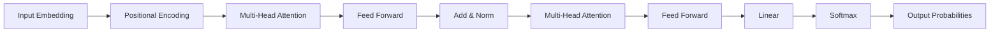

# 基于AI大模型的自然语言生成：写作的未来

作者：禅与计算机程序设计艺术 / Zen and the Art of Computer Programming

关键词：AI大模型、自然语言生成、写作、Transformer、GPT、BERT、Prompt、Few-shot Learning

## 1. 背景介绍
### 1.1 问题的由来
自然语言是人类智慧的结晶,也是人工智能的终极目标之一。近年来,随着深度学习的蓬勃发展,尤其是Transformer[1]等大型语言模型的出现,自然语言处理(NLP)领域取得了长足的进步。其中,自然语言生成(NLG)作为NLP的一个重要分支,旨在让计算机能够像人一样生成流畅、连贯、富有创意的文本。传统的NLG方法主要基于规则或模板,难以生成高质量的长文本。而基于深度学习的端到端生成模型,如GPT系列[2,3]、BERT[4]等,则展现出了惊人的文本生成能力,使得计算机写作的梦想逐渐照进现实。

### 1.2 研究现状 
基于深度学习的NLG研究始于2014年Sutskever等人[5]提出的序列到序列(Seq2Seq)模型。此后,Bahdanau等人[6]引入注意力机制,Vaswani等人[1]提出Transformer结构,大大提升了模型生成文本的质量。2018年,Radford等人[2]在大规模无标注语料上预训练得到GPT模型,开创了预训练语言模型的先河。此后,GPT-2[3]、BERT[4]、XLNet[7]等预训练模型不断刷新NLG任务的SOTA成绩。最新的GPT-3[8]和PaLM[9]等大模型,更是展现出了类似人类创造力的文本生成能力,引发了学术界和工业界的广泛关注。

### 1.3 研究意义
AI写作对教育、新闻、法律、医疗等领域都具有重大意义。它可以自动生成个性化的学习资料,提高教学效率;可以实时生成新闻报道,加快信息传播;可以辅助律师起草法律文书,节省人力成本;还可以根据病历生成医疗报告,减轻医生工作负担。此外,AI写作还有望催生一批新的行业和职业,如AI小说、AI编剧等,为人类创造力插上腾飞的翅膀。因此,深入研究AI写作技术,对推动人工智能在各行各业的应用,促进社会生产力的发展,都具有十分重要的意义。

### 1.4 本文结构
本文将围绕基于AI大模型的自然语言生成技术,从以下几个方面展开论述:

1. 介绍NLG的核心概念和主要技术路线。 
2. 重点讲解Transformer、GPT、BERT等大模型的原理和训练方法。
3. 阐述Prompt、Few-shot Learning等提高大模型生成能力的新范式。
4. 通过实例代码演示如何使用GPT、BERT等模型进行文本生成。
5. 分析AI写作的应用场景,展望其未来发展方向和挑战。

## 2. 核心概念与联系

### 2.1 自然语言生成 NLG
自然语言生成(Natural Language Generation,NLG)是自然语言处理的一个重要分支,旨在让计算机根据给定的输入信息(如结构化数据、知识库、多模态信息等),自动生成符合人类语言习惯的自然语言文本[10]。NLG可以分为以下三个层次:

- 文档规划(Document Planning):确定要生成的文本内容。
- 句子规划(Sentence Planning):将文档规划的结果转化为句子序列。 
- 表层实现(Surface Realization):根据句子规划的结果生成最终的自然语言文本。

传统的NLG系统大多采用规则或模板的方法,需要人工定义大量的生成规则和模板,难以生成高质量的长文本。近年来,随着深度学习的发展,端到端的生成模型逐渐成为主流,可以直接从大规模语料中学习建模,生成更加流畅、连贯的长文本。

### 2.2 Transformer 
Transformer[1]是一种基于自注意力机制的序列建模框架,摒弃了传统的RNN/CNN等结构,通过Self-Attention学习序列内部的依赖关系,极大地提高了并行计算效率和长程建模能力。Transformer主要由编码器(Encoder)和解码器(Decoder)组成,如下图所示:



编码器通过多层的Self-Attention和前馈网络,将输入序列X编码为隐藏状态H。解码器也采用类似的结构,不同的是在Self-Attention之后还引入了Encoder-Decoder Attention,用于捕捉生成序列和编码序列之间的依赖关系。最后,通过线性变换和Softmax函数将解码器的输出映射为下一个Token的概率分布。

Transformer在机器翻译、阅读理解、文本摘要等任务上取得了SOTA成绩,奠定了大模型时代的技术基础。

### 2.3 预训练语言模型
预训练语言模型(Pre-trained Language Model)是指先在大规模无标注语料上进行自监督预训练,再在下游任务的标注数据上进行微调的范式。相比从零开始训练,预训练模型可以更高效地学习并迁移语言知识,在少样本场景下也能取得不错的效果。GPT和BERT是两类典型的预训练语言模型。

#### GPT
GPT(Generative Pre-Training)[2]以自回归的方式建模文本序列,即在预训练阶段最大化当前Token在给定前序Token下的条件概率:

$$ L(\theta)=\sum_{i=1}^{n}\log P(x_i|x_{<i};\theta) $$

其中$x_i$为第$i$个Token,$x_{<i}$为$x_i$之前的所有Token,$\theta$为模型参数。预训练之后,GPT可以通过贪心搜索、Beam Search等方法生成连续文本。

GPT-2[3]在GPT的基础上,将模型规模扩大到15亿参数,并在更大的WebText语料上训练,展现出了强大的零样本学习能力。GPT-3[8]进一步将参数量增加到1750亿,在Few-shot场景下甚至超越了人类的表现。

#### BERT
BERT(Bidirectional Encoder Representations from Transformers)[4]采用Masked Language Model和Next Sentence Prediction两个预训练任务,联合建模双向上下文信息:

$$ L(\theta)= L_{MLM}(\theta)+L_{NSP}(\theta) $$

其中$L_{MLM}$为被掩码Token的预测损失,$L_{NSP}$为下一句预测损失。预训练后的BERT编码器可以为下游任务提供强大的上下文表示。

BERT在GLUE、SQuAD等11项NLP任务上刷新了当时的SOTA记录,掀起了NLP领域的预训练热潮。此后,XLNet[7]、RoBERTa[11]、ALBERT[12]等模型不断改进BERT的预训练方法,进一步提升了下游任务性能。

### 2.4 Prompt范式
Prompt是一种新的预训练范式,旨在充分利用预训练模型的知识,简化下游任务的训练流程。传统的微调方法需要引入新的任务专属网络,并在标注数据上重新训练,代价较大。而Prompt范式则将任务转化为预训练模型已经擅长的形式,如自然语言补全,从而实现参数高效、样本高效的学习。

根据是否包含可学习参数,Prompt可以分为:

- 硬Prompt(Hard Prompt):由离散词Token构成,不含可学习参数。
- 软Prompt(Soft Prompt):将离散Prompt嵌入到连续空间,引入可学习参数[13]。

下图展示了一个情感分类任务的Prompt示例:

```
[CLS] 这部电影很好看,我非常喜欢。[SEP] 问题:这句话的情感倾向是什么?回答: [MASK]
```

其中[CLS]、[SEP]、[MASK]为特殊占位符。将原始句子和问题-回答模板拼接在一起,构成一个完形填空式的输入,预测[MASK]位置为"正面"还是"负面",即可得到句子的情感倾向。

Prompt方法使得预训练模型可以在更少的标注数据上快速适应新任务,在小样本和零样本学习中展现出了巨大的潜力。GPT-3、PaLM等大模型结合Prompt,可以实现诸如问答、写作、数学推理等复杂任务,有望彻底改变传统的人机交互方式。

### 2.5 Few-shot Learning
Few-shot Learning是指在只给定少量标注样本的情况下学习新任务的能力[14]。传统的深度学习模型需要大量的标注数据进行训练,在小样本场景下很难学到鲁棒的特征表示。Few-shot Learning旨在通过元学习(Meta-Learning)、度量学习(Metric Learning)等方法,让模型具备快速学习新概念的能力。

基于Prompt的Few-shot Learning通常采用以下范式:给定$K$个标注样本,将其转化为Prompt形式,然后将待预测样本拼接在最后,让语言模型预测答案。例如,对于一个情感分类任务:

```
指令:根据以下例子判断最后一句的情感倾向。
例子1:这部电影太棒了,我非常喜欢。
答案1:正面
例子2:这次旅行很糟糕,浪费了我的假期。
答案2:负面
例子3:这家餐厅的菜品一般,性价比不高。
答案3:负面
问题:今天天气真好,我感到心情舒畅。
答案:
```

语言模型根据前面的$K$个样本对最后一个样本做出判断,从而实现小样本学习。

Few-shot Learning使得预训练模型可以在新领域快速适配,大大降低了人工标注和训练的成本。GPT-3、PaLM等大模型在Few-shot场景下表现出色,展现出了惊人的学习和泛化能力。

## 3. 核心算法原理 & 具体操作步骤
### 3.1 算法原理概述
基于AI大模型的自然语言生成主要采用Transformer结构,通过自监督预训练和有监督微调两个阶段来学习语言知识和完成下游任务。预训练阶段旨在从海量无标注语料中学习通用的语言表示,微调阶段则利用任务专属的标注数据对模型进行优化。近年来,Prompt等新范式的出现,使得预训练模型可以在更少的标注数据上快速适应新任务,大大提高了小样本学习的效果。

### 3.2 算法步骤详解

#### 3.2.1 数据准备
1. 收集大规模高质量的无标注文本语料,如BooksCorpus、Wikipedia、WebText等。  
2. 对语料进行清洗和预处理,如去除HTML标签、URL、重复内容等。
3. 使用Byte Pair Encoding(BPE)、WordPiece、SentencePiece等分词算法将文本转化为词典有限的子词单元。
4. 将语料划分为训练集、验证集和测试集。

#### 3.2.2 模型预训练
1. 根据目标任务和计算资源,确定模型的规模(如层数、隐藏单元数)和预训练目标(如自回归、Masked LM等)。
2. 随机初始化模型参数,或加载预训练的Checkpoint。
3. 以Batch为单位迭代训练语料:
   - 根据序列长度从语料中采样一个Batch。
   - 根据预训练目标生成训练标签(如被Mask的Token)。
   - 将Token ID转化为词向量,加上位置编码。
   - 将词向量输入Transformer的编码器和解码器。
   - 计算预训练损失(如交叉熵),并使用优化器(如AdamW)更新模型参数。
4. 定期在验证集上评估模型性能,保存性能最优的Checkpoint。
5. 训练完成后,使用测试集评估模型的泛化性能。

#### 3.2.3 模型微调
1. 根据下游任务的输入输出形式,设计合