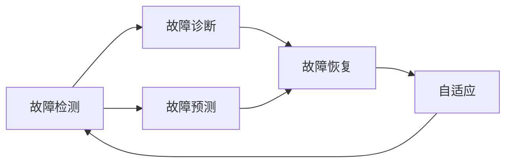

# 基于Java的智能家居设计：用Java实现智能家居中的自我修复系统

关键词：智能家居、Java、自我修复、容错、健壮性

## 1. 背景介绍

### 1.1 问题的由来

随着物联网技术的飞速发展,智能家居已经逐渐走进千家万户。智能家居通过互联网将家中的各种设备连接起来,以实现设备的智能化和自动化控制,为用户提供更加舒适、安全、便捷的居住体验。然而,由于智能家居系统的复杂性和不确定性,其在运行过程中不可避免地会出现各种故障和异常。因此,如何提高智能家居系统的容错能力和自我修复能力,成为了智能家居领域亟待解决的关键问题之一。

### 1.2 研究现状

目前,国内外学者针对智能家居系统的容错和自我修复已经开展了一些研究。例如,文献[1]提出了一种基于多Agent的智能家居容错架构,通过引入监督Agent和备份Agent,实现了系统的故障检测和恢复。文献[2]设计了一种智能家居系统的自我修复模型,该模型采用基于反馈的修复策略,可以动态调整系统参数,实现故障的自动修复。文献[3]提出了一种智能家居的自适应容错方法,通过构建系统的状态空间模型,预测可能出现的故障,并提前采取规避或者恢复措施。

### 1.3 研究意义

智能家居的自我修复能力对于提高系统的可靠性、稳定性和用户体验具有十分重要的意义。通过自我修复,智能家居系统可以在出现故障时自动诊断故障原因,并采取相应的恢复措施,避免了故障的扩散和连锁反应,减少了用户的手动操作和维护成本。同时,自我修复还可以增强系统对环境变化的适应能力,使得智能家居能够在动态变化的环境中稳定运行。因此,研究智能家居的自我修复对于推动智能家居技术的发展和应用具有重要的理论和实践价值。

### 1.4 本文结构

本文将重点探讨如何使用Java语言实现智能家居系统的自我修复。全文共分为九个部分：第一部分介绍智能家居自我修复的研究背景和意义；第二部分阐述智能家居自我修复涉及的核心概念；第三部分讨论自我修复的核心算法原理和具体实现步骤；第四部分建立自我修复的数学模型,并给出详细的公式推导过程；第五部分通过具体的Java代码实例,讲解自我修复的实现细节；第六部分分析自我修复在实际智能家居场景中的应用；第七部分推荐自我修复相关的开发工具和学习资源；第八部分总结全文,并展望自我修复技术的未来发展方向和挑战；第九部分为文章的附录,给出了一些常见问题的解答。

## 2. 核心概念与联系

在智能家居系统中,自我修复(Self-Healing)是指系统能够自动检测、诊断和修复故障,从而保证系统的持续可用性和服务质量。自我修复是构建高可靠、高可用智能家居系统的关键所在。

自我修复的实现离不开以下几个核心概念：

1. 故障检测(Failure Detection):指智能家居系统能够实时监控各个组件和服务的运行状态,及时发现故障和异常。常见的故障检测手段包括心跳检测、阈值检测、异常检测等。

2. 故障诊断(Failure Diagnosis):在发现故障后,智能家居系统需要能够准确诊断故障的类型、原因和位置。故障诊断通常采用基于规则、基于模型或者基于机器学习的方法。

3. 故障恢复(Failure Recovery):诊断出故障原因后,系统需要自动采取相应的恢复措施,使得系统能够快速恢复到正常的工作状态。常见的恢复措施包括重启服务、切换备份、数据回滚等。

4. 故障预测(Failure Prediction):通过对系统的历史数据和运行状态进行分析,预测可能出现的故障,并提前采取预防措施。故障预测可以使用统计学模型、机器学习等技术。

5. 自适应(Self-Adaptation):智能家居系统需要能够根据环境的变化动态调整自身的行为和配置,以适应不断变化的用户需求和外部条件。自适应是自我修复的重要补充手段。

下图展示了智能家居自我修复的核心概念之间的关系：

从图中可以看出,故障检测是自我修复的起点,通过对系统的持续监控来发现各种故障和异常；故障预测可以辅助故障检测,提前预警可能出现的问题；故障诊断负责分析故障原因,为后续的恢复工作提供决策依据；故障恢复是自我修复的核心,通过采取针对性的恢复措施,实现系统状态的恢复；自适应则是在恢复的基础上,根据环境的变化动态调整系统,提高系统的健壮性,最终回到故障检测,形成一个完整的自我修复循环。

## 3. 核心算法原理 & 具体操作步骤

### 3.1 算法原理概述

智能家居的自我修复算法主要包括两个核心部分：故障检测和故障恢复。

在故障检测部分,主要采用基于心跳、基于异常和基于阈值的检测方法。基于心跳的方法通过定期发送心跳信号,检测系统各个组件的存活状态；基于异常的方法通过建立正常行为模型,判断系统行为是否超出正常范围；基于阈值的方法通过设定关键指标的阈值,判断系统是否处于故障状态。

在故障恢复部分,常见的恢复策略包括重启策略、热备份策略、检查点/恢复策略等。重启策略通过重新启动故障组件或者整个系统来恢复故障；热备份策略通过维护一个或多个备份,在检测到故障时快速切换到备份上,保证业务连续性；检查点/恢复策略通过定期保存系统的状态,在发生故障时从最近的检查点恢复系统状态。

### 3.2 算法步骤详解

下面以基于心跳的故障检测和重启恢复策略为例,详细讲解自我修复算法的具体步骤。

故障检测步骤：
1. 确定心跳检测对象,通常选择系统的关键组件,如核心服务、关键节点等。
2. 设置心跳检测周期T,表示每隔多久发送一次心跳信号。
3. 设置心跳超时时间N,表示连续多少个周期未收到心跳视为故障。
4. 周期性地向所有检测对象发送心跳信号。
5. 记录每个检测对象最近一次心跳的时间戳。
6. 检查当前时间与最近心跳时间戳的差值是否超过N*T,如果超过则将该对象标记为故障。

故障恢复步骤：
1. 根据故障检测的结果,确定需要重启的故障组件。
2. 调用故障组件的停止接口,优雅地终止故障组件的运行。
3. 清理故障组件的运行环境,释放相关资源。
4. 重新初始化故障组件的运行环境。
5. 调用故障组件的启动接口,重新启动组件。
6. 检测组件是否成功启动,如未成功则重复步骤2-5。
7. 恢复组件间的依赖关系和通信连接,保证组件能够正常对外提供服务。

### 3.3 算法优缺点

基于心跳的故障检测算法具有简单、高效的特点,能够快速发现系统中的故障,但是对于网络抖动等短时故障可能会产生误判。此外,心跳检测只能发现故障,无法诊断故障原因,因此还需要配合其他诊断手段。

重启恢复策略的优点是恢复速度快,能够快速恢复系统的可用性。但是频繁的重启可能会影响系统的性能和稳定性,对有状态的组件恢复效果也不佳。因此,重启往往作为恢复的最后手段,与其他恢复策略配合使用。

### 3.4 算法应用领域

自我修复算法在智能家居系统中有广泛的应用,主要体现在以下几个方面：

1. 家电设备的故障诊断与恢复,例如空调、冰箱等家电的自我检测和修复。
2. 家庭网络的故障诊断与恢复,例如路由器、网关等网络设备的自我修复。
3. 智能安防系统的故障诊断与恢复,例如摄像头、报警器等安防设备的自我修复。
4. 能源管理系统的故障诊断与恢复,例如智能电表、光伏逆变器等能源设备的自我修复。

总之,自我修复算法可以应用于智能家居系统的方方面面,提高系统的可靠性和稳定性,减少人工维护的成本。

## 4. 数学模型和公式 & 详细讲解 & 举例说明

### 4.1 数学模型构建

为了更加准确地描述智能家居自我修复过程,我们可以建立如下数学模型：

我们定义智能家居系统的状态空间为$S=\{s_1,s_2,...,s_n\}$,其中$s_i$表示系统的一个可能状态。系统的初始状态为$s_0$。

定义系统的行为空间为$A=\{a_1,a_2,...,a_m\}$,其中$a_j$表示系统的一个可能行为。

定义系统在状态$s_i$下采取行为$a_j$的概率为$P(a_j|s_i)$。

定义系统从状态$s_i$转移到状态$s_k$的概率为$P(s_k|s_i)$。

定义故障检测函数$f:S \rightarrow \{0,1\}$,其中$f(s_i)=1$表示在状态$s_i$下检测到故障,$f(s_i)=0$表示未检测到故障。

定义故障恢复函数$g:S \rightarrow S$,表示将系统从故障状态恢复到正常状态。

则智能家居自我修复过程可以描述为一个马尔可夫决策过程(MDP),其状态转移概率为:

$$
P(s_k|s_i) = \sum_{j=1}^m P(a_j|s_i) \cdot P(s_k|s_i,a_j)
$$

其中,$P(s_k|s_i,a_j)$表示在状态$s_i$下采取行为$a_j$后转移到状态$s_k$的概率。

系统的目标是最小化故障发生的概率,即:

$$
\min \sum_{i=1}^n P(s_i) \cdot f(s_i)
$$

其中,$P(s_i)$表示系统处于状态$s_i$的稳态概率。

### 4.2 公式推导过程

为了求解上述优化问题,我们可以使用值迭代算法,其公式推导过程如下：

定义值函数$V(s_i)$表示从状态$s_i$开始到达终止状态的最小期望代价。则值函数满足以下贝尔曼方程：

$$
V(s_i) = \min_{a_j} \left\{ f(s_i) + \sum_{k=1}^n P(s_k|s_i,a_j) \cdot V(s_k) \right\}
$$

我们可以使用迭代的方法求解上述方程：

1. 初始化值函数$V_0(s_i)=0$。

2. 对于第$t$次迭代,按照以下公式更新值函数：

$$
V_t(s_i) = \min_{a_j} \left\{ f(s_i) + \sum_{k=1}^n P(s_k|s_i,a_j) \cdot V_{t-1}(s_k) \right\}
$$

3. 重复步骤2,直到值函数收敛,即$\max_i |V_t(s_i) - V_{t-1}(s_i)| < \epsilon$,其中$\epsilon$为一个很