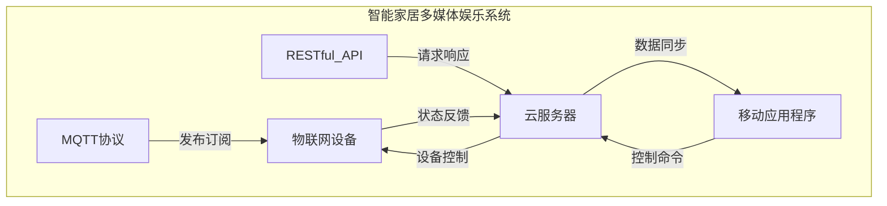

# 基于MQTT协议和RESTful API的智能家居多媒体娱乐系统

## 1. 背景介绍

### 1.1 问题的由来

在当今快节奏的生活方式中，人们越来越渴望在家中获得高质量的娱乐体验。传统的家庭娱乐系统通常缺乏智能化和互联网连接功能,难以满足现代用户对于便捷性、个性化和多终端访问的需求。因此,构建一个基于物联网技术的智能家居多媒体娱乐系统,实现家庭娱乐设备的无缝集成和智能控制,成为了一个迫切的需求。

### 1.2 研究现状

近年来,物联网技术的快速发展为智能家居系统的建设提供了坚实的技术基础。一些主流的物联网通信协议,如MQTT(Message Queuing Telemetry Transport)和RESTful API(Representational State Transfer Application Programming Interface),已被广泛应用于智能家居领域。然而,现有的智能家居娱乐系统往往存在功能单一、设备兼容性差、用户体验不佳等问题,亟需进一步优化和完善。

### 1.3 研究意义

构建一个基于MQTT协议和RESTful API的智能家居多媒体娱乐系统,能够实现以下几个方面的价值:

1. **便捷控制**:用户可以通过移动应用程序或语音助手等多种方式,轻松控制家中的娱乐设备,如电视、音响、投影仪等,提高了娱乐体验的便捷性。

2. **个性化体验**:系统可以根据用户的喜好和使用习惯,推荐个性化的娱乐内容,如电影、音乐、游戏等,满足不同用户的娱乐需求。

3. **设备互联互通**:基于物联网技术,不同品牌和类型的娱乐设备可以无缝集成,实现跨平台、跨终端的无缝体验。

4. **远程访问**:用户可以通过互联网远程控制家中的娱乐系统,实现了娱乐体验的延伸。

5. **节能环保**:智能家居娱乐系统可以根据用户的使用情况,自动调节设备的工作状态,实现了能源的合理利用和环境保护。

### 1.4 本文结构

本文将首先介绍智能家居多媒体娱乐系统的核心概念和技术原理,包括MQTT协议、RESTful API等。然后详细阐述系统的核心算法原理和数学模型,并通过代码实例和案例分析,展示系统的实际应用场景。最后,探讨系统的未来发展趋势和面临的挑战,并提供相关的学习资源和工具推荐。

## 2. 核心概念与联系

智能家居多媒体娱乐系统的核心概念包括MQTT协议、RESTful API、物联网设备、云服务器和移动应用程序等。它们之间的关系如下所示:

1. **MQTT协议**:MQTT是一种轻量级的发布/订阅消息传输协议,适用于物联网环境中的设备通信。在智能家居娱乐系统中,MQTT协议用于实现家庭娱乐设备与控制中心之间的实时通信和数据交换。

2. **RESTful API**:RESTful API是一种基于HTTP协议的应用程序编程接口,它提供了一种标准化的方式来访问和操作Web服务。在智能家居娱乐系统中,RESTful API用于移动应用程序与云服务器之间的通信,实现对家庭娱乐设备的远程控制和状态查询。

3. **物联网设备**:物联网设备是指具有网络连接功能的各种家庭娱乐设备,如电视、音响、投影仪等。这些设备通过MQTT协议与控制中心进行通信,接收控制命令并反馈状态信息。

4. **云服务器**:云服务器是整个系统的控制中心,它通过RESTful API与移动应用程序进行交互,并通过MQTT协议与家庭娱乐设备进行通信。云服务器负责处理用户请求、管理设备状态、执行控制逻辑等任务。

5. **移动应用程序**:移动应用程序是用户与智能家居娱乐系统进行交互的主要界面。用户可以通过移动应用程序发送控制命令、查询设备状态、个性化设置等,实现对家庭娱乐系统的便捷管理。

这些核心概念相互协作,构建了一个完整的智能家居多媒体娱乐系统,实现了家庭娱乐设备的智能控制、远程访问和个性化体验。

## 3. 核心算法原理 & 具体操作步骤

### 3.1 算法原理概述

智能家居多媒体娱乐系统的核心算法原理基于MQTT协议和RESTful API,实现了设备控制、数据交换和用户交互等功能。算法的主要流程如下:

1. **设备发现和注册**:系统首先通过MQTT协议发现并注册家庭娱乐设备,建立设备与控制中心之间的通信连接。

2. **用户请求处理**:当用户通过移动应用程序发送控制命令时,应用程序将请求发送给云服务器的RESTful API。

3. **控制命令下发**:云服务器接收到用户请求后,根据请求内容和设备状态,生成相应的控制命令,并通过MQTT协议下发给目标设备。

4. **设备响应和反馈**:家庭娱乐设备接收到控制命令后,执行相应的操作,并将执行结果和状态信息通过MQTT协议反馈给云服务器。

5. **数据同步和展示**:云服务器将设备的状态信息通过RESTful API同步给移动应用程序,以便用户查看设备的实时状态。

6. **个性化推荐**:基于用户的使用历史和偏好,系统可以通过机器学习算法对娱乐内容进行个性化推荐,提升用户体验。

该算法的核心在于将MQTT协议和RESTful API有机结合,实现了物联网设备与云服务器、移动应用程序之间的高效通信和控制,从而构建了一个智能化、便捷化的家庭娱乐系统。

### 3.2 算法步骤详解

1. **设备发现和注册**

   - 步骤1:家庭娱乐设备启动时,向MQTT代理服务器发送注册请求,包含设备ID、类型、功能等信息。
   - 步骤2:MQTT代理服务器接收到注册请求后,将设备信息存储在设备注册表中。
   - 步骤3:设备订阅相应的MQTT主题,用于接收控制命令和发送状态反馈。

2. **用户请求处理**

   - 步骤1:用户通过移动应用程序发送控制请求,如打开电视、调节音量等。
   - 步骤2:移动应用程序将请求数据封装成HTTP请求,发送给云服务器的RESTful API。
   - 步骤3:云服务器接收到HTTP请求后,解析请求数据,进行合法性和安全性检查。

3. **控制命令下发**

   - 步骤1:云服务器根据用户请求和设备状态,生成相应的控制命令。
   - 步骤2:云服务器将控制命令发布到MQTT代理服务器的相应主题。
   - 步骤3:目标设备订阅了该主题,因此可以接收到控制命令。

4. **设备响应和反馈**

   - 步骤1:家庭娱乐设备接收到控制命令后,执行相应的操作,如打开电视、调节音量等。
   - 步骤2:设备将执行结果和当前状态信息封装成MQTT消息,发布到指定的反馈主题。
   - 步骤3:云服务器订阅了该反馈主题,因此可以接收到设备的状态信息。

5. **数据同步和展示**

   - 步骤1:云服务器将接收到的设备状态信息存储在数据库中。
   - 步骤2:移动应用程序定期向云服务器的RESTful API发送状态查询请求。
   - 步骤3:云服务器从数据库中读取最新的设备状态信息,并通过HTTP响应返回给移动应用程序。
   - 步骤4:移动应用程序解析HTTP响应数据,并在界面上展示设备的实时状态。

6. **个性化推荐**

   - 步骤1:系统记录用户的娱乐内容使用历史和偏好数据,如观看电影、收听音乐等。
   - 步骤2:利用协同过滤或基于内容的推荐算法,分析用户数据,生成个性化推荐列表。
   - 步骤3:将推荐列表通过RESTful API发送给移动应用程序,在应用程序界面上展示给用户。

通过上述步骤,智能家居多媒体娱乐系统实现了设备控制、状态监控、个性化推荐等核心功能,为用户带来了便捷、智能化的家庭娱乐体验。

### 3.3 算法优缺点

**优点:**

1. **高效通信**:利用轻量级的MQTT协议实现设备与控制中心之间的实时通信,降低了网络延迟和带宽占用。

2. **可扩展性强**:基于标准的RESTful API和MQTT协议,系统具有良好的可扩展性,可以方便地集成新的设备和功能。

3. **跨平台支持**:RESTful API和MQTT协议都是开放标准,支持多种编程语言和平台,便于系统的开发和部署。

4. **个性化体验**:通过机器学习算法分析用户数据,实现了娱乐内容的个性化推荐,提升了用户体验。

5. **安全可靠**:系统采用了安全传输协议和数据加密措施,确保了通信和数据的安全性。

**缺点:**

1. **系统复杂度高**:整个系统涉及多种技术和协议,如MQTT、RESTful API、机器学习等,系统的设计和开发相对复杂。

2. **实时性要求高**:对于某些实时性要求较高的场景,如在线游戏等,MQTT协议可能无法满足低延迟的需求。

3. **隐私和安全风险**:系统需要收集和处理大量的用户数据,如果处理不当,可能会引发隐私和安全风险。

4. **设备兼容性**:不同品牌和型号的家庭娱乐设备可能存在兼容性问题,需要进行适配和测试。

5. **系统维护成本**:随着系统规模和功能的扩展,系统的维护和升级成本也会相应增加。

### 3.4 算法应用领域

基于MQTT协议和RESTful API的智能家居多媒体娱乐系统算法,不仅可以应用于家庭娱乐场景,还可以扩展到以下领域:

1. **智能家居自动化**:该算法可以用于控制和监控家中的各种智能设备,如照明、温控、安防等,实现家居环境的自动化管理。

2. **工业物联网**:在工业领域,该算法可以应用于远程监控和控制生产设备、机器人等,提高生产效率和安全性。

3. **智能农业**:利用该算法,可以构建智能农业监控系统,实时获取温室大棚的环境数据,并根据数据自动调节设备,优化作物生长环境。

4. **智能交通**:该算法可以应用于智能交通系统,实现对交通信号灯、道路监控摄像头等设备的远程控制和监测,优化交通流量。

5. **智能医疗**:在医疗领域,该算法可以用于远程监控患者的生命体征数据,并根据数据自动调整医疗设备的工作状态,提高医疗质量和效率。

总的来说,基于MQTT协议和RESTful API的智能控制算法具有广泛的应用前景,可以为各个领域的物联网系统提供高效、可