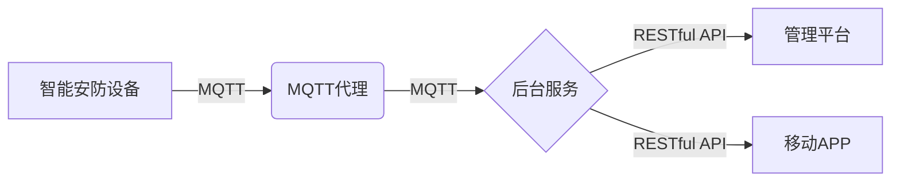

# 基于MQTT协议和RESTful API的智能家居安防系统集成设计

关键词：智能家居、安防系统、MQTT协议、RESTful API、系统集成

## 1. 背景介绍
### 1.1 问题的由来
随着物联网技术的飞速发展,智能家居已经逐渐走进千家万户。人们对家居安全防范的需求也日益增长。传统的家居安防系统存在布线复杂、功能单一、扩展性差等问题。如何利用先进的物联网技术,实现一个灵活、高效、易扩展的智能家居安防系统成为亟需解决的问题。

### 1.2 研究现状
目前,国内外已有不少基于物联网的智能家居安防系统的研究和应用。比如利用ZigBee、WiFi等无线通信技术实现各种家居安防设备的互联互通;利用云计算平台对海量安防数据进行存储和分析;利用移动APP实现远程监控和控制等。但是这些系统大多是封闭的,缺乏开放性和互操作性,集成难度大。

### 1.3 研究意义
本文提出利用MQTT协议和RESTful API实现一个开放、灵活、易集成的智能家居安防系统的设计方案。MQTT是一个轻量级的发布/订阅消息传输协议,具有开放性好、实时性高、支持QoS等优点,非常适合物联网应用。RESTful API采用标准的HTTP方法如GET、POST等进行通信,具有跨平台、易理解、易调试等特点。两者结合可以打造一个松耦合、高内聚的智能家居安防系统。

### 1.4 本文结构
本文将从以下几个方面展开论述:
- 介绍MQTT协议和RESTful API的核心概念和优势
- 阐述智能家居安防系统的整体架构设计
- 详细讲解系统关键组件的实现原理和流程
- 给出系统集成的具体步骤和接口定义
- 展示一个简单的原型系统的Demo实现
- 分析系统的应用场景和发展前景
- 总结全文,并对下一步的工作提出展望

## 2. 核心概念与联系
MQTT(Message Queuing Telemetry Transport)是一个基于发布/订阅模式的轻量级消息传输协议。它工作在TCP/IP协议族上,是为硬件性能低下的远程设备和网络状况糟糕的情况下而设计的发布/订阅型消息协议。

MQTT的主要特点包括:
- 使用发布/订阅消息模式,提供一对多的消息发布
- 对负载内容屏蔽的消息传输
- 使用 TCP/IP 提供网络连接
- 有三种消息发布服务质量(QoS):
  - "至多一次",消息发布完全依赖底层 TCP/IP 网络。会发生消息丢失或重复。
  - "至少一次",确保消息到达,但消息重复可能会发生。
  - "只有一次",确保消息到达一次。

一个MQTT系统由发布者(Publisher)、代理(Broker)和订阅者(Subscriber)组成。发布者和订阅者都是MQTT客户端,通过MQTT协议提供的消息机制进行通信。MQTT协议中,消息的发布者不会将消息直接发送给特定的订阅者,而是将消息发布到MQTT代理。MQTT代理负责将消息路由到订阅了此主题的订阅者。

RESTful API是一种基于HTTP协议的轻量级Web服务架构风格。REST(Representational State Transfer)这个术语是由Roy Fielding在他2000年的博士论文中提出的。RESTful API具有如下关键特征:

- 使用标准的HTTP方法如GET、POST、PUT、DELETE等进行数据操作
- 使用URI(Uniform Resource Identifier)来定位资源
- 无状态通信机制,服务端不保存客户端的上下文信息
- 数据传输一般使用轻量级的JSON(JavaScript Object Notation)或XML(eXtensible Markup Language)格式

RESTful API简单易用、可扩展性强,非常适合作为不同系统之间的集成方式。在智能家居安防系统中,我们可以为每类设备如摄像头、门锁、警报器等定义统一的RESTful API接口,实现设备的注册、配置、状态查询、控制等功能。

MQTT和RESTful API可以很好地结合,实现智能家居安防系统的分层解耦和灵活集成。系统的核心架构如下图所示:

智能安防设备通过MQTT协议与MQTT代理通信,实现设备数据如视频流、报警信息的上报,以及接收控制指令。后台服务通过订阅相关主题,获取设备上报的数据,并根据业务逻辑进行处理分析。同时,后台服务提供一组RESTful API,供管理平台和移动APP进行调用,实现远程监控、设备管理等功能。

## 3. 核心算法原理 & 具体操作步骤

### 3.1 算法原理概述
本系统涉及的核心算法主要包括:
1) 设备认证与密钥协商算法
为保证通信安全,设备和平台之间需要进行身份认证,并协商通信密钥。可以采用基于证书的TLS/SSL认证方案,或者使用更轻量级的对称加密算法如AES。

2) 视频编解码算法
智能摄像头采集的原始视频数据需要进行编码压缩后再传输,以降低带宽占用。H.264是目前应用最广泛的视频编码标准,在压缩率和画质方面达到了很好的平衡。

3) 视频分析算法
为实现智能报警,需要对视频内容进行实时分析,检测异常行为。常用的算法包括背景建模、目标检测和跟踪、行为识别等。其中,深度学习技术如CNN、LSTM等在提高识别准确率方面表现突出。

### 3.2 算法步骤详解
下面以视频分析算法为例,详细讲解其处理步骤:

输入:摄像头实时采集的视频流
输出:异常行为报警信号

1) 背景建模:利用高斯混合模型(GMM)等算法,对视频的背景进行建模,提取前景目标

2) 目标检测与跟踪:采用基于深度学习的目标检测算法如YOLO、SSD等,对前景目标进行定位并分类(人、车等),然后用卡尔曼滤波、粒子滤波等算法实现多目标跟踪

3) 行为识别:将检测到的目标的运动轨迹、外观特征等输入到LSTM网络中进行序列学习,实现行为识别(如徘徊、快速奔跑等),判断是否为异常行为

4) 报警决策:综合目标类型、运动轨迹、行为等多种因素,通过设定阈值,实现智能报警

### 3.3 算法优缺点
优点:
- 充分利用了视频中蕴含的时空信息,对异常行为的识别准确率高
- 通过深度学习算法,可以自动提取视频中的高层语义特征,减少了人工设计特征的工作量
- 算法具有一定的鲁棒性,对光照变化、视角变化等因素有一定的适应能力

缺点:  
- 算法的实时性有待提高,尤其是在嵌入式设备上运行时,受限于芯片算力
- 对于小目标、遮挡严重的目标等,算法的检测和跟踪精度会有所下降
- 算法的场景适应性还需要进一步加强,对于特定的应用环境,需要进行针对性的算法优化

### 3.4 算法应用领域
视频分析算法除了应用于智能安防领域,还可以应用于以下场合:
- 智慧零售:客流统计、热力图分析、客户行为分析等
- 智慧交通:交通流量检测、事故检测、违章检测等
- 工业视觉:缺陷检测、工件计数、机器人视觉导航等
- 医疗影像:病灶检测、病理分类等

## 4. 数学模型和公式 & 详细讲解 & 举例说明

### 4.1 数学模型构建
在智能视频分析中,一个核心的数学模型是高斯混合背景建模(Gaussian Mixture Model)。它可以用于提取视频的前景目标。假设时间 $t$ 某像素点的观测值为 $X_t$,该像素点的背景模型可以用 $K$ 个高斯分布的加权和来表示:

$$
P(X_t) = \sum_{i=1}^{K} w_{i,t} * \eta(X_t, \mu_{i,t}, \Sigma_{i,t})
$$

其中, $w_{i,t}$ 是第 $i$ 个高斯分布的权重, $\mu_{i,t}$ 和 $\Sigma_{i,t}$ 分别是第 $i$ 个高斯分布的均值和协方差矩阵。$\eta$ 表示高斯概率密度函数:

$$
\eta(X_t, \mu, \Sigma) = \frac{1}{(2\pi)^{n/2} |\Sigma|^{1/2}} e^{- \frac{1}{2} (X_t-\mu)^T \Sigma^{-1} (X_t-\mu)}
$$

其中 $n$ 为特征空间的维度,在背景建模中通常取 $n=3$,即像素的 RGB 三个颜色通道。

### 4.2 公式推导过程
对于一个新的像素观测值 $X_t$,首先判断它是否属于背景的 $K$ 个高斯分布中的某一个。如果不属于任何一个已有的高斯分布,就将 $X_t$ 作为一个新的高斯分布加入到背景模型中,并初始化其均值 $\mu$ 为 $X_t$,协方差矩阵 $\Sigma$ 为一个较大的值。

如果 $X_t$ 匹配到了某个高斯分布,则可以用如下的公式对该高斯分布的参数进行更新:

$$
\begin{aligned}
w_{i,t} &= (1-\alpha) w_{i,t-1} + \alpha \\
\rho &= \alpha * \eta(X_t, \mu_{i,t-1}, \Sigma_{i,t-1}) \\
\mu_{i,t} &= (1-\rho) \mu_{i,t-1} + \rho X_t \\
\Sigma_{i,t} &= (1-\rho) \Sigma_{i,t-1} + \rho (X_t - \mu_{i,t})^T (X_t - \mu_{i,t})
\end{aligned}
$$

其中 $\alpha$ 是学习率,控制背景更新的速度。未匹配的高斯分布的 $w$ 和 $\mu$ 保持不变, $\Sigma$ 会乘以一个衰减系数。

最后,所有高斯分布按照 $w/|\Sigma|$ 从大到小排序,前 $B$ 个高斯分布被认为是背景,其中

$$
B = \arg \min_b \left( \frac{\sum_{i=1}^{b} w_i}{\sum_{i=1}^{K} w_i} > T \right)
$$

$T$ 是一个阈值,表示背景在整个场景中所占的比例。

### 4.3 案例分析与讲解
下面以一个具体的例子来说明GMM背景建模的过程。假设我们要对一段道路监控视频进行前景提取,背景主要包含道路、天空等静止区域,前景是移动的车辆、行人等。

我们选取视频中的某个像素点,观察它在连续的 $N$ 帧中的 RGB 值变化,如下图所示:

可以看出,该像素点大部分时间的颜色比较稳定,对应于背景区域。在 $t_1$ 和 $t_2$ 时刻出现了 RGB 值的剧烈变化,说明有车辆经过,像素点此时属于前景。 

我们用 2 个高斯分布($K=2$)来对该像素点建模,其参数初始化如下:
- 第一个高斯 $G_1$: 权重 $w_1=0.6$,均值 $\mu_1=[40,40,40]$,协方差矩阵 $\Sigma_1=\left[ \begin{smallmatrix} 6 & 0 & 0\\ 0 & 6