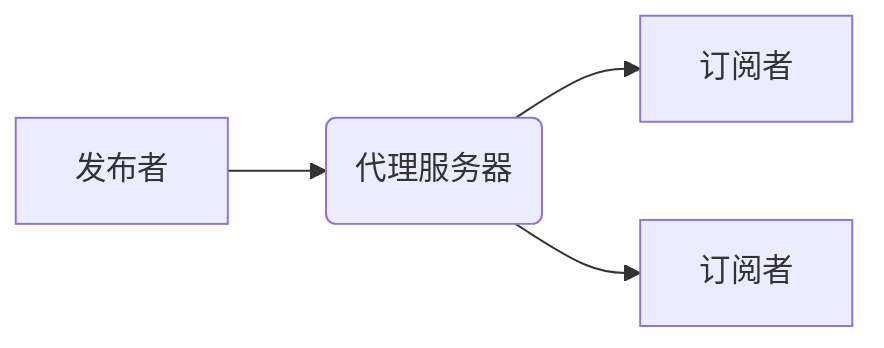
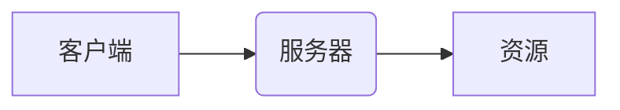

# 基于MQTT协议和RESTful API的智能家居设备远程控制与状态监测

## 1. 背景介绍

### 1.1 问题的由来

随着物联网技术的不断发展,智能家居系统逐渐成为现代生活中不可或缺的一部分。传统的家居设备控制方式存在诸多不足,如操作繁琐、控制范围有限等,亟需一种更加智能化、远程化的控制方式。同时,家居设备状态的实时监测也是智能家居系统的重要组成部分,能够提高用户的使用体验。

### 1.2 研究现状

目前,基于物联网技术的智能家居系统正在快速发展。其中,MQTT(Message Queuing Telemetry Transport)协议和RESTful(Representational State Transfer) API是两种广泛应用的通信方式。

MQTT是一种基于发布/订阅模式的轻量级消息传输协议,适用于物联网环境下的消息通信。它具有低功耗、低带宽占用、可靠性高等优点,非常适合在智能家居系统中应用。

RESTful API则是一种基于HTTP协议的应用程序接口,它遵循REST架构风格,使用统一的资源定位方式,支持多种数据格式。RESTful API简单、高效,已经成为构建分布式系统的主流方式之一。

### 1.3 研究意义

将MQTT协议和RESTful API相结合,可以构建一个高效、可靠的智能家居系统,实现家居设备的远程控制和状态监测。这不仅能够提高用户的生活质量,还可以促进物联网技术在智能家居领域的应用。

### 1.4 本文结构

本文首先介绍MQTT协议和RESTful API的核心概念,然后详细阐述它们在智能家居系统中的应用原理和实现方法。接下来,通过数学模型和公式分析系统的性能和可靠性。最后,给出实际应用场景、工具和资源推荐,并总结未来发展趋势和面临的挑战。

## 2. 核心概念与联系

MQTT(Message Queuing Telemetry Transport)是一种基于发布/订阅模式的轻量级消息传输协议,它由IBM在1999年发布,最新版本为MQTT 5.0。MQTT协议的核心概念包括:

- 发布者(Publisher):发布消息的客户端
- 订阅者(Subscriber):订阅消息的客户端
- 主题(Topic):消息的路由地址,用于标识消息的类型或来源
- 代理服务器(Broker):消息的中转站,负责接收发布者的消息并转发给订阅者

MQTT协议的工作流程如下:

RESTful API则是一种基于HTTP协议的应用程序接口,它遵循REST架构风格,使用统一的资源定位方式,支持多种数据格式。RESTful API的核心概念包括:

- 资源(Resource):被操作的对象,通过URI(Uniform Resource Identifier)进行标识
- 表现层(Representation):资源的具体表现形式,通常使用JSON或XML格式
- HTTP方法:对资源进行操作的方式,包括GET(获取)、POST(创建)、PUT(更新)、DELETE(删除)等

RESTful API的工作流程如下:

在智能家居系统中,MQTT协议和RESTful API可以协同工作,实现设备的远程控制和状态监测。具体来说:

- MQTT协议用于实时传输控制命令和状态数据,保证通信的高效和可靠性。
- RESTful API用于管理和配置家居设备,提供更加友好的用户界面和更丰富的功能。

通过将两者结合,可以构建一个完整的智能家居系统,实现设备的无缝集成和高效管理。

## 3. 核心算法原理 & 具体操作步骤

### 3.1 算法原理概述

在基于MQTT协议和RESTful API的智能家居系统中,核心算法包括两个部分:MQTT通信算法和RESTful API交互算法。

MQTT通信算法负责实现设备与MQTT代理服务器之间的消息收发,包括连接建立、主题订阅、消息发布和接收等。它采用了发布/订阅模式,可以实现设备与服务器之间的异步通信,提高系统的实时性和可靠性。

RESTful API交互算法则负责实现客户端与家居设备之间的资源操作,包括获取设备信息、发送控制命令、更新设备配置等。它遵循REST架构风格,使用统一的资源定位方式和标准的HTTP方法,提供了友好的用户界面和丰富的功能。

### 3.2 算法步骤详解

#### MQTT通信算法步骤

1. 客户端(设备或应用程序)连接MQTT代理服务器,建立持久连接。
2. 客户端订阅感兴趣的主题,以接收相关消息。
3. 客户端向指定主题发布消息,代理服务器将消息转发给所有订阅该主题的客户端。
4. 客户端接收订阅主题的消息,进行相应处理。
5. 客户端可以随时取消订阅或发布新消息。
6. 客户端断开与代理服务器的连接。

#### RESTful API交互算法步骤

1. 客户端(应用程序或网页)向服务器发送HTTP请求,请求URI标识要操作的资源。
2. 服务器根据请求的HTTP方法(GET、POST、PUT、DELETE等)执行相应的操作。
3. 服务器将操作结果以特定的表现形式(JSON或XML)返回给客户端。
4. 客户端解析响应数据,并进行相应的处理或展示。

### 3.3 算法优缺点

#### MQTT通信算法优缺点

优点:

- 轻量级、低功耗,适合物联网环境
- 发布/订阅模式,支持一对多通信
- 支持消息持久化和离线消息传输
- 具有良好的可靠性和保证消息传递

缺点:

- 安全性相对较弱,需要额外的安全措施
- 实时性较差,不适合对实时性要求很高的场景
- 缺乏管理和配置功能,需要与其他协议或API配合使用

#### RESTful API交互算法优缺点

优点:

- 简单、轻量,易于理解和实现
- 无状态,可扩展性强
- 支持多种数据格式,易于集成
- 提供友好的用户界面和丰富的功能

缺点:

- 不适合实时通信场景
- 对资源的表现形式有一定要求
- 安全性需要额外的措施,如HTTPS等
- 对大量并发请求的处理能力较差

### 3.4 算法应用领域

MQTT通信算法和RESTful API交互算法可以广泛应用于物联网、智能家居、工业自动化等领域。具体来说:

- 物联网领域:传感器数据采集、设备远程控制、实时监控等
- 智能家居领域:家电控制、环境监测、安防系统等
- 工业自动化领域:机器人控制、生产线监控、设备管理等
- 移动互联网领域:即时通讯、推送服务、移动支付等
- 物流跟踪领域:货物实时位置跟踪、库存管理等

## 4. 数学模型和公式 & 详细讲解 & 举例说明

### 4.1 数学模型构建

在智能家居系统中,我们可以构建数学模型来分析和优化系统的性能和可靠性。下面是一些常见的数学模型:

1. **队列模型**

队列模型可用于分析MQTT代理服务器的消息处理能力和延迟情况。假设消息到达服务器的过程服从泊松分布,服务时间服从指数分布,则可以建立 M/M/1 队列模型。

设 $\lambda$ 为消息到达率, $\mu$ 为服务率,则系统的利用率 $\rho = \lambda / \mu$。当 $\rho < 1$ 时,队列长度的期望值为:

$$
L_q = \frac{\rho^2}{1 - \rho}
$$

2. **可靠性模型**

可靠性模型可用于评估系统的可靠性和故障率。假设系统由 n 个独立组件组成,每个组件的故障率为 $\lambda_i$,则系统的故障率为:

$$
\lambda_{\text{sys}} = \sum_{i=1}^{n} \lambda_i
$$

如果组件之间存在冗余关系,则可以使用更复杂的模型,如并行模型、串行模型等。

3. **网络模型**

网络模型可用于分析系统的网络性能和时延。假设网络中有 m 个节点,每个节点之间的时延为 $d_{ij}$,则从节点 i 到节点 j 的最短路径时延为:

$$
D_{ij} = \min \sum_{(i,k) \in P} d_{ik}
$$

其中 P 表示从节点 i 到节点 j 的所有可能路径。

### 4.2 公式推导过程

下面以队列模型为例,推导 M/M/1 队列模型中队列长度的期望值公式。

假设消息到达服务器的过程服从泊松分布,其概率密度函数为:

$$
f(x) = \frac{\lambda^x e^{-\lambda}}{x!}, x = 0, 1, 2, \dots
$$

服务时间服从指数分布,其概率密度函数为:

$$
g(x) = \mu e^{-\mu x}, x \geq 0
$$

令 $\rho = \lambda / \mu$,则系统的平衡方程为:

$$
\pi_0 + \sum_{n=1}^{\infty} \pi_n = 1
$$

$$
\pi_n = \rho^n \pi_0, n \geq 1
$$

将第二个方程代入第一个方程,可得:

$$
\pi_0 + \pi_0 \sum_{n=1}^{\infty} \rho^n = 1
$$

由于 $\sum_{n=1}^{\infty} \rho^n = \frac{\rho}{1 - \rho}$,所以:

$$
\pi_0 = 1 - \rho
$$

队列长度的期望值为:

$$
L_q = \sum_{n=1}^{\infty} n \pi_n = \pi_0 \sum_{n=1}^{\infty} n \rho^n
$$

利用求和公式:

$$
\sum_{n=1}^{\infty} n x^n = \frac{x}{(1 - x)^2}
$$

可得:

$$
L_q = \pi_0 \frac{\rho}{(1 - \rho)^2} = \frac{\rho^2}{1 - \rho}
$$

### 4.3 案例分析与讲解

假设一个智能家居系统中有 100 个家电设备,每个设备每小时向 MQTT 代理服务器发送 5 条状态数据,服务器的处理能力为 1000 条消息/小时。我们需要分析系统的消息处理能力和延迟情况。

1. 确定参数

- 消息到达率 $\lambda = 100 \times 5 = 500$ 条/小时
- 服务率 $\mu = 1000$ 条/小时
- 利用率 $\rho = \lambda / \mu = 500 / 1000 = 0.5$

2. 计算队列长度期望值

由 M/M/1 队列模型可知,当 $\rho < 1$ 时,队列长度的期望值为:

$$
L_q = \frac{\rho^2}{1 - \rho} = \frac{0.5^2}{1 - 0.5} = 0.5
$$

3. 分析结果

由于队列长度的期望值为 0.5,说明大部分时候队列中只有 0 或 1 条消息在等待处理,系统的消息处理能力足够应对当前的负载。但是,如果设备数量或发送频率继续增加,系统的利用率会升高,队列长度和延迟也会随之增加。

因此,我们需要根据实际情况,合理规划系统的处理能力,保证在高负载情况下也能提供可靠的服务。同时,也可以考虑采用负载均衡、消息持久化等策略,进一步提高系统的可靠性和可扩展性。

### 4.4 常见问题解答

1. **为什么要使用 MQTT 协议而不是 HTTP 协议?**

MQTT 协议是一种轻量级的发布/订阅模式的消息传输协议,具有低功耗、低