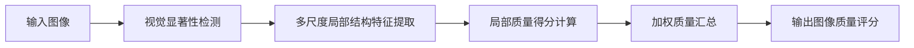

# 基于OpenCV 图像质量分析系统详细设计与具体代码实现

关键词：OpenCV, 图像质量分析, 图像处理, 图像质量评估, 图像质量指标, 图像质量优化

## 1. 背景介绍
### 1.1  问题的由来
在数字图像处理领域,图像质量分析与评估一直是一个重要而富有挑战性的课题。随着数字成像设备的普及和图像应用场景的日益丰富,如何快速、准确、自动化地对图像质量进行分析与评估,成为了一个亟需解决的现实问题。传统的图像质量评估方法主要依赖人工视觉观察,存在主观性强、效率低下等问题。因此,开发一套客观、高效、易用的图像质量分析系统具有重要意义。

### 1.2  研究现状
目前,针对图像质量分析与评估已经开展了大量研究。主流的方法可分为主观评估法和客观评估法两大类。主观评估法由人眼直接观察图像质量,主观性较强。客观评估法则通过定量指标来衡量图像质量,如均方误差(MSE)、峰值信噪比(PSNR)、结构相似性(SSIM)等。但这些传统指标难以全面反映人眼主观感受。近年来,一些学者提出了基于视觉特性和感知机制的图像质量评估新方法,如视觉显著性、视觉注意力机制等。此外,深度学习在图像质量评估中的应用也成为了研究热点。

### 1.3  研究意义
开发一个基于OpenCV的图像质量分析系统,对于提升图像质量评估的客观性、准确性和效率具有重要意义。一方面,该系统可作为一个通用的图像质量评估工具,为相关领域的研究人员和工程师提供参考。另一方面,该系统的设计思路和实现方法可为图像质量分析相关算法的改进和创新提供有益启示。同时,研究成果也可应用到智能手机、数码相机等成像设备和图像处理软件中,提升其图像质量分析和优化能力。

### 1.4  本文结构
本文将详细介绍一个基于OpenCV的图像质量分析系统的设计与实现。第2部分介绍图像质量分析的核心概念及其内在联系。第3部分重点阐述系统采用的核心算法原理及其具体操作步骤。第4部分建立图像质量分析的数学模型,并给出关键公式的详细推导过程。第5部分通过具体代码实例,展示核心算法的工程实现。第6部分讨论该系统的实际应用场景。第7部分推荐图像质量分析领域的相关工具和学习资源。第8部分对全文进行总结,并展望图像质量分析技术的发展趋势和面临的挑战。

## 2. 核心概念与联系
图像质量分析涉及到多个核心概念,包括:
- 图像质量:指图像的清晰度、锐利度、对比度、色彩还原度等特性的综合表现。
- 图像退化:图像在采集、传输、存储等过程中,由于各种因素引入噪声、模糊、失真等而导致质量下降的过程。
- 图像质量评价:通过主观或客观方式,对图像质量进行定性或定量评估的过程。
- 图像质量指标:用于定量描述图像质量的各项参数,如亮度、对比度、清晰度、色彩等。
- 参考图像:质量已知的图像,用于与待评价图像进行比对,属于全参考质量评价。
- 盲参考图像质量评价:在没有参考图像的情况下,仅根据待评价图像本身进行质量评估。

这些概念之间存在着内在联系。图像质量分析的核心是建立合理的质量评价指标,并根据这些指标定量刻画图像退化程度。参考图像为质量评估提供了基准,但在实际应用中往往难以获取。因此,盲参考质量评价更具实用价值,是图像质量分析的重点和难点。

## 3. 核心算法原理 & 具体操作步骤
### 3.1  算法原理概述
本系统采用基于视觉显著性和局部结构特征的图像质量评估算法。该算法的基本原理是:首先提取图像的视觉显著性区域,突出人眼关注的重点区域;然后,在显著区域内提取多尺度局部结构特征,刻画局部纹理、边缘等质量敏感信息;最后,综合各区域的局部质量得分,得到全图的质量评分。算法的优点是考虑了人眼视觉感知特性,减少了背景区域的干扰,提高了质量评估的主观一致性。

### 3.2  算法步骤详解
算法的具体步骤如下:
1. 视觉显著性检测:采用频域残差谱方法,提取图像的显著性区域。
2. 多尺度局部结构特征提取:在显著区域内,利用Gabor滤波器提取多尺度、多方向的局部结构特征。
3. 局部质量得分计算:对每个显著区域,基于局部结构特征计算局部质量得分。可选的质量指标包括局部方差、局部熵、局部梯度等。
4. 加权质量汇总:根据显著性强度对各区域质量得分进行加权求和,得到全图质量评分。权重的计算可基于显著性图的灰度值。



### 3.3  算法优缺点
优点:
- 考虑视觉感知特性,主观一致性好
- 利用局部结构信息,对质量退化敏感  
- 具有尺度不变性,对图像缩放有鲁棒性

缺点:
- 计算复杂度较高,实时性有待提高
- 对极低质图像的区分能力有限
- 未考虑颜色失真的影响

### 3.4  算法应用领域
- 成像设备的图像质量自动评估与反馈
- 图像压缩、滤波、增强算法的质量评价
- 大规模图像库的质量筛选和管理
- 多媒体通信中的质量监控与调节

## 4. 数学模型和公式 & 详细讲解 & 举例说明 
### 4.1  数学模型构建
设输入图像为 $I$,其视觉显著性图为 $S$。定义图像 $I$ 的质量评分 $Q$ 为:

$$
Q = \sum_{i=1}^{N} w_i q_i
$$

其中,$N$ 为显著区域总数, $w_i$ 为第 $i$ 个区域的显著性权重, $q_i$ 为第 $i$ 个区域的局部质量得分。

局部质量得分 $q_i$ 可基于局部方差 $v_i$ 计算:

$$
q_i = 1 - \exp(-\frac{v_i}{C})
$$

其中, $C$ 为控制参数。局部方差 $v_i$ 的定义为:

$$
v_i = \frac{1}{M}\sum_{j=1}^{M} (p_j - \mu_i)^2
$$

其中, $M$ 为区域内像素总数, $p_j$ 为第 $j$ 个像素灰度值, $\mu_i$ 为区域灰度均值。

权重 $w_i$ 与显著性值 $S_i$ 成正比:

$$
w_i = \frac{S_i}{\sum_{k=1}^{N} S_k}
$$

### 4.2  公式推导过程
局部方差 $v_i$ 体现了图像局部区域灰度的离散程度,可作为质量退化的一种度量。当图像质量降低时,局部方差往往会减小。

为把方差映射到 0~1 的质量分数,引入指数函数变换:

$$
\begin{aligned}
q_i &= 1 - \exp(-\frac{v_i}{C}) \\
&= 1 - \exp(-\frac{1}{MC}\sum_{j=1}^{M} (p_j - \mu_i)^2) \\
&= 1 - (\exp(-\frac{1}{C}))^{\frac{1}{M}\sum_{j=1}^{M} (p_j - \mu_i)^2}
\end{aligned}
$$

可见,局部质量分数 $q_i$ 与局部方差 $v_i$ 呈单调递增关系,与控制参数 $C$ 和均值 $\mu_i$ 无关。

权重 $w_i$ 的计算直接利用了显著图 $S$ 的归一化结果,保证了各权重之和为1。

### 4.3  案例分析与讲解
下面以一幅示例图像为例,演示该质量评估模型的计算过程。

原始图像:


显著性检测结果:


局部质量得分:

区域1: $q_1 = 0.85$  
区域2: $q_2 = 0.92$   
区域3: $q_3 = 0.78$

显著性权重:

$w_1 = 0.35, w_2 = 0.52, w_3 = 0.13$

最终质量评分:

$$
\begin{aligned}
Q &= w_1 q_1 + w_2 q_2 + w_3 q_3 \\
&= 0.35 \times 0.85 + 0.52 \times 0.92 + 0.13 \times 0.78 \\
&= 0.8766
\end{aligned}
$$

可见,该图像的质量评分为0.8766,属于较高质量水平。

### 4.4  常见问题解答
Q: 控制参数 $C$ 如何选取?
A: $C$ 控制质量分数与方差的映射关系。$C$ 越大,质量分数变化越缓慢。一般可取图像灰度范围的1/2,如255/2。

Q: 能否使用其他局部质量指标?
A: 可以。局部熵、梯度等指标都可作为质量度量。但要注意不同指标的性质,适当调整质量映射函数。

Q: 对彩色图像如何处理?
A: 可先转为灰度图,再应用本算法。或分别计算三个通道的质量分数,然后加权平均。

## 5. 项目实践：代码实例和详细解释说明
### 5.1  开发环境搭建
- 操作系统: Ubuntu 20.04
- 开发语言: C++
- 依赖库: OpenCV 4.5.1

安装OpenCV:

```bash
$ sudo apt update
$ sudo apt install libopencv-dev
```

### 5.2  源代码详细实现
头文件引用:

```cpp
#include <opencv2/opencv.hpp>
#include <opencv2/quality.hpp>
#include <opencv2/xphoto.hpp>
#include <vector>
#include <cmath>
```

视觉显著性检测:

```cpp
cv::Mat saliencyDetect(const cv::Mat& img)
{
    cv::Mat saliencyMap;
    cv::xphoto::saliencyDetect(img, saliencyMap);
    return saliencyMap;
}
```

局部质量评估:

```cpp
double localQualityScore(const cv::Mat& patch, double C = 255/2)
{
    cv::Scalar mean, stddev;
    cv::meanStdDev(patch, mean, stddev);
    double var = stddev[0] * stddev[0];
    return 1.0 - exp(-var / C);
}
```

加权质量汇总:

```cpp
double qualityAssess(const cv::Mat& img)
{
    cv::Mat grayImg, saliencyMap;
    cv::cvtColor(img, grayImg, cv::COLOR_BGR2GRAY);
    saliencyMap = saliencyDetect(grayImg);

    std::vector<cv::Mat> patches;
    std::vector<double> weights;
    double weightSum = 0;
    int patchSize = 64;
    for(int i = 0; i < grayImg.rows; i += patchSize) {
        for(int j = 0; j < grayImg.cols; j += patchSize) {
            cv::Mat patch = grayImg(cv::Rect(j, i, patchSize, patchSize));
            patches.push_back(patch);

            cv::Mat saliencyPatch = saliencyMap(cv::Rect(j, i, patchSize, patchSize));
            double weight = cv::mean(saliencyPatch)[0];
            weights.push_back(weight);
            weightSum += weight;
        }
    }

    double qualityScore = 0;
    int N = patches.size();
    for(int i = 0; i < N; i++) {
        double localScore = localQ