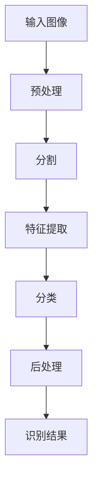

# 基于OpenCV的手写字识别系统详细设计与具体代码实现

## 1. 背景介绍

### 1.1 问题的由来

在当今数字化时代,手写识别技术已经广泛应用于多个领域,如电子签名、邮件分拣、数字化文件处理等。尽管键盘输入和语音识别技术的发展,手写输入仍然是一种自然、高效的人机交互方式。然而,由于手写字符的多样性和复杂性,实现高精度的手写字符识别系统仍然是一个具有挑战性的任务。

### 1.2 研究现状  

早期的手写字符识别系统主要基于统计模型和模板匹配方法。随着机器学习和深度学习技术的发展,基于神经网络的方法逐渐占据主导地位。其中,卷积神经网络(CNN)因其在图像识别任务中的出色表现,成为手写字符识别的主流方法之一。

### 1.3 研究意义

开发一个高性能的手写字符识别系统,不仅可以提高人机交互的效率和用户体验,还可以推动相关领域的技术进步。例如,它可以应用于自动化表单处理、古籍数字化、教育评分系统等场景。此外,手写字符识别也是计算机视觉和模式识别领域的一个重要研究课题。

### 1.4 本文结构

本文将详细介绍基于OpenCV的手写字符识别系统的设计与实现。我们将首先探讨系统的核心概念和算法原理,包括预处理、特征提取、分类等关键步骤。接下来,我们将深入讲解数学模型和公式推导过程。然后,我们将提供完整的代码实现和详细的解释说明。最后,我们将讨论实际应用场景、相关工具和资源,并总结未来的发展趋势和挑战。

## 2. 核心概念与联系

手写字符识别系统通常包括以下几个核心概念和步骤:

1. **预处理**: 对输入图像进行预处理,如去噪、二值化、倾斜校正等,以提高后续步骤的准确性。

2. **分割**: 将输入图像分割为单个字符或字符组,以便进行单独识别。

3. **特征提取**: 从每个字符图像中提取出有意义的特征,如结构特征、统计特征等,以供后续分类器使用。

4. **分类**: 使用训练好的分类器(如支持向量机、神经网络等)对提取的特征进行分类,得到识别结果。

5. **后处理**: 对初步识别结果进行后续处理,如上下文校正、语法检查等,以提高整体准确性。

这些步骤相互关联,形成了一个完整的手写字符识别流程。其中,预处理和特征提取对于提高系统性能至关重要,而分类器的选择和训练也直接影响最终的识别精度。

## 3. 核心算法原理 & 具体操作步骤

### 3.1 算法原理概述

本系统采用基于OpenCV的传统计算机视觉方法,结合机器学习算法实现手写字符识别。算法的核心思想是:

1. 对输入图像进行预处理,如去噪、二值化等,以提高图像质量。

2. 使用投影分析等方法对预处理后的图像进行字符分割。

3. 对每个分割出的字符图像提取特征,如结构特征(投影特征、轮廓特征等)和统计特征(矩特征、直方图特征等)。

4. 使用支持向量机(SVM)或其他机器学习算法,基于提取的特征对字符进行分类和识别。

5. 可选地进行后处理,如语法检查、上下文校正等,以提高识别准确性。

该算法的优点是计算效率较高,并且对噪声和扭曲具有一定的鲁棒性。但它也存在一些局限性,如对手写风格的变化敏感,难以处理复杂的背景和字符重叠等情况。

### 3.2 算法步骤详解

1. **预处理**
   - 去噪: 使用中值滤波、高斯滤波等方法去除图像噪声。
   - 二值化: 将灰度图像转换为二值图像,可使用大津算法、自适应阈值等方法。
   - 倾斜校正: 检测并校正图像的倾斜角度,可使用霍夫变换等方法。

2. **字符分割**
   - 投影分析: 通过计算水平和垂直投影,确定字符的位置和边界。
   - 连通区域分析: 标记连通的像素区域,将每个区域视为一个字符。

3. **特征提取**
   - 结构特征:
     - 投影特征: 基于水平和垂直投影计算特征向量。
     - 轮廓特征: 提取字符边界的链码或其他轮廓描述符作为特征。
   - 统计特征:
     - 矩特征: 计算字符图像的几何矩,如面积、质心、方向等。
     - 直方图特征: 计算字符图像的像素值直方图作为特征。

4. **分类与识别**
   - 支持向量机(SVM): 使用SVM将提取的特征映射到高维空间,寻找最优分类超平面。
   - 其他机器学习算法: 也可使用K-近邻、决策树、人工神经网络等算法进行分类。

5. **后处理(可选)**
   - 语法检查: 基于语言模型检查识别结果的语法合理性。
   - 上下文校正: 利用上下文信息(如相邻字符)校正识别错误。

### 3.3 算法优缺点

**优点**:

- 计算效率较高,适合实时应用场景。
- 对噪声和字符扭曲具有一定的鲁棒性。
- 特征提取和分类过程可解释性强。

**缺点**:

- 对手写风格的变化敏感,难以处理过于个性化的手写体。
- 难以有效处理复杂背景和字符重叠等情况。
- 传统特征提取方法的表达能力有限,难以捕捉复杂的模式。

### 3.4 算法应用领域

该算法适用于以下场景:

- 表单识别和自动化数据录入。
- 邮件分拣和地址识别。
- 银行支票的自动处理。
- 古籍和手写文献的数字化。
- 教育领域的作业批改和评分系统。

## 4. 数学模型和公式 & 详细讲解 & 举例说明

### 4.1 数学模型构建

在手写字符识别系统中,我们可以将问题建模为一个模式分类任务。给定一个手写字符图像 $I$,我们需要将其分类到预定义的字符类别集合 $\mathcal{C} = \{c_1, c_2, \dots, c_K\}$ 中的某一个类别 $c_k$。

我们可以使用discriminant函数 $f(I)$ 来表示分类器对输入图像 $I$ 的响应,其中 $f: \mathcal{I} \rightarrow \mathcal{C}$ 将图像空间 $\mathcal{I}$ 映射到类别空间 $\mathcal{C}$。我们的目标是学习一个最优的discriminant函数 $f^*$,使得对于任意输入图像 $I$,都有:

$$f^*(I) = \arg\max_{c_k \in \mathcal{C}} P(c_k|I)$$

即找到一个最大化后验概率 $P(c_k|I)$ 的discriminant函数。根据贝叶斯公式,我们可以将其改写为:

$$f^*(I) = \arg\max_{c_k \in \mathcal{C}} \frac{P(I|c_k)P(c_k)}{P(I)}$$

由于分母 $P(I)$ 对所有类别是相同的,因此可以忽略,得到:

$$f^*(I) = \arg\max_{c_k \in \mathcal{C}} P(I|c_k)P(c_k)$$

这就将问题转化为估计条件概率密度 $P(I|c_k)$ 和先验概率 $P(c_k)$。在实践中,我们通常采用discriminant模型 $f(I; \theta)$ 来近似这个最优解,其中 $\theta$ 是需要从训练数据中学习的模型参数。

### 4.2 公式推导过程

在手写字符识别任务中,一种常见的做法是使用支持向量机(SVM)作为分类器。SVM的基本思想是在特征空间中寻找一个最优超平面,将不同类别的样本分开,同时最大化两类样本到超平面的距离(即间隔)。

对于线性可分的情况,我们可以将SVM的discriminant函数写为:

$$f(x) = \text{sign}(w^T x + b)$$

其中 $x$ 是输入特征向量, $w$ 是权重向量, $b$ 是偏置项。我们希望找到一个 $(w, b)$ 组合,使得:

$$\begin{align*}
\min_{w, b} &\quad \frac{1}{2}\|w\|^2 \\
\text{s.t.} &\quad y_i(w^T x_i + b) \geq 1, \quad i = 1, 2, \dots, N
\end{align*}$$

这是一个约束优化问题,可以通过拉格朗日乘子法求解。引入拉格朗日乘子 $\alpha_i \geq 0$,我们可以构造拉格朗日函数:

$$L(w, b, \alpha) = \frac{1}{2}\|w\|^2 - \sum_{i=1}^N \alpha_i \big[y_i(w^T x_i + b) - 1\big]$$

对偶问题可以通过求解:

$$\begin{align*}
\max_\alpha &\quad \sum_{i=1}^N \alpha_i - \frac{1}{2} \sum_{i=1}^N \sum_{j=1}^N \alpha_i \alpha_j y_i y_j x_i^T x_j \\
\text{s.t.} &\quad \sum_{i=1}^N \alpha_i y_i = 0 \\
&\quad 0 \leq \alpha_i \leq C, \quad i = 1, 2, \dots, N
\end{align*}$$

得到最优解 $\alpha^*$,从而可以恢复出 $w^*$ 和 $b^*$:

$$\begin{align*}
w^* &= \sum_{i=1}^N \alpha_i^* y_i x_i \\
b^* &= y_j - w^{*T} x_j \quad (\text{for any } j \text{ with } \alpha_j^* \neq 0)
\end{align*}$$

对于非线性情况,我们可以引入核函数 $K(x_i, x_j) = \phi(x_i)^T \phi(x_j)$,将输入映射到高维特征空间,从而实现非线性分类。

### 4.3 案例分析与讲解

让我们通过一个实际案例来进一步理解SVM在手写字符识别中的应用。假设我们有一个包含手写数字图像及其标签的数据集,我们希望训练一个SVM模型来对新的手写数字图像进行分类。

1. **特征提取**

   首先,我们需要从每个手写数字图像中提取特征向量。一种常见的方法是使用像素值作为特征,即将每个 $28 \times 28$ 像素的图像展平为 $784$ 维的向量。另一种方法是提取结构特征或统计特征,如投影特征、轮廓特征、矩特征等。

2. **训练SVM模型**

   接下来,我们使用提取的特征向量及其对应的标签作为输入,训练一个线性SVM模型或非线性SVM模型(使用核函数)。在训练过程中,SVM会自动学习出最优的权重向量 $w^*$ 和偏置项 $b^*$,以最大化不同类别样本之间的间隔。

3. **模型评估**

   在训练完成后,我们可以使用保留的测试集来评估模型的性能。对于每个测试样本,我们首先提取其特征向量 $x_\text{test}$,然后使用训练好的SVM模型计算:

   $$y_\text{pred} = \text{sign}(w^{*T} x_\text{test} + b^*)$$

   将预测结果 $y_\text{pred}$ 