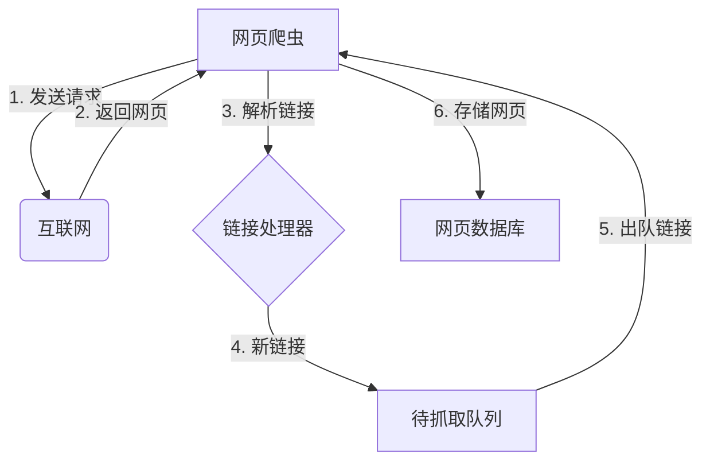
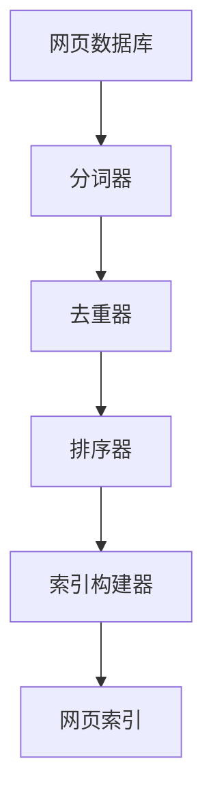
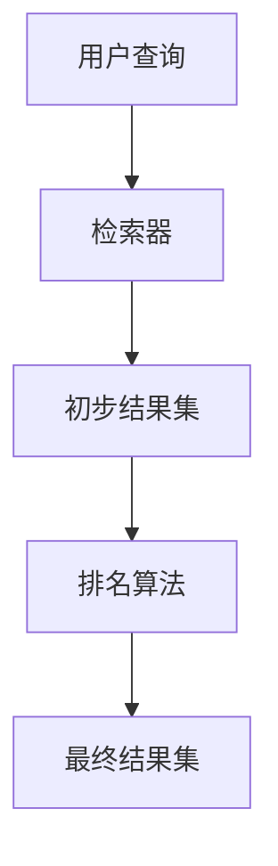
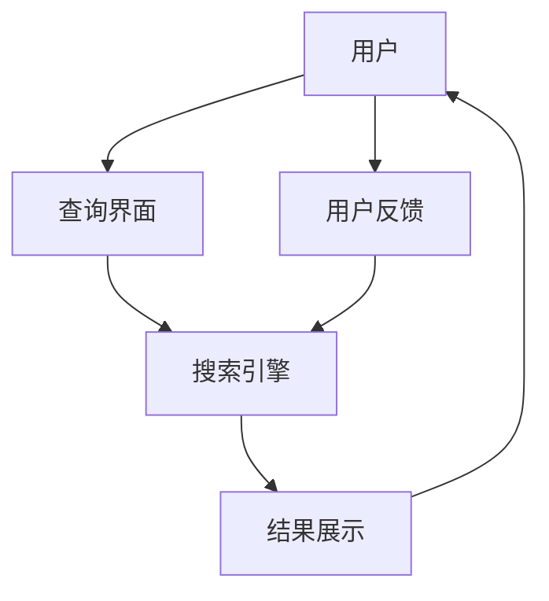
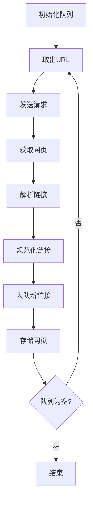
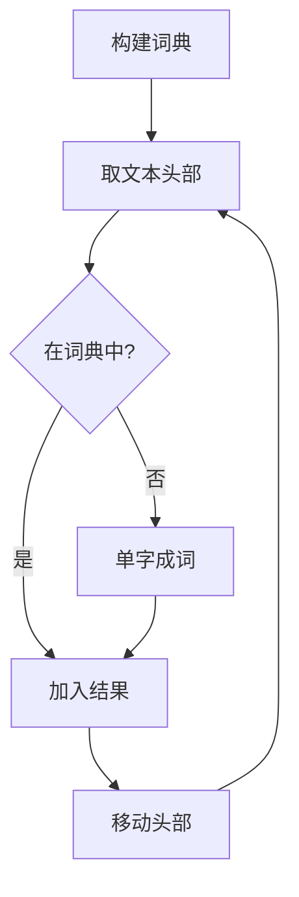
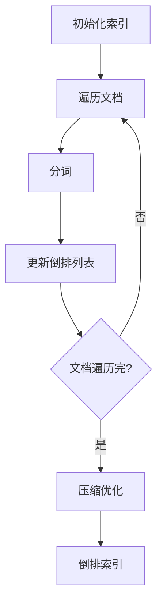
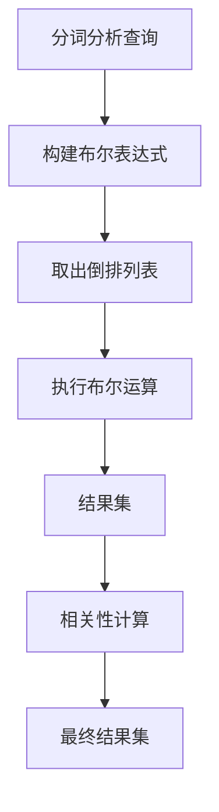

# 基于Python的搜索引擎的设计与实现

## 1. 背景介绍

### 1.1 问题的由来

在当今信息时代,互联网上的数据量呈现出爆炸式增长。根据统计,截至2022年底,全球互联网上的信息量已经超过了60ZB(1ZB=1万亿TB)。面对如此庞大的数据量,如何快速、准确地检索出用户所需的信息,成为了一个亟待解决的问题。传统的搜索方式已经无法满足用户的需求,因此设计和实现一个高效的搜索引擎就显得尤为重要。

### 1.2 研究现状

目前,已经有许多公司和组织投入了大量的人力物力来研发搜索引擎技术,比如谷歌(Google)、百度(Baidu)、微软(Microsoft)等。这些搜索引擎通过不断优化算法和架构,提供了较为准确和高效的搜索服务。然而,随着数据量的持续增长和用户需求的不断变化,现有的搜索引擎技术仍然存在一些缺陷和局限性,比如:

- 准确率不足:搜索结果中仍然存在大量无关内容
- 实时性差:无法及时反映最新的数据更新
- 个性化程度低:无法很好地满足不同用户的个性化需求
- 可扩展性差:难以应对海量数据的高并发访问

因此,设计和实现一种全新的搜索引擎技术,以解决上述问题,成为了当前研究的热点方向。

### 1.3 研究意义

设计和实现一种高效、准确、实时、个性化的搜索引擎技术,对于提高互联网信息获取的效率和质量具有重要意义。具体来说,其意义主要体现在以下几个方面:

1. 提高信息检索的准确性和召回率
2. 满足用户个性化的搜索需求
3. 支持海量数据的实时检索和更新
4. 提升系统的可扩展性和高并发处理能力
5. 降低搜索成本,提高资源利用率

总的来说,研究和开发新一代搜索引擎技术,将为用户提供更加优质的信息服务,促进信息技术的发展,对经济和社会发展都将产生深远的影响。

### 1.4 本文结构

本文将围绕基于Python语言的搜索引擎技术展开讨论,主要内容包括:

1. 介绍搜索引擎的核心概念和关键技术
2. 分析和阐述搜索引擎的核心算法原理及具体实现步骤
3. 构建搜索引擎的数学模型,并给出公式推导和案例分析
4. 基于Python语言,实现一个简单的搜索引擎示例,并对代码进行解读和分析
5. 探讨搜索引擎在实际场景中的应用,以及未来的发展趋势和挑战
6. 推荐相关的学习资源、开发工具和论文等

## 2. 核心概念与联系

在深入探讨搜索引擎的设计与实现之前,我们需要先了解一些核心概念,这些概念是构建搜索引擎的基础。

### 2.1 网页爬虫(Web Crawler)

网页爬虫是搜索引擎的重要组成部分,主要负责从互联网上收集网页数据。它通过遍历互联网上的链接,自动下载网页内容,形成一个庞大的网页数据库。



### 2.2 网页索引(Web Index)

网页索引是搜索引擎的核心部分,它通过对网页数据进行分词、去重、排序等处理,构建出一个高效的索引结构,用于快速查找网页。常见的索引结构包括:

- 倒排索引(Inverted Index)
- 前缀树(Trie Tree)
- 哈希表(Hash Table)



### 2.3 排名算法(Ranking Algorithm)

排名算法是搜索引擎的另一个核心部分,它通过综合考虑多种因素(如网页内容、链接结构、用户行为等),对检索结果进行排序,从而提高搜索结果的质量和相关性。常见的排名算法包括:

- PageRank算法
- HITS算法
- BM25算法
- 机器学习算法(如LambdaRank、RankNet等)



### 2.4 用户界面(User Interface)

用户界面是搜索引擎与用户交互的入口,它需要提供友好的查询界面,并将搜索结果以合理的形式呈现给用户。同时,用户界面还需要收集用户的反馈数据(如点击、停留时间等),为排名算法的优化提供依据。



上述四个核心概念相互关联、相互作用,共同构成了一个完整的搜索引擎系统。网页爬虫负责数据采集,网页索引实现高效检索,排名算法保证结果质量,用户界面则是系统与用户的交互桥梁。

## 3. 核心算法原理 & 具体操作步骤

### 3.1 算法原理概述

搜索引擎的核心算法主要包括以下几个方面:

1. **网页爬虫算法**: 用于有效地从互联网上采集网页数据,包括链接提取、URL规范化、网页去重等策略。
2. **分词算法**: 将网页内容分割成单词序列,是构建索引的基础。常用的分词算法有最大匹配算法、逆向最大匹配算法等。
3. **索引构建算法**: 将分词结果构建成高效的索引结构,如倒排索引、前缀树等,以支持快速查找。
4. **检索算法**: 根据用户查询,在索引中快速找到相关的网页集合,常用的检索模型有布尔模型、向量空间模型等。
5. **排名算法**: 对检索结果进行排序,使得最相关的网页排在前面。常见的排名算法有PageRank、BM25、机器学习算法等。

这些算法相互配合、环环相扣,共同实现了搜索引擎的核心功能。下面我们将详细介绍其中的关键算法原理和具体实现步骤。

### 3.2 算法步骤详解

#### 3.2.1 网页爬虫算法

网页爬虫算法的主要目标是从互联网上采集尽可能多的网页数据,为后续的索引构建和检索提供基础。常用的爬虫算法包括广度优先爬虫(BFS)和深度优先爬虫(DFS)等。

以广度优先爬虫算法为例,其基本步骤如下:

1. 初始化一个待抓取队列,并将种子URL放入队列
2. 从队列中取出一个URL,发送HTTP请求获取网页内容
3. 解析网页内容,提取所有链接,并对链接进行规范化处理
4. 将新发现的链接加入待抓取队列
5. 存储已抓取的网页内容
6. 重复步骤2-5,直到队列为空或达到预设条件



在实现过程中,还需要考虑网页去重、控制爬取深度、设置爬取策略等问题,以提高爬虫的效率和质量。

#### 3.2.2 分词算法

分词算法的目标是将网页内容分割成单词序列,为后续的索引构建做准备。常用的分词算法包括最大匹配算法、逆向最大匹配算法等。

以最大匹配算法为例,其基本步骤如下:

1. 构建一个词典,包含所有可能出现的单词
2. 从左到右扫描文本,取最长的匹配词
3. 将匹配到的词加入结果列表
4. 继续扫描剩余文本,重复步骤2-3
5. 直到扫描完整个文本



在实现过程中,还需要考虑处理分词歧义、数字、标点符号等特殊情况,以提高分词的准确性。

#### 3.2.3 索引构建算法

索引构建算法的目标是将分词结果构建成高效的索引结构,以支持快速查找。常用的索引结构包括倒排索引、前缀树等。

以倒排索引为例,其基本构建步骤如下:

1. 初始化一个空的倒排索引结构
2. 遍历所有文档,对每个文档进行分词
3. 对于每个单词,将其所在文档的ID加入对应的倒排列表
4. 对倒排列表进行压缩和优化,如去除停用词、记录词频等



在实现过程中,还需要考虑索引的存储方式、更新策略、分布式部署等问题,以提高索引的效率和可扩展性。

#### 3.2.4 检索算法

检索算法的目标是根据用户查询,在索引中快速找到相关的文档集合。常用的检索模型包括布尔模型、向量空间模型等。

以布尔模型为例,其基本检索步骤如下:

1. 对用户查询进行分词和词法分析,构建查询的布尔表达式
2. 从索引中取出每个查询词对应的倒排列表
3. 对倒排列表执行布尔运算(如交集、并集等),得到初步结果集
4. 根据需要,对结果集进行进一步处理,如计算相关性分数等



在实现过程中,还需要考虑查询优化、相关性ranking、查询拼写纠正等问题,以提高检索的准确性和效率。

#### 3.2.5 排名算法

排名算法的目标是对检索结果进行排序,使得最相关的文档排在前面。常见的排名算法包括PageRank、BM25、机器学习算法等。

以PageRank算法为例,其基本思路是通过网页之间的链接结构,计算每个网页的重要性得分,然后根据得分对结果进行排序。具体步骤如下:

1. 构建网页之间的链接图
2. 初始化每个网页的PageRank值为1/N(N为网页总数)
3. 迭代计算每个网页的新PageRank值,直到收敛
4. 根据最终的PageRank值对结果集进行排序

```mermaid
graph TD
    A[构建链接图] --> B[初始化PR值]
    B --> C[迭代计算]
    C --> D{是否收敛?}
    