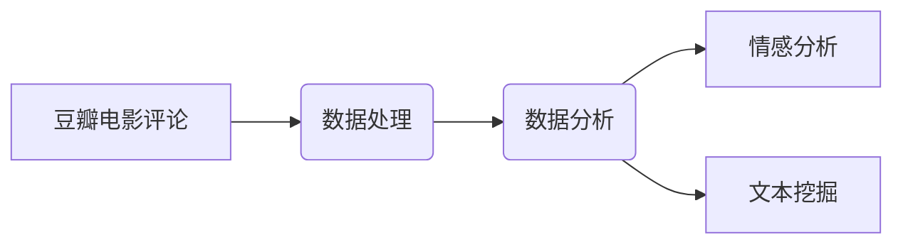

# 基于Python豆瓣电影评论的数据处理与分析

关键词：Python, 豆瓣电影评论, 数据处理, 数据分析, 情感分析, 文本挖掘

## 1. 背景介绍
### 1.1 问题的由来
随着互联网的快速发展,越来越多的人开始在网上分享自己对电影的看法和评价。豆瓣作为国内最大的电影评论网站,汇聚了大量用户生成的电影评论数据。这些数据蕴含着丰富的信息,如果能够有效地挖掘和利用,将有助于我们深入理解用户对电影的偏好和看法,为电影行业提供有价值的参考。

### 1.2 研究现状 
目前,国内外学者已经开展了不少基于电影评论数据的研究工作。一些研究利用机器学习和深度学习算法对电影评论进行情感分析,自动判断评论的情感倾向[1]。还有研究基于电影评论数据构建了电影推荐系统[2]。此外,电影评论数据也被用于电影票房预测[3]、电影类型划分[4]等任务。这些研究表明,电影评论数据具有重要的应用价值。

### 1.3 研究意义
本文以豆瓣电影评论数据为研究对象,利用Python进行数据处理与分析,具有以下意义:

(1) 丰富电影评论数据分析的研究。目前针对豆瓣电影评论数据的分析研究还比较少,本文的研究可以为后续研究提供参考。

(2) 展示Python在文本数据处理与分析中的应用。Python是文本挖掘领域常用的编程语言,但针对中文文本的处理分析案例还不多,本文可以很好地展示Python在这方面的能力。

(3) 为电影行业提供有价值的分析结果。通过对豆瓣电影评论数据的分析,可以洞察用户对电影的真实看法,为电影从业者提供决策参考。

### 1.4 本文结构
本文后续结构安排如下:第2部分介绍相关核心概念;第3部分介绍核心算法原理与具体操作步骤;第4部分建立数学模型并进行公式推导与案例分析;第5部分给出基于Python的代码实现;第6部分讨论实际应用场景;第7部分推荐相关工具和学习资源;第8部分对全文进行总结并展望未来;第9部分列出常见问题解答。

## 2. 核心概念与联系
本节介绍文中涉及的核心概念,主要包括:

(1) 豆瓣电影评论:用户在豆瓣平台对电影发表的主观评价和看法,通常包含用户对电影的评分和评论文本。

(2) 数据处理:对原始的电影评论数据进行清洗、去重、分词等预处理操作,将非结构化的文本数据转化为结构化的、可用于分析的数据。

(3) 数据分析:运用统计学和数据挖掘的方法,对处理后的电影评论数据进行探索性分析和挖掘,发现其中蕴含的规律和特征。

(4) 情感分析:通过自然语言处理技术,自动判断电影评论文本所表达的情感倾向,如正面、负面和中性等。

(5) 文本挖掘:从大规模的文本数据中发现隐藏的、有价值的知识的过程,涉及文本表示、文本分类、聚类、信息抽取等技术。

这些概念之间关系紧密:豆瓣电影评论是研究对象和数据来源,需要通过数据处理使其可用于分析;情感分析和文本挖掘是对电影评论数据进行分析的具体方法;数据分析则贯穿始终,是发现数据价值的关键。它们共同构成了本文研究的核心。

## 3. 核心算法原理 & 具体操作步骤
### 3.1 算法原理概述
本文主要涉及两类算法:一类是数据预处理的算法,如文本清洗、中文分词等;另一类是数据分析的算法,如情感分类、主题模型等。

数据预处理算法旨在去除原始文本数据中的噪声,提取文本特征。常见的文本清洗操作包括去除HTML标签、特殊符号、停用词,以及繁体转简体等。中文分词则是将连续的文本切分成有意义的词语序列,是文本挖掘的基础。常用的分词算法有基于字典匹配的正向最大匹配算法、逆向最大匹配算法等,以及基于统计的隐马尔可夫模型分词算法等。

数据分析算法用于从处理后的数据中抽取有价值的信息和知识。情感分类算法可以判断文本的情感倾向,主要分为基于词典的方法和基于机器学习的方法。基于词典的方法通过情感词典计算文本的情感值,而基于机器学习的方法则训练分类器自动判别文本情感。主题模型用于发现文本集合的潜在主题,常见的模型有潜在语义分析(LSA)、潜在狄利克雷分配(LDA)等。

### 3.2 算法步骤详解
下面以情感分类任务为例,详细介绍基于机器学习的情感分类算法的步骤。

输入:电影评论数据集$D=\{(x_1,y_1),(x_2,y_2),...,(x_N,y_N)\}$,其中$x_i$为第$i$条评论的文本,$y_i\in\{0,1\}$为评论的情感标签(0表示负面,1表示正面),$N$为样本数。

输出:情感分类器$f$,对新的评论文本$x$,可以预测其情感标签$\hat{y}=f(x)$。

步骤:
1. 文本预处理:对评论文本$x_i$进行分词、去停用词等操作,得到词语序列$s_i$。

2. 特征提取:将词语序列$s_i$转化为数值型特征向量$v_i$。常用的特征表示方法有词袋模型、TF-IDF、Word2Vec等。以词袋模型为例,设语料库中共有$M$个不同的词语,则$v_i$为$M$维向量,第$j$维表示词语$w_j$在$s_i$中的出现频次。

3. 划分数据集:将带标签的特征向量数据集$\{(v_1,y_1),(v_2,y_2),...,(v_N,y_N)\}$划分为训练集和测试集,比例通常为8:2或7:3。

4. 训练分类器:用训练集数据训练所选择的分类器,如朴素贝叶斯、逻辑回归、支持向量机等。以逻辑回归为例,训练过程就是通过极大似然估计或梯度下降等方法,求解逻辑回归模型的参数$\theta$:

$$
\hat{\theta}=\arg\max_{\theta}\sum_{i=1}^{N}[y_i\log(h_{\theta}(v_i))+(1-y_i)\log(1-h_{\theta}(v_i))]
$$

其中$h_{\theta}(v_i)=\frac{1}{1+e^{-\theta^Tv_i}}$为逻辑回归函数。

5. 模型评估:用测试集数据评估训练得到的分类器性能,常用的评价指标有准确率、精确率、召回率和F1值等。

6. 模型应用:对新的评论文本$x$,先进行预处理得到词语序列$s$,再提取特征得到$v$,然后用训练好的分类器进行预测:$\hat{y}=f(v)=\mathbf{1}\{\theta^Tv>0.5\}$。

### 3.3 算法优缺点
基于机器学习的情感分类算法的优点是:
- 可以自动学习文本情感分类的规则,不需要手工构建情感词典;
- 分类性能较好,在大规模语料上训练可以达到较高的准确率;
- 可以同时适用于多种语言和领域的文本情感分析任务。

其缺点包括:  
- 需要大量带标签的训练数据,而情感标注成本较高;
- 模型的泛化能力有限,对于新领域的文本,需要重新训练;
- 对低频词和生僻词的情感判断能力较差,容易受到训练数据的影响。

### 3.4 算法应用领域
情感分类算法可应用于多个领域,例如:

(1) 舆情监控:通过对网络评论、新闻、微博等文本进行情感分析,实时掌握舆论动向,预警负面舆情。

(2) 推荐系统:分析用户评论的情感倾向,了解用户喜好,为其推荐合适的商品或服务。  

(3) 客户服务:自动对客户反馈进行情感判断,发现负面评价并及时处理。

(4) 金融投资:根据财经新闻、股吧论坛等文本的情感分析结果,预测股票涨跌。

## 4. 数学模型和公式 & 详细讲解 & 举例说明
### 4.1 数学模型构建
本节以潜在狄利克雷分配(LDA)主题模型为例,介绍其数学模型的构建过程。

LDA是一种层次化的贝叶斯概率生成模型,它认为每篇文档都由多个主题组成,而每个主题都是词语上的概率分布。形式化地,LDA模型可以用以下过程来描述文档的生成:

1. 对于语料库中的每篇文档$d$:
   - 从狄利克雷分布$\alpha$中采样出文档的主题分布$\theta_d$: $\theta_d|\alpha \sim \mathrm{Dir}(\alpha)$
   - 对于文档中的每个词位置$i$:
     - 从多项式分布$\theta_d$中采样出该词的主题$z_{di}$: $z_{di}|\theta_d \sim \mathrm{Mult}(\theta_d)$
     - 从主题$z_{di}$对应的多项式分布$\phi_{z_{di}}$中采样出词语$w_{di}$: $w_{di}|z_{di},\phi_{z_{di}} \sim \mathrm{Mult}(\phi_{z_{di}})$
2. 对于每个主题$k$:  
   - 从狄利克雷分布$\beta$中采样出主题的词语分布$\phi_k$: $\phi_k|\beta \sim \mathrm{Dir}(\beta)$

其中$\alpha$和$\beta$是模型的超参数,分别控制主题分布和词语分布的先验。$\theta_d$和$\phi_k$是模型的隐变量,需要通过后验推断来估计。$z_{di}$和$w_{di}$是模型的观测变量,分别表示第$d$篇文档第$i$个词的主题和词语本身。

### 4.2 公式推导过程
根据LDA模型的定义,文档$d$的生成概率可以表示为:

$$
p(d|\alpha,\beta) = \int p(\theta_d|\alpha)\prod_{i=1}^{n_d}\sum_{z_{di}}p(z_{di}|\theta_d)p(w_{di}|z_{di},\beta)d\theta_d
$$

其中$n_d$为文档$d$的词数。由于隐变量$\theta_d$和$z_{di}$是未知的,上式没有解析解,需要用近似推断方法求解。常用的推断算法有变分推断和Gibbs采样等。

以Gibbs采样为例,我们需要采样每个词的主题指派$z_{di}$。在其他词的主题指派已知的条件下,词$w_{di}$的主题$z_{di}$的后验概率正比于:

$$
p(z_{di}=k|w_{di}=v,z_{\neg di},w_{\neg di},\alpha,\beta) \propto \frac{n_{d,\neg i}^{(k)}+\alpha_k}{\sum_{k=1}^K (n_{d,\neg i}^{(k)}+\alpha_k)} \cdot \frac{n_{\neg di}^{(v|k)}+\beta_v}{\sum_{v=1}^V (n_{\neg di}^{(v|k)}+\beta_v)}
$$

其中$n_{d,\neg i}^{(k)}$表示文档$d$中除当前词以外指派为主题$k$的词数,$n_{\neg di}^{(v|k)}$表示语料库中除当