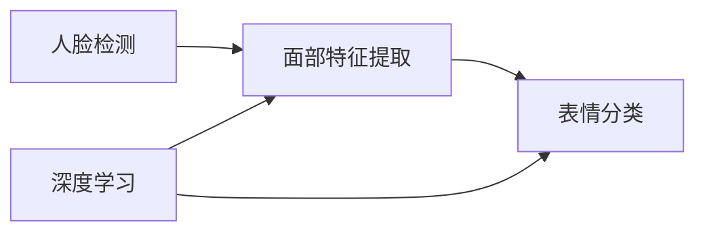

# 基于opencv 的人脸表情识别系统详细设计与具体代码实现

关键词：人脸表情识别、OpenCV、机器学习、图像处理、特征提取、分类算法

## 1. 背景介绍
### 1.1  问题的由来
人脸表情识别是计算机视觉和人工智能领域的一个重要研究方向。随着人机交互技术的不断发展,让计算机能够准确识别和理解人类的面部表情,对于提升人机交互体验,实现更加智能化的应用服务具有重要意义。
### 1.2  研究现状
目前,人脸表情识别技术已经取得了长足的进展。许多研究者提出了各种有效的算法和模型,如基于几何特征、外观特征、深度学习等方法。一些开源的计算机视觉库如OpenCV,也集成了人脸检测和表情识别的功能模块,为相关应用的开发提供了便利。
### 1.3  研究意义
人脸表情蕴含着丰富的情感信息,是人类情感状态的重要外在表现。通过对人脸表情的自动识别,可以让计算机更好地理解用户的情感,从而提供个性化、人性化的交互服务。同时,表情识别技术在医疗、教育、安防等诸多领域也有广阔的应用前景。
### 1.4  本文结构
本文将详细介绍一个基于OpenCV的人脸表情识别系统的设计与实现。首先,讨论人脸表情识别涉及的核心概念和关键技术;然后,重点阐述表情识别算法的原理和实现步骤;接着,给出具体的系统架构设计和代码实现;最后,总结全文,并展望人脸表情识别技术的发展趋势与挑战。

## 2. 核心概念与联系
人脸表情识别是一个涵盖多个领域的综合性课题,其核心概念包括:

- 人脸检测(Face Detection):在图像或视频中定位和标定人脸区域的过程。常用的方法有Haar特征+AdaBoost分类器、HOG特征+SVM分类器等。

- 面部特征提取(Facial Feature Extraction):从人脸图像中提取能够刻画表情特征的关键信息,如面部器官(眼、口、眉等)的形状、位置、纹理等。特征提取方法可分为几何特征和外观特征两大类。

- 表情分类(Expression Classification):根据提取的面部特征,判断当前表情属于哪一类(如高兴、悲伤、惊讶等)。常见的分类器有SVM、随机森林、神经网络等。

- 深度学习(Deep Learning):一类基于深度神经网络的机器学习方法。将特征提取和分类统一在一个端到端的网络结构中,可以自动学习层次化的表情特征表示。

这些概念环环相扣,共同构成了人脸表情识别的技术基础。下图展示了它们之间的逻辑联系:



## 3. 核心算法原理 & 具体操作步骤
### 3.1  算法原理概述
本文采用的是一种基于局部二值模式(LBP)特征和支持向量机(SVM)的人脸表情识别算法。其基本原理是:首先对人脸图像进行预处理和归一化;然后,提取LBP特征,刻画不同表情下面部纹理的差异;最后,用SVM对LBP特征进行分类,识别出具体的表情类别。
### 3.2  算法步骤详解

1. 人脸检测与对齐
使用OpenCV的级联分类器(CascadeClassifier)检测人脸,并根据眼睛位置进行几何对齐,得到标准化的人脸区域图像。

2. 图像预处理  
对人脸图像进行灰度化、直方图均衡化等预处理,减少光照等因素的影响。

3. LBP特征提取
在人脸图像的不同区域(如眼、口、鼻等)提取LBP特征。LBP通过比较像素与其邻域像素的大小关系,得到一个二进制编码,可以有效地描述局部纹理信息。

4. 特征向量构建
将各个区域提取的LBP特征连接成一个高维的特征向量,作为表情图像的特征表示。

5. SVM分类器训练
使用带标签的表情图像样本,训练多个二分类SVM,如"高兴 vs 其他"、"悲伤 vs 其他"等。SVM可以在高维特征空间中寻找最优的分类超平面。

6. 表情类别判决
对于待识别的表情图像,提取LBP特征并输入到训练好的SVM分类器,通过投票机制决定最终的表情类别。

### 3.3  算法优缺点

优点:
- LBP特征对光照变化有较强的鲁棒性,能够描述细节纹理信息。
- SVM是一种有效的小样本学习方法,分类性能好,易于训练。
- 算法计算效率较高,满足实时性要求。

缺点:  
- 对姿态变化、遮挡等因素的适应性有限。
- 没有考虑面部特征的时序动态信息。
- 特征表示能力不如深度学习方法。

### 3.4  算法应用领域
基于LBP+SVM的表情识别算法可应用于以下场合:

- 人机交互:根据用户表情调整交互方式,提供个性化服务。
- 智能监控:通过表情分析识别异常情绪和可疑行为。
- 驾驶辅助:监测驾驶员疲劳、分心等危险状态。
- 医疗诊断:协助评估患者的情绪和心理状况。

## 4. 数学模型和公式 & 详细讲解 & 举例说明
### 4.1  数学模型构建
LBP特征:设$I(x,y)$为图像在$(x,y)$处的像素值,$g_c$为中心像素,$g_i(i=0,1,...,7)$为邻域像素。LBP值定义为:

$$LBP(x_c,y_c)=\sum_{i=0}^7 2^i s(g_i-g_c), s(x)=\begin{cases} 
1, & x \geq 0 \\
0, & x < 0
\end{cases}$$

SVM分类器:给定训练样本$\{(x_i,y_i)\}_{i=1}^N$,其中$x_i$为特征向量,$y_i \in \{-1,1\}$为类标签。SVM的目标是找到一个超平面$w^Tx+b=0$,使得两类样本被最大间隔分开。数学上表示为以下优化问题:

$$\min_{w,b} \frac{1}{2} \|w\|^2 \quad s.t. \quad y_i(w^Tx_i+b) \geq 1, i=1,2,...,N$$

### 4.2  公式推导过程
对于LBP特征,通过移位操作和查表可以高效地计算每个像素的LBP值:

```cpp
unsigned char LBP[256];
for(int i=0; i<256; i++) {
    unsigned char bits = 0;
    for(int j=0; j<8; j++) {
        bits |= ((i >> j) & 1) << (7-j);
    }
    LBP[i] = bits;
}

unsigned char lbpValue = LBP[((g0 >= gc) << 7) | ((g1 >= gc) << 6) | ... | (g7 >= gc)];
```

对于SVM模型,引入拉格朗日乘子$\alpha_i \geq 0$,将原问题转化为对偶问题:

$$\max_\alpha \sum_{i=1}^N \alpha_i - \frac{1}{2} \sum_{i,j=1}^N \alpha_i \alpha_j y_i y_j x_i^T x_j \quad s.t. \quad \sum_{i=1}^N \alpha_i y_i = 0, 0 \leq \alpha_i \leq C$$

求解出最优的$\alpha^*$后,分类决策函数为:$f(x)=sign(\sum_{i=1}^N \alpha_i^* y_i x_i^T x + b^*)$

### 4.3  案例分析与讲解
以下是一个简单的二维数据集,用SVM进行分类:

```python
import numpy as np
from sklearn import svm

X = np.array([[1,2],[2,3],[3,3],[2,1],[3,2]])
Y = np.array([1,1,1,-1,-1])

clf = svm.SVC(kernel='linear', C=1000)
clf.fit(X, Y)

print(clf.predict([[4,5]]))  # 输出[1]
```

在这个例子中,我们构造了一个包含5个样本的数据集,其中前3个样本属于正类,后2个属于负类。然后,使用scikit-learn库中的SVM分类器进行训练。最后,对一个新的样本点`[4,5]`进行预测,得到的结果为正类`[1]`。SVM通过寻找一个最大间隔超平面,对样本点进行了很好的划分。

### 4.4  常见问题解答

**Q:** LBP特征对光照变化为什么具有鲁棒性?
**A:** LBP通过比较像素相对大小关系得到编码,而不是直接使用像素值。因此,当光照发生变化时,虽然像素值会整体增大或减小,但像素间的大小关系保持不变,LBP特征也就不会受到太大影响。

**Q:** SVM的核函数有什么作用?
**A:** 核函数可以将原始特征空间映射到一个更高维的空间,使得在原空间中不可分的样本在新空间内线性可分。常见的核函数有线性核、多项式核、高斯核(RBF)等。通过使用核函数,SVM可以处理非线性分类问题。

**Q:** 对于多分类问题,SVM是如何处理的?
**A:** 常见的方法有一对一(One-vs-One)和一对多(One-vs-Rest)两种。一对一是在所有类别中两两构建二分类SVM,测试时将样本分类到得票最多的类别;一对多是每个类别构建一个二分类SVM,将其他所有类别作为负类,测试时将样本分类到置信度最高的类别。

## 5. 项目实践：代码实例和详细解释说明
### 5.1  开发环境搭建
- 操作系统:Windows 10 / Ubuntu 18.04
- 开发语言:C++
- 开发工具:Visual Studio 2019 / GCC 7.5
- 依赖库:OpenCV 4.5.1

### 5.2  源代码详细实现

```cpp
#include <opencv2/opencv.hpp>
#include <vector>
#include <string>

using namespace cv;
using namespace cv::ml;
using namespace std;

vector<string> emotionLabels = {"Angry", "Disgust", "Fear", "Happy", "Neutral", "Sad", "Surprise"};

Ptr<SVM> trainSVM(vector<Mat>& trainImages, vector<int>& trainLabels) {
    Mat trainData;
    for(size_t i=0; i<trainImages.size(); i++) {
        Mat feature = trainImages[i].reshape(1, 1);
        trainData.push_back(feature);
    }
    trainData.convertTo(trainData, CV_32FC1);
    
    Ptr<SVM> svm = SVM::create();
    svm->setType(SVM::C_SVC);
    svm->setKernel(SVM::LINEAR);
    svm->setTermCriteria(TermCriteria(TermCriteria::MAX_ITER, 100, 1e-6));
    svm->train(trainData, ROW_SAMPLE, trainLabels);
    
    return svm;
}

void preprocessImage(Mat& img, Mat& outImg) {
    cvtColor(img, outImg, COLOR_BGR2GRAY);
    equalizeHist(outImg, outImg);
    resize(outImg, outImg, Size(96, 96));
}

Mat extractLBPFeature(Mat& img) {
    Mat lbpImg;
    Mat points = Mat::zeros(1, 8, CV_8UC1);
    for(int i=0; i<8; i++) {
        points.at<uchar>(i) = i;
    }
    int radius = 1;
    LBPOperator lbp(8, radius, points);
    lbp(img, lbpImg);
    return lbpImg;
}

int main() {
    vector<Mat> trainImages;
    vector<int> trainLabels;
    
    // 加载训练样本
    for(size_t i=0; i<emotionLabels.size(); i++) {
        string folderPath = "./dataset/" + emotionLabels[i];
        vector<String> filePaths;
        glob(folderPath, filePaths);
        
        for(size_t j=0; j<filePaths.size(); j++) {
            Mat img = imread(filePaths[j]);
            Mat processedImg, lbp