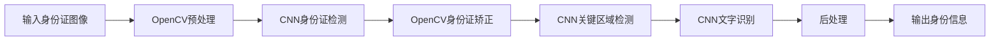

# 基于opencv+cnn的身份证识别系统详细设计与具体代码实现

关键词：身份证识别, OpenCV, 卷积神经网络, 文字检测, 文字识别

## 1. 背景介绍
### 1.1  问题的由来
随着互联网时代的发展,各类在线业务蓬勃发展,身份认证成为了一个重要环节。传统的人工审核身份证的方式效率低下,无法满足海量用户的实名认证需求。因此,亟需一种高效、智能化的身份证识别方案。
### 1.2  研究现状
目前,身份证识别主要有以下几种方法:
1. 基于模板匹配的方法。通过预先定义身份证模板,然后将待识别图像与模板进行匹配,提取身份证信息。但无法应对多变的拍摄角度、光照条件等。
2. 基于OCR的方法。先定位身份证区域,然后使用OCR技术识别身份证文字。识别精度较高,但对图像质量要求高,处理速度慢。
3. 基于深度学习的端到端方法。利用深度学习模型直接从输入图像中定位和识别身份证信息,可以处理质量较差的图像,速度快,是目前的研究热点。

### 1.3  研究意义
身份证识别在互联网应用中具有广泛需求,传统方法存在诸多不足。因此,开发一个鲁棒、高效的身份证识别系统具有重要意义:
1. 提高身份认证效率,节省人力成本
2. 改善用户体验,提升业务转化率
3. 实现7x24小时不间断认证服务
4. 为实名制等监管要求提供支撑

### 1.4  本文结构
本文将详细介绍一种基于OpenCV和卷积神经网络的身份证识别方案。2-4节介绍相关概念原理,5-6节给出系统设计与代码实现,7-8节讨论实际应用与未来展望。

## 2. 核心概念与联系
身份证识别涉及计算机视觉、深度学习、图像处理等多个领域的概念和技术。

OpenCV是一个开源的计算机视觉库,提供了大量图像处理、分析的API,可用于身份证定位、图像预处理等。

卷积神经网络(CNN)是一种深度学习模型,通过卷积、池化等操作提取图像特征,并进行分类、检测等任务。CNN可用于身份证关键区域检测与文字识别。

身份证识别的主要步骤包括:图像采集、预处理、身份证检测、关键区域定位、文字识别、后处理。各个步骤相互关联,共同构成完整的识别流程。

下图展示了OpenCV、CNN在身份证识别流程中的作用:



## 3. 核心算法原理 & 具体操作步骤
### 3.1  算法原理概述
本文采用基于OpenCV和CNN的身份证识别算法,主要分为三个阶段:
1. 身份证定位:使用OpenCV进行图像增强,然后用CNN检测出身份证区域并矫正。
2. 关键区域检测:在身份证区域中,用CNN检测姓名、身份证号码等关键区域。 
3. 文字识别:对各个关键区域,用CNN进行文字识别,得到最终身份信息。

### 3.2  算法步骤详解
1. 图像预处理
   - 图像缩放:统一缩放到固定尺寸,减少后续计算量
   - 灰度化:转为灰度图,突出身份证轮廓
   - 二值化:转为黑白图像,便于边缘检测
   - 形态学处理:去除噪点,连接断裂边缘
2. 身份证检测与矫正
   - 使用训练好的CNN模型,在图像中检测身份证区域,得到边缘坐标
   - 用OpenCV对身份证区域进行透视变换,矫正为正面视图
3. 关键区域检测
   - 在矫正后的身份证图像上,用CNN检测姓名、性别、民族、住址、身份证号码等关键区域
   - 用OpenCV提取各个关键区域的图像
4. 文字识别
   - 对每个关键区域图像,用CNN识别其中的文字
   - 识别结果进行后处理,如错误订正、日期格式转换等
5. 输出结果
   - 将识别结果整理为规范格式的身份信息
   - 输出JSON或其他格式的数据

### 3.3  算法优缺点
优点:
- 采用CNN,可以处理模糊、倾斜、光照不均的图像,鲁棒性强
- 端到端识别,无需人工定义复杂规则,通用性好
- 检测和识别速度快,可实时处理视频流

缺点: 
- 需要大量训练数据,对数据标注要求高
- 模型计算量大,需要GPU加速
- 对于特殊字体、污损严重的身份证,识别率下降

### 3.4  算法应用领域  
身份证识别算法可应用于:
- 银行、运营商等行业的实名认证
- 酒店、网吧等场所的身份核验
- 人脸识别的辅助验证
- 移动端身份证拍照识别

## 4. 数学模型和公式 & 详细讲解 & 举例说明
### 4.1  数学模型构建
身份证识别中用到的CNN模型主要包括:
1. 身份证检测模型:使用SSD(Single Shot MultiBox Detector)模型,可表示为:

$$
\begin{aligned}
L(x,c,l,g) = \frac{1}{N}(L_{conf}(x,c) + \alpha L_{loc}(x,l,g))
\end{aligned}
$$

其中,$x$为输入图像,$c$为身份证类别置信度,$l$为预测边界框位置,$g$为真实边界框位置。$L_{conf}$是分类损失,$L_{loc}$是定位损失。

2. 文字识别模型:使用CRNN(Convolutional Recurrent Neural Network)模型,可表示为:

$$
\begin{aligned}
h_{t} = LSTM(x_{t}, h_{t-1})
y_{t} = Softmax(W_{o}h_{t} + b_{o})
\end{aligned}
$$

其中,$x_t$为CNN提取的特征序列,$h_t$为LSTM隐藏状态,$y_t$为$t$时刻的输出。

### 4.2  公式推导过程
以文字识别的CTC损失函数为例:
对于输入序列$X$,标签序列$Y$,定义CTC损失为:

$$
\begin{aligned}
p(Y|X) = \sum_{\pi \in B^{-1}(Y)} p(\pi|X)
\end{aligned}
$$

其中,$B^{-1}(Y)$为$Y$的所有可能路径,$p(\pi|X)$为路径$\pi$的概率:

$$
\begin{aligned}
p(\pi|X) = \prod_{t=1}^{T} y_{\pi_t}^t
\end{aligned}
$$

最小化CTC损失等价于最大化$p(Y|X)$:

$$
\begin{aligned}
L_{CTC} = -\log p(Y|X) = -\log \sum_{\pi \in B^{-1}(Y)} \prod_{t=1}^{T} y_{\pi_t}^t
\end{aligned}
$$

### 4.3  案例分析与讲解
以一张身份证图像为例,说明识别过程:
1. 通过OpenCV进行图像增强、二值化等预处理,得到黑白图像。
2. 用SSD模型检测出图像中的身份证区域,得到边界框坐标。
3. 用透视变换矫正身份证区域为正面视图。
4. 在矫正后的身份证图像上,用SSD模型检测姓名、号码等关键区域,得到各个区域的图像。
5. 对每个关键区域图像,用CRNN模型识别文字。如号码区域图像输入CRNN,输出"3210231988010112345"。
6. 对识别结果进行后处理,如日期转为"19880101"。
7. 将各个关键信息整理为JSON格式输出。

### 4.4  常见问题解答
1. 对倾斜或模糊的身份证图像识别效果不好怎么办?
   
   可以在预处理阶段增强图像,如高斯滤波、直方图均衡化等。也可以扩充训练数据,增加各种角度、模糊程度的样本。

2. 对复印件、翻拍的身份证识别率低怎么办?
   
   可以在预处理阶段判断图像是否为复印件,如果是则直接拒绝。可以训练一个真伪分类器,或者分析图像的纹理、颜色等特征。

3. 如何提高文字识别的准确率?
   
   可以增加训练数据量,扩充文字字体、大小、粗细等变化。在后处理阶段,可以引入语言模型,纠正识别错误。还可以与其他OCR引擎结果做对比验证。

## 5. 项目实践：代码实例和详细解释说明
### 5.1  开发环境搭建
- 操作系统:Ubuntu 16.04
- 深度学习框架:TensorFlow 1.12
- 计算机视觉库:OpenCV 3.4
- 其他依赖:numpy、scipy、matplotlib等

### 5.2  源代码详细实现
1. 图像预处理部分
```python
import cv2
import numpy as np

def preprocess(img):
    # 缩放到固定大小
    img = cv2.resize(img, (WIDTH, HEIGHT))
    
    # 灰度化
    gray = cv2.cvtColor(img, cv2.COLOR_BGR2GRAY)
    
    # 高斯滤波去噪
    blurred = cv2.GaussianBlur(gray, (5, 5), 0)
    
    # Sobel算子边缘检测
    sobel = cv2.Sobel(blurred, cv2.CV_8U, 1, 0, ksize=3)
    
    # 二值化
    ret, binary = cv2.threshold(sobel, 0, 255, cv2.THRESH_OTSU+cv2.THRESH_BINARY)
    
    # 闭运算连接断裂边缘
    kernel = cv2.getStructuringElement(cv2.MORPH_RECT, (21, 7))
    closed = cv2.morphologyEx(binary, cv2.MORPH_CLOSE, kernel) 
    
    return closed
```

2. 身份证检测部分
```python
import tensorflow as tf
from object_detection.utils import label_map_util

def detect_idcard(img):
    # 加载冻结的模型和类别
    detection_graph = tf.Graph()
    with detection_graph.as_default():
        od_graph_def = tf.GraphDef()
        with tf.gfile.GFile(MODEL_PATH, 'rb') as fid:
            od_graph_def.ParseFromString(fid.read())
            tf.import_graph_def(od_graph_def, name='')
        
    label_map = label_map_util.load_labelmap(LABEL_PATH)
    categories = label_map_util.convert_label_map_to_categories(label_map, max_num_classes=1, use_display_name=True)
    category_index = label_map_util.create_category_index(categories)
    
    with detection_graph.as_default():
        with tf.Session(graph=detection_graph) as sess:
            # 输入图像
            image_tensor = detection_graph.get_tensor_by_name('image_tensor:0')
            detection_boxes = detection_graph.get_tensor_by_name('detection_boxes:0')
            detection_scores = detection_graph.get_tensor_by_name('detection_scores:0')
            detection_classes = detection_graph.get_tensor_by_name('detection_classes:0')
            num_detections = detection_graph.get_tensor_by_name('num_detections:0')
            
            # 运行检测
            (boxes, scores, classes, num) = sess.run(
                [detection_boxes, detection_scores, detection_classes, num_detections],
                feed_dict={image_tensor: np.expand_dims(img, axis=0)})
            
            # 取出检测结果
            boxes = np.squeeze(boxes)
            classes = np.squeeze(classes).astype(np.int32)
            scores = np.squeeze(scores)
            
            # 根据阈值过滤
            idcard_box = None
            for i in range(len(scores)):
                if scores[i] > THRESH:
                    idcard_box = tuple(boxes[i].tolist())
                    break
            
            return idcard_box
```

3. 身份证矫正部分
```python
import numpy as np
import cv2

def perspective_transform(img, box):
    # 透视变换矫正
    points = np.float32([[box[0], box[1]], [box[2], box[1]], 
                         