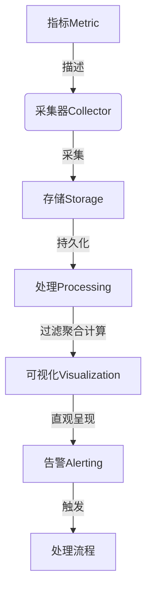

# 基于Web的大数据系统监控平台的设计与实现

## 1. 背景介绍

### 1.1 问题的由来

随着大数据技术的快速发展和广泛应用,大数据系统的规模和复杂性也与日俱增。这些系统通常由大量分布式节点组成,运行着海量的数据处理任务。然而,大规模分布式系统的运行状态难以掌控,一旦出现故障或性能问题,将导致严重的经济损失和数据丢失风险。因此,有效监控大数据系统的运行状态,及时发现和诊断问题,确保系统的高可用性和稳定性,成为了当前大数据领域亟待解决的重要课题。

### 1.2 研究现状  

目前,已有多种开源和商业的大数据监控工具,如Ganglia、Ambari、Cloudera Manager等。它们通过采集系统指标数据,并提供可视化界面来展示集群状态和资源利用情况。然而,这些工具大多存在以下不足:

1. **监控范围有限**:主要关注硬件资源和部分组件,缺乏对整个大数据生态系统的全面监控。
2. **可扩展性差**:随着系统规模扩大,监控工具的性能和可靠性会受到影响。
3. **集成度低**:监控数据分散在不同工具中,难以形成统一的监控视图。
4. **可定制性差**:缺乏灵活的自定义监控指标和报警规则的能力。

### 1.3 研究意义

设计一个基于Web的大数据系统监控平台,能够解决上述问题,具有重要的理论和实践意义:

1. **提高大数据系统的可观测性**:全面监控系统各个层面的运行状态,确保系统的高可用性和稳定性。
2. **优化系统性能**:通过监控关键指标,发现性能瓶颈,优化资源利用效率。
3. **简化运维管理**:统一的监控视图和智能报警机制,降低运维复杂度。
4. **支持可扩展性**:设计具有良好扩展性的架构,适应大规模大数据系统的需求。

### 1.4 本文结构

本文首先介绍大数据监控平台的核心概念和关键技术,然后详细阐述系统的设计原理、架构和实现细节,包括数据采集、存储、处理和可视化等各个模块。此外,还将探讨平台在实际应用场景中的使用,以及未来的发展趋势和挑战。

## 2. 核心概念与联系

大数据监控平台涉及多个核心概念,它们之间存在紧密的联系:

1. **指标(Metric)**:用于描述系统各个层面的运行状态,包括硬件、软件、应用等多个维度。
2. **采集器(Collector)**:负责从分布式节点采集指标数据,是整个监控系统的数据源头。
3. **存储(Storage)**:将采集到的大量监控数据持久化存储,以支持后续的数据处理和分析。
4. **处理(Processing)**:对监控数据进行过滤、聚合和计算,提取出有价值的信息。
5. **可视化(Visualization)**:将处理后的监控数据以图表或报表的形式呈现,直观反映系统状态。
6. **告警(Alerting)**:根据预定义的规则,对异常状况发出告警通知,触发相应的处理流程。

这些概念相互关联、环环相扣,共同构建了一个完整的大数据监控解决方案。下面将对核心技术进行详细阐述。

## 3. 核心算法原理 & 具体操作步骤  

### 3.1 算法原理概述

大数据监控平台的核心算法主要包括两个方面:

1. **数据采集算法**:高效、可靠地从分布式节点采集监控数据。
2. **数据处理算法**:对海量监控数据进行实时处理,提取有价值的信息。

#### 数据采集算法

采集算法需要解决两个关键问题:

1. **采集策略**:确定采集哪些指标、以何种频率采集。
2. **采集方式**:选择被动式(Pull)还是主动式(Push)采集。

常见的采集策略包括全量采集、智能采集(根据系统负载动态调整采集频率)等。采集方式则需要权衡可靠性、实时性和系统开销。

#### 数据处理算法  

处理算法的核心是如何高效地从海量监控数据中提取有价值的信息。主要包括:

1. **数据过滤**:根据预定义的规则,过滤掉无用或冗余的数据。
2. **数据聚合**:对相关的监控数据进行聚合,形成更高层次的指标。
3. **数据计算**:对监控数据执行统计计算,如求平均值、最大/最小值等。
4. **模式识别**:发现监控数据中的异常模式,用于故障诊断和预测。

这些算法需要综合考虑准确性、实时性和可扩展性等因素。

### 3.2 算法步骤详解

#### 数据采集算法

1. **定义采集策略**
    - 全量采集所有指标
    - 智能采集:根据系统负载动态调整采集频率
    - 用户自定义:指定需要采集的指标和频率
2. **选择采集方式**
    - 被动式(Pull):采集器主动轮询节点获取数据
    - 主动式(Push):节点主动将数据推送给采集器
3. **设计高效的采集协议**
    - 二进制协议(如Protobuf)以减小网络开销
    - 支持批量采集以提高吞吐量
    - 支持增量采集以降低重复数据传输
4. **实现容错和恢复机制**
    - 采集器失败时,数据能够缓存并重传
    - 支持采集器的动态扩缩容

#### 数据处理算法

1. **数据过滤**
    - 基于规则(如正则表达式)过滤无用数据
    - 基于机器学习算法自动识别异常数据
2. **数据聚合**
    - 时间窗口聚合:按时间范围聚合数据
    - 层次聚合:将底层指标聚合为高层指标
3. **数据计算**
    - 求均值、中位数、最大/最小值等统计量
    - 实现滑动窗口、指数加权移动平均等算法 
4. **模式识别**
    - 基于统计方法识别异常模式(如3σ原则)
    - 基于机器学习算法自动建模和异常检测

这些算法可以在流式处理框架(如Spark Streaming、Flink)中高效实现。

### 3.3 算法优缺点

#### 优点

- **高效**:通过优化的采集协议和处理算法,提高了系统的吞吐量和响应能力。
- **可扩展**:采用分布式架构,支持水平扩展以适应大规模监控场景。
- **智能化**:融入机器学习算法,实现自动异常检测和模式识别。
- **可定制**:支持灵活的采集策略和处理规则,满足不同场景的需求。

#### 缺点  

- **算法复杂度高**:涉及多种复杂算法,增加了系统的实现难度。
- **学习成本高**:融入机器学习等先进技术,要求开发人员具备相应的专业知识。
- **实时性受限**:对于低延迟的实时监控场景,可能无法满足极端的时延要求。
- **硬件资源需求高**:大规模并行处理海量数据,对硬件资源(CPU、内存等)的需求较高。

### 3.4 算法应用领域

上述算法不仅适用于大数据监控平台,还可应用于以下领域:

- **物联网监控**:采集和处理海量传感器数据,实现对设备的实时监控。
- **网络监控**:监控网络流量、链路状态等,保障网络的高可用性。
- **IT运维监控**:全面监控IT基础设施和应用系统的运行状况。
- **在线业务监控**:实时监控电商、社交等在线业务的关键指标。
- **金融风控**:监控交易数据,发现异常模式,防范金融风险。

## 4. 数学模型和公式 & 详细讲解 & 举例说明

在大数据监控平台中,数学模型和公式主要应用于以下几个方面:

### 4.1 数学模型构建

#### 时间序列模型

监控数据本质上是一个时间序列,可以使用 **Auto-Regressive Integrated Moving Average (ARIMA)** 等时间序列模型对其进行建模和预测。

ARIMA模型由三个部分组成:

- **自回归(AR)部分**:利用序列的历史值对当前值进行建模。

$$
y_t = \phi_1 y_{t-1} + \phi_2 y_{t-2} + ... + \phi_p y_{t-p} + \epsilon_t
$$

其中,$\phi_i$是自回归系数,$\epsilon_t$是白噪声项。

- **积分(I)部分**:通过差分运算消除非平稳性。
- **移动平均(MA)部分**:利用历史预测误差对当前值进行修正。

$$
y_t = \epsilon_t + \theta_1 \epsilon_{t-1} + \theta_2 \epsilon_{t-2} + ... + \theta_q \epsilon_{t-q}
$$

其中,$\theta_i$是移动平均系数。

通过估计ARIMA模型的参数,可以对监控指标的未来值进行预测,并将其与实际值进行比较,从而发现异常情况。

#### 异常检测模型

常用的异常检测模型包括:

- **3σ原则**:如果一个数据点偏离均值超过3个标准差,则被视为异常。
- **隔离森林(Isolation Forest)算法**:通过构建隔离树对异常值进行隔离,是一种高效的无监督异常检测算法。

### 4.2 公式推导过程

以3σ原则为例,推导判断异常的公式:

已知随机变量$X$服从正态分布$N(\mu, \sigma^2)$,其概率密度函数为:

$$
f(x) = \frac{1}{\sqrt{2\pi\sigma^2}} e^{-\frac{(x-\mu)^2}{2\sigma^2}}
$$

令$Z = \frac{X-\mu}{\sigma}$,则$Z$服从标准正态分布$N(0, 1)$。

根据标准正态分布的性质,有:

$$
P(|Z| \leq 3) = 0.9973
$$

即$|Z| > 3$的概率仅为0.0027,这种情况被视为异常。

将$Z$带入原始随机变量$X$的定义,可得:

$$
|X - \mu| > 3\sigma
$$

即如果$X$偏离均值$\mu$超过3个标准差$\sigma$,则判定为异常值。

### 4.3 案例分析与讲解

假设我们要监控一个Hadoop集群的内存使用率。经过一段时间的观察,发现内存使用率的均值为60%,标准差为10%。

根据3σ原则,如果内存使用率超过90%(60% + 3 * 10%)或低于30%(60% - 3 * 10%),就会触发异常报警。

我们可以使用ARIMA模型对内存使用率进行建模和预测,并将预测值与实际值进行比较。如果两者的差值超过3σ,则判定为异常。

例如,假设ARIMA模型预测的下一个时间点内存使用率为65%,而实际值为85%,差值为20%,超过3σ(30%),因此会触发异常报警。

### 4.4 常见问题解答

**Q: 如何选择合适的数学模型?**

A: 模型的选择取决于数据的特征和监控目标。时间序列模型适用于对趋势和周期性数据进行预测,而异常检测模型则适用于发现突发异常。在实际应用中,可以综合使用多种模型,相互补充。

**Q: 模型的参数如何估计?**

A: 参数估计可以使用最大似然估计、贝叶斯估计等统计方法。对于复杂模型,也可