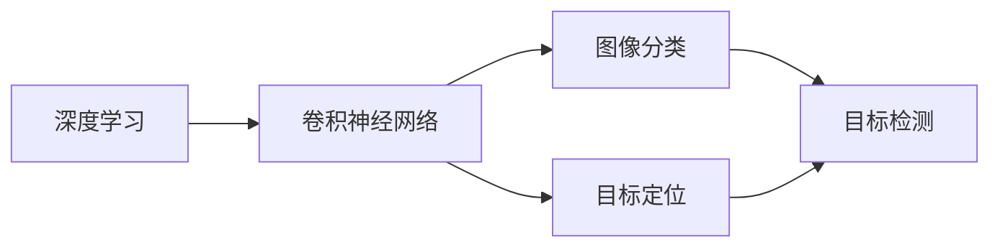

# 基于yolov5的戴口罩检测

## 1. 背景介绍

### 1.1  问题的由来

2020年初，新冠肺炎疫情席卷全球，给人们的生活和工作带来了巨大影响。为了遏制病毒传播，佩戴口罩成为了人们日常生活中不可或缺的一部分。然而，仍有部分人群存在不规范佩戴口罩或不佩戴口罩的行为，增加了病毒传播风险。因此，如何有效监测人们是否正确佩戴口罩，成为了一个亟待解决的问题。

### 1.2  研究现状

目前，针对口罩佩戴检测的研究主要集中在计算机视觉和深度学习领域。传统的方法主要基于手工提取特征，如Haar、HOG等，再结合分类器如SVM、Adaboost等进行判别。但这类方法对光照、角度等变化较为敏感，泛化能力较差。

近年来，深度学习在计算机视觉领域取得了突破性进展。基于深度学习的目标检测算法，如Faster R-CNN、YOLO、SSD等，能够自动学习图像特征，对复杂场景下的目标检测具有较强的鲁棒性。其中YOLO系列算法以其检测速度快、精度高的优势受到广泛关注。

### 1.3  研究意义

开发一套基于深度学习的口罩佩戴检测系统，对疫情防控、公共场所管理等具有重要意义：

1. 及时发现未佩戴口罩人员，降低疫情传播风险；
2. 提高公共场所管理效率，减轻人工监管压力；
3. 提供客观口罩佩戴数据，为疫情防控决策提供依据。

同时，口罩佩戴检测也是一个很好的应用深度学习解决实际问题的案例，对推动计算机视觉技术在公共安全、智慧城市等领域的应用具有一定的示范作用。

### 1.4  本文结构

本文将详细介绍如何使用当前较为先进的目标检测算法YOLOv5，来实现口罩佩戴检测。内容安排如下：

- 第2部分介绍口罩佩戴检测的核心概念与技术关联；
- 第3部分重点讲解YOLOv5的原理、步骤及优缺点；
- 第4部分建立数学模型，推导并举例说明相关公式； 
- 第5部分通过具体代码实践，展示如何使用YOLOv5构建口罩佩戴检测系统；
- 第6部分分析该技术的应用场景及未来发展空间；
- 第7部分推荐学习资源、开发工具等；
- 第8部分总结全文，并展望未来的机遇与挑战；
- 第9部分为附录，解答一些常见问题。

## 2. 核心概念与联系

在口罩佩戴检测任务中，涉及到几个核心概念：

- 目标检测(Object Detection)：是指在一张图像中，找出所有感兴趣的目标(如人脸、汽车等)，并给出它们的位置和类别。是计算机视觉的一个经典任务。

- 图像分类(Image Classification)：判断一张图像所属的类别，如判断图像中的人是否佩戴口罩，属于二分类问题。图像分类是目标检测的基础。

- 深度学习(Deep Learning)：一种机器学习方法，通过构建多层神经网络，自动学习图像的层次化特征表示。深度学习极大地推动了计算机视觉的进步。

- 卷积神经网络(Convolutional Neural Network, CNN)：一种专门用于处理网格拓扑结构数据(如图像)的神经网络。CNN通过局部连接和权值共享，能有效减少网络参数，具有平移不变性。

- 目标定位(Object Localization)：确定图像中目标的精确位置，一般用矩形框(Bounding Box)表示。YOLO将目标检测看作一个回归问题，直接从图像回归出目标框的位置和类别概率。

这些概念之间的联系可用下图表示：

可见，目标检测需要同时解决图像分类和目标定位两个子问题。YOLO巧妙地将二者统一到一个回归问题中，是一种one-stage目标检测方法。接下来重点介绍YOLO的原理和实现。

## 3. 核心算法原理 & 具体操作步骤

### 3.1  算法原理概述

YOLO(You Only Look Once)是一种基于深度学习的实时目标检测算法，由Joseph Redmon等人于2016年提出。其核心思想是将目标检测看作一个回归问题，直接从图像回归出目标框的位置和类别概率。

与传统的two-stage检测器(如Faster R-CNN)不同，YOLO属于one-stage检测器，只需一次推理就能得到检测结果，因而速度更快。YOLO将输入图像划分为S×S个网格，每个网格负责检测落在该网格内的目标。对每个网格，YOLO预测B个目标框，以及这些框所属C个类别的概率。

检测时，YOLO首先对图像做一次卷积计算，提取特征图。然后使用全连接层直接预测每个网格的目标框和类别概率。最后通过阈值筛选和非极大值抑制，得到最终的检测结果。整个过程只需一次前向推理，所以YOLO速度很快，能达到实时。

### 3.2  算法步骤详解

以下详细讲解YOLO的检测步骤。

输入：一张图像
输出：图像中各目标的位置和类别

Step 1: 图像分割
将输入图像分割为 S×S 个网格。如果某个目标的中心落在网格内，则该网格负责检测该目标。

Step 2: 特征提取  
对图像做卷积计算，提取特征图。YOLO采用了类似GoogLeNet的网络结构，包含24个卷积层和2个全连接层。

Step 3: 边界框预测
对每个网格，预测 B 个边界框(bounding box)，每个边界框包含5个值：(x, y, w, h) 和 confidence。
其中(x, y)为边界框中心相对网格的坐标，w和h为框的宽和高相对整张图像的比例。
Confidence反映了框内包含目标的置信度和框的准确度，其定义为：
$Pr(Object) * IOU_{truth}^{pred}$

Step 4: 类别概率预测
每个网格预测 C 个条件类别概率 $Pr(Class_i|Object)$，即在包含目标的前提下，目标属于各类别的概率。

Step 5: 后处理
对每个边界框，令其置信度与条件类别概率相乘：
$Pr(Class_i|Object) * Pr(Object) * IOU_{truth}^{pred} = Pr(Class_i) * IOU_{truth}^{pred}$
这样就得到每个框所属各类别的置信度评分。

根据置信度阈值，滤除置信度低的框。
对剩余的框，进行非极大值抑制(NMS)，以消除同一目标的重复检测框。

最终每个目标只保留一个得分最高的检测框，输出其位置和类别。

### 3.3  算法优缺点

YOLO算法的主要优点有：

1. 速度快。YOLO将检测看作回归问题，只需一次推理，所以非常快，能达到实时性的要求。 

2. 全局考虑。YOLO在训练和推理时都能看到整张图像的信息，能更好地利用上下文信息，不容易在背景上产生误检。

3. 泛化能力强。YOLO的特征提取网络对常见目标有很好的泛化能力，不容易过拟合。

当然，YOLO也存在一些局限性：

1. 定位精度稍差。特别是对小目标和相邻目标，定位不够精准。这主要是由于特征图分辨率降采样造成的。

2. 召回率偏低。YOLO 对每个网格只预测两个框，可能无法覆盖密集的同类目标。

3. 不能很好地处理不同长宽比的目标。YOLO的锚框是预设固定的，不够灵活。

后续的YOLOv2~v5通过引入锚框聚类、多尺度特征融合、数据增强、损失函数优化等改进，不断提升YOLO的性能，同时保持了其速度优势。

### 3.4  算法应用领域

得益于其实时性和通用性，YOLO算法在很多领域得到了应用，如：

- 自动驾驶：行人、车辆检测
- 智慧安防：异常行为检测
- 工业质检：产品缺陷检测
- 医学影像：病灶检测
- 遥感图像：目标提取与识别
- 人机交互：手势识别

此外，YOLO还被广泛用于构建各种检测系统的基础模块，如行人重识别、车辆跟踪、人流量统计等。口罩佩戴检测就是YOLO的一个新兴应用方向。

## 4. 数学模型和公式 & 详细讲解 & 举例说明

本节主要介绍YOLO中涉及的一些关键的数学模型与公式，并辅以实例讲解。

### 4.1  数学模型构建

首先，我们定义以下符号：

- $S$: 网格尺寸，将图像分为 $S \times S$ 个网格
- $B$: 每个网格预测的边界框数
- $C$: 类别数
- $(x, y)$: 边界框中心坐标，相对于网格的位置，取值范围 $[0, 1]$
- $(w, h)$: 边界框的宽和高，相对于整张图像的比例，取值范围 $[0, 1]$  
- $c$: 边界框的置信度，反映框内存在目标的可能性
- $p_i(c)$: 网格中第 $i$ 个边界框包含目标 $c$ 的条件概率

对每个网格，YOLO预测 $B$ 个边界框，每个边界框除了位置坐标 $(x, y, w, h)$ 外，还包含一个置信度 $c$ 和 $C$ 个条件类别概率 $p_i(c)$。

因此，YOLO的输出张量维度为：$S \times S \times (B * 5 + C)$。例如，对于COCO数据集，$S=7, B=2, C=80$，输出张量维度为 $7 \times 7 \times 30$。

### 4.2  公式推导过程

1. 置信度的定义：
$$
c = Pr(Object) * IOU_{truth}^{pred}
$$
其中 $Pr(Object)$ 表示框内存在目标的概率，$IOU_{truth}^{pred}$ 表示预测框与真实框的交并比(Intersection over Union)。

IOU的计算公式为：
$$
IOU = \frac{Area\ of\ Overlap}{Area\ of\ Union}
$$

直观地说，置信度 $c$ 反映了检测框的质量，需要同时考虑框内是否有目标，以及框的定位准确性。

2. 条件类别概率的定义：
$$
p_i(c) = Pr(Class_i|Object)
$$
表示在存在目标的前提下，目标属于第 $i$ 类的概率。

3. 类别置信度得分：
$$
Pr(Class_i|Object) * Pr(Object) * IOU_{truth}^{pred} = Pr(Class_i) * IOU_{truth}^{pred}
$$
等号左边相当于在置信度的基础上，乘以条件类别概率。这样每个检测框就得到了 $C$ 个类别置信度分数，据此可以确定框内目标的类别。

4. 损失函数：
YOLO的损失函数由3部分组成：坐标误差、置信度误差和分类误差。
$$
\lambda_{coord} \sum_{i=0}^{S^2} \sum_{j=0}^{B} \mathbb{1}_{ij}^{obj} [(x_i-\hat{x}_i)^2 + (y_i-\hat{y}_i)^2] \\
+ \lambda_{coord} \sum_{i=0}^{S^2} \sum_{j=0}^{B} \mathbb{1}_{ij}^{obj} [(\sqrt{w_i}-\sqrt{\hat{w}_i})^2 + (\sqrt{h_i}-\sqrt{\hat{h}_i})^2] \\
+ \