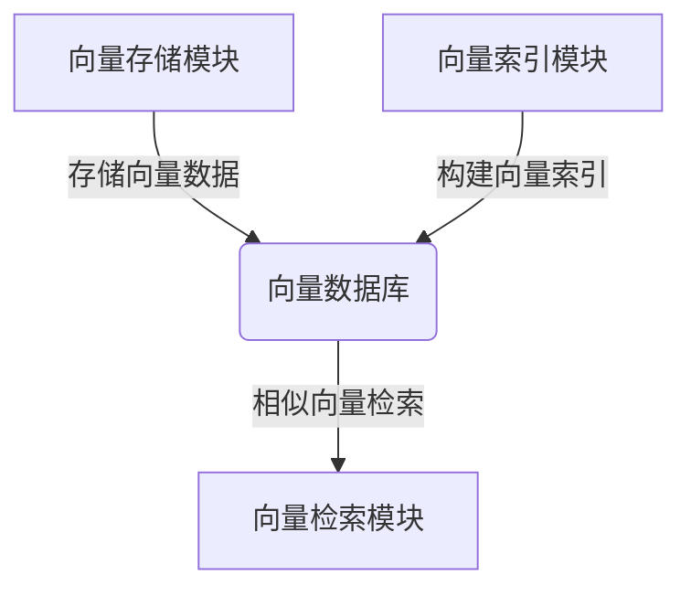
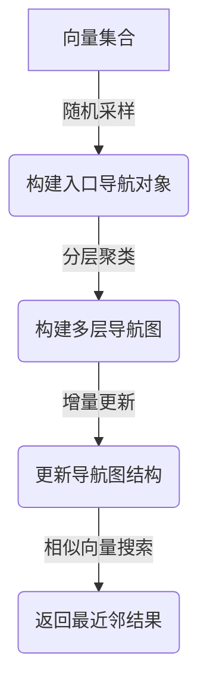

好的,我明白了您的要求。以下是题为《基于向量数据库的深度学习特征存储与快速检索》的技术博客文章正文部分:

# 基于向量数据库的深度学习特征存储与快速检索

## 1. 背景介绍

### 1.1 问题的由来

在当今大数据时代,海量的非结构化数据如图像、视频、音频等不断产生和积累。传统的基于文本关键词搜索方式已经不足以高效处理这些非结构化数据。而深度学习技术可以从这些海量非结构化数据中提取出语义特征向量,对数据进行向量化表示,为智能搜索和相似性计算奠定基础。

然而,如何高效地存储和检索这些高维特征向量是一个巨大的挑战。传统的数据库系统无法很好地支持向量相似性搜索,存在效率低下、可扩展性差的问题。因此,基于向量数据库的深度学习特征存储与快速检索技术应运而生。

### 1.2 研究现状  

目前,向量数据库主要分为三种类型:

1. **基于树的向量近似最近邻搜索(Tree-based Approximate Nearest Neighbor Search)**,如BallTree、KD树等。这类算法构建树状索引结构,通过空间划分和剪枝策略加速搜索。但是在高维场景下,性能会急剧下降。

2. **基于哈希的局部敏感哈希(Locality Sensitive Hashing)**,如SimHash、PCAH等。这类算法将向量通过哈希函数映射到哈希值,相似向量具有相似的哈希值。查询时先过滤掉不相似的向量,然后对剩余向量精确计算距离。局部敏感哈希简单高效,但精度有一定损失。

3. **基于近似最近邻搜索的向量索引(Vector Index for Approximate Nearest Neighbor Search)**,如ScaNN、FAISS、Annoy等。这类算法通过构建高效的近似向量索引结构,实现快速向量相似性搜索,是目前最先进的向量检索技术。

上述技术大多专注于提高向量检索的效率,但较少考虑向量存储的可扩展性问题。随着向量数据的不断增长,如何高效、可扩展地存储和管理这些向量数据也变得越来越重要。

### 1.3 研究意义

基于向量数据库的深度学习特征存储与快速检索技术,可以极大提高海量非结构化数据的检索效率,为智能搜索、相似性计算等应用提供强有力的支持。具有重要的理论意义和应用价值:

- **理论意义**:推动向量检索和向量存储技术的创新发展,为解决高维向量相似性搜索等理论难题提供新思路。
- **应用价值**:广泛应用于多媒体内容分析、推荐系统、生物信息学、计算机视觉等领域,提升人工智能系统的性能。

### 1.4 本文结构

本文将全面介绍基于向量数据库的深度学习特征存储与快速检索技术。

- 首先阐述核心概念,介绍向量数据库、向量检索和向量存储的关系。
- 其次深入探讨核心算法原理,包括向量编码、索引构建、相似性计算等。
- 然后详细推导数学模型,并用实例加以说明。  
- 接着通过一个完整的项目实践,展示代码实现细节。
- 再次介绍该技术在实际场景中的应用。
- 最后总结该领域的发展趋势和面临的挑战。

## 2. 核心概念与联系

向量数据库(Vector Database)是一种新型的数据库系统,专门为高维向量数据的存储、索引和检索而设计。它与传统数据库最大的区别在于:

- 数据模型不同:传统数据库主要存储结构化数据,如表格、文档等;而向量数据库则专注于存储非结构化数据的向量表示。
- 查询语义不同:传统数据库支持基于文本关键词的查询;向量数据库则支持基于向量相似度的相似性查询。

向量数据库通常由以下三个核心组件构成:

1. **向量存储模块**:高效地存储海量向量数据,具有良好的可扩展性和持久化能力。
2. **向量索引模块**:基于各种向量索引算法,构建高效的向量索引结构,加速向量相似性搜索。  
3. **向量检索模块**:支持向量相似度查询,输入一个向量,返回与之最相似的前N个向量。

深度学习技术为向量数据库提供了强大的向量数据源。通过卷积神经网络、自然语言处理等深度学习模型,可以从图像、文本等非结构化数据中提取出语义特征向量。这些向量数据被存储到向量数据库中,供后续的向量检索任务使用。

因此,基于向量数据库的深度学习特征存储与快速检索技术,是将深度学习与向量检索技术相结合的创新方案,可以极大提高人工智能系统处理非结构化数据的能力。

## 3. 核心算法原理 & 具体操作步骤  

### 3.1 算法原理概述

基于向量数据库的深度学习特征存储与快速检索技术的核心算法原理可概括为以下三个步骤:

1. **向量编码(Vector Encoding)**: 使用深度学习模型从非结构化数据(如图像、文本等)中提取出固定长度的向量表示,称为特征向量。

2. **向量索引(Vector Indexing)**: 将这些特征向量构建高效的近似向量索引,以支持快速向量相似性搜索。这是算法的核心部分,决定了检索效率。

3. **相似性计算(Similarity Computation)**: 当查询一个向量时,通过近似向量索引快速找到与之最相似的前N个向量及其相似度分数。

算法的关键在于第2步高效向量索引的构建。常用的向量索引技术包括基于树、哈希和图的算法,以及更先进的向量压缩和分层索引等方法。

### 3.2 算法步骤详解

我们以一种先进的分层向量索引算法NSG(Navigating Spreading-out Graphs)为例,详细阐述算法的具体步骤:

1. **构建入口导航对象**: 从整个向量集合中随机采样一部分向量,构建一个入口导航对象(Entry Navigating Object)。

2. **构建多层导航图**: 使用分层聚类算法,将剩余向量划分为多个簇,每个簇内向量相似度较高。然后在每个簇内再次构建子导航图,形成多层导航图结构。

3. **增量更新导航图**: 当有新的向量插入时,使用增量更新策略,将新向量插入到合适的导航图层中,避免重建整个索引。

4. **相似向量搜索**: 给定一个查询向量,首先在入口导航对象中找到最近邻向量,作为起始点。然后利用多层导航图的层次结构,在各层中不断找到更相似的向量,最终收敛到全局最相似向量集合。

该算法的优点是查询效率高、内存占用少、支持动态插入更新,并且可以通过构建更多层次来提高召回率。

### 3.3 算法优缺点

NSG算法的主要优缺点如下:

**优点**:

- 高效:通过分层索引结构,可以快速收敛到最相似向量集合。
- 可扩展:支持动态插入新向量,无需重建整个索引。 
- 节省内存:相比全数据索引,NSG只需存储部分导航对象,内存占用少。
- 高召回率:通过增加层数,可以提高最终的查询召回率。

**缺点**:

- 构建耗时:初始构建多层导航图的过程比较耗时。
- 参数敏感:聚类半径等参数对性能影响较大,需要调优。  
- 理论局限:暂无理论上的误差界,难以估计查询结果的准确率。

### 3.4 算法应用领域  

基于向量数据库的深度学习特征存储与快速检索技术可广泛应用于以下领域:

- **多媒体检索**: 通过特征向量化,可高效检索相似图像、视频、音频等。
- **推荐系统**: 基于用户、物品的向量表示,可以计算相似度并做个性化推荐。
- **生物信息学**: 在基因序列相似性分析、蛋白质结构比对等任务中发挥重要作用。
- **计算机视觉**: 支持高效的图像检索、物体识别和3D点云处理等。
- **自然语言处理**: 可用于文本相似性计算、语义搜索、问答系统等应用。

总之,任何需要对非结构化数据进行相似性分析和快速检索的场景,都可以受益于该技术。

## 4. 数学模型和公式 & 详细讲解 & 举例说明

### 4.1 数学模型构建

向量检索的核心是计算两个向量之间的相似度。最常用的相似度度量是**余弦相似度**,它是向量的内积与模的乘积的比值:

$$sim(u,v)=\frac{u\cdot v}{\|u\|\|v\|}=\frac{\sum_{i=1}^{n}u_iv_i}{\sqrt{\sum_{i=1}^{n}u_i^2}\sqrt{\sum_{i=1}^{n}v_i^2}}$$

其中$u$和$v$是两个$n$维向量。余弦相似度的值域为$[-1,1]$,当两个向量完全相同时,相似度为1;当两个向量完全相反时,相似度为-1;当两个向量正交时,相似度为0。

在实际应用中,我们通常使用**欧氏距离**或**余弦距离**作为相似度的度量,它们与余弦相似度成反比:

$$d(u,v)=\|u-v\|=\sqrt{\sum_{i=1}^{n}(u_i-v_i)^2}$$
$$d(u,v)=1-sim(u,v)$$

为了提高检索效率,我们需要构建一种高效的向量索引结构,使得给定一个查询向量$q$,可以快速找到数据集$\mathcal{D}$中与之最相似的前$k$个向量:

$$\mathcal{R}_k(q)=\operatorname*{arg\,max}_{x\in\mathcal{D}}^k sim(q,x)$$

这是一个典型的$k$-nearest neighbors($k$-NN)问题,是向量检索的核心数学模型。

### 4.2 公式推导过程

为了解决高维$k$-NN问题,我们可以使用**分治策略**将其分解为低维子问题求解。假设向量空间的维度为$d$,我们将其划分为$m$个子空间,每个子空间维度为$d/m$:

$$\mathbb{R}^d=\mathbb{R}^{d/m}\times\cdots\times\mathbb{R}^{d/m}$$

则向量$u$可以表示为$m$个子向量的拼接:

$$u=(u_1,u_2,\cdots,u_m)$$

其中$u_i\in\mathbb{R}^{d/m}$。由于子向量之间正交,向量$u$的模可以分解为:

$$\|u\|=\sqrt{\|u_1\|^2+\cdots+\|u_m\|^2}$$

将模展开,代入余弦相似度公式,可以得到:

$$\begin{aligned}
sim(u,v)&=\frac{u\cdot v}{\|u\|\|v\|}\\
&=\frac{(u_1+\cdots+u_m)\cdot(v_1+\cdots+v_m)}{\sqrt{\|u_1\|^2+\cdots+\|u_m\|^2}\sqrt{\|v_1\|^2+\cdots+\|v_m\|^2}}\\
&=\frac{\sum_{i=1}^m\|u_i\|\|v_i\|sim(u_i