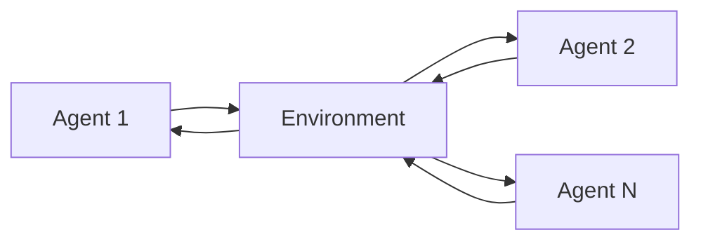
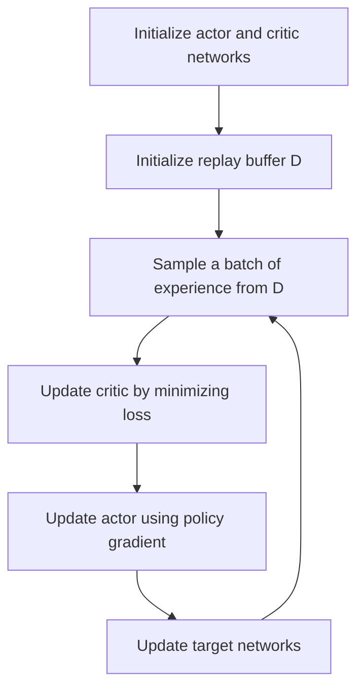

# 基于强化学习的多智能体系统合作行为分析

关键词：强化学习、多智能体系统、合作行为、博弈论、深度学习

## 1. 背景介绍

### 1.1 问题的由来

在人工智能领域,多智能体系统(Multi-Agent System, MAS)一直是研究的热点。多智能体系统中,多个智能体相互协作、通信、竞争,完成复杂任务。在现实世界中,多智能体系统广泛存在,如自动驾驶、机器人足球、无人机集群、智能电网等。研究多智能体的合作行为,对于实现群体智能、提高系统性能具有重要意义。

传统的多智能体合作控制算法,如博弈论、一致性算法等,在解决简单问题时效果较好,但面对复杂动态环境时,泛化能力和适应性较差。近年来,强化学习(Reinforcement Learning, RL)以其优秀的自主学习能力,为多智能体合作提供了新的思路。将强化学习应用于多智能体系统,智能体可以通过不断与环境交互,学习优化策略,实现更加智能、灵活的合作行为。

### 1.2 研究现状

目前,基于强化学习的多智能体合作研究主要集中在以下几个方面:

(1)基于博弈论的多智能体强化学习算法。如Nash-Q learning、WoLF-PHC等,将博弈论与强化学习相结合,实现多智能体在竞争环境中的最优策略学习。

(2)基于深度学习的多智能体强化学习框架。如MADDPG、COMA、QMIX等,利用深度神经网络作为策略函数逼近器,增强了算法的表示能力,可以处理高维、连续的状态-行为空间。

(3)面向大规模智能体的分布式强化学习。如PSRO、DCH等,通过将学习任务分解到各个智能体,并行学习,提高了系统的可扩展性。

(4)考虑通信约束的多智能体强化学习。如DIAL、SchedNet等,研究智能体在有限通信条件下的合作学习机制,增强了系统的鲁棒性。

尽管已有大量研究工作,但在收敛性、稳定性、可解释性等方面仍存在问题,亟需进一步探索。

### 1.3 研究意义

研究基于强化学习的多智能体合作行为,具有重要的理论和实际意义:

(1)丰富多智能体系统理论。多智能体强化学习是多智能体系统与机器学习交叉融合的新方向,有助于促进两个领域的理论发展。

(2)提升工程实践能力。智能交通、智慧城市、工业互联网等,都涉及多智能体协同优化问题。本文的研究可以为这些领域提供新的解决方案。

(3)探索通用人工智能。多智能体强化学习体现了自主学习、分布式智能的思想,是构建通用人工智能系统的基础。

### 1.4 本文结构

本文共分为9个章节:

第1章介绍研究背景及意义;
第2章概述了多智能体强化学习的核心概念;
第3章详细阐述多智能体强化学习的算法原理;
第4章建立多智能体强化学习的数学模型;
第5章给出算法的代码实现;
第6章讨论算法在实际场景中的应用;
第7章总结全文,分析未来的发展方向;
第8章列出常见问题解答。

## 2. 核心概念与联系

在讨论多智能体强化学习算法之前,有必要对相关概念进行界定和阐述。

(1)智能体(Agent):可以感知环境状态,根据策略选择行为,通过与环境交互获得奖励,目标是最大化长期累积奖励。在多智能体系统中,存在多个智能体,它们相互合作或竞争。

(2)状态(State):表示智能体所处的环境状态,是智能体感知的输入信息。多智能体系统的状态可以表示为所有智能体状态的并集。

(3)行为(Action):智能体根据策略选择的动作,是智能体对环境的输出。多智能体的联合行为空间是所有智能体行为的笛卡尔积。

(4)策略(Policy):将状态映射为行为的函数,即给定状态下智能体选择行为的规则。在多智能体系统中,每个智能体有自己的策略。联合策略是所有智能体策略的集合。

(5)奖励(Reward):量化评价智能体行为的信号,由环境反馈给智能体。在合作场景下,多个智能体共享团队奖励。

(6)价值函数(Value Function):评估状态或状态-行为对的长期累积奖励。常见的价值函数有状态价值函数和动作价值函数。多智能体系统需要考虑联合价值函数。

(7)Nash均衡:在博弈论中,是指一种稳定的策略组合,在该策略组合下,任何一个智能体单方面改变策略都不会获得更高的收益。

多智能体强化学习的目标是找到一个最优联合策略,使得所有智能体的长期累积奖励最大化。这可以看作是在联合策略空间中寻找Nash均衡点的过程。由于多智能体间存在复杂的相互作用,环境具有不稳定性、不完全可观测性等特点,因此需要设计专门的学习算法。

下图展示了多智能体强化学习的基本框架:

## 3. 核心算法原理 & 具体操作步骤

### 3.1 算法原理概述

多智能体强化学习在传统强化学习的基础上,考虑了多个智能体间的交互作用,其核心是通过智能体与环境和其他智能体互动,不断学习优化策略,实现整体利益最大化。常见的多智能体强化学习算法可分为以下三类:

(1)独立学习算法:每个智能体独立地学习自己的策略,将其他智能体视为环境的一部分。代表算法有独立Q学习、策略梯度等。

(2)联合行为学习算法:将多智能体的联合行为空间视为单个智能体的行为空间,学习联合策略。代表算法有联合行为Q学习、MADDPG等。

(3)基于均衡的学习算法:借鉴博弈论中均衡的概念,学习收敛到Nash均衡点的策略。代表算法有Nash Q学习、Minimax Q学习等。

本文重点介绍一种基于Actor-Critic框架的多智能体深度强化学习算法MADDPG(Multi-Agent Deep Deterministic Policy Gradient)。

### 3.2 算法步骤详解

MADDPG算法的核心思想是集中式训练、分布式执行。即在训练阶段,所有智能体共享彼此的观测信息和策略参数;在执行阶段,每个智能体根据自身的局部观测独立地选择行为。算法主要分为以下几个步骤:

(1)随机初始化每个智能体的Actor网络 $\mu_{\theta_i}$ 和Critic网络 $Q_{\phi_i}$ 参数。其中,Actor网络输入为智能体的局部观测 $o_i$,输出为行为概率分布 $\pi_{\theta_i}(a_i|o_i)$;Critic网络输入为所有智能体的观测 $\boldsymbol{o}=(o_1,\dots,o_N)$ 和行为 $\boldsymbol{a}=(a_1,\dots,a_N)$ ,输出为联合行为价值 $Q_i^{\boldsymbol{\mu}}(\boldsymbol{o},\boldsymbol{a})$。

(2)初始化经验回放池 $\mathcal{D}$,用于存储智能体的交互数据 $(\boldsymbol{o},\boldsymbol{a},\boldsymbol{r},\boldsymbol{o}')$。

(3)在每个训练步骤 $t$,智能体根据当前策略 $\boldsymbol{\mu}=\{\mu_{\theta_1},\dots,\mu_{\theta_N}\}$ 与环境交互,得到观测 $\boldsymbol{o}$、联合行为 $\boldsymbol{a}$、奖励 $\boldsymbol{r}=(r_1,\dots,r_N)$ 和下一时刻观测 $\boldsymbol{o}'$,并存入经验回放池 $\mathcal{D}$。

(4)从 $\mathcal{D}$ 中采样一个批次的数据 $\{(\boldsymbol{o}^j,\boldsymbol{a}^j,\boldsymbol{r}^j,\boldsymbol{o}'^j)\}_{j=1}^M$,其中 $M$ 为批大小。

(5)对于每个智能体 $i$,更新其Critic网络,最小化如下损失函数:

$$
\mathcal{L}(\phi_i)=\frac{1}{M}\sum_{j=1}^M\left(y^j-Q_{\phi_i}(\boldsymbol{o}^j,\boldsymbol{a}^j)\right)^2
$$

其中, $y^j=r_i^j+\gamma Q_{\phi_i}'\left(\boldsymbol{o}'^j,\boldsymbol{a}'^j\right)|_{a_i'=\mu_{\theta_i}'(o_i'^j)}$。

(6)对于每个智能体 $i$,更新其Actor网络,最大化如下策略目标函数:

$$
J(\theta_i)=\frac{1}{M}\sum_{j=1}^M Q_{\phi_i}\left(\boldsymbol{o}^j,\boldsymbol{a}^j\right)|_{a_i=\mu_{\theta_i}(o_i^j)}
$$

(7)更新目标网络参数:
$\theta_i'\leftarrow \tau\theta_i+(1-\tau)\theta_i'$,
$\phi_i'\leftarrow \tau\phi_i+(1-\tau)\phi_i'$,
其中 $\tau$ 为软更新系数。

(8)重复步骤(3)-(7),直至算法收敛或达到最大训练步数。

### 3.3 算法优缺点

MADDPG算法的优点在于:

(1)通过集中式训练,每个智能体可以学习考虑其他智能体的策略,加速了收敛过程;

(2)采用Actor-Critic框架和深度神经网络,增强了算法处理复杂环境的能力;

(3)无需访问其他智能体的策略,具有较好的可扩展性。

但MADDPG算法也存在一些局限:

(1)在智能体数量较多时,维护经验回放池的开销较大;

(2)算法对超参数较为敏感,实际应用时需要进行反复调试;

(3)难以应对环境的非平稳性变化。

### 3.4 算法应用领域

MADDPG算法在多智能体合作控制领域有广泛应用,如:

(1)自动驾驶:多辆无人车通过强化学习协同决策,提高整体交通效率和安全性;

(2)机器人足球:多个足球机器人通过强化学习掌握配合战术,增强团队作战能力;

(3)智能电网:多个微网通过强化学习优化能量分配,实现供需平衡和成本最小化;

(4)无人机集群:多架无人机通过强化学习协同完成侦察、打击等任务,提升任务成功率。

下图展示了MADDPG算法的训练流程:

## 4. 数学模型和公式 & 详细讲解 & 举例说明

### 4.1 数学模型构建

考虑一个有 $N$ 个智能体的马尔科夫博弈模型,可以用一个六元组 $\langle\mathcal{S},\mathcal{O},\mathcal{A},\mathcal{P},\mathcal{R},\gamma\rangle$ 表示:

- 状态空间 $\mathcal{S}$ 表示所有智能体的全局状态集合;
- 观测空间 $\mathcal{O}=\mathcal{O}_1\times\dots\times\mathcal{O}_N$ 表示所有智能体的联合观测集合,其中 $\mathcal{O}_i$ 为智能体 $i$ 的局部观测空间;
- 行为空间 $\mathcal{A}=\mathcal{A}_1\