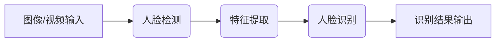
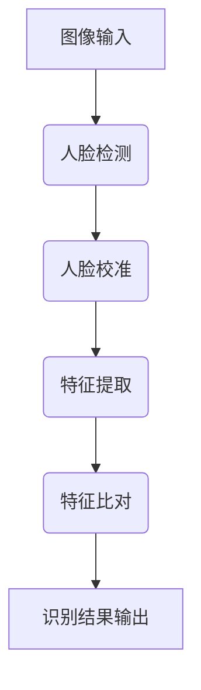
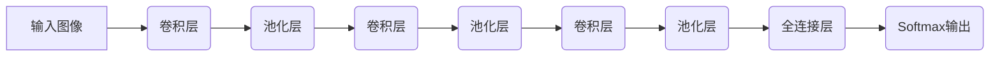

以下是根据您提供的标题和要求撰写的技术博客文章正文内容:

# 基于无服务器架构的人脸识别实验的设计与实现

## 1. 背景介绍

### 1.1 问题的由来

在当今快节奏的数字时代,人脸识别技术已经广泛应用于各个领域,如安全监控、刷脸支付、人员通行管理等。随着云计算和无服务器架构的兴起,将人脸识别系统部署在云端并通过无服务器函数提供服务,可以显著降低运维成本、提高系统弹性和可扩展性。然而,在无服务器架构下实现高效、可靠的人脸识别系统仍然面临诸多挑战。

### 1.2 研究现状  

目前,已有一些研究探索了在无服务器架构下实现人脸识别的方法。例如,利用AWS Lambda函数和S3存储桶进行人脸检测和识别。但这些方案通常只关注特定云平台,缺乏通用性和可移植性。另外,由于无服务器函数的冷启动问题,人脸识别的响应时间可能会受到影响。

### 1.3 研究意义

设计一个基于无服务器架构的通用人脸识别系统,可以带来以下好处:

1. 降低运维成本和基础设施投资
2. 实现按需扩展,满足突发流量
3. 提高系统的可靠性和容错能力
4. 跨云平台部署,提高可移植性

### 1.4 本文结构  

本文将首先介绍无服务器架构和人脸识别的核心概念,然后详细阐述系统的设计原理、算法流程和数学模型。接下来,我们将通过代码实例演示如何在无服务器架构下实现人脸识别功能。最后,探讨该系统在实际场景中的应用,并对未来的发展趋势和挑战进行展望。

## 2. 核心概念与联系

无服务器架构(Serverless Architecture)是一种全新的云计算执行模型,其核心思想是"构建无服务器云函数(Serverless Cloud Functions)",通过事件驱动的方式自动运行云函数,并根据实际需求自动分配计算资源。这种架构模式能够将应用程序分解为单一功能的微服务,每个微服务均由一个或多个云函数组成。

人脸识别(Face Recognition)是一种基于计算机视觉和机器学习技术,从数字图像或视频中自动检测、识别人脸的技术。它通常包括以下几个主要步骤:

1. 人脸检测(Face Detection):从图像或视频帧中定位人脸区域
2. 特征提取(Feature Extraction):从人脸区域提取独特的人脸特征向量
3. 人脸识别(Face Recognition):将提取的人脸特征与已知人脸数据库进行比对,输出识别结果



在无服务器架构下,我们可以将人脸识别系统拆分为多个功能独立的云函数,如人脸检测函数、特征提取函数、人脸识别函数等。这些函数被事件驱动调用,通过消息队列或其他事件源进行协作,最终完成端到端的人脸识别任务。

## 3. 核心算法原理 & 具体操作步骤  

### 3.1 算法原理概述

本系统采用的核心算法是基于深度卷积神经网络(Deep Convolutional Neural Networks, DCNN)的人脸识别算法。DCNN能够自动从图像数据中学习特征表示,并在人脸识别任务上取得了卓越的性能表现。

算法的基本思路是:首先使用DCNN对人脸图像进行编码,生成一个固定长度的特征向量;然后,将该特征向量与人脸数据库中已知的人脸特征向量进行相似度比较,输出最相似的人脸标识。

在训练阶段,DCNN模型在大规模人脸数据集上进行监督学习,学习人脸图像的特征表示。在推理阶段,训练好的DCNN模型对新的人脸图像进行编码,生成对应的特征向量,并将其与人脸数据库进行比对,输出识别结果。

### 3.2 算法步骤详解

1. **人脸检测**: 使用基于DCNN的人脸检测器(如MTCNN)在输入图像中定位人脸区域,获取人脸图像块。

2. **人脸校准**: 对检测到的人脸图像块进行校准(如仿射变换),使人脸图像具有统一的尺寸和方向。

3. **特征提取**: 将校准后的人脸图像输入到DCNN模型,经过多层卷积、池化和全连接层的特征转换,生成固定长度的人脸特征向量。

4. **特征比对**: 将提取的人脸特征向量与人脸数据库中的人脸特征向量进行相似度计算(如余弦相似度)。

5. **结果输出**: 根据相似度得分,输出最相似的人脸标识及其相似度分数。如果所有相似度分数均低于预设阈值,则判定为未知人脸。



### 3.3 算法优缺点

**优点**:

- 基于DCNN的人脸识别算法具有较高的识别精度和鲁棒性。
- 端到端的深度学习模型,无需手工设计特征。
- 可以通过迁移学习和模型微调快速适应新的数据集。

**缺点**:

- 需要大量的人脸数据集进行模型训练,数据采集和标注成本较高。
- 推理过程计算量较大,对硬件要求较高。
- 存在识别偏差的风险,如对不同年龄、肤色、种族的人脸识别精度可能不同。

### 3.4 算法应用领域

基于DCNN的人脸识别算法已广泛应用于以下领域:

- 安全监控:通过人脸识别进行身份验证和监控追踪。
- 刷脸支付:用于移动支付和金融场景的身份认证。
- 人员通行管理:门禁系统、考勤系统等。
- 社交媒体:人脸标记、人脸解锁等。
- 犯罪侦查:通过人脸识别协助侦破案件。

## 4. 数学模型和公式 & 详细讲解 & 举例说明

### 4.1 数学模型构建

DCNN模型的核心是通过多层卷积和池化操作自动学习图像的特征表示。我们以VGGFace2模型为例,介绍其网络结构和数学原理。

VGGFace2是一种用于人脸识别的DCNN模型,它的网络结构如下:



其中,卷积层用于提取图像的局部特征,池化层用于降低特征维度和空间分辨率,全连接层将提取的特征映射到特征向量空间。

### 4.2 公式推导过程

1. **卷积运算**

卷积层的基本运算单元是卷积核,它对输入特征图进行卷积运算,提取局部特征。设输入特征图为 $I$,卷积核为 $K$,卷积步长为 $s$,则卷积运算可表示为:

$$
O(i,j) = \sum_{m}\sum_{n}I(m,n)K(i-sm,j-sn)
$$

其中, $O(i,j)$ 是输出特征图在 $(i,j)$ 位置的值。

2. **池化运算**

池化层通过降采样操作降低特征维度,常用的池化方法有最大池化和平均池化。设输入特征图为 $I$,池化窗口大小为 $k \times k$,步长为 $s$,则最大池化运算可表示为:

$$
O(i,j) = \max_{m=0}^{k-1}\max_{n=0}^{k-1}I(i\cdot s+m,j\cdot s+n)
$$

3. **全连接层**

全连接层将前一层的特征向量映射到特征空间,其运算可表示为:

$$
y = f(Wx+b)
$$

其中, $x$ 是输入特征向量, $W$ 是权重矩阵, $b$ 是偏置向量, $f$ 是非线性激活函数(如ReLU)。

4. **损失函数**

在训练阶段,我们需要最小化模型的损失函数,常用的损失函数有交叉熵损失:

$$
L = -\sum_{i=1}^{N}y_i\log(p_i)
$$

其中, $y_i$ 是样本 $i$ 的真实标签, $p_i$ 是模型预测的概率分布。

通过反向传播算法和优化器(如SGD、Adam等),我们可以更新模型参数,使损失函数最小化,从而获得更准确的人脸识别模型。

### 4.3 案例分析与讲解

我们以一个简单的二分类人脸识别问题为例,说明DCNN模型的工作原理。假设我们有一个包含两个人的人脸数据集,需要训练一个DCNN模型对这两个人的人脸进行识别。

1. **数据预处理**

首先,我们需要对原始人脸图像进行预处理,包括人脸检测、校准、裁剪和归一化等操作,将图像转换为统一的格式,作为DCNN的输入。

2. **模型结构**

我们构建一个简单的DCNN模型,包括两个卷积层、两个池化层和两个全连接层。每个卷积层后接一个ReLU激活层,用于增加模型的非线性表达能力。

```python
model = Sequential([
    Conv2D(32, (3, 3), activation='relu', input_shape=(64, 64, 3)),
    MaxPooling2D((2, 2)),
    Conv2D(64, (3, 3), activation='relu'),
    MaxPooling2D((2, 2)),
    Flatten(),
    Dense(128, activation='relu'),
    Dense(2, activation='softmax')
])
```

3. **模型训练**

我们将预处理后的人脸图像输入到DCNN模型中进行训练。在前向传播过程中,图像经过多层卷积和池化操作,提取出人脸的特征表示;在反向传播过程中,通过计算损失函数(如交叉熵损失)和优化算法(如SGD),更新模型参数,使模型逐渐学习到区分两个人脸的特征模式。

4. **模型评估**

在测试集上评估训练好的DCNN模型,计算模型的准确率、精确率、召回率等指标,分析模型的性能表现。如果模型的性能满足要求,则可以将其应用于实际的人脸识别任务;否则需要调整模型结构或超参数,重新进行训练。

通过这个简单的案例,我们可以直观地理解DCNN在人脸识别任务中的工作原理。在实际应用中,我们需要构建更加复杂和深层的DCNN模型,并在大规模人脸数据集上进行训练,以获得更高的识别精度和鲁棒性。

### 4.4 常见问题解答

1. **为什么要使用DCNN进行人脸识别?**

DCNN能够自动从图像数据中学习特征表示,无需手工设计特征提取算子,在人脸识别任务上表现出色。相比传统的机器学习算法,DCNN具有更强的特征学习能力和泛化性能。

2. **DCNN模型的训练需要多少数据?**

DCNN模型通常需要大量的训练数据才能获得良好的性能。对于人脸识别任务,我们需要数十万甚至数百万张不同身份、姿态、年龄、肤色的人脸图像作为训练集,以确保模型的泛化能力。

3. **如何处理DCNN模型的过拟合问题?**

过拟合是DCNN模型常见的问题之一。我们可以采取以下策略来缓解过拟合:

-