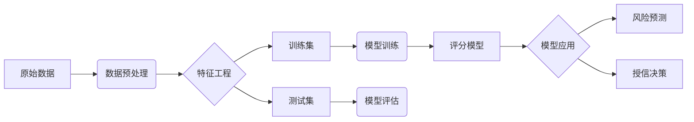

# 基于机器学习的银行信贷评分模型研究

关键词：机器学习, 信贷评分, 银行风控, 数据挖掘, 逻辑回归, 决策树, 神经网络  

## 1. 背景介绍
### 1.1  问题的由来
随着金融科技的快速发展,传统的银行信贷审批流程已经难以适应日益激烈的市场竞争。人工审核效率低下、主观性强,难以应对海量的信贷申请。因此,迫切需要引入先进的机器学习技术,建立高效、客观、准确的信贷评分模型,提升银行风控水平。

### 1.2  研究现状  
国内外学者对机器学习在信贷评分领域的应用开展了广泛研究。传统的评分模型如Logistic回归[1]、决策树[2]等已被证实可有效预测违约风险。近年来,随着深度学习的兴起,一些学者尝试引入神经网络[3]、支持向量机[4]等复杂模型,进一步提升预测性能。但如何权衡模型的复杂度与解释性,构建既准确又鲁棒的评分模型,仍是亟待解决的难题。

### 1.3  研究意义
机器学习评分模型可显著提高信贷审批效率,降低人力成本,控制信贷风险。通过挖掘海量历史数据,可以发现人工难以察觉的风险特征,为信贷决策提供数据支撑。同时,模型可持续优化迭代,适应市场变化。本研究有望推动银行信贷业务的智能化转型,对金融行业数字化具有重要意义。

### 1.4  本文结构
本文将首先介绍信贷评分的核心概念,阐述机器学习算法的基本原理。然后重点探讨几种主流的评分模型,推导其数学公式,并结合案例加以说明。接着,我们将实现一个完整的信贷评分系统,详细解读关键代码。最后,总结全文,展望信贷评分技术的未来发展方向与挑战。

## 2. 核心概念与联系
信贷评分是指通过分析借款人的历史信息和当前状况,预测其未来违约风险的过程。其核心是建立申请人特征与违约概率之间的映射关系。机器学习通过从历史数据中自动学习这种关系,构建预测模型。

评分的对象通常是个人或小微企业,原始数据包括人口统计学信息、信用记录、财务状况、行为数据等。这些数据经过清洗、特征工程等预处理步骤,提取出有判别力的特征向量,再输入机器学习模型进行训练。模型训练是一个参数优化的过程,通过最小化损失函数来拟合样本数据。训练得到的模型能够对新的信贷申请给出违约概率的预测值,为信贷审批决策提供参考。

下图展示了一个典型的机器学习信贷评分系统的架构:



## 3. 核心算法原理 & 具体操作步骤
### 3.1  算法原理概述
常用的信贷评分算法可分为三类:统计学习、决策树系列、神经网络系列。它们分别基于不同的理论假设,具有不同的优缺点。

统计学习方法假设样本数据服从某种概率分布,通过极大似然估计等方法求解模型参数。代表算法有逻辑回归、朴素贝叶斯、支持向量机等。这类方法的优点是模型简单,训练速度快,输出具有概率意义。但其往往过于简单,难以刻画复杂的非线性关系。

决策树系列通过递归地构建树形结构来进行分类预测。代表算法有ID3、C4.5、CART等。单棵决策树的泛化能力较弱,因此常采用Bagging、Boosting等集成学习技术,训练多棵树的组合来提升性能,如随机森林、GBDT等。树模型的优点是具有较好的解释性,缺点是对噪声敏感,容易过拟合。

神经网络模仿人脑的信息处理机制,使用多层感知机、卷积网络等复杂的网络结构。深度学习模型能够自动提取高阶特征,在复杂分类任务上表现出色。但其训练需要海量数据和算力,参数调优困难,而且模型是一个"黑盒",缺乏可解释性。

### 3.2  算法步骤详解
下面以逻辑回归为例,详细说明其建模步骤。

步骤1:数据预处理。对原始数据进行清洗,剔除噪声和异常值。对连续变量做归一化,将取值范围缩放到[0,1]。对离散变量做one-hot编码,转换成虚拟变量。

步骤2:特征选择。用IV(信息值)、WOE(证据权重)等指标衡量各个特征的预测能力,剔除无效特征。可通过相关性分析、方差分析等方法,进一步消除冗余特征。

步骤3:样本划分。采用分层抽样等方法,将数据集按照7:3的比例划分为训练集和测试集,保证两个子集的分布一致。

步骤4:模型训练。逻辑回归通过极大似然估计来求解模型参数。设$x$为特征向量,$y$为二元标签,表示是否违约。逻辑回归模型假设:

$$
P(y=1|x)=\frac{1}{1+e^{-(\beta_0+\beta_1x_1+...+\beta_nx_n)}}
$$

其中$\beta_0,\beta_1,...,\beta_n$为待估计的参数。对数似然函数为:

$$
L(\beta)=\sum_{i=1}^N[y_i\log p_i+(1-y_i)\log(1-p_i)]
$$

其中$p_i=P(y_i=1|x_i)$。使用梯度下降法求解$L(\beta)$的最大值,得到参数估计值。

步骤5:模型评估。在测试集上评估模型的预测性能,常用指标有准确率、AUC值、KS值等。通过阈值调整,平衡好坏样本的错分率,得到最优分类阈值。

步骤6:模型应用。用训练好的模型对新申请人打分,根据分数排序,结合业务规则,给出授信额度和利率定价的建议。

### 3.3  算法优缺点
逻辑回归的优点是:
- 模型简单,易于实现和部署
- 训练速度快,适合大规模数据
- 输出的分数有概率意义,可解释性强
- 不易过拟合,泛化能力好

缺点是:
- 难以刻画非线性关系
- 需要人工选择特征,特征工程工作量大
- 鲁棒性不够,对异常值敏感

### 3.4  算法应用领域
除了银行信贷,逻辑回归在其他许多领域也有广泛应用,如:
- 金融风控:贷款审批、信用卡欺诈检测、保险理赔反欺诈等
- 互联网广告:广告点击率预估、用户转化预测等  
- 医疗诊断:疾病风险预测、药物反应分析等
- 人力资源:员工流失预测、人才甄选等

## 4. 数学模型和公式 & 详细讲解 & 举例说明
### 4.1  数学模型构建
信贷评分可以看作一个二分类问题,因变量$y$表示客户是否违约,自变量$x$为客户的各项特征指标。假设$y$服从Bernoulli分布,即$y=1$的概率为$p$,$y=0$的概率为$1-p$。

逻辑回归模型的核心是Logistic函数(即Sigmoid函数):

$$
g(z)=\frac{1}{1+e^{-z}}
$$

其中$z=\beta_0+\beta_1x_1+...+\beta_nx_n$,是特征的线性组合。Logistic函数将实数域映射到(0,1)区间,得到违约概率$p$的估计值:

$$
\hat{p}=\frac{1}{1+e^{-(\beta_0+\beta_1x_1+...+\beta_nx_n)}}
$$

可见,逻辑回归是一种非线性模型,但其决策边界是线性的。

### 4.2  公式推导过程
对数几率(log odds)是指事件发生与不发生的概率比值的对数:

$$
\log\frac{p}{1-p}=\beta_0+\beta_1x_1+...+\beta_nx_n
$$

可见,特征与对数几率之间是线性关系。进一步变换可得:

$$
\frac{p}{1-p}=e^{\beta_0+\beta_1x_1+...+\beta_nx_n}
$$

$$
p=\frac{e^{\beta_0+\beta_1x_1+...+\beta_nx_n}}{1+e^{\beta_0+\beta_1x_1+...+\beta_nx_n}}=\frac{1}{1+e^{-(\beta_0+\beta_1x_1+...+\beta_nx_n)}}
$$

这就得到了Logistic函数。可见,Logistic回归是在广义线性模型的框架下,假设因变量服从Bernoulli分布,并用Logistic函数作为联系函数而得到的。

参数估计采用极大似然法。似然函数为:

$$
L(\beta)=\prod_{i=1}^Np_i^{y_i}(1-p_i)^{1-y_i}
$$

取对数得到对数似然:

$$
\log L(\beta)=\sum_{i=1}^N[y_i\log p_i+(1-y_i)\log(1-p_i)]
$$

求导并令导数为0,得到似然方程:

$$
\sum_{i=1}^N(y_i-p_i)x_i=0
$$

这是一个非线性方程组,没有解析解,需要用数值优化算法求解,如梯度下降法、牛顿法等。

### 4.3  案例分析与讲解
下面以一个简单的例子直观地说明逻辑回归的原理。假设我们根据客户的年收入和信用卡额度两个指标来判断其是否会违约。

```
年收入(万元) 信用卡额度(万元)  是否违约
  20            2            否
  25            3            否
  30            5            否
  40            6            否
  50            8            否
  33            9            是
  35           10            是
  40           11            是
  48           13            是
  50           15            是
```

我们的目标是找到一条直线,能够尽可能地将违约用户和正常用户分开。逻辑回归得到的决策边界如下图所示:


可以看到,该直线基本上将两类样本分开了。直线的斜率和截距就对应模型的参数$\beta$。直线上方的点被预测为违约,下方的点被预测为正常。直线离样本点越远,违约概率越接近0或1。

### 4.4  常见问题解答
问:逻辑回归能否处理多分类问题?
答:标准的二项逻辑回归只能处理二分类。对于多分类问题,可以用Softmax回归,即多项逻辑回归。其原理是将多分类问题转化为多个二分类问题。

问:如何评价逻辑回归模型的预测性能?
答:常用的评价指标有:
- 准确率:预测正确的样本数占总样本数的比例
- 精确率:预测为正例且实际为正例的样本数占预测为正例的样本数的比例
- 召回率:预测为正例且实际为正例的样本数占实际为正例的样本数的比例
- F1值:精确率和召回率的调和平均数
- AUC值:ROC曲线下的面积,反映了模型对正负例的区分能力
- KS值:正例和负例的累积分布之差的最大值,刻画了模型的风险区分度

问:如何解释逻辑回归模型的系数?
答:逻辑回归的系数反映了各个特征对违约风险的影响程度和方向。系数为正说