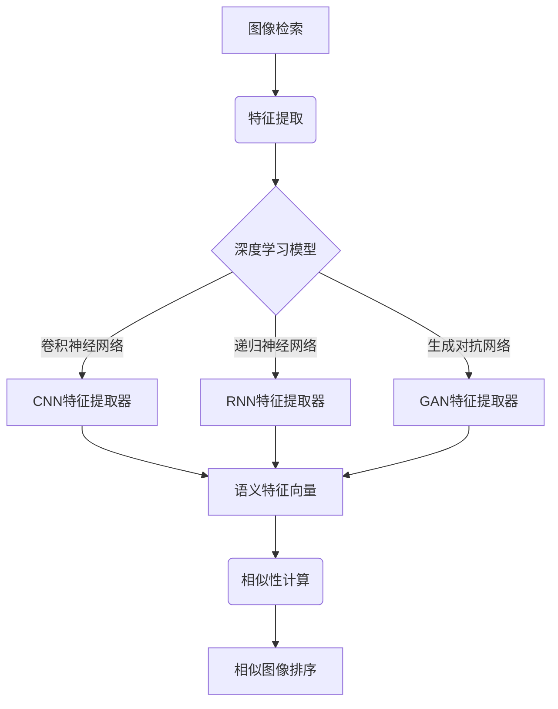

# 基于深度学习的图像检索算法研究

## 1. 背景介绍

### 1.1 问题的由来

在当今信息时代,图像数据的爆炸式增长使得图像检索技术变得越来越重要。传统的基于文本的图像检索方法存在明显缺陷,无法有效捕捉图像的语义信息,导致检索结果与用户需求存在偏差。因此,如何设计一种高效、准确的图像检索算法成为了当前研究的热点问题。

### 1.2 研究现状  

早期的图像检索技术主要基于低级特征(如颜色、纹理等)进行相似性匹配,但由于语义鸿沟的存在,这些方法难以满足用户的高层次需求。近年来,随着深度学习技术的迅猛发展,基于深度学习的图像检索算法逐渐成为研究重点。这些算法能够自动学习图像的高级语义特征,显著提高了检索的准确性和效率。

### 1.3 研究意义

基于深度学习的图像检索算法具有广阔的应用前景,如互联网图像搜索、医学图像诊断、视频监控等领域。高效准确的图像检索技术不仅能够提高人机交互体验,还可以促进相关领域的技术进步,对推动人工智能发展具有重要意义。

### 1.4 本文结构

本文首先介绍图像检索的背景和研究现状,阐述研究的重要性。接下来详细探讨基于深度学习的图像检索算法的核心概念、原理和数学模型。然后通过实际案例分析算法的实现细节和应用场景。最后总结算法的发展趋势和面临的挑战,并提供相关资源推荐。

## 2. 核心概念与联系

基于深度学习的图像检索算法的核心思想是利用深度神经网络自动学习图像的高级语义特征,并基于这些特征进行相似性匹配。算法的关键步骤包括:

1. **特征提取**: 使用深度学习模型(如卷积神经网络CNN、递归神经网络RNN或生成对抗网络GAN等)从原始图像中提取语义特征向量。
2. **相似性计算**: 通过计算查询图像和数据库中图像特征向量之间的距离(如欧氏距离或余弦相似度),评估它们之间的相似程度。
3. **相似图像排序**: 根据相似性得分对数据库中的图像进行排序,返回与查询图像最相似的前N个结果。

## 3. 核心算法原理 & 具体操作步骤

### 3.1 算法原理概述

基于深度学习的图像检索算法通常包含两个主要组件:特征提取器和相似性计算模块。

**特征提取器**利用深度神经网络从原始图像中提取出语义特征向量,这些特征向量能够捕捉图像的高级语义信息,如物体类别、属性等。常用的特征提取器包括:

- **卷积神经网络(CNN)**: 擅长捕捉图像的局部模式和空间信息,广泛用于目标检测、图像分类等任务。
- **递归神经网络(RNN)**: 适用于处理序列数据,可用于捕捉图像中物体的空间关系和上下文信息。
- **生成对抗网络(GAN)**: 通过对抗训练学习图像的隐含特征分布,可用于生成高质量的图像特征表示。

**相似性计算模块**则负责计算查询图像和数据库中图像特征向量之间的相似度,常用的相似度度量包括欧氏距离、余弦相似度等。根据相似度得分对数据库中的图像进行排序,返回与查询图像最相似的前N个结果。

### 3.2 算法步骤详解

1. **数据预处理**: 对输入图像进行必要的预处理,如调整大小、归一化等,以满足深度学习模型的输入要求。

2. **特征提取**: 将预处理后的图像输入到预先训练好的深度神经网络中,获取图像的语义特征向量。

3. **特征编码(可选)**: 对提取的特征向量进行编码,如使用产品量化(PQ)或矢量量化(VQ)等技术,以减小特征向量的维度和存储开销。

4. **相似性计算**: 计算查询图像特征向量与数据库中所有图像特征向量之间的相似度,常用的相似度度量包括欧氏距离、余弦相似度等。

5. **相似图像排序**: 根据相似度得分对数据库中的图像进行排序,返回与查询图像最相似的前N个结果。

6. **结果展示**: 将排序后的相似图像结果展示给用户。

### 3.3 算法优缺点

**优点**:

- 能够自动学习图像的高级语义特征,克服了传统基于低级特征的方法的局限性。
- 通过利用大规模数据和深度神经网络的强大建模能力,可以获得更加准确和鲁棒的图像表示。
- 算法具有很好的扩展性和通用性,可以应用于不同领域的图像检索任务。

**缺点**:

- 需要大量的标注数据和计算资源来训练深度神经网络模型。
- 深度学习模型的可解释性较差,难以解释特征提取器学习到的特征的具体含义。
- 对于一些小样本或长尾分布的图像类别,模型的性能可能会受到影响。

### 3.4 算法应用领域

基于深度学习的图像检索算法具有广泛的应用前景,包括但不限于以下领域:

- **互联网图像搜索**: 在搜索引擎、电子商务网站等场景下,提供准确高效的图像检索服务。
- **医学图像诊断**: 通过检索相似的医学影像数据,辅助医生进行疾病诊断和治疗方案制定。
- **视频监控**: 在视频监控系统中检索感兴趣的目标物体或人员,提高安防效率。
- **版权保护**: 检测互联网上是否存在盗版图像,保护版权所有者的合法权益。
- **生物多样性保护**: 通过图像检索技术识别和监测濒危物种,为生物多样性保护提供支持。

## 4. 数学模型和公式 & 详细讲解 & 举例说明

### 4.1 数学模型构建

基于深度学习的图像检索算法通常采用以下数学模型:

1. **特征提取模型**: 使用深度神经网络从原始图像中提取语义特征向量。假设输入图像为 $I$,特征提取器为 $f_\theta$,其中 $\theta$ 为模型参数,则图像的特征向量 $\phi(I)$ 可表示为:

$$\phi(I) = f_\theta(I)$$

常用的特征提取器包括卷积神经网络(CNN)、递归神经网络(RNN)和生成对抗网络(GAN)等。

2. **相似度计算模型**: 计算查询图像特征向量 $\phi(q)$ 与数据库中图像特征向量 $\phi(x)$ 之间的相似度。常用的相似度度量包括:

   - **欧氏距离**:
     $$d(\phi(q), \phi(x)) = \|\phi(q) - \phi(x)\|_2$$
   
   - **余弦相似度**:
     $$s(\phi(q), \phi(x)) = \frac{\phi(q) \cdot \phi(x)}{\|\phi(q)\| \|\phi(x)\|}$$

3. **相似图像排序模型**: 根据相似度得分对数据库中的图像进行排序,返回与查询图像最相似的前N个结果。

### 4.2 公式推导过程

以余弦相似度为例,推导其计算过程:

设查询图像特征向量为 $\phi(q) = (q_1, q_2, \dots, q_n)$,数据库中图像特征向量为 $\phi(x) = (x_1, x_2, \dots, x_n)$,其中 $n$ 为特征向量的维度。

余弦相似度定义为两个向量的点积与它们的模长的乘积的比值,即:

$$s(\phi(q), \phi(x)) = \frac{\phi(q) \cdot \phi(x)}{\|\phi(q)\| \|\phi(x)\|}$$

其中,向量的点积为:

$$\phi(q) \cdot \phi(x) = \sum_{i=1}^n q_i x_i$$

向量的模长为:

$$\|\phi(q)\| = \sqrt{\sum_{i=1}^n q_i^2}, \quad \|\phi(x)\| = \sqrt{\sum_{i=1}^n x_i^2}$$

将点积和模长代入余弦相似度公式,可得:

$$s(\phi(q), \phi(x)) = \frac{\sum_{i=1}^n q_i x_i}{\sqrt{\sum_{i=1}^n q_i^2} \sqrt{\sum_{i=1}^n x_i^2}}$$

余弦相似度的取值范围为 $[-1, 1]$,当两个向量完全相同时,余弦相似度为1;当两个向量完全相反时,余弦相似度为-1;当两个向量正交时,余弦相似度为0。

在图像检索任务中,我们通常希望查询图像和数据库中图像的特征向量具有较高的余弦相似度,以确保它们在语义上更加相似。

### 4.3 案例分析与讲解

假设我们有一个包含1000张图像的数据库,每张图像都已经被提取出128维的特征向量。现在我们想要检索与给定查询图像 $q$ 最相似的前10张图像。

1. 首先,我们使用预训练的CNN模型提取查询图像 $q$ 的特征向量 $\phi(q)$:

   $$\phi(q) = f_\theta(q)$$

   其中 $f_\theta$ 为CNN特征提取器,参数 $\theta$ 通过在大规模数据集上预训练获得。

2. 接下来,我们计算查询图像特征向量 $\phi(q)$ 与数据库中每个图像特征向量 $\phi(x_i)$ 之间的余弦相似度:

   $$s(\phi(q), \phi(x_i)) = \frac{\phi(q) \cdot \phi(x_i)}{\|\phi(q)\| \|\phi(x_i)\|}, \quad i = 1, 2, \dots, 1000$$

3. 根据计算得到的相似度得分,我们对数据库中的图像进行降序排序。

4. 最后,返回与查询图像 $q$ 最相似的前10张图像作为检索结果。

通过这个案例,我们可以直观地理解基于深度学习的图像检索算法的工作流程。在实际应用中,我们还需要考虑一些其他因素,如特征编码、索引结构优化等,以提高算法的效率和可扩展性。

### 4.4 常见问题解答

1. **为什么要使用深度学习进行图像检索?**

   深度学习模型能够自动学习图像的高级语义特征,克服了传统基于低级特征的方法的局限性。通过利用大规模数据和深度神经网络的强大建模能力,可以获得更加准确和鲁棒的图像表示,从而提高图像检索的性能。

2. **不同的深度学习模型(如CNN、RNN、GAN)在图像检索任务中有何优缺点?**

   - CNN擅长捕捉图像的局部模式和空间信息,适用于目标检测、图像分类等任务,在图像检索中表现出色。
   - RNN适用于处理序列数据,可用于捕捉图像中物体的空间关系和上下文信息,对于场景图像检索有一定优势。
   - GAN通过对抗训练学习图像的隐含特征分布,可用于生成高质量的图像特征表示,但训练过程较为复杂。

   在实际应用中,可以根据具体任务和数据特点选择合适的深度学习模型或者进行模型融合。

3. **如何提高图像检索算法的效率?**

   可以采取以下策略提高算法的效率:
   