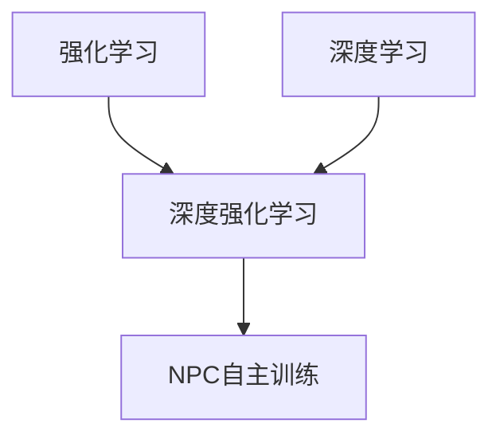

# 基于深度强化学习的NPC自主训练模型构建的实现

## 1. 背景介绍

### 1.1 问题的由来

在游戏和虚拟环境中,非玩家角色(Non-Player Characters, NPCs)的智能行为一直是一个挑战。传统的基于规则的方法往往导致NPC表现出僵硬、缺乏创造力的行为模式。随着人工智能技术的发展,基于深度强化学习的NPC自主训练模型成为了一种有前景的解决方案。

游戏中的NPC需要能够根据环境的变化做出智能决策,例如寻路、战斗、与玩家互动等。然而,预先编写规则来覆盖所有可能情况是非常困难的。相比之下,通过强化学习,NPC可以通过与环境的互动来学习最优策略,从而展现出更加自然和智能的行为。

### 1.2 研究现状

近年来,深度强化学习在多个领域取得了突破性进展,如AlphaGo战胜人类顶尖棋手、OpenAI的机器人学会行走等。研究人员开始将深度强化学习应用于游戏NPC的训练,以期获得更加智能和人性化的行为模式。

目前,已有多个研究团队在这一领域取得了进展。例如,DeepMind的研究人员使用深度强化学习训练NPC在第一人称射击游戏中进行导航和战斗。另一个团队则训练NPC在策略游戏中进行资源管理和建筑布局。这些研究表明,深度强化学习在游戏NPC的训练中具有广阔的应用前景。

### 1.3 研究意义

基于深度强化学习的NPC自主训练模型能够带来以下几个主要意义:

1. **提升NPC智能水平**: 传统的基于规则的方法往往难以覆盖所有可能情况,导致NPC表现出僵硬、缺乏创造力的行为。而通过强化学习,NPC可以学习到更加智能和人性化的策略。

2. **提高游戏体验**: 智能化的NPC能够为玩家带来更加富有挑战性和乐趣的游戏体验,增强游戏的吸引力和可玩性。

3. **降低开发成本**: 相比于手工编写大量规则,通过强化学习训练NPC能够大幅降低游戏开发的人力和时间成本。

4. **推动人工智能发展**: 游戏环境为强化学习算法提供了一个理想的测试平台,有助于推动相关理论和算法的发展。

### 1.4 本文结构

本文将详细介绍基于深度强化学习的NPC自主训练模型的构建过程。文章主要分为以下几个部分:

1. 核心概念与联系
2. 核心算法原理与具体操作步骤
3. 数学模型和公式详细讲解与案例分析
4. 项目实践:代码实例和详细解释
5. 实际应用场景
6. 工具和资源推荐
7. 总结:未来发展趋势与挑战
8. 附录:常见问题与解答

## 2. 核心概念与联系

在深入探讨算法细节之前,我们先来了解一些核心概念及它们之间的联系。

### 2.1 强化学习(Reinforcement Learning)

强化学习是一种机器学习范式,其目标是通过与环境的互动,学习到一个可以最大化累积奖励的策略(policy)。强化学习的核心思想是"试错学习",即通过不断尝试不同的行为,并根据获得的奖励信号来调整策略。

在强化学习中,有以下几个关键要素:

- **环境(Environment)**: 代理(Agent)与之交互的外部世界。
- **状态(State)**: 环境的当前状况。
- **行为(Action)**: 代理在当前状态下可以采取的操作。
- **奖励(Reward)**: 代理采取某个行为后,环境给予的反馈信号。
- **策略(Policy)**: 代理在每个状态下选择行为的策略。
- **价值函数(Value Function)**: 评估某个状态或状态-行为对的长期累积奖励。

强化学习的目标是找到一个最优策略,使得在遵循该策略时,代理能够获得最大的累积奖励。

### 2.2 深度学习(Deep Learning)

深度学习是机器学习的一个子领域,它使用深层神经网络模型来学习数据的特征表示。深度神经网络能够从原始输入数据中自动提取多层次的抽象特征,从而解决复杂的任务。

将深度学习与强化学习相结合,就形成了深度强化学习(Deep Reinforcement Learning)。在深度强化学习中,我们使用深层神经网络来近似策略或价值函数,从而能够处理高维的状态输入(如图像、视频等),并在复杂的环境中学习出更加优秀的策略。

### 2.3 NPC自主训练

在游戏和虚拟环境中,NPC(Non-Player Characters)指的是由计算机控制的角色,而不是由人类玩家直接操控。传统的NPC行为往往是基于预先编写的规则,这种方法存在局限性,难以覆盖所有可能情况。

通过深度强化学习,我们可以让NPC在与环境的互动中自主学习,而不需要人工设计复杂的规则。NPC被视为强化学习中的代理,游戏环境则是它需要与之交互的环境。NPC的目标是通过采取一系列行为(如移动、攻击等),从环境中获得最大的累积奖励(如分数、生命值等)。

在训练过程中,NPC会不断尝试不同的策略,并根据获得的奖励信号来调整其行为策略。经过足够的训练后,NPC就能学会在特定环境下的最优行为策略,从而展现出更加智能和人性化的表现。

### 2.4 核心概念关系

上述三个核心概念之间的关系可以用下图来概括:

- 强化学习提供了"试错学习"的范式,即通过与环境交互获得奖励信号来调整策略。
- 深度学习提供了使用深层神经网络从原始数据中自动提取特征的能力。
- 将强化学习与深度学习相结合,就形成了深度强化学习。
- 在游戏和虚拟环境中,我们可以将NPC视为深度强化学习中的代理,通过自主训练来学习最优策略,从而展现出智能化的行为。

## 3. 核心算法原理与具体操作步骤

在上一节中,我们了解了基于深度强化学习的NPC自主训练模型的核心概念。接下来,我们将深入探讨其核心算法原理及具体的操作步骤。

### 3.1 算法原理概述

基于深度强化学习的NPC自主训练模型主要采用了两种核心算法:深度Q网络(Deep Q-Network, DQN)和策略梯度(Policy Gradient)算法。

#### 3.1.1 深度Q网络(DQN)

深度Q网络是将Q-Learning算法与深度神经网络相结合的一种强化学习算法。它使用一个深层神经网络来近似Q函数,即评估在某个状态下采取某个行为的长期累积奖励。

在训练过程中,DQN会不断更新神经网络的参数,使得网络输出的Q值能够越来越准确地估计真实的Q值。当训练完成后,我们就可以根据神经网络输出的Q值,选择在当前状态下的最优行为。

DQN算法适用于离散动作空间的情况,例如在游戏中控制NPC的移动方向。它的优点是相对简单,训练稳定,但缺点是在连续动作空间下性能较差。

#### 3.1.2 策略梯度(Policy Gradient)

策略梯度算法直接对代理的策略进行参数化,并通过梯度上升的方式来优化策略参数,使得代理在环境中获得的累积奖励最大化。

在基于深度学习的策略梯度算法中,我们使用一个深层神经网络来表示策略,其输入为当前状态,输出为在该状态下采取每个可能行为的概率。在训练过程中,我们会根据获得的奖励信号,计算策略梯度,并沿着梯度方向更新神经网络参数。

策略梯度算法适用于连续动作空间的情况,例如控制NPC的移动速度和方向。它的优点是能够直接优化策略,在连续控制任务上表现良好,但缺点是训练过程相对不稳定,收敛较慢。

在实际应用中,我们通常会根据具体问题的特点,选择使用DQN或策略梯度算法,或者将两者结合使用。

### 3.2 算法步骤详解

接下来,我们将详细介绍基于深度Q网络(DQN)和策略梯度算法的NPC自主训练模型的具体实现步骤。

#### 3.2.1 深度Q网络(DQN)算法步骤

1. **初始化**
   - 构建一个深层神经网络,用于近似Q函数。
   - 初始化经验回放池(Experience Replay Buffer),用于存储代理与环境的交互数据。
   - 初始化探索率(Exploration Rate),控制代理在训练初期探索环境的程度。

2. **与环境交互**
   - 根据当前状态和探索率,选择一个行为(利用当前Q网络输出的Q值,或随机选择)。
   - 在环境中执行选择的行为,获得下一个状态、奖励和是否结束的信号。
   - 将(当前状态、选择的行为、下一个状态、奖励、是否结束)的数据存入经验回放池。

3. **从经验回放池中采样数据**
   - 从经验回放池中随机采样一个批次的数据。

4. **计算目标Q值**
   - 对于非终止状态,使用Q网络计算下一状态的最大Q值。
   - 计算目标Q值,即当前奖励加上折现因子乘以下一状态的最大Q值。
   - 对于终止状态,目标Q值就是当前奖励。

5. **更新Q网络参数**
   - 使用采样数据和目标Q值,计算Q网络输出的Q值与目标Q值之间的损失。
   - 通过反向传播算法,更新Q网络的参数,使得Q网络输出的Q值逼近目标Q值。

6. **调整探索率**
   - 在训练过程中,逐步降低探索率,使得代理更多地利用已学习的Q值进行决策。

7. **重复步骤2-6,直至训练完成**

经过足够的训练后,Q网络就能够较准确地估计每个状态-行为对的Q值。在实际应用中,我们只需根据当前状态,选择Q值最大的行为即可。

#### 3.2.2 策略梯度算法步骤

1. **初始化**
   - 构建一个深层神经网络,用于表示策略。
   - 初始化策略网络的参数。

2. **与环境交互**
   - 根据当前状态,使用策略网络输出的概率分布,采样选择一个行为。
   - 在环境中执行选择的行为,获得下一个状态、奖励和是否结束的信号。
   - 记录该交互序列的轨迹数据。

3. **计算累积奖励**
   - 对于每个交互序列,计算其累积奖励(Return)。

4. **计算策略梯度**
   - 根据累积奖励和交互轨迹,计算策略梯度。

5. **更新策略网络参数**
   - 使用策略梯度,通过梯度上升的方式更新策略网络的参数。

6. **重复步骤2-5,直至训练完成**

经过足够的训练后,策略网络就能够输出在每个状态下的最优行为概率分布。在实际应用中,我们根据当前状态,从策略网络输出的概率分布中采样选择行为即可。

需要注意的是,上述算法步骤是一种简化的描述,实际实现中还需要考虑一些技术细节,如梯度估计方法、基线(Baseline)的引入、策略熵(Policy Entropy)的调节等,以提高训练的稳定性和效率。

### 3.3 算法优缺点

基于深度强化学习的NPC自主训练模型具有以下优缺点:

**优点