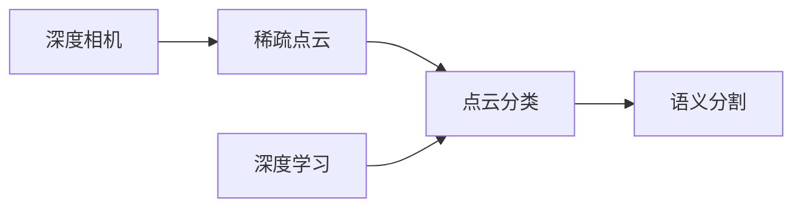

# 基于深度相机稀疏点云分类算法研究

关键词：深度相机、稀疏点云、分类算法、深度学习、三维重建

## 1. 背景介绍
### 1.1  问题的由来
随着计算机视觉和人工智能技术的飞速发展,三维重建和场景理解成为了当前研究的热点。深度相机作为一种能够获取三维空间信息的传感器,在机器人导航、自动驾驶、增强现实等领域有着广泛的应用前景。然而,深度相机获取的原始点云数据通常比较稀疏,直接应用现有的点云处理算法效果并不理想。因此,如何对深度相机获取的稀疏点云进行有效分类是一个亟待解决的问题。

### 1.2  研究现状 
目前,针对稀疏点云的分类算法主要有两大类:基于手工特征的传统机器学习方法和基于深度学习的端到端方法。

传统机器学习方法通常先从点云中提取一些几何和统计特征,然后使用SVM、随机森林等分类器进行分类。比如,Hackel等人提出了一种多尺度特征提取方法[1],可以同时提取局部和全局的点云特征。Weinmann等人使用了基于熵的特征选择方法[2],从高维特征中选取最有区分度的特征子集用于分类。这类方法的优点是计算效率较高,但是特征工程比较依赖经验,泛化能力有限。

近年来,深度学习在图像分类领域取得了巨大成功,很多研究者开始将其应用到点云处理中。PointNet[3]是第一个直接将原始点云输入到神经网络进行特征学习和分类的工作,开创了点云深度学习的先河。此后,PointNet++[4]、DGCNN[5]、PointCNN[6]等众多改进方法不断涌现,极大地推动了点云分类的发展。这类方法能够自动学习点云的内在特征表示,不需要人工设计特征,分类精度大幅提升。但是它们大多是在规则和密集的点云数据集上训练和测试的,对稀疏点云的分类效果有待进一步验证。

### 1.3  研究意义
深度相机在很多应用场景下都需要工作在远距离,此时获取的点云不可避免地存在稀疏性。稀疏点云给现有算法带来了很大挑战,因此研究专门针对稀疏点云的分类方法具有重要意义。一方面,它可以拓展深度相机的使用范围,发掘更多潜在应用;另一方面,这项研究也有助于理解点云数据的本质特性,为后续算法改进提供启发和思路。从理论到实践,对稀疏点云分类问题的探索都有着深远影响。

### 1.4  本文结构
本文主要研究内容分为以下几个部分:第2节介绍稀疏点云分类涉及的一些核心概念;第3节详细阐述本文提出的分类算法原理和步骤;第4节建立数学模型并推导相关公式;第5节通过实际代码实现来验证算法性能;第6节讨论算法的应用场景;第7节总结全文并展望未来研究方向。

## 2. 核心概念与联系
在正式介绍算法之前,我们先来了解一下稀疏点云分类中的几个核心概念。

(1) 点云(Point Cloud):点云是物体表面采样点的集合,每个点由其三维坐标(x,y,z)来描述。点云通常由深度相机、激光雷达等传感器采集得到,反映了物体的几何形状。

(2) 稀疏点云(Sparse Point Cloud):与规则点云相比,稀疏点云在空间分布上呈现出非均匀性,局部点云密度差异较大。稀疏点云往往由远距离采样或遮挡等因素导致。

(3) 点云分类(Point Cloud Classification):点云分类是指将点云中的每个点划分到某个预定义的类别,比如汽车、行人、建筑等。分类结果可用于场景理解、目标检测等后续任务。

(4) 深度学习(Deep Learning):深度学习是机器学习的一个分支,主要使用人工神经网络对数据进行表示学习。CNN、RNN等网络结构在图像、语音等领域取得了广泛成功。

(5) 语义分割(Semantic Segmentation):语义分割是点云分类的一种常见形式,旨在将点云分割成多个有语义含义的部分,比如汽车的车轮、车窗等。每个点的类别标签由其所属部件决定。

这些概念之间存在着紧密的联系。稀疏点云是深度相机采集数据的特殊形式,给点云分类带来了新的挑战。而点云分类又是语义分割的基础,两者常常结合在一起解决具体问题。深度学习作为一种强大的数据驱动方法,为点云分类任务提供了新的思路。下图展示了这些概念之间的逻辑关系:

## 3. 核心算法原理 & 具体操作步骤
### 3.1  算法原理概述
本文提出的稀疏点云分类算法基于图卷积神经网络(Graph Convolutional Network, GCN)[7]。GCN是一种专门处理图结构数据的深度学习模型,通过在图域定义卷积操作来提取节点的特征表示。将点云视为一个无向图,每个点对应图中的一个节点,点之间的邻接关系对应图中的边,GCN就可以很自然地应用于点云处理任务。

算法的整体思路如下:首先,将输入的稀疏点云构建成一个k近邻图,每个点与其最近的k个点相连;然后,利用图卷积操作对点云特征进行层级提取和融合;最后,将点云特征输入到全连接层进行分类预测。考虑到稀疏点云的不均匀性,算法在图卷积过程中还引入了注意力机制,自适应地调整不同区域的特征权重。此外,为了缓解数据稀疏带来的过拟合问题,我们在网络训练中使用了dropout和数据增强等正则化手段。

### 3.2  算法步骤详解
算法主要分为四个步骤:图构建、特征提取、注意力融合和分类输出。下面对每个步骤进行详细说明。

(1) 图构建
给定一个N个点的稀疏点云$P=\{p_i|i=1,2,...,N\}$,我们首先计算每个点$p_i$与其他所有点的欧氏距离,然后选取距离最近的k个点作为其邻居$N(p_i)$。基于点云P构建一个无向图$G=(V,E)$,其中节点集V对应点云P,边集E包含所有点与其k近邻之间的连边。

(2) 特征提取
图G中每个节点$v_i$除了其三维坐标$(x_i,y_i,z_i)$外,还可以附加一些额外的特征,比如颜色、法向量等。我们将这些特征组成节点的初始特征向量$h_i^{(0)}$。然后,通过堆叠L层图卷积来提取节点的高层特征表示:

$$h_i^{(l)}=\sigma(\sum_{j\in N(i)}\frac{1}{c_{ij}}h_j^{(l-1)}W^{(l)})$$

其中,$h_i^{(l)}$表示第l层第i个节点的特征向量,$N(i)$为节点i的邻居节点集合,$c_{ij}$是归一化常数,用于平衡不同节点的贡献度,$W^{(l)}$是第l层的权重矩阵,$\sigma$是激活函数,如ReLU。

直观地看,图卷积操作就是将每个节点的特征与其邻居节点的特征进行聚合,得到一个新的特征表示。通过多次迭代,节点可以获取到更大范围内的上下文信息。

(3) 注意力融合
传统的图卷积对所有邻居节点施加了相同的权重,这对于稀疏点云可能并不适用。我们希望模型能够自动区分重要的邻居和不重要的邻居。因此,引入注意力机制来调整不同邻居的权重:

$$\alpha_{ij}^{(l)}=\frac{exp(LeakyReLU(a^T[W^{(l)}h_i^{(l-1)}||W^{(l)}h_j^{(l-1)}]))}{\sum_{k\in N(i)}exp(LeakyReLU(a^T[W^{(l)}h_i^{(l-1)}||W^{(l)}h_k^{(l-1)}]))}$$

$$h_i^{(l)}=\sigma(\sum_{j\in N(i)}\alpha_{ij}^{(l)}W^{(l)}h_j^{(l-1)})$$

其中,$\alpha_{ij}^{(l)}$表示第l层节点i对邻居节点j的注意力权重,$\cdot^T$表示转置,[]表示拼接操作,$a$是注意力权重向量,用于计算节点特征的相似度。

(4) 分类输出
经过L层图卷积和注意力融合后,我们得到了每个点的最终特征表示$h_i^{(L)}$。将其输入到全连接层(Fully Connected Layer)中进行分类预测:

$$y_i=softmax(FC(h_i^{(L)}))$$

其中,$y_i$是第i个点的分类概率向量,$FC$表示全连接层。我们使用交叉熵损失函数来优化模型参数:

$$loss=-\sum_i\sum_cy_{ic}log(\hat{y}_{ic})$$

其中,$y_{ic}$是第i个点的真实类别标签(one-hot向量),$\hat{y}_{ic}$是模型预测的类别概率。

### 3.3  算法优缺点
本算法的优点主要有以下几点:
(1) 充分利用了点云的图结构信息,通过图卷积对点云特征进行层级提取,能够获得更加抽象和鲁棒的特征表示。
(2) 引入注意力机制,自适应地调整不同邻居的权重,更好地处理稀疏点云的不均匀性。
(3) 采用端到端的深度学习框架,避免了复杂的特征工程,具有更好的泛化能力。

算法的缺点包括:
(1) 计算复杂度较高,需要在图上进行多次卷积和注意力操作,对于大规模点云数据可能难以实时处理。
(2) 模型参数量较大,需要大量标注数据进行训练,获取训练数据的成本比较高。
(3) 超参数较多,如k近邻数量、卷积层数等,需要进行反复调试才能达到最优性能。

### 3.4  算法应用领域
本算法可以应用于以下几个领域:
(1) 自动驾驶:对道路场景中的车辆、行人、障碍物等进行识别和分类,辅助决策和路径规划。
(2) 机器人导航:对室内外环境中的物体进行语义分割,构建高级别的环境地图,指导机器人运动。
(3) 增强现实:对真实场景的语义理解,实现虚拟物体与真实环境的无缝融合和交互。
(4) 工业视觉:对工业产品的缺陷检测和品质评估,提高生产效率和质量控制水平。

## 4. 数学模型和公式 & 详细讲解 & 举例说明
### 4.1  数学模型构建
我们将稀疏点云分类问题建模为一个图结构上的节点分类问题。设输入点云为$P=\{p_i|i=1,2,...,N\}$,其对应的无向图为$G=(V,E)$,节点集V对应点云P,边集E表示点之间的邻接关系。每个节点$v_i$有其特征向量$h_i$,目标是学习一个分类函数$f:V \rightarrow Y$,将每个节点映射到一个类别标签$y_i \in Y$。我们使用图卷积神经网络来拟合这个分类函数。

图卷积的数学定义如下:设图G的邻接矩阵为A,度矩阵为D,其中$D_{ii}=\sum_jA_{ij}$。图卷积操作可以表示为:

$$H^{(l+1)}=\sigma