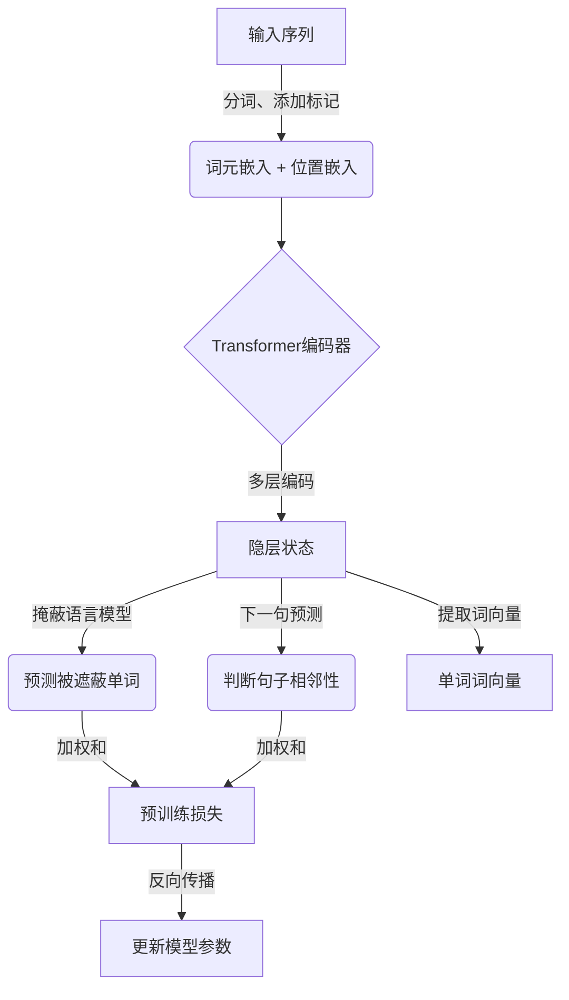

这是一个很有趣的话题,我会尽力写一篇内容丰富、见解深刻的技术博客。让我们开始吧!

# 基于深度神经网络的高质量词向量生成方法研究

## 1. 背景介绍

### 1.1 问题的由来

在自然语言处理领域,词向量是一种将单词映射到连续向量空间的技术,能够捕捉单词之间的语义和句法关系。高质量的词向量对于许多下游任务(如机器翻译、情感分析、文本生成等)都至关重要。传统的词向量生成方法(如Word2Vec和GloVe)虽然取得了不错的效果,但仍存在一些缺陷,比如对低频词的表示不佳、未能充分利用上下文信息等。

### 1.2 研究现状  

近年来,随着深度学习技术的不断发展,基于神经网络的词向量生成模型逐渐成为研究热点。这些模型通过神经网络自动学习单词的语义表示,避免了传统方法中人工设计特征的缺陷。其中,ELMo、BERT等模型取得了卓越的性能,成为新的研究前沿。

### 1.3 研究意义

高质量的词向量对自然语言处理任务至关重要,能够极大提高模型的性能。研究基于深度神经网络的词向量生成方法,有望获得更加准确、丰富的单词语义表示,为下游任务提供有力支撑。此外,这一领域的研究也可能推动神经网络模型、优化算法等相关技术的发展。

### 1.4 本文结构

本文首先介绍词向量的基本概念和传统生成方法,然后重点探讨基于深度神经网络的词向量生成模型,包括模型原理、训练方法、性能分析等。最后总结研究现状,并对未来发展方向进行展望。

## 2. 核心概念与联系

词向量(Word Embedding)是将单词映射到低维连续向量空间的一种技术,其核心思想是用密集的实值向量来表示单词,这些向量能够很好地捕捉单词之间的语义和句法关系。

高质量词向量的生成需要满足以下几个核心要求:

1. **语义保真性**:向量空间中,语义相似的单词应该彼此靠近。
2. **句法一致性**:能够捕捉单词在不同句法结构中的语法属性。 
3. **上下文敏感性**:单词的向量表示应该能够根据上下文语境发生变化。
4. **覆盖广泛性**:包括常见词和低频词在内的大部分单词都应该有高质量的向量表示。

基于深度神经网络的词向量生成模型,通过神经网络自动学习单词的语义表示,避免了传统方法中人工设计特征的缺陷,能够较好地满足上述要求。这些模型通常由以下几个核心部分组成:

1. **输入层**:将单词或上下文映射为初始向量表示。
2. **编码层**:通过卷积、注意力等操作提取上下文特征。
3. **语义层**:学习单词的上下文无关语义表示。
4. **融合层**:将上下文无关语义和上下文特征融合,生成最终词向量。

不同模型在网络结构、训练目标等方面有所不同,但都遵循上述基本框架。接下来我们将详细介绍几种代表性模型。

## 3. 核心算法原理 & 具体操作步骤

### 3.1 算法原理概述

基于深度神经网络的词向量生成算法主要分为两大类:基于语言模型的方法和基于插入目标的方法。

**基于语言模型的方法**通过预测下一个单词,学习单词在上下文中的语义表示。代表模型有ELMo、GPT等。这类方法能够很好地捕捉单词的上下文语义,但对单词本身的语义表示较差。

**基于插入目标的方法**则是通过预测被遮蔽单词,同时学习单词的上下文无关语义和上下文语义。代表模型是BERT及其变体。这类方法能够平衡单词本身语义和上下文语义的表示。

下面以BERT为例,介绍基于插入目标的词向量生成模型的核心原理和操作步骤。

### 3.2 算法步骤详解

BERT(Bidirectional Encoder Representations from Transformers)是一种基于Transformer编码器的预训练语言模型。它的核心思想是通过掩蔽单词,同时对掩蔽单词和上下文进行编码,从而学习单词的上下文无关语义和上下文语义表示。BERT的训练分为两个阶段:

1. **预训练阶段**:在大规模无标注语料上进行自监督训练,包括两个任务:
   - **掩蔽语言模型(Masked LM)**:随机遮蔽输入序列中的部分单词,训练模型预测被遮蔽单词。
   - **下一句预测(Next Sentence Prediction)**:判断两个句子是否相邻。

2. **微调阶段**:在特定任务的标注数据上,对预训练模型进行进一步微调,获得针对该任务的最优模型。

在预训练阶段,BERT通过掩蔽语言模型任务,学习单词的上下文无关语义表示;同时通过双向编码上下文,获取单词的上下文语义表示。这两种表示在最终的输出层融合,生成单词的最终词向量。具体操作步骤如下:

1. **输入表示**:将输入序列分词,每个词对应一个词元(WordPiece),并添加特殊标记[CLS]和[SEP]。

2. **词元嵌入**:将每个词元映射为一个初始向量表示。

3. **位置嵌入**:为每个位置添加位置嵌入,捕捉单词在序列中的位置信息。

4. **语义编码**:输入序列通过多层Transformer编码器,每一层包含多头自注意力和前馈网络。

5. **掩蔽语言模型**:对于被掩蔽的词元,从最终隐层状态预测其单词。

6. **下一句预测**:从[CLS]标记的隐层状态,通过分类器预测两个句子是否相邻。

7. **预训练损失**:掩蔽语言模型损失和下一句预测损失的加权和作为总损失。

8. **词向量生成**:将每个单词对应的最终隐层状态作为其上下文无关语义表示,与其上下文语义表示(通过自注意力获得)相加,得到最终词向量。

通过上述自监督预训练,BERT能够在大规模语料上学习到单词的丰富语义知识。在下游任务中,只需要对BERT进行少量微调,即可获得针对该任务的最优模型和高质量词向量表示。

### 3.3 算法优缺点

BERT及其变体模型在多个自然语言处理任务上取得了卓越的性能,证明了其高质量词向量的有效性。主要优点包括:

1. **上下文敏感**:能够根据上下文捕捉单词的语义变化。
2. **双向编码**:融合了上下文的前后信息,词向量表示更加丰富。 
3. **泛化性强**:通过自监督预训练,模型能够学习到大量语义知识,在下游任务中快速收敛。
4. **可解释性**:注意力机制赋予了模型一定的可解释性。

但这类模型也存在一些缺陷和局限性:

1. **训练代价大**:BERT的参数规模较大,预训练过程计算开销昂贵。
2. **长序列表现差**:自注意力的计算复杂度与序列长度的平方成正比,对长序列建模能力有限。
3. **缺乏推理能力**:BERT主要学习到模式匹配的能力,缺乏真正的推理和因果推理能力。
4. **领域迁移差**:预训练语料与下游任务领域差异较大时,模型性能会受到影响。

因此,如何在保持BERT优势的同时,降低训练代价、提高长序列建模能力、增强推理能力和领域适应性,是未来需要解决的重要问题。

### 3.4 算法应用领域

高质量的词向量在自然语言处理的诸多领域都有广泛应用,主要包括:

1. **文本分类**:新闻分类、情感分析、垃圾邮件过滤等。
2. **机器翻译**:利用词向量捕捉语义信息,提高翻译质量。
3. **问答系统**:根据问题和文本的语义表示,匹配问题答案。
4. **文本生成**:根据上下文语义生成自然、连贯的文本。
5. **信息检索**:根据查询和文档的语义相似度进行排序。
6. **知识图谱**:通过词向量发现实体和关系,构建知识库。

除自然语言处理外,词向量也广泛应用于计算机视觉、推荐系统、知识表示等领域。可以预见,随着人工智能技术的发展,高质量词向量的应用场景将越来越广泛。

## 4. 数学模型和公式 & 详细讲解 & 举例说明

### 4.1 数学模型构建

BERT是一种基于Transformer的双向编码器模型,其核心是多头自注意力机制和位置编码。我们先介绍自注意力机制的数学原理。

给定一个输入序列 $\boldsymbol{x} = (x_1, x_2, \ldots, x_n)$,自注意力机制首先计算每个位置 $i$ 与其他所有位置 $j$ 的注意力权重:

$$\text{Attention}(q_i, k_j, v_j) = \text{softmax}\left(\frac{q_i k_j^T}{\sqrt{d_k}}\right)v_j$$

其中 $q_i$、$k_j$、$v_j$ 分别是 $x_i$ 的查询(query)、$x_j$ 的键(key)和值(value)映射,通过不同的线性变换得到;$d_k$ 是缩放因子,用于防止点积的方差过大。

然后,将注意力权重与值向量 $v_j$ 相乘并求和,得到位置 $i$ 的注意力表示 $z_i$:

$$z_i = \sum_{j=1}^n \text{Attention}(q_i, k_j, v_j)$$

对所有位置的注意力表示进行拼接,即可获得整个序列的注意力表示 $\boldsymbol{z}$。

多头注意力机制是将多个注意力表示拼接而成,以增强模型的表示能力:

$$\text{MultiHead}(Q, K, V) = \text{Concat}(z_1, z_2, \ldots, z_h)W^O$$

其中 $z_i = \text{Attention}(QW_i^Q, KW_i^K, VW_i^V)$,表示第 $i$ 个注意力头;$W_i^Q$、$W_i^K$、$W_i^V$ 和 $W^O$ 是可学习的线性变换参数。

在BERT中,输入序列首先通过词元嵌入层和位置嵌入层获得初始表示,然后通过 $N$ 层Transformer编码器进行编码,每一层包含一个多头自注意力子层和一个前馈网络子层。最终的输出隐层状态即为单词的上下文表示。

### 4.2 公式推导过程

我们以单头自注意力机制为例,推导其数学表达式。

设输入序列为 $\boldsymbol{x} = (x_1, x_2, \ldots, x_n)$,其中每个 $x_i \in \mathbb{R}^{d_\text{model}}$ 是 $d_\text{model}$ 维向量。我们希望计算每个位置 $i$ 与所有位置 $j$ 的注意力权重,并根据权重对值向量 $\boldsymbol{v}$