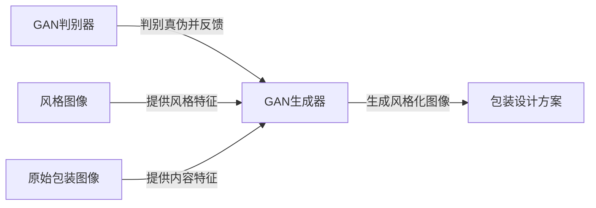

# 基于生成对抗网络的图像风格迁移在商品包装设计中的应用

关键词：生成对抗网络、图像风格迁移、商品包装设计、深度学习、计算机视觉

## 1. 背景介绍

### 1.1 问题的由来
在当今竞争激烈的消费品市场中,商品包装设计扮演着至关重要的角色。一个优秀的包装设计不仅能吸引消费者的注意力,还能传达品牌理念,提升商品价值。然而,传统的包装设计流程往往耗时耗力,难以快速响应市场变化。近年来,人工智能技术的发展为包装设计带来了新的机遇。其中,基于生成对抗网络(GAN)的图像风格迁移技术展现出巨大潜力,有望革新包装设计行业。

### 1.2 研究现状
生成对抗网络自2014年由Goodfellow等人提出以来,在计算机视觉领域掀起了一股研究热潮。GAN由生成器和判别器两个神经网络组成,通过两者的对抗学习,可以生成逼真的图像。Gatys等人于2016年提出了一种基于卷积神经网络(CNN)的图像风格迁移算法,实现了将一幅图像的风格迁移到另一幅图像的内容上。此后,Zhu等人提出了CycleGAN,进一步扩展了风格迁移的应用场景。目前,GAN在图像生成、超分辨率、图像编辑等方面取得了瞩目成果,但在商品包装设计中的应用尚处于起步阶段。

### 1.3 研究意义
将GAN图像风格迁移技术应用于商品包装设计,有望带来以下益处:

1. 提高设计效率:传统包装设计需要专业设计师投入大量时间和精力,采用风格迁移技术可以自动生成多种设计方案,极大提升设计效率。
2. 拓宽设计思路:设计师可以尝试将各种风格元素融入包装设计,激发创意灵感,创造出新颖独特的设计作品。 
3. 个性化定制:利用风格迁移生成与消费者喜好匹配的包装,实现千人千面的个性化设计,提升用户体验。
4. 降低设计成本:自动化设计工具可减少对设计师的依赖,节约人力成本,让中小企业也能获得优质设计。

### 1.4 本文结构
本文将重点探讨GAN图像风格迁移在商品包装设计中的应用。第2部分介绍风格迁移与包装设计的核心概念;第3部分阐述GAN风格迁移的算法原理与具体步骤;第4部分建立风格迁移的数学模型,并以案例说明;第5部分给出项目实践的代码实例与详解;第6部分分析该技术在包装设计行业的应用场景;第7部分推荐相关学习资源与工具;第8部分总结全文,展望未来发展方向,并指出面临的挑战;第9部分为常见问题解答。

## 2. 核心概念与联系

在探讨GAN风格迁移在包装设计中的应用之前,有必要厘清几个核心概念:

- 生成对抗网络(GAN): 由生成器和判别器组成的深度学习模型,通过两个网络的博弈学习,生成器可生成逼真的图像。
- 风格迁移:将一幅图像的风格特征迁移到另一幅图像的内容上,生成融合了两者特点的新图像的过程。常用方法有基于CNN的Gatys算法和基于GAN的CycleGAN等。
- 商品包装设计:为商品设计外包装的造型、材质、色彩、图案等,使其具有美感和销售力,传达产品与品牌信息的艺术设计过程。

风格迁移可应用于包装设计的方方面面。例如,可将著名艺术家的画风应用于包装图案设计,或将怀旧风格的老包装"翻新"为现代风格。设计师可利用风格迁移快速生成多个设计方案,再进行筛选和微调,既能提高工作效率,又能拓宽创意思路。



## 3. 核心算法原理 & 具体操作步骤

### 3.1 算法原理概述
GAN风格迁移的核心是建立两个相互博弈的神经网络:生成器G和判别器D。生成器接收原始图像和风格图像,生成风格化的图像;判别器接收生成图像和真实图像,判断它们是否为真。两个网络通过反复训练,不断提升生成图像的质量,直至判别器无法分辨真伪。

### 3.2 算法步骤详解
1. 准备数据集:收集大量原始包装图像和风格图像,进行预处理。
2. 搭建生成器G:通常采用U-Net等编码器-解码器结构,以原始图像和风格图像为输入,生成风格化图像。
3. 搭建判别器D:通常采用卷积神经网络,以生成图像和真实图像为输入,输出真伪概率。
4. 定义损失函数:包括内容损失、风格损失和对抗损失,分别衡量生成图像与原始图像的内容相似度、与风格图像的风格相似度,以及被判别器判为真的概率。
5. 训练模型:交替训练生成器和判别器,生成器尽可能欺骗判别器,判别器尽可能分辨真伪,两者在对抗中不断进步。
6. 测试模型:用训练好的生成器为新的包装图像生成各种风格化版本,供设计师参考和选择。

### 3.3 算法优缺点
GAN风格迁移的优点包括:
- 生成效果逼真,能够同时保留内容图像的语义信息和风格图像的外观特征。
- 可以处理任意风格和内容图像,具有很强的灵活性和适用性。
- 生成速度快,可批量生成多种风格化图像,提高设计效率。

但该算法也存在一些局限性:
- 对训练数据的质量和数量要求较高,需要大量高质量的图像样本。
- 训练过程不够稳定,容易出现模式崩溃、梯度消失等问题,调参难度大。
- 生成的图像可能存在伪影、失真等瑕疵,需要后期处理。

### 3.4 算法应用领域
除了商品包装设计,GAN风格迁移还可应用于以下领域:
- 服装设计:将各种纹理材质、图案风格迁移到服装设计图上,方便设计师预览效果。
- 室内装潢:为室内场景图添加各种装修风格,如北欧风、工业风等,供用户参考。
- 游戏美术:快速生成不同风格的游戏场景、角色、道具等素材。
- 电影特效:为电影镜头添加特定时代、地域的风格,增强代入感。

## 4. 数学模型和公式 & 详细讲解 & 举例说明

### 4.1 数学模型构建
GAN风格迁移可以用以下数学模型描述:

令原始图像为 $x$,风格图像为 $s$,生成器为 $G$,判别器为 $D$,则风格迁移过程可表示为:

$$\hat{x} = G(x, s)$$

其中 $\hat{x}$ 为生成的风格化图像。

生成器 $G$ 和判别器 $D$ 的目标函数分别为:

$$\min_G \max_D \mathcal{L}_{GAN}(G, D) + \lambda_c \mathcal{L}_{content}(G) + \lambda_s \mathcal{L}_{style}(G)$$

其中 $\mathcal{L}_{GAN}$、$\mathcal{L}_{content}$、$\mathcal{L}_{style}$ 分别为对抗损失、内容损失和风格损失,$\lambda_c$、$\lambda_s$ 为平衡因子。

### 4.2 公式推导过程
对抗损失 $\mathcal{L}_{GAN}$ 衡量生成图像欺骗判别器的能力,采用二元交叉熵损失:

$$\mathcal{L}_{GAN}(G, D) = \mathbb{E}_{x\sim p_{data}(x)}[\log D(x)] + \mathbb{E}_{x\sim p_{data}(x), s\sim p_{data}(s)}[\log(1-D(G(x,s)))]$$

内容损失 $\mathcal{L}_{content}$ 衡量生成图像与原始图像的内容相似度,采用L1或L2损失:

$$\mathcal{L}_{content}(G) = \mathbb{E}_{x\sim p_{data}(x), s\sim p_{data}(s)}[\| G(x,s) - x \|_1]$$

风格损失 $\mathcal{L}_{style}$ 衡量生成图像与风格图像的外观相似度,通过比较两图像在CNN特征空间的Gram矩阵:

$$\mathcal{L}_{style}(G) = \mathbb{E}_{x\sim p_{data}(x), s\sim p_{data}(s)}[\sum_{i=1}^L \| G(\phi_i(G(x,s))) - G(\phi_i(s)) \|_1]$$

其中 $\phi_i$ 为VGG网络的第 $i$ 层特征图,$G(\cdot)$ 为Gram矩阵。

### 4.3 案例分析与讲解
以将梵高《星夜》的风格迁移到薯片包装设计为例。原始图像 $x$ 为薯片包装设计图,风格图像 $s$ 为《星夜》油画。将两图输入预训练的CycleGAN模型,得到风格化的包装设计图 $\hat{x}$。

观察可见,生成图像在保留了薯片包装整体布局、Logo等关键元素的同时,融入了梵高笔触粗犷、色彩鲜明的风格特征,呈现出油画般的质感。设计师可根据生成图快速制作多款初稿,再进行细节优化,既有利于创意发散,又能提升工作效率。

### 4.4 常见问题解答
问:GAN风格迁移能否适用于任意风格和内容图像?
答:理论上可以,但由于模型是在特定数据集上训练的,对于风格差异过大的图像,效果可能不够理想,需要重新训练模型。

问:风格迁移生成的图像是否有版权风险?
答:风格迁移本质上是一种演绎作品,涉及内容图像、风格图像、算法模型的权利归属问题。商用时需要获得相关权利人的授权许可,或使用无版权的素材。

## 5. 项目实践：代码实例和详细解释说明

### 5.1 开发环境搭建
本项目基于TensorFlow 2.x和Keras实现,需要安装以下依赖库:
```
tensorflow>=2.0
tensorflow-addons
matplotlib
```

### 5.2 源代码详细实现
以下是CycleGAN风格迁移的核心代码:

```python
import tensorflow as tf

def downsample(filters, size, apply_instancenorm=True):
    initializer = tf.random_normal_initializer(0., 0.02)
    gamma_init = keras.initializers.RandomNormal(mean=0.0, stddev=0.02)

    result = tf.keras.Sequential()
    result.add(tf.keras.layers.Conv2D(filters, size, strides=2, padding='same',
                                      kernel_initializer=initializer, use_bias=False))

    if apply_instancenorm:
        result.add(tfa.layers.InstanceNormalization(gamma_initializer=gamma_init))

    result.add(tf.keras.layers.LeakyReLU())

    return result
    
def upsample(filters, size, apply_dropout=False):
    initializer = tf.random_normal_initializer(0., 0.02)
    gamma_init = keras.initializers.RandomNormal(mean=0.0, stddev=0.02)

    result = tf.keras.Sequential()
    result.add(tf.keras.layers.Conv2DTranspose(filters, size, strides=2,
                                               padding='same',
                                               kernel_initializer=initializer,
                                               use_bias=False))

    result.add(tfa.layers.InstanceNormalization(gamma_initializer=gamma_init))

    if apply_dropout:
        result.add(tf.keras.layers.Dropout(0.5))

    result.add(tf.keras.layers.ReLU())

    return result

def Generator():