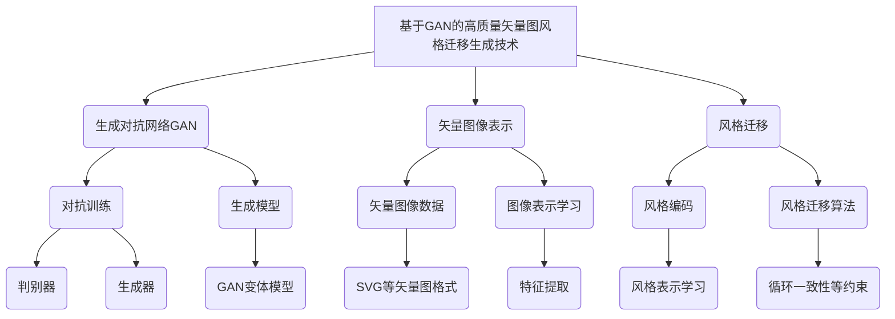
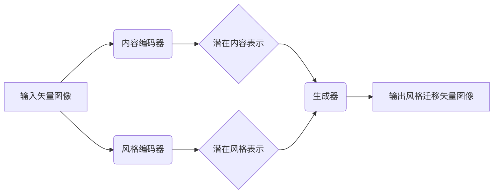

# 基于生成对抗网络的高质量矢量图风格迁移生成

## 1. 背景介绍

### 1.1 问题的由来

在图形设计和数字艺术领域,创作高质量且具有独特风格的矢量图一直是一个巨大的挑战。传统的方法通常需要设计师耗费大量的时间和精力手工绘制,这不仅效率低下,而且难以保证风格的一致性。随着人工智能技术的不断发展,基于深度学习的图像生成模型为解决这一问题提供了新的思路。

生成对抗网络(Generative Adversarial Networks, GANs)作为一种强大的生成模型,已经在图像生成、风格迁移等领域取得了卓越的成绩。然而,现有的基于GAN的矢量图风格迁移方法在生成质量和计算效率方面仍然存在一些不足,难以满足实际应用的需求。

### 1.2 研究现状

近年来,研究人员提出了多种基于GAN的矢量图风格迁移方法,旨在生成高质量且具有特定风格的矢量图像。这些方法通常采用编码器-解码器结构,将输入图像编码为潜在空间表示,然后利用GAN网络将潜在表示解码为目标风格的矢量图像。

其中,一些研究工作侧重于改进网络结构和损失函数,以提高生成质量。例如,CycleGAN[1]利用循环一致性损失实现了无监督的风格迁移。另一些工作则关注于提高生成效率,如利用自注意力机制[2]或多尺度生成策略[3]加速生成过程。

然而,现有方法在生成质量和计算效率之间仍存在着权衡。一方面,高质量的生成结果通常需要更复杂的网络结构和更多的计算资源;另一方面,追求高效的生成过程可能会牺牲生成质量。因此,设计一种能够同时实现高质量和高效率的矢量图风格迁移生成模型,是当前研究的一个重要方向。

### 1.3 研究意义

基于生成对抗网络的高质量矢量图风格迁移生成技术具有重要的理论意义和应用价值:

1. **理论意义**:该技术将推动生成对抗网络在矢量图像领域的发展,为解决复杂的图像生成问题提供新的思路和方法。同时,它也将促进相关领域(如计算机视觉、图形学等)的理论研究和技术进步。

2. **应用价值**:高质量的矢量图风格迁移生成技术可以广泛应用于图形设计、数字艺术、广告设计、动画制作等领域,为设计师和艺术家提供强大的创作工具,大幅提高工作效率,推动相关行业的发展。

3. **商业价值**:该技术有望催生新的商业模式和产品,如基于AI的在线设计平台、个性化图像生成服务等,为相关企业带来新的收入来源和商机。

4. **社会影响**:通过降低图形设计的门槛,该技术有助于普及数字艺术,丰富视觉文化,提升大众的审美体验。同时,它也可用于辅助教学、科普传播等领域,提高知识的可视化表达能力。

总之,基于生成对抗网络的高质量矢量图风格迁移生成技术具有广阔的发展前景,值得深入研究和探索。

### 1.4 本文结构

本文将全面介绍基于生成对抗网络的高质量矢量图风格迁移生成技术。具体内容安排如下:

- 第2部分阐述该技术的核心概念及其与相关技术的联系;
- 第3部分详细解释该技术的核心算法原理和具体操作步骤;
- 第4部分推导该技术所涉及的数学模型和公式,并通过案例进行讲解;
- 第5部分提供该技术的项目实践,包括开发环境搭建、源代码实现、代码解读和运行结果展示;
- 第6部分介绍该技术在实际应用中的场景;
- 第7部分推荐相关的学习资源、开发工具和论文;
- 第8部分总结该技术的研究成果、未来发展趋势和面临的挑战;
- 第9部分列出常见问题并给出解答。

## 2. 核心概念与联系

基于生成对抗网络的高质量矢量图风格迁移生成技术涉及多个核心概念,包括生成对抗网络(GAN)、矢量图像表示、风格迁移等,这些概念与计算机视觉、机器学习、图形学等多个领域紧密相关。

上图展示了这些核心概念之间的关系。具体来说:

1. **生成对抗网络(GAN)**: GAN是一种基于对抗训练的生成模型,由生成器和判别器组成。生成器旨在生成逼真的样本,而判别器则判断样本的真伪。通过生成器和判别器的互相对抗,GAN可以学习到数据的真实分布,并生成新的样本。

2. **矢量图像表示**: 矢量图像是由一系列数学曲线和形状构成的图像,与基于像素的光栅图像不同。矢量图像具有无损缩放、体积小等优点,广泛应用于图形设计领域。表示和处理矢量图像是该技术的核心问题之一。

3. **风格迁移**: 风格迁移旨在将一种艺术风格迁移到另一种内容上,即在保留原始内容的基础上,赋予其新的艺术风格。这种技术可以应用于图像、文本、音频等多种数据形式。

上述三个核心概念在该技术中互相交织、相辅相成。具体来说,该技术利用GAN的生成能力,学习矢量图像的表示,并将目标风格编码到潜在空间中,最终实现高质量的矢量图风格迁移生成。

同时,该技术还与计算机视觉、机器学习、图形学等多个领域相关。例如,矢量图像表示学习借鉴了计算机视觉中的特征提取技术;风格编码和迁移算法来源于机器学习中的表示学习方法;生成对抗网络的发展也离不开机器学习理论的支撑;而矢量图像数据的处理则需要图形学的知识等。

总之,基于生成对抗网络的高质量矢量图风格迁移生成技术是一个交叉学科的前沿技术,它汇聚了多个领域的核心概念和方法,为解决实际问题提供了有力的工具。

## 3. 核心算法原理与具体操作步骤

### 3.1 算法原理概述

基于生成对抗网络的高质量矢量图风格迁移生成算法的核心思想是:利用GAN的生成能力,将输入矢量图像的内容和目标风格编码到潜在空间中,然后通过生成器网络解码出具有目标风格的新矢量图像。

该算法一般采用编码器-解码器的框架结构,如下图所示:

1. **内容编码器**将输入矢量图像编码为潜在内容表示,保留了图像的内容信息;
2. **风格编码器**将目标风格编码为潜在风格表示,捕获了风格的特征;
3. **生成器**接收潜在内容表示和潜在风格表示作为输入,并生成具有目标风格的新矢量图像。

在训练过程中,还需要一个**判别器**来判断生成图像的真伪,并将判别结果作为反馈信号,指导生成器不断改进。生成器和判别器通过对抗训练相互博弈,最终达到生成高质量矢量图像的目标。

该算法的关键在于如何高效地编码矢量图像的内容和风格信息,以及如何设计生成器和判别器的网络结构,以提高生成质量和计算效率。下面将对算法的具体步骤进行详细阐述。

### 3.2 算法步骤详解

基于生成对抗网络的高质量矢量图风格迁移生成算法可以分为以下几个主要步骤:

#### 步骤1: 数据预处理

1. 收集矢量图像数据集,包括内容图像和风格参考图像;
2. 将矢量图像数据(如SVG格式)转换为适合神经网络处理的数值表示形式;
3. 对数据进行归一化、增强等预处理,以提高训练效果。

#### 步骤2: 网络设计

1. 设计**内容编码器**网络,用于编码输入矢量图像的内容信息;
2. 设计**风格编码器**网络,用于编码目标风格的特征;
3. 设计**生成器**网络,接收内容表示和风格表示作为输入,生成风格迁移后的矢量图像;
4. 设计**判别器**网络,判断生成图像的真伪,并将判别结果作为反馈信息;
5. 选择合适的网络结构(如卷积网络、自注意力机制等)和损失函数。

#### 步骤3: 对抗训练

1. 初始化生成器和判别器的网络参数;
2. 对生成器进行训练:
   - 从内容图像和风格参考图像中采样;
   - 将内容图像输入内容编码器,获取潜在内容表示;
   - 将风格参考图像输入风格编码器,获取潜在风格表示;
   - 将内容表示和风格表示作为输入,通过生成器生成风格迁移图像;
   - 计算生成图像与真实图像之间的reconstruction loss;
   - 计算判别器对生成图像的判别分数,将其作为对抗loss;
   - 将reconstruction loss和对抗loss相加,作为生成器的总损失;
   - 更新生成器的网络参数,使总损失最小化。
3. 对判别器进行训练:
   - 从真实图像和生成器生成的图像中采样;
   - 计算判别器对真实图像和生成图像的判别分数;
   - 将真实图像的判别分数作为真实loss,生成图像的判别分数作为假loss;
   - 将真实loss和假loss相加,作为判别器的总损失;
   - 更新判别器的网络参数,使总损失最小化。
4. 重复步骤2和3,直到模型收敛。

#### 步骤4: 生成和后处理

1. 使用训练好的生成器模型进行推理;
2. 将需要风格迁移的矢量图像输入内容编码器,获取潜在内容表示;
3. 将目标风格输入风格编码器,获取潜在风格表示;
4. 将内容表示和风格表示输入生成器,生成风格迁移后的矢量图像;
5. 对生成的矢量图像进行后处理(如平滑、优化等),以提高视觉质量。

以上是基于生成对抗网络的高质量矢量图风格迁移生成算法的主要步骤。在实际实现过程中,还需要注意诸多细节,如超参数调优、训练策略优化、模型压缩等,以提高生成质量和计算效率。

### 3.3 算法优缺点

基于生成对抗网络的高质量矢量图风格迁移生成算法具有以下优缺点:

**优点:**

1. **生成质量高**: 利用GAN的生成能力,可以生成高分辨