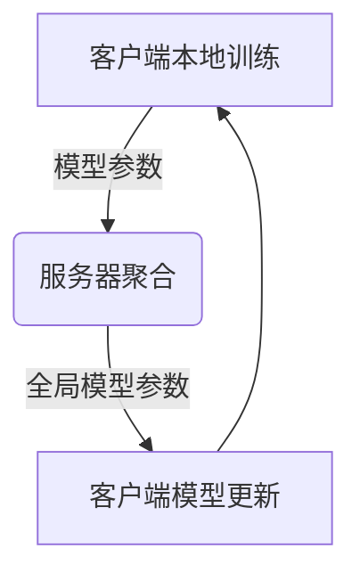

以下是根据给定要求撰写的技术博客文章正文:

# 基于联邦学习的声纹识别研究

## 1. 背景介绍

### 1.1 问题的由来

在当今信息时代,语音识别技术在各个领域得到了广泛应用,如智能助手、语音控制系统等。然而,传统的语音识别系统需要将用户的语音数据集中存储和处理,这存在一些隐私和安全风险。此外,由于数据孤岛问题,单个机构难以获得足够的训练数据,从而影响模型的准确性。

### 1.2 研究现状  

为了解决上述问题,联邦学习(Federated Learning)应运而生。联邦学习是一种分布式机器学习范式,它允许多个客户端在不共享原始数据的情况下协同训练模型。每个客户端在本地使用自己的数据训练模型,然后将模型参数上传到服务器,服务器聚合所有客户端的模型参数并更新全局模型。通过这种方式,联邦学习能够保护用户隐私,同时利用多个数据源提高模型性能。

### 1.3 研究意义

声纹识别是一种基于语音的生物识别技术,它可以通过分析说话人的声音特征来识别其身份。声纹识别在安全认证、犯罪侦查等领域有着广泛应用前景。然而,传统的集中式声纹识别系统存在隐私泄露风险,同时受到数据孤岛问题的影响。将联邦学习应用于声纹识别有望解决这些问题,提高模型性能并保护用户隐私。

### 1.4 本文结构

本文首先介绍联邦学习和声纹识别的基本概念,然后详细阐述基于联邦学习的声纹识别算法原理、数学模型及实现细节。接下来,我们将探讨该技术的实际应用场景、相关工具和资源,最后总结研究成果并展望未来发展趋势和挑战。

## 2. 核心概念与联系

联邦学习(Federated Learning)是一种分布式机器学习范式,它允许多个客户端在不共享原始数据的情况下协同训练模型。每个客户端在本地使用自己的数据训练模型,然后将模型参数上传到服务器,服务器聚合所有客户端的模型参数并更新全局模型。通过这种方式,联邦学习能够保护用户隐私,同时利用多个数据源提高模型性能。

声纹识别(Speaker Recognition)是一种基于语音的生物识别技术,它可以通过分析说话人的声音特征来识别其身份。声纹识别主要包括两个任务:说话人识别(Speaker Identification)和说话人验证(Speaker Verification)。说话人识别旨在从已知的说话人集合中确定说话人的身份,而说话人验证则是验证说话人的声音是否与已知的声纹模板匹配。

将联邦学习应用于声纹识别可以解决传统集中式系统存在的隐私和数据孤岛问题。每个客户端(如智能手机或智能音箱)都可以在本地训练自己的声纹模型,而无需将原始语音数据上传到服务器。服务器只需要聚合所有客户端的模型参数,从而获得更准确的全局声纹模型。这种分布式训练方式能够保护用户隐私,同时利用多个数据源提高模型性能。

## 3. 核心算法原理 & 具体操作步骤

### 3.1 算法原理概述

基于联邦学习的声纹识别算法主要包括以下几个步骤:

1. 客户端本地训练: 每个客户端使用自己的语音数据在本地训练一个声纹模型。
2. 模型参数上传: 客户端将本地训练得到的模型参数上传到服务器。
3. 模型参数聚合: 服务器收集所有客户端上传的模型参数,并使用联邦平均(FedAvg)算法或其他聚合策略计算出新的全局模型参数。
4. 全局模型下发: 服务器将聚合后的全局模型参数下发给每个客户端。
5. 本地模型更新: 客户端使用新的全局模型参数更新自己的本地声纹模型。
6. 重复上述过程,直到模型收敛或达到预设的迭代次数。

该算法的核心思想是将模型训练过程分散到多个客户端,每个客户端只需要使用自己的数据训练模型,而无需共享原始数据。通过在服务器端聚合所有客户端的模型参数,可以获得更准确的全局模型,同时保护了用户隐私。

### 3.2 算法步骤详解

1. **客户端本地训练**

每个客户端使用自己的语音数据集在本地训练一个声纹模型。常用的模型包括基于深度神经网络的模型(如卷积神经网络、循环神经网络等)和基于统计模型的方法(如高斯混合模型、支持向量机等)。

2. **模型参数上传**

客户端将本地训练得到的模型参数上传到服务器。上传的参数通常是模型的权重和偏置等,而不包含原始语音数据。

3. **模型参数聚合**

服务器收集所有客户端上传的模型参数,并使用联邦平均(FedAvg)算法或其他聚合策略计算出新的全局模型参数。

联邦平均算法的具体步骤如下:

(1) 服务器随机选择一部分客户端参与当前轮次的训练。
(2) 选中的客户端在本地使用自己的数据训练模型,并将更新后的模型参数上传到服务器。
(3) 服务器计算所有上传模型参数的加权平均,得到新的全局模型参数。

$$
w^{t+1} = \sum_{k=1}^{m} \frac{n_k}{n} w_k^{t+1}
$$

其中 $w^{t+1}$ 是新的全局模型参数, $m$ 是参与训练的客户端数量, $n_k$ 是第 $k$ 个客户端的数据量, $n$ 是所有参与客户端的总数据量, $w_k^{t+1}$ 是第 $k$ 个客户端上传的新模型参数。

4. **全局模型下发**

服务器将聚合后的全局模型参数下发给每个客户端。

5. **本地模型更新**

客户端使用新的全局模型参数更新自己的本地声纹模型。

6. **迭代训练**

重复上述过程,直到模型收敛或达到预设的迭代次数。

### 3.3 算法优缺点

**优点:**

- 保护用户隐私: 原始语音数据不会离开客户端,只有模型参数在客户端和服务器之间传输。
- 利用多个数据源: 通过聚合多个客户端的模型参数,可以获得更准确的全局模型。
- 解决数据孤岛问题: 即使单个客户端的数据量有限,也可以通过联邦学习提高模型性能。
- 降低通信开销: 只需要传输模型参数,而不是原始数据,从而降低了通信开销。

**缺点:**

- 收敛速度较慢: 由于需要在多个客户端之间传输模型参数,收敛速度可能比集中式训练慢。
- 客户端异构性: 不同客户端的计算能力、网络条件等可能存在差异,影响训练效率。
- 隐私攻击风险:虽然原始数据不会离开客户端,但是模型参数仍有可能泄露一些隐私信息。
- 通信瓶颈:当客户端数量很大时,服务器与客户端之间的通信可能会成为瓶颈。

### 3.4 算法应用领域

基于联邦学习的声纹识别算法可以应用于以下领域:

- 智能助手: 如Siri、Alexa等语音助手可以使用该算法进行说话人识别和验证,提高语音交互的安全性和个性化体验。
- 移动支付: 通过声纹识别技术,用户可以使用语音进行身份验证,实现更便捷的移动支付。
- 犯罪侦查: 警方可以使用该算法对嫌疑人的语音进行比对,辅助犯罪侦查。
- 远程教育: 在线课程可以通过声纹识别技术进行考勤和身份验证。
- 呼叫中心: 呼叫中心可以使用声纹识别技术自动识别客户身份,提高服务效率。

## 4. 数学模型和公式 & 详细讲解 & 举例说明

### 4.1 数学模型构建

声纹识别的核心是从语音信号中提取说话人的声学特征,然后基于这些特征构建声纹模型。常用的声学特征包括mel频率倒谱系数(MFCC)、线性预测倒谱系数(LPCC)、相对谱传递(RASTA)等。

假设我们使用MFCC作为声学特征,对于一个语音样本 $x$,我们可以提取出一个 $D$ 维的MFCC特征向量 $\boldsymbol{o}=\left(o_{1}, o_{2}, \ldots, o_{D}\right)^{\top}$。

为了建模说话人的声纹特征,我们可以使用高斯混合模型(GMM)。GMM假设观测数据服从多个高斯分布的混合,每个高斯分布代表一个声纹子状态。

对于 $M$ 个混合成分的GMM,其概率密度函数为:

$$
p(\boldsymbol{o} \mid \lambda)=\sum_{m=1}^{M} w_{m} \mathcal{N}\left(\boldsymbol{o} \mid \boldsymbol{\mu}_{m}, \boldsymbol{\Sigma}_{m}\right)
$$

其中 $\lambda=\left\{w_{m}, \boldsymbol{\mu}_{m}, \boldsymbol{\Sigma}_{m}\right\}_{m=1}^{M}$ 是GMM的参数集合, $w_{m}$ 是第 $m$ 个混合成分的权重, $\mathcal{N}\left(\boldsymbol{o} \mid \boldsymbol{\mu}_{m}, \boldsymbol{\Sigma}_{m}\right)$ 是 $D$ 维高斯分布的概率密度函数:

$$
\mathcal{N}\left(\boldsymbol{o} \mid \boldsymbol{\mu}_{m}, \boldsymbol{\Sigma}_{m}\right)=\frac{1}{(2 \pi)^{D / 2}\left|\boldsymbol{\Sigma}_{m}\right|^{1 / 2}} \exp \left\{-\frac{1}{2}\left(\boldsymbol{o}-\boldsymbol{\mu}_{m}\right)^{\top} \boldsymbol{\Sigma}_{m}^{-1}\left(\boldsymbol{o}-\boldsymbol{\mu}_{m}\right)\right\}
$$

其中 $\boldsymbol{\mu}_{m}$ 和 $\boldsymbol{\Sigma}_{m}$ 分别是第 $m$ 个混合成分的均值向量和协方差矩阵。

在训练阶段,我们可以使用期望最大化(EM)算法来估计GMM的参数 $\lambda$,从而得到说话人的声纹模型。在测试阶段,我们可以计算测试语音样本在该声纹模型下的对数似然概率,并与其他说话人的声纹模型进行比较,从而实现说话人识别或验证。

### 4.2 公式推导过程

我们以GMM的参数估计为例,推导EM算法在该问题中的具体形式。

假设我们有 $N$ 个观测数据 $\boldsymbol{O}=\left\{\boldsymbol{o}_{1}, \boldsymbol{o}_{2}, \ldots, \boldsymbol{o}_{N}\right\}$,目标是找到最大化观测数据对数似然的GMM参数 $\lambda^{*}$:

$$
\lambda^{*}=\arg \max _{\lambda} \log p(\boldsymbol{O} \mid \lambda)=\arg \max _{\lambda} \sum_{n=1}^{N} \log p\left(\boldsymbol{o}_{n} \mid \lambda\right)
$$

由于对数似然函数存在隐变量(即每个观测数据所属的混合成分),我们引入隐变量 $\boldsymbol{z}_{n}=\left(z_{n 1}, z_{n 2}, \l