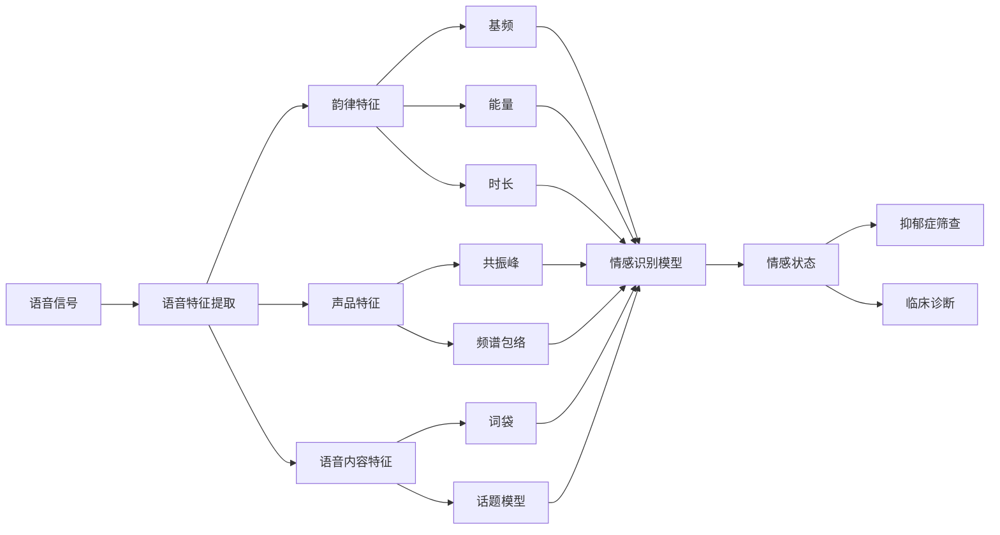

# 基于语音信号的抑郁症识别模型设计与应用

关键词：抑郁症识别、语音信号处理、机器学习、深度学习、情感计算

## 1. 背景介绍
### 1.1 问题的由来
抑郁症是当今社会面临的重大公共卫生问题之一。据世界卫生组织统计,全球约有3.5亿人患有抑郁症,给个人、家庭和社会带来沉重负担。传统的抑郁症诊断方法主要依赖医生的临床访谈和心理测量,存在主观性强、耗时长等缺点。因此,迫切需要开发客观、高效、便捷的抑郁症筛查和诊断辅助工具。
### 1.2 研究现状
近年来,以语音为载体的情感计算和心理健康评估成为人工智能领域的研究热点。语音作为人类情感表达的重要方式,蕴含着丰富的心理和生理信息。大量研究表明,抑郁症患者的语音在韵律、共振峰、基频等声学特征上存在显著异常。利用语音信号进行抑郁症识别具有无创、低成本、易获取等优势,在临床辅助诊断中显示出良好应用前景。目前,基于语音的抑郁症识别主要采用传统机器学习和深度学习两类方法。传统机器学习方法如支持向量机、随机森林等,在小样本数据上表现良好,但特征工程复杂,泛化能力有限。深度学习方法如卷积神经网络、长短时记忆网络等,可自动提取高层特征,但需要大量标注数据和计算资源。因此,如何构建鲁棒、高效、可解释的语音抑郁症识别模型,仍是亟待解决的难题。
### 1.3 研究意义 
本文旨在探索语音信号在抑郁症识别中的应用,设计一种融合传统机器学习和深度学习优势的混合模型,提升抑郁症筛查和诊断的智能化水平。一方面,该研究有助于揭示抑郁症患者语音的病理学机制,加深对语音-情感-认知关联的理解。另一方面,基于语音的抑郁症辅助诊断系统可嵌入移动终端,实现便捷、及时的心理健康初筛,缓解医疗资源紧张,促进大众心理健康。
### 1.4 本文结构
本文后续章节安排如下:第2章介绍语音情感识别的基本概念和理论基础。第3章详述语音抑郁症识别的核心算法原理和实现步骤。第4章建立语音-抑郁症数学模型,推导相关公式,并举例说明。第5章给出算法的代码实现,展示实验结果。第6章讨论该技术的实际应用场景。第7章推荐相关学习资源和开发工具。第8章总结全文,展望未来挑战和发展方向。

## 2. 核心概念与联系
语音情感识别是一种利用计算机自动分析和识别说话人情感状态的技术。其核心是提取语音信号中蕴含的情感特征,并构建映射模型将特征转化为离散或连续的情感标签。语音情感特征可分为韵律特征、声品特征和语音内容特征三类。韵律特征反映语音的时域节奏和变化趋势,如基频、能量、时长等。声品特征刻画语音的频域属性,如共振峰、频谱包络等。语音内容特征表示语义和语法信息,如词袋、话题模型等。

抑郁症是一种以显著而持久的心境低落为主要临床特征的情感性精神障碍。抑郁症患者常表现出情绪、认知、行为、生理等多方面症状,如悲伤、绝望、自责、兴趣丧失、注意力下降、睡眠紊乱等。抑郁症的病因涉及遗传、神经生物学、心理应激等多重因素,语音异常被认为是重要的生物学标记之一。

语音情感识别为抑郁症诊断提供了新思路。一方面,抑郁症患者的情感表达能力下降,语音情感特征可作为抑郁症筛查的客观指标。另一方面,语音作为认知过程的外在表现,其异常模式可反映抑郁症的神经心理机制。因此,语音情感识别有望成为连接抑郁症临床表型和内在病理的桥梁,实现精神疾病的外周生物标记和辅助诊断。

## 3. 核心算法原理 & 具体操作步骤
### 3.1 算法原理概述
本文采用一种融合传统机器学习和深度学习的混合模型,称为支持向量机-长短时记忆网络(SVM-LSTM)。该模型由两个子模块组成:特征提取模块和情感识别模块。特征提取模块先利用OpenSMILE工具提取语音的低层描述符,再通过统计函数映射为utterance-level特征向量。情感识别模块采用LSTM网络建模语音的时序依赖,并在最后一个时间步引入注意力机制,赋予不同特征动态权重。最后,将LSTM输出送入SVM分类器,实现抑郁症和健康状态的二分类判别。
### 3.2 算法步骤详解
1) 语音预处理:使用Praat软件对原始语音进行去噪、端点检测、分帧等预处理,提高信噪比,消除无效段。
2) 特征提取:调用OpenSMILE特征提取器,采用eGeMAPS特征集,提取语音帧级别的低层描述符(LLD),包括频谱、能量、声品等共23个特征。
3) 特征映射:对帧级LLD进行统计泛函映射,得到utterance-level特征,包括均值、标准差、百分位数等。
4) 特征归一化:采用Z-score方法对特征进行归一化,消除量纲影响,加速模型收敛。
5) LSTM建模:将utterance-level特征输入LSTM网络,设置隐藏层维度为128,学习率0.001,优化器为Adam。
6) 注意力机制:在LSTM最后一个时间步引入Attention层,通过加权求和的方式聚合高层特征。
7) SVM分类:将注意力层输出送入SVM分类器,采用RBF核函数,惩罚系数C=1.0,gamma参数自适应。
8) 模型训练:采用5折交叉验证方法训练SVM-LSTM模型,损失函数为交叉熵,评价指标为准确率、精确率、召回率、F1值。
9) 模型推理:使用训练好的模型对新的语音样本进行抑郁症风险预测,提供概率值和二分类结果。
### 3.3 算法优缺点
优点:
- 融合了语音信号的局部和全局特征,捕捉多尺度、多域信息。
- 引入注意力机制,自适应地关注不同特征,增强模型的可解释性。
- 利用LSTM的时序建模能力,挖掘语音情感的动态演化规律。
- 采用SVM作为后端分类器,在小样本场景下鲁棒性更强。

缺点:
- 对数据质量要求较高,语音噪声、文本错误等因素影响识别性能。
- 模型复杂度高,训练推理耗时长,不利于移动端部署。
- 缺乏个性化诊断,难以考虑患者的人口学和临床背景信息。
- 算法泛化能力有待验证,模型迁移和域自适应仍是难点。
### 3.4 算法应用领域
- 临床辅助诊断:为精神科医生提供参考,缩短诊断时间,提高诊断客观性。
- 心理健康筛查:嵌入心理咨询APP,实现抑郁症的早期预警和风险评估。
- 远程医疗监测:对偏远地区患者进行远程语音采集,实现抑郁症的追踪和管理。
- 药物疗效评价:通过对比用药前后的语音特征变化,量化评价抗抑郁药物疗效。

## 4. 数学模型和公式 & 详细讲解 & 举例说明 
### 4.1 数学模型构建
设语音信号为$s(t)$,其短时傅里叶变换为:
$$
S(f,t)=\int_{-\infty}^{\infty}s(\tau)w(t-\tau)e^{-j2\pi f\tau}d\tau
$$
其中$w(t)$为窗函数,常取Hamming窗:
$$
w(n)=0.54-0.46\cos(\frac{2\pi n}{N-1}),0\leq n \leq N-1
$$
对$S(f,t)$取模平方得到语音的功率谱:
$$
P(f,t)=|S(f,t)|^2
$$
对功率谱$P(f,t)$进行梅尔滤波器组卷积,得到梅尔频率倒谱系数(MFCC):
$$
c(n)=\sum_{k=1}^{K}[\log\sum_{f=0}^{F-1}P(f,t)H_k(f)]\cos[\frac{\pi n(k-0.5)}{K}]
$$
其中$H_k(f)$为第$k$个三角梅尔滤波器的频率响应。

对MFCC进行一阶差分,得到$\Delta$MFCC:
$$
\Delta c(n)=\frac{\sum_{i=1}^{L}i[c(n+i)-c(n-i)]}{2\sum_{i=1}^{L}i^2}
$$

设第$t$个utterance-level特征向量为$x_t$,则LSTM的前向传播公式为:
$$
f_t=\sigma(W_f\cdot[h_{t-1},x_t]+b_f)
$$
$$
i_t=\sigma(W_i\cdot[h_{t-1},x_t]+b_i)
$$
$$
\tilde{C}_t=\tanh(W_C\cdot[h_{t-1},x_t]+b_C)
$$
$$
C_t=f_t*C_{t-1}+i_t*\tilde{C}_t
$$
$$
o_t=\sigma(W_o\cdot[h_{t-1},x_t]+b_o)
$$
$$
h_t=o_t*\tanh(C_t)
$$
其中$f_t,i_t,o_t$分别为遗忘门、输入门、输出门,$C_t$为细胞状态,$\sigma$为sigmoid激活函数。

在最后一个时间步$T$引入注意力机制,令$h_T$为查询向量Query,$h_1,\dots,h_{T-1}$为键值向量Key和Value,则注意力分数$\alpha$为:
$$
\alpha_i=\frac{\exp(h_T^\top h_i)}{\sum_{j=1}^{T-1}\exp(h_T^\top h_j)}
$$
注意力向量$v$为加权求和:
$$
v=\sum_{i=1}^{T-1}\alpha_ih_i
$$

最后,将$v$输入SVM进行分类,优化目标为:
$$
\min_{w,b,\xi}\frac{1}{2}w^\top w+C\sum_{i=1}^{N}\xi_i
$$
$$
s.t. y_i(w^\top\phi(v_i)+b)\geq1-\xi_i, \xi_i\geq0
$$
其中$w$为权重向量,$b$为偏置项,$\xi$为松弛变量,$\phi$为核函数,$C$为惩罚系数。
### 4.2 公式推导过程
1) MFCC公式推导:
   - 对语音信号进行短时傅里叶变换,得到频谱。
   - 取频谱模平方,得到功率谱。
   - 将功率谱通过梅尔滤波器组,模拟人耳的听觉特性。
   - 取对数,得到梅尔频谱。
   - 对梅尔频谱进行离散余弦变换,得到MFCC。
2) LSTM公式推导:
   - 遗忘门