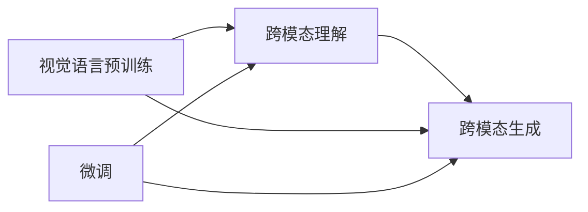

# 多模态大模型：技术原理与实战 国内多模态大模型介绍

关键词：多模态大模型、跨模态理解、跨模态生成、预训练、微调、视觉语言模型、文本到图像生成、视觉问答

## 1. 背景介绍
### 1.1 问题的由来
随着人工智能技术的快速发展，单模态的语言模型和视觉模型已经取得了显著的进展。然而，现实世界中的信息往往是多模态的，包含文本、图像、音频、视频等不同形式的数据。如何让机器像人一样理解和生成多模态信息，是当前人工智能领域的一个重要挑战。

### 1.2 研究现状
近年来，多模态大模型的研究受到了广泛关注。国外的代表性工作包括OpenAI的DALL-E、Google的Imagen、DeepMind的Flamingo等。这些模型展示了在跨模态理解和生成方面的强大能力。国内也涌现出一批优秀的多模态大模型，如百度的文心一言、华为的盘古等，在多模态任务上取得了不俗的表现。

### 1.3 研究意义
多模态大模型的研究具有重要的理论和实践意义。从理论上讲，它有助于我们深入理解人类的认知机制，探索知识在不同模态间的表征和转换。从实践上讲，多模态大模型可以应用于智能搜索、智能问答、内容创作等多个领域，极大地提升人机交互的体验和效率。

### 1.4 本文结构
本文将围绕多模态大模型的技术原理和实战应用展开讨论。首先介绍多模态大模型的核心概念和关键技术，然后重点阐述其核心算法原理和数学模型。接着通过代码实例和详细解释，展示如何实现一个多模态大模型。最后总结多模态大模型的发展趋势和面临的挑战，并提供相关的学习资源和工具推荐。

## 2. 核心概念与联系
多模态大模型涉及几个核心概念：
- 跨模态理解：让机器理解不同模态数据所表达的语义信息，如文本描述的图像内容。
- 跨模态生成：让机器根据某一模态的输入信息生成另一模态的输出，如根据文本生成图像。
- 视觉语言预训练：在大规模文本-图像对数据上进行预训练，学习不同模态的通用表征。
- 微调：在特定任务的小样本数据上微调预训练模型，快速适应新任务。

这些概念环环相扣，共同构成了多模态大模型的技术框架。



## 3. 核心算法原理 & 具体操作步骤
### 3.1 算法原理概述
多模态大模型的核心算法主要包括：
1. 视觉语言预训练：使用对比学习或掩码语言建模等方法，在大规模文本-图像对数据上进行预训练，学习不同模态数据的对齐表征。
2. 跨模态注意力机制：通过注意力机制实现不同模态特征的交互融合，让模型能够捕捉模态间的对应关系。
3. 自回归生成：使用自回归模型（如Transformer）进行跨模态生成，根据源模态信息自回归地生成目标模态的输出序列。

### 3.2 算法步骤详解
以视觉语言预训练为例，具体步骤如下：
1. 构建大规模文本-图像对数据集，每个样本包含一张图像和对应的文本描述。
2. 对图像使用CNN进行特征提取，对文本使用Transformer进行编码。
3. 通过对比学习目标函数（如InfoNCE），最大化正样本（匹配的图文对）的相似度，最小化负样本的相似度。
4. 重复步骤3直到模型收敛，得到预训练的视觉语言表征模型。

### 3.3 算法优缺点
- 优点：
  - 通过预训练学习通用的跨模态表征，可以更好地理解和生成多模态信息。
  - 预训练模型可以应用于各种下游任务，具有较好的迁移性和泛化性。
- 缺点：  
  - 预训练需要大规模高质量的数据，对计算资源要求较高。
  - 不同模态信息的对齐和融合仍然是一个挑战性问题。

### 3.4 算法应用领域
多模态大模型可以应用于以下领域：
- 智能搜索：根据用户的文本查询检索相关的图像、视频等多模态信息。
- 智能问答：回答涉及文本、图像等多模态信息的复杂问题。
- 内容创作：根据文本描述自动生成图像、视频等多模态内容。
- 机器翻译：实现文本-图像、语音-手语等跨模态翻译。

## 4. 数学模型和公式 & 详细讲解 & 举例说明
### 4.1 数学模型构建
以视觉语言预训练中的对比学习为例，我们构建如下数学模型：

给定一批大小为$N$的图文对样本$\{(v_i, t_i)\}_{i=1}^N$，其中$v_i$表示第$i$个图像，$t_i$表示第$i$个文本。我们的目标是学习一个视觉编码器$f_v$和一个文本编码器$f_t$，使得匹配的图文对在公共嵌入空间中的表征相似度最大化。

我们定义图文对$(v_i, t_i)$的相似度分数为：

$$s(v_i, t_i) = \frac{\exp(f_v(v_i)^T f_t(t_i))}{\sum_{j=1}^N \exp(f_v(v_i)^T f_t(t_j))}$$

其中，$f_v(v_i)$和$f_t(t_i)$分别表示图像$v_i$和文本$t_i$的嵌入表征。分母部分是对所有文本进行归一化，得到相似度的概率分布。

对比学习的目标函数定义为最大化正样本的log似然概率：

$$\mathcal{L} = \sum_{i=1}^N \log s(v_i, t_i)$$

### 4.2 公式推导过程
对目标函数$\mathcal{L}$求梯度，我们可以得到：

$$\nabla_{f_v} \mathcal{L} = \sum_{i=1}^N (f_t(t_i) - \sum_{j=1}^N s(v_i, t_j) f_t(t_j))$$

$$\nabla_{f_t} \mathcal{L} = \sum_{i=1}^N (f_v(v_i) - \sum_{j=1}^N s(v_j, t_i) f_v(v_j))$$

通过梯度下降法更新$f_v$和$f_t$的参数，最终得到预训练的视觉语言表征模型。

### 4.3 案例分析与讲解
我们以一个简单的例子来说明对比学习的过程。假设有3个图文对样本：
- $(v_1, t_1)$: 图像1和文本1
- $(v_2, t_2)$: 图像2和文本2
- $(v_3, t_3)$: 图像3和文本3

对于$(v_1, t_1)$，我们希望最大化以下对数似然概率：

$$\log s(v_1, t_1) = \log \frac{\exp(f_v(v_1)^T f_t(t_1))}{\exp(f_v(v_1)^T f_t(t_1)) + \exp(f_v(v_1)^T f_t(t_2)) + \exp(f_v(v_1)^T f_t(t_3))}$$

直观地说，我们希望图像1与文本1的相似度分数尽可能大，而与其他非匹配文本的相似度分数尽可能小。通过最大化所有正样本的对数似然概率，模型可以学习到匹配的图文对在嵌入空间中更加接近。

### 4.4 常见问题解答
- 问：对比学习中的负样本是如何构建的？
- 答：负样本通常采用batch内其他非匹配的图文对。也就是说，对于一个图像，除了它对应的文本外，batch内其他文本都可以作为负样本。这种做法简单高效，避免了额外的负采样开销。

## 5. 项目实践：代码实例和详细解释说明
### 5.1 开发环境搭建
- Python 3.x
- PyTorch
- Transformers
- CLIP

可以通过以下命令安装所需库：
```bash
pip install torch torchvision transformers clip
```

### 5.2 源代码详细实现
下面是一个简单的视觉语言预训练代码示例：

```python
import torch
import torch.nn as nn
import torch.optim as optim
from transformers import BertModel, BertTokenizer
from clip import clip

# 定义视觉编码器和文本编码器
class ImageEncoder(nn.Module):
    def __init__(self):
        super().__init__()
        self.clip, _ = clip.load('ViT-B/32', device='cuda')
        
    def forward(self, x):
        return self.clip.encode_image(x)

class TextEncoder(nn.Module):
    def __init__(self):
        super().__init__()
        self.bert = BertModel.from_pretrained('bert-base-uncased')
        
    def forward(self, input_ids, attention_mask):
        outputs = self.bert(input_ids, attention_mask=attention_mask)
        return outputs.pooler_output

# 定义对比学习的损失函数
class ContrastiveLoss(nn.Module):
    def __init__(self, temperature=0.07):
        super().__init__()
        self.temperature = temperature
        self.cross_entropy = nn.CrossEntropyLoss()

    def forward(self, image_embeds, text_embeds):
        logits = torch.matmul(image_embeds, text_embeds.T) / self.temperature
        labels = torch.arange(len(logits)).to(logits.device)
        loss_i2t = self.cross_entropy(logits, labels)
        loss_t2i = self.cross_entropy(logits.T, labels)
        return (loss_i2t + loss_t2i) / 2

# 创建模型、优化器和损失函数
image_encoder = ImageEncoder().cuda()
text_encoder = TextEncoder().cuda()
optimizer = optim.Adam(list(image_encoder.parameters()) + list(text_encoder.parameters()), lr=1e-4)
criterion = ContrastiveLoss()

# 训练循环
for epoch in range(num_epochs):
    for images, texts in dataloader:
        images = images.cuda()
        input_ids, attention_mask = tokenizer(texts, padding=True, truncation=True, return_tensors='pt')
        input_ids, attention_mask = input_ids.cuda(), attention_mask.cuda()
        
        image_embeds = image_encoder(images)
        text_embeds = text_encoder(input_ids, attention_mask)
        
        loss = criterion(image_embeds, text_embeds)
        
        optimizer.zero_grad()
        loss.backward()
        optimizer.step()
```

### 5.3 代码解读与分析
- 我们定义了两个编码器：`ImageEncoder`使用CLIP对图像进行特征提取，`TextEncoder`使用BERT对文本进行编码。
- `ContrastiveLoss`是对比学习的损失函数，通过最小化正样本的交叉熵损失来拉近匹配图文对的表征，同时推远非匹配图文对的表征。
- 在训练循环中，我们从数据加载器中获取一批图文对，分别通过图像编码器和文本编码器得到它们的嵌入表征。
- 然后计算对比损失，并通过反向传播和梯度下降来更新模型参数。

### 5.4 运行结果展示
经过训练后，我们可以使用预训练的视觉语言表征模型来进行跨模态检索和生成等任务。例如，给定一个文本描述，我们可以从图像库中检索出与之最相关的图像：

```python
query = "a cat sitting on a chair"
query_embed = text_encoder(tokenizer(query, return_tensors='pt').to(device))
image_embeds = image_encoder(images)
similarities = torch.matmul(query_embed, image_embeds.T)
best_match_idx = similarities.argmax().item()
best_match_image = images[best_match_idx]
```

通过计算文本嵌入与图像嵌入的相似度，我们可以找到与查询文本最匹配的图像。这展示了多模态大模型在跨模态理解和检索方面的强大能力。

## 6. 实际应用场景
多模态大模型可以应用于以下实际场景：
- 电商搜索：用户可以上传商品图片，并通过文本描述来