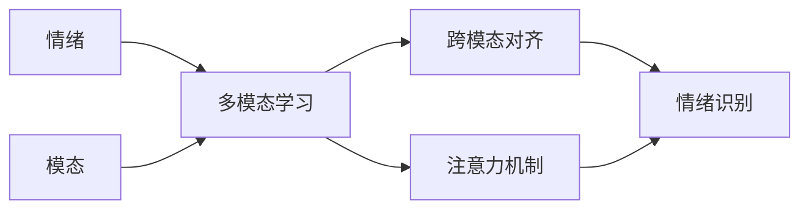

# 多模态大模型：技术原理与实战 多模态大模型在情绪识别领域的应用

## 1. 背景介绍

### 1.1 问题的由来

随着人工智能技术的快速发展,特别是深度学习的兴起,多模态学习成为了当前的研究热点。多模态学习旨在利用不同模态数据(如文本、图像、音频等)之间的互补信息,从而提高模型的性能。近年来,多模态预训练大模型(如CLIP、DALL-E等)在图像-文本跨模态理解任务上取得了显著的进展。这些大模型通过在海量多模态数据上进行预训练,可以学习到丰富的跨模态知识表示。

情绪识别是人机交互、社交媒体分析等领域的重要任务,传统方法主要基于单一模态(如文本)进行情绪分析。然而,随着短视频、直播等富媒体形式的兴起,仅依赖文本信息往往难以准确判断用户情绪。多模态大模型为情绪识别任务带来了新的契机,通过融合文本、语音、表情等多模态信息,有望显著提升情绪识别的性能。

### 1.2 研究现状

多模态情绪识别已有一些初步的研究探索。早期工作主要采用特征级别的多模态融合方法,如将不同模态的特征拼接后输入分类器。近年来,随着注意力机制、图神经网络等技术的发展,一些工作提出了更加精细的多模态交互建模方法。例如,Poria等人提出了一种基于注意力的多模态情感分析模型,通过交叉注意力机制动态地融合不同模态的信息。Shenoy等人利用图卷积网络对多模态数据进行建模,捕捉不同模态节点之间的关联性。

尽管已有工作取得了一定进展,但在以下几个方面仍存在局限性:1)现有方法大多基于特定任务设计,缺乏通用的多模态表示学习范式;2)对于视频等时序多模态数据,现有方法对时序依赖的建模不足;3)缺乏在大规模多模态数据上进行预训练的研究。因此,亟需探索更加强大、通用的多模态大模型,充分挖掘不同模态数据的互补性,学习aligned的跨模态表示,从而提升情绪识别的性能。

### 1.3 研究意义

多模态大模型在情绪识别领域具有重要的研究意义:

1. 提升情绪识别准确率。通过融合文本、语音、表情等多模态信息,挖掘它们之间的互补性,可以更全面、准确地判断用户情绪状态。这对于智能客服、舆情监测等应用场景具有重要价值。

2. 探索通用的多模态学习范式。针对情绪识别任务构建多模态大模型,可以为其他多模态学习任务(如视频问答、图文生成等)提供有益借鉴,推动多模态人工智能的发展。 

3. 丰富情绪计算的研究内容。将多模态大模型引入情绪识别,有助于拓展情绪计算的研究视角,深入理解不同模态在情绪表达中的作用机制,为后续的情感交互提供理论支撑。

4. 促进跨学科交叉融合。情绪识别涉及心理学、认知科学等多个学科,多模态大模型的研究有助于促进人工智能与这些学科的交叉融合,为解释人类情绪提供新的视角。

### 1.4 本文结构

本文将重点探讨多模态大模型在情绪识别领域的技术原理与实战。第2部分介绍情绪识别任务中涉及的核心概念。第3部分详细阐述多模态大模型的核心算法原理与具体操作步骤。第4部分给出多模态情绪识别的数学模型,并结合案例进行详细讲解。第5部分展示项目实践,给出代码实例与详细解释。第6部分分析多模态大模型在情绪识别中的实际应用场景。第7部分推荐相关的学习资源与开发工具。第8部分总结全文,展望未来发展趋势与挑战。第9部分列举一些常见问题解答。

## 2. 核心概念与联系

在多模态情绪识别任务中,涉及以下几个核心概念:

- 情绪(Emotion):指个体对客观事物的态度体验,常见情绪类别包括高兴、悲伤、愤怒、惊讶等。
- 模态(Modality):指信息的表现形式,如文本、语音、视觉等。不同模态蕴含了互补的情绪信息。
- 多模态学习(Multimodal Learning):旨在利用多种模态数据的互补性,学习更加全面、鲁棒的特征表示,提升下游任务性能。
- 跨模态对齐(Cross-modal Alignment):指在共享语义空间中,将不同模态数据映射为aligned的表示向量,使得它们在该空间中距离相近。
- 注意力机制(Attention Mechanism):通过学习权重分配,动态地聚焦于不同模态数据中的关键信息,实现精细化的特征交互融合。

这些概念之间密切相关。多模态学习是实现情绪识别的关键手段,其核心在于学习不同模态数据的跨模态对齐表示。注意力机制则是实现多模态交互的重要技术,可以捕捉模态内和模态间的关联性。下图展示了这些概念之间的联系:

通过多模态学习,将不同模态数据映射到共享语义空间,并利用注意力机制建模它们之间的关联性,最终实现对用户情绪状态的精准识别。

## 3. 核心算法原理 & 具体操作步骤

### 3.1 算法原理概述

本文采用基于Transformer的多模态大模型进行情绪识别。该模型的核心思想是利用自注意力机制学习不同模态数据的跨模态对齐表示,并通过掩码语言建模、对比学习等预训练任务,在大规模多模态语料上进行预训练,从而获得通用的多模态语义理解能力。在下游情绪识别任务中,将不同模态数据输入预训练模型,提取对齐的多模态特征,再通过注意力交互模块进行跨模态融合,最后基于融合特征进行情绪分类。

### 3.2 算法步骤详解

多模态大模型的训练分为两个阶段:预训练阶段和微调阶段。

**预训练阶段**的主要步骤如下:

1. 多模态数据预处理:对文本进行分词、语音进行特征提取(如MFCC)、视觉数据提取帧级特征(如ResNet)等,将不同模态数据转化为统一的张量形式。

2. 输入嵌入:将每个模态的输入数据映射为低维稠密向量,并加入位置编码以引入序列信息。文本嵌入$\mathbf{E}_t$、语音嵌入$\mathbf{E}_a$、视觉嵌入$\mathbf{E}_v$分别计算如下:

$$
\mathbf{E}_t=\mathbf{W}_t\mathbf{X}_t+\mathbf{P}_t
$$
$$
\mathbf{E}_a=\mathbf{W}_a\mathbf{X}_a+\mathbf{P}_a
$$
$$
\mathbf{E}_v=\mathbf{W}_v\mathbf{X}_v+\mathbf{P}_v
$$

其中,$\mathbf{X}_t,\mathbf{X}_a,\mathbf{X}_v$分别表示文本、语音、视觉的输入特征,$\mathbf{W}$为模态特定的嵌入矩阵,$\mathbf{P}$为对应的位置编码。

3. 多模态Transformer编码:将不同模态的嵌入向量输入Transformer编码器,通过自注意力机制建模模态内和模态间的长程依赖,学习不同模态的对齐表示。

4. 预训练任务:设计掩码语言建模(MLM)、对比学习(CL)等自监督任务,利用海量无标注多模态语料进行预训练。MLM任务通过随机掩码文本tokens,预测被掩码的tokens;CL任务则通过最大化正样本对的相似度,最小化负样本对的相似度,学习aligned的跨模态表示。预训练损失函数如下:

$$
\mathcal{L}=\mathcal{L}_{MLM}+\mathcal{L}_{CL}
$$

其中,$\mathcal{L}_{MLM}$为掩码语言建模损失,$\mathcal{L}_{CL}$为对比学习损失。

**微调阶段**的主要步骤如下:  

1. 多模态特征提取:将不同模态数据输入预训练模型,提取对齐的多模态特征表示$\mathbf{H}_t,\mathbf{H}_a,\mathbf{H}_v$。

2. 注意力交互:通过注意力机制建模不同模态特征之间的交互,动态地聚焦于关键情绪信息。令$\mathbf{Q}_t,\mathbf{K}_a,\mathbf{V}_a$分别表示文本特征的查询向量、语音特征的键向量和值向量,则文本到语音的注意力权重$\mathbf{A}_{t\rightarrow a}$计算如下:

$$
\mathbf{A}_{t\rightarrow a}=\text{softmax}(\frac{\mathbf{Q}_t\mathbf{K}_a^T}{\sqrt{d}})
$$

其中,$d$为注意力头的维度。类似地可以计算语音到文本、文本到视觉等注意力权重。

3. 多模态特征融合:基于注意力权重对不同模态特征进行加权求和,得到融合后的多模态特征表示$\mathbf{H}_f$:

$$
\mathbf{H}_f=\mathbf{A}_{t\rightarrow a}\mathbf{V}_a+\mathbf{A}_{t\rightarrow v}\mathbf{V}_v+\mathbf{A}_{a\rightarrow t}\mathbf{V}_t+\mathbf{A}_{a\rightarrow v}\mathbf{V}_v+\mathbf{A}_{v\rightarrow t}\mathbf{V}_t+\mathbf{A}_{v\rightarrow a}\mathbf{V}_a
$$

4. 情绪分类:在融合特征之上接入全连接层和Softmax层,进行情绪类别的预测:

$$
\hat{\mathbf{y}}=\text{softmax}(\mathbf{W}_c\mathbf{H}_f+\mathbf{b}_c)
$$

其中,$\hat{\mathbf{y}}$为情绪类别的预测概率分布。

5. 模型训练:基于交叉熵损失函数,利用标注数据对模型进行微调,不断更新模型参数以提升情绪识别性能。微调阶段的损失函数为:

$$
\mathcal{L}_{emo}=-\sum_{i=1}^N\sum_{j=1}^C y_{ij}\log \hat{y}_{ij}
$$

其中,$N$为训练样本数,$C$为情绪类别数,$y_{ij}$为第$i$个样本的第$j$个类别的真实标签,$\hat{y}_{ij}$为模型预测的概率值。

### 3.3 算法优缺点

**优点:**

1. 通过在大规模多模态语料上预训练,可以学习到通用的跨模态语义表示,具有更强的泛化能力。
2. 利用注意力机制动态地建模不同模态数据之间的关联性,可以更好地挖掘情绪信息。 
3. 端到端的训练方式,避免了繁琐的特征工程,降低了人工成本。

**缺点:**

1. 模型参数量大,训练和推理成本较高,对计算资源要求较高。
2. 对于训练数据的质量和规模要求较高,否则容易出现过拟合等问题。
3. 模型可解释性较差,难以直观地解释模型的决策过程。

### 3.4 算法应用领域

多模态情绪识别算法可应用于以下领域:

1. 智能客服:通过分析用户的文本、语音、表情等信息,实时判断用户情绪,提供个性化服务。
2. 社交媒体分析:对社交平台上的