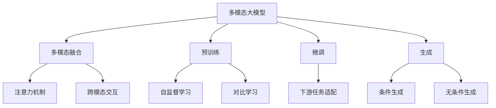
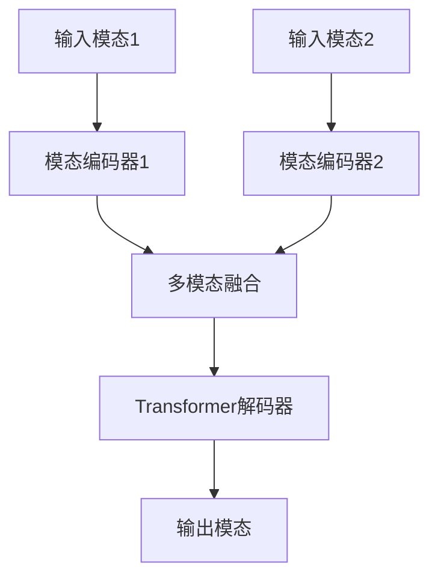

# 多模态大模型：技术原理与实战 方法论介绍

## 1. 背景介绍

### 1.1 问题的由来

在过去的几年中，自然语言处理(NLP)和计算机视觉(CV)等领域取得了长足的进步。然而,这些进展主要集中在单一模态(如文本或图像)上。随着人工智能系统在现实世界中的广泛应用,处理多种模态数据(如文本、图像、视频和音频等)的需求日益增长。传统的单模态模型无法很好地捕捉和利用不同模态之间的相关性,因此无法充分利用多模态数据中蕴含的丰富信息。

为了解决这一问题,多模态大模型(Multimodal Large Models)应运而生。多模态大模型旨在通过统一的架构同时处理多种模态数据,充分利用不同模态之间的相关性,提高模型的理解和生成能力。

### 1.2 研究现状

近年来,多模态大模型受到了广泛关注,并取得了一些重要进展。代表性工作包括:

- **BERT**:最早的多模态预训练模型之一,能够同时处理文本和图像数据。
- **ViLBERT**:在BERT的基础上,引入了更加复杂的视觉特征提取模块,提高了对图像的理解能力。
- **UNITER**:采用了全新的预训练任务和损失函数,在多个下游任务上取得了优异的性能。
- **OSCAR**:通过对象标签增强了对图像的理解,并引入了新的预训练目标来提高生成质量。
- **Flamingo**:由DeepMind提出的大规模视觉语言模型,在多个任务上展现出了出色的能力。

尽管取得了一些进展,但现有的多模态大模型仍然存在一些局限性,例如:

1. 缺乏对更多模态(如视频、音频等)的支持。
2. 模型规模和计算资源需求较大,难以广泛应用。
3. 生成质量和一致性有待进一步提高。
4. 缺乏对模型内在机制的深入理解和解释。

### 1.3 研究意义

多模态大模型具有重要的理论意义和应用价值:

- **理论意义**:多模态大模型有助于我们深入理解不同模态之间的关联性,探索更加通用和强大的人工智能架构。
- **应用价值**:多模态大模型可以支持诸多实际应用场景,如智能助手、内容创作、教育、医疗等领域。

因此,研究和发展多模态大模型技术,不仅可以推动人工智能理论的发展,也有望为各行业带来革命性的变革。

### 1.4 本文结构

本文将全面介绍多模态大模型的技术原理和实战方法,内容安排如下:

1. **背景介绍**:阐述多模态大模型的由来、研究现状和意义。
2. **核心概念与联系**:解释多模态大模型的核心概念,并分析不同概念之间的联系。
3. **核心算法原理与具体操作步骤**:深入探讨多模态大模型的核心算法原理,并详细介绍算法的具体操作步骤。
4. **数学模型和公式详细讲解与举例说明**:构建多模态大模型的数学模型,推导公式,并通过案例分析加深理解。
5. **项目实践:代码实例和详细解释说明**:提供完整的代码实例,并对关键部分进行详细解释和说明。
6. **实际应用场景**:介绍多模态大模型在不同领域的实际应用场景,并展望未来的发展方向。
7. **工具和资源推荐**:推荐相关的学习资源、开发工具、论文等资源,方便读者进一步学习和研究。
8. **总结:未来发展趋势与挑战**:总结多模态大模型的研究成果,分析未来的发展趋势和面临的挑战,并对未来的研究方向进行展望。
9. **附录:常见问题与解答**:解答多模态大模型相关的常见问题,帮助读者更好地理解和掌握这一领域的知识。

## 2. 核心概念与联系

多模态大模型是一种统一的架构,旨在同时处理多种模态数据,如文本、图像、视频和音频等。它包含以下几个核心概念:

1. **多模态融合**:将不同模态的数据融合到统一的表示空间中,捕捉不同模态之间的相关性和交互。这通常涉及注意力机制和跨模态交互等技术。

2. **预训练**:在大规模多模态数据集上进行预训练,使模型学习到通用的表示能力。常用的预训练技术包括自监督学习和对比学习等。

3. **微调**:在特定下游任务上对预训练模型进行微调,使其适应具体的任务需求。这通常需要对模型进行一定程度的修改和调整。

4. **生成**:根据输入的条件(如文本或图像),生成相应的多模态输出。生成可以是条件生成(如根据文本生成图像),也可以是无条件生成(如生成文本或图像)。

这些核心概念之间存在密切的联系:

- 多模态融合是实现多模态大模型的基础,它将不同模态的数据融合到统一的表示空间中,为后续的预训练、微调和生成奠定了基础。
- 预训练使模型学习到通用的表示能力,为下游任务的微调和生成提供了强大的起点。
- 微调将预训练模型适配到特定的下游任务,提高了模型在该任务上的性能。
- 生成则是多模态大模型的最终目标,通过条件生成或无条件生成,实现多模态数据的理解和生成。

通过有机结合这些核心概念,多模态大模型能够充分利用不同模态之间的相关性,提高数据理解和生成的能力,从而支持更广泛的应用场景。

## 3. 核心算法原理与具体操作步骤

### 3.1 算法原理概述

多模态大模型的核心算法原理主要包括以下几个方面:

1. **多模态融合**:通过注意力机制和跨模态交互,将不同模态的数据融合到统一的表示空间中。
2. **自监督预训练**:在大规模多模态数据集上进行自监督预训练,使模型学习到通用的表示能力。
3. **对比学习**:通过对比学习技术,进一步增强模型对不同模态之间关系的理解。
4. **条件生成**:根据输入的条件(如文本或图像),生成相应的多模态输出。
5. **无条件生成**:无需任何条件输入,直接生成多模态数据,如生成文本或图像。

### 3.2 算法步骤详解

以下是多模态大模型算法的具体操作步骤:

1. **数据预处理**:对输入的多模态数据进行预处理,如文本分词、图像编码等,将其转换为模型可以处理的形式。

2. **模态编码**:使用特定的编码器(如Transformer编码器)对每种模态的数据进行编码,得到对应的表示向量。

3. **多模态融合**:
   - 使用注意力机制捕捉不同模态之间的相关性,计算注意力权重。
   - 根据注意力权重,将不同模态的表示向量融合到统一的表示空间中。

4. **自监督预训练**:
   - 设计自监督预训练任务,如遮蔽语言模型(Masked Language Modeling)、遮蔽视觉模型(Masked Visual Modeling)等。
   - 在大规模多模态数据集上进行预训练,使模型学习到通用的表示能力。

5. **对比学习**:
   - 构建正样本对(来自同一个数据样本的不同模态表示)和负样本对(来自不同数据样本的模态表示)。
   - 通过对比学习损失函数,使正样本对的表示更加接近,负样本对的表示更加远离,增强模型对不同模态之间关系的理解。

6. **微调**:
   - 针对特定的下游任务,对预训练模型进行微调,使其适应该任务的需求。
   - 根据任务类型,可能需要对模型进行一定程度的修改和调整。

7. **条件生成**:
   - 输入条件(如文本或图像)到模型中。
   - 模型根据条件,生成相应的多模态输出(如根据文本生成图像)。

8. **无条件生成**:
   - 无需任何条件输入,直接让模型生成多模态数据,如生成文本或图像。

9. **输出后处理**:对模型生成的输出进行后处理,如文本解码、图像渲染等,得到最终的多模态输出结果。

### 3.3 算法优缺点

多模态大模型算法具有以下优点:

- 能够同时处理多种模态数据,充分利用不同模态之间的相关性。
- 通过自监督预训练和对比学习,模型可以学习到通用的表示能力,提高了泛化性能。
- 支持条件生成和无条件生成,具有广泛的应用场景。

但同时也存在一些缺点和挑战:

- 模型规模较大,计算资源需求高,训练和推理成本较高。
- 不同模态之间的融合和交互机制还需进一步探索和优化。
- 生成质量和一致性有待进一步提高,尤其是在无条件生成任务中。
- 缺乏对模型内在机制的解释和理解,存在一定的"黑箱"问题。

### 3.4 算法应用领域

多模态大模型算法可以应用于多个领域,包括但不限于:

- **智能助手**:通过多模态交互,提供更加自然和智能的助手服务。
- **内容创作**:根据文本或图像条件,生成相应的多模态内容,如插画、视频等。
- **教育**:生成多模态教学资源,提高教学效率和吸引力。
- **医疗**:辅助医生诊断和治疗,通过多模态数据提高准确性。
- **零售**:提供个性化的产品推荐和购物体验。
- **娱乐**:生成多模态内容,如游戏、动画等,提高用户体验。

随着技术的不断发展,多模态大模型的应用领域将不断扩展,为各行业带来革命性的变革。

## 4. 数学模型和公式详细讲解与举例说明

### 4.1 数学模型构建

多模态大模型的数学模型通常基于Transformer架构,并针对多模态数据进行了相应的扩展和修改。以下是一个典型的多模态Transformer模型架构:

其中:

- **输入模态**:表示输入的多模态数据,如文本、图像等。
- **模态编码器**:对每种模态的数据进行编码,得到对应的表示向量。
- **多模态融合**:使用注意力机制和跨模态交互,将不同模态的表示向量融合到统一的表示空间中。
- **Transformer解码器**:基于融合后的表示,使用Transformer解码器进行进一步的处理和生成。
- **输出模态**:根据任务需求,生成相应的多模态输出。

在这个架构中,多模态融合是关键环节,它决定了模型如何捕捉和利用不同模态之间的相关性。常见的多模态融合方法包括:

1. **简单拼接**:将不同模态的表示向量直接拼接在一起,作为Transformer的输入。
2. **注意力融合**:使用注意力机制计算不同模态之间的注意力权重,并根据权重对表示向量进行加权求和。