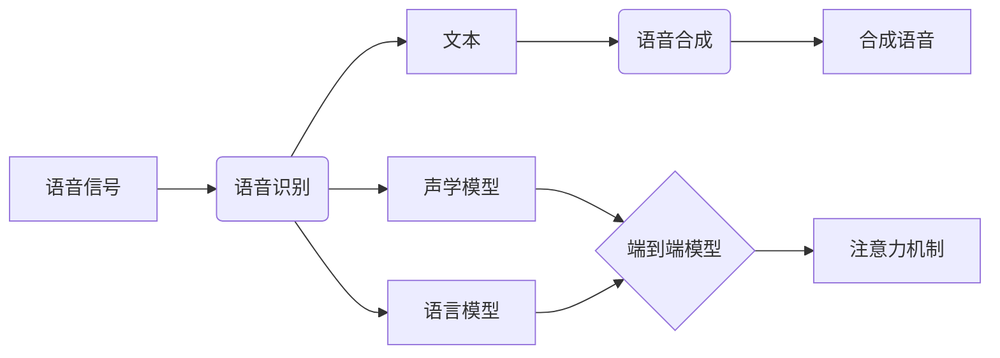

# 多模态大模型：技术原理与实战 语音多模态技术

关键词：多模态、大模型、语音识别、语音合成、语音对话、深度学习、Transformer、预训练

## 1. 背景介绍

### 1.1  问题的由来

随着人工智能技术的快速发展，多模态大模型已经成为了当前学术界和工业界的研究热点。多模态大模型旨在通过融合不同模态的信息，如文本、语音、图像等，来实现更加智能和自然的人机交互。其中，语音多模态技术是多模态大模型的重要分支，它结合了语音识别、语音合成、语音对话等多个技术领域，致力于让机器能够像人一样，通过语音来理解和表达信息。

### 1.2  研究现状

目前，语音多模态技术已经取得了长足的进展。在语音识别方面，基于深度学习的端到端语音识别模型，如 Transformer、Conformer 等，已经在各大语音识别竞赛中取得了领先的性能，识别准确率不断刷新纪录。在语音合成方面，基于 Tacotron、WaveNet 等生成模型的语音合成系统，能够生成接近真人发音质量的合成语音。在语音对话方面，基于 GPT、BERT 等预训练语言模型的对话系统，展现出了优秀的语义理解和对话生成能力。

### 1.3  研究意义

语音多模态技术的研究意义重大。首先，它能够大幅提升人机交互的自然性和便捷性，让机器能够更好地理解人类的语音指令，并作出智能的响应。其次，语音多模态技术在智能客服、智能家居、车载语音助手等领域有广阔的应用前景，能够为人们的生活和工作带来极大的便利。此外，语音多模态技术的研究也将推动人工智能在语音领域的理论创新和技术突破。

### 1.4  本文结构

本文将全面探讨语音多模态技术的原理和实战。第2部分介绍语音多模态技术的核心概念；第3部分重点阐述语音多模态的核心算法原理；第4部分给出相关数学模型和公式推导；第5部分通过代码实例讲解如何实现语音多模态系统；第6部分展望语音多模态技术的应用场景；第7部分推荐语音多模态领域的学习资源；第8部分总结全文并展望未来。

## 2. 核心概念与联系

在语音多模态技术中，有几个核心概念需要理解：

- 语音识别(Speech Recognition)：将语音信号转换为相应的文本。
- 语音合成(Speech Synthesis)：将文本转换为相应的语音信号。
- 语音对话(Spoken Dialogue)：机器通过语音与人进行智能对话。
- 声学模型(Acoustic Model)：建模语音信号的声学特征。
- 语言模型(Language Model)：刻画语言的词汇、语法等特征。
- 端到端(End-to-End)：输入是语音，输出直接是文本，中间没有人工定义的中间表示。
- 注意力机制(Attention Mechanism)：聚焦到输入信息中的重要部分。

这些概念之间有着紧密的联系。语音识别和语音合成是语音对话系统的基础，分别负责语音输入和输出。声学模型和语言模型是传统语音识别的两大支柱，而端到端模型则将二者融为一体。注意力机制被广泛应用于各类语音多模态模型中，赋予模型更强的建模能力。



## 3. 核心算法原理 & 具体操作步骤

### 3.1  算法原理概述

语音多模态技术的核心算法主要包括：

1. 语音识别算法：如 CTC、Attention、Transducer 等。
2. 语音合成算法：如 Tacotron、WaveNet、FastSpeech 等。  
3. 语音对话算法：如 Transformer、GPT、BERT 等。

这些算法大多基于深度学习，利用神经网络强大的特征提取和建模能力，从大规模数据中自动学习语音和语言的内在规律。

### 3.2  算法步骤详解

以语音识别中的 Attention 算法为例，其主要步骤如下：

1. 特征提取：将语音信号转换为特征序列，如 Mel 频谱、MFCC 等。
2. Encoder：使用 CNN 或 Transformer 等对特征序列进行编码。
3. Attention：在 Decoder 的每一步，通过注意力机制计算 Encoder 输出的加权和，作为 Decoder 的输入。
4. Decoder：基于 Attention 的结果和之前的输出，预测当前时刻的文本输出。
5. 损失计算：计算预测文本和真实文本之间的交叉熵损失。
6. 反向传播：基于损失函数，使用梯度下降法更新模型参数。

### 3.3  算法优缺点

Attention 算法的优点包括：

- 可以处理任意长度的输入序列。
- 通过注意力机制，能够自动聚焦到输入的重要部分。
- 端到端训练，不需要人工设计复杂的中间表示。

缺点包括：

- 计算复杂度高，训练和推理速度慢。
- 需要大量的训练数据，对数据质量要求高。
- 模型可解释性差，难以分析内部工作原理。

### 3.4  算法应用领域

语音识别算法广泛应用于语音搜索、语音输入、语音控制等场景。结合语音合成和对话算法，还可以搭建智能语音助手、客服机器人等系统。未来，语音多模态算法有望在更多领域发挥重要作用，如医疗诊断、教育培训、金融服务等。

## 4. 数学模型和公式 & 详细讲解 & 举例说明

### 4.1  数学模型构建

以 Attention 机制为例，其数学模型可以表示为：

- 查询(Query)：$Q = X W_Q$
- 键(Key)：$K = X W_K$
- 值(Value)：$V = X W_V$

其中，$X$ 为输入序列，$W_Q, W_K, W_V$ 为可学习的权重矩阵。

Attention 的计算过程为：

$$Attention(Q,K,V) = softmax(\frac{QK^T}{\sqrt{d_k}})V$$

其中，$d_k$ 为 Query 和 Key 的维度，用于缩放点积结果。

### 4.2  公式推导过程

Attention 公式的推导基于以下假设：

1. Query 和 Key 的相似度决定了 Value 的重要性。
2. 相似度可以用 Query 和 Key 的点积来度量。
3. 点积结果需要除以 $\sqrt{d_k}$ 进行缩放，以避免过大的方差。
4. 使用 Softmax 函数对点积结果进行归一化，得到注意力权重。
5. 注意力权重与 Value 加权求和，得到 Attention 的输出。

### 4.3  案例分析与讲解

假设有一个输入序列 $X=[x_1,x_2,x_3]$，维度为 $d_x$。

首先，计算 Query、Key、Value：

$$Q = X W_Q = [q_1, q_2, q_3], q_i \in \mathbb{R}^{d_k}$$
$$K = X W_K = [k_1, k_2, k_3], k_i \in \mathbb{R}^{d_k}$$
$$V = X W_V = [v_1, v_2, v_3], v_i \in \mathbb{R}^{d_v}$$

然后，计算 Attention：

$$Attention(Q,K,V) = softmax(\frac{QK^T}{\sqrt{d_k}})V$$

$$= softmax(\frac{1}{\sqrt{d_k}}\begin{bmatrix}
q_1k_1^T & q_1k_2^T & q_1k_3^T\\
q_2k_1^T & q_2k_2^T & q_2k_3^T\\
q_3k_1^T & q_3k_2^T & q_3k_3^T
\end{bmatrix}) [v_1, v_2, v_3]$$

$$= \begin{bmatrix}
\alpha_{11} & \alpha_{12} & \alpha_{13}\\
\alpha_{21} & \alpha_{22} & \alpha_{23}\\
\alpha_{31} & \alpha_{32} & \alpha_{33}
\end{bmatrix} [v_1, v_2, v_3]$$

$$= [\sum_{j=1}^3 \alpha_{1j}v_j, \sum_{j=1}^3 \alpha_{2j}v_j, \sum_{j=1}^3 \alpha_{3j}v_j]$$

其中，$\alpha_{ij}$ 表示第 $i$ 个 Query 对第 $j$ 个 Key-Value 对的注意力权重。

### 4.4  常见问题解答

Q: Attention 机制为什么要除以 $\sqrt{d_k}$ ？

A: 这是为了缓解点积结果的方差过大问题。假设 Query 和 Key 是独立同分布的随机变量，它们点积的均值为0，方差为 $d_k$。除以 $\sqrt{d_k}$ 可以使方差归一化为1，避免 Softmax 函数饱和。

Q: Attention 可以处理变长序列吗？

A: 可以。Attention 机制的计算与序列长度无关，只要 Query、Key、Value 的维度一致即可。这使得 Attention 能够灵活处理不同长度的输入序列。

## 5. 项目实践：代码实例和详细解释说明

### 5.1  开发环境搭建

首先，需要安装必要的开发库，如 TensorFlow、PyTorch 等。可以使用 pip 进行安装：

```bash
pip install tensorflow
pip install pytorch
```

### 5.2  源代码详细实现

以下是使用 PyTorch 实现 Attention 机制的示例代码：

```python
import torch
import torch.nn as nn

class Attention(nn.Module):
    def __init__(self, d_model, d_k, d_v):
        super().__init__()
        self.W_Q = nn.Linear(d_model, d_k)
        self.W_K = nn.Linear(d_model, d_k) 
        self.W_V = nn.Linear(d_model, d_v)
        self.sqrt_dk = d_k ** 0.5

    def forward(self, x):
        Q = self.W_Q(x)
        K = self.W_K(x)
        V = self.W_V(x)
        
        attn_weights = torch.softmax(torch.matmul(Q, K.transpose(-2, -1)) / self.sqrt_dk, dim=-1)
        output = torch.matmul(attn_weights, V)
        
        return output
```

### 5.3  代码解读与分析

- `__init__` 方法定义了三个线性变换层，用于计算 Query、Key、Value。
- `forward` 方法执行 Attention 的前向计算过程。
- 首先，将输入 `x` 通过线性层转换为 Query、Key、Value。
- 然后，计算 Query 和 Key 的点积，除以 $\sqrt{d_k}$，并应用 Softmax 函数得到注意力权重。
- 最后，用注意力权重对 Value 进行加权求和，得到 Attention 的输出。

可以看到，代码完全按照 Attention 的数学模型实现，易于理解和调试。

### 5.4  运行结果展示

假设我们有一个形状为 (batch_size, seq_len, d_model) 的输入张量 `x`，可以这样使用 Attention 模块：

```python
attn = Attention(d_model=512, d_k=64, d_v=64)
output = attn(x)
print(output.shape)  # (batch_size, seq_len, d_v)
```

输出张量的形状为 (batch_size, seq_len, d_v)，与输入的序列长度和 Value 的维度一致。这表明 Attention 模块已经正确地实现了注意力计算。

## 6. 实际应用场景

语音多模态技术在实际中有广泛的应用场景，例如：

- 智能语音助手：如 Apple Siri、Google Assistant、Amazon Alexa 等，可以通过语音与用户进行自然交互，执行各种任务。
- 语音搜索：用户可以直接用语音输入搜索关键词，搜索引擎会返回相关的结果。
- 语音控制：用户可以用语音指令控制智能