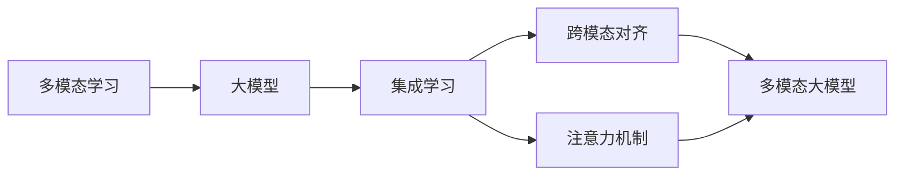

# 多模态大模型：技术原理与实战 集成学习

关键词：多模态、大模型、集成学习、深度学习、自然语言处理、计算机视觉、语音识别

## 1. 背景介绍
### 1.1  问题的由来
随着人工智能技术的快速发展，单一模态的模型已经无法满足日益复杂的应用需求。多模态大模型应运而生，通过融合文本、图像、语音等不同模态的数据，实现更加全面和准确的感知与理解。然而，如何有效地集成不同模态的信息，构建高效、鲁棒的多模态大模型，仍然面临诸多挑战。

### 1.2  研究现状
目前，多模态大模型已经在学术界和工业界得到广泛关注。谷歌、微软、OpenAI等科技巨头纷纷推出了自己的多模态大模型，如CLIP、DALL-E、GPT-3等。这些模型在图像描述、视觉问答、文本生成等任务上取得了突破性进展。同时，学术界也提出了一系列创新的多模态融合方法，如多模态注意力机制、跨模态对比学习等。

### 1.3  研究意义
多模态大模型的研究具有重要的理论和实践意义。从理论角度看，它有助于深入理解人类认知的机理，探索不同感官信息的交互与整合过程。从实践角度看，多模态大模型可以应用于智能客服、医疗诊断、自动驾驶等诸多领域，极大地提升人工智能系统的感知与决策能力，为人类生活带来便利。

### 1.4  本文结构
本文将围绕多模态大模型的技术原理与实战展开深入探讨。首先，我们将介绍多模态大模型的核心概念与内在联系。然后，重点阐述多模态融合的核心算法原理与具体操作步骤。接着，通过数学模型和公式推导，揭示多模态大模型的理论基础。在项目实践部分，我们将给出详细的代码实例和解释说明。此外，本文还将讨论多模态大模型的实际应用场景，推荐相关的工具和学习资源。最后，对多模态大模型的未来发展趋势与挑战进行展望。

## 2. 核心概念与联系
多模态大模型涉及以下几个核心概念：

- 多模态学习：旨在利用不同模态数据（如文本、图像、语音等）之间的互补信息，构建更加全面、准确的人工智能模型。
- 大模型：指参数量巨大（通常在亿级以上）的深度学习模型，具有强大的表示学习和泛化能力。
- 集成学习：通过组合多个基学习器的预测结果，提高模型的泛化性能和鲁棒性。
- 跨模态对齐：学习不同模态数据之间的语义对齐关系，实现模态间的信息传递与融合。
- 注意力机制：通过加权聚合不同模态的特征表示，动态调整不同模态信息的重要性。

这些概念之间紧密相关、相互支撑。多模态学习是大模型的重要应用方向，而大模型的强大表示能力为多模态融合提供了坚实基础。集成学习可以有效组合不同模态的预测结果，提升模型性能。跨模态对齐和注意力机制则是实现多模态信息交互的关键技术。它们共同构成了多模态大模型的核心框架。

## 3. 核心算法原理 & 具体操作步骤
### 3.1  算法原理概述
多模态大模型的核心算法可以分为三个主要部分：特征提取、多模态融合和集成预测。

特征提取阶段，针对不同模态的数据（如文本、图像、语音等），采用相应的深度学习模型（如Transformer、CNN、RNN等）提取高层语义特征。这一过程将原始的高维数据转化为紧凑的低维表示，为后续的多模态融合奠定基础。

多模态融合阶段是算法的核心，其目的是学习不同模态特征之间的交互与对齐关系。常见的融合方法包括：

- 简单拼接：直接将不同模态的特征向量拼接起来，形成一个联合表示。
- 双线性池化：通过外积操作，捕捉不同模态特征之间的高阶交互信息。
- 注意力融合：利用注意力机制，根据任务动态调整不同模态特征的重要性，实现自适应融合。
- 跨模态对比学习：通过最大化不同模态数据之间的互信息，学习模态无关的语义表示。

集成预测阶段，通过组合多个多模态融合模型的输出，得到最终的预测结果。常见的集成策略包括加权平均、投票等。集成学习能够有效减少单个模型的偏差，提高预测的鲁棒性和准确性。

### 3.2  算法步骤详解
下面以注意力融合为例，详细介绍多模态大模型的训练步骤：

1. 数据准备：收集和标注多模态数据，如图像-文本对、视频-音频对等。
2. 特征提取：对每个模态的数据，使用预训练的深度学习模型提取高层特征。例如，对于图像可以使用CNN，对于文本可以使用BERT等。
3. 注意力计算：根据任务目标，计算不同模态特征之间的注意力权重。常见的方法包括点积注意力、加性注意力等。
4. 特征融合：根据注意力权重，对不同模态的特征进行加权求和，得到融合后的多模态表示。
5. 预测输出：将融合后的多模态表示输入到任务特定的输出层，如分类器、生成器等，得到最终的预测结果。
6. 损失计算：根据预测结果和真实标签，计算训练损失。常见的损失函数包括交叉熵、均方误差等。
7. 参数更新：利用优化算法（如Adam、SGD等）更新模型参数，最小化训练损失。
8. 模型集成：重复步骤2-7，训练多个多模态融合模型。在推理阶段，将这些模型的输出进行集成，得到最终的预测结果。

### 3.3  算法优缺点
多模态大模型的主要优点包括：

- 信息互补：通过融合不同模态的信息，模型能够获得更全面、准确的认知。
- 泛化能力强：大规模参数和海量数据的训练，使得模型具有强大的表示学习和迁移能力。
- 鲁棒性高：集成学习策略能够有效减少单个模型的偏差，提高预测的稳定性。

同时，多模态大模型也存在一些局限性：

- 计算开销大：大规模参数和复杂的融合机制，导致训练和推理的计算成本较高。
- 数据依赖强：模型的性能很大程度上取决于训练数据的质量和规模。
- 可解释性差：大模型内部的决策过程通常是黑盒的，缺乏可解释性。

### 3.4  算法应用领域
多模态大模型在许多领域都有广泛应用，例如：

- 智能问答：融合图像、文本等多模态信息，实现更加自然、准确的问答交互。
- 医学诊断：结合医学影像、病历、基因组数据等，辅助医生进行疾病诊断和治疗决策。
- 自动驾驶：综合分析车载摄像头、激光雷达、GPS等传感器数据，实现环境感知和决策控制。
- 情感分析：通过文本、语音、面部表情等多模态信息，准确识别用户的情感状态。

## 4. 数学模型和公式 & 详细讲解 & 举例说明
### 4.1  数学模型构建
我们以注意力融合为例，给出多模态大模型的数学形式化描述。

假设有两个模态的数据，分别表示为 $X^{(1)} \in \mathbb{R}^{n_1 \times d_1}$ 和 $X^{(2)} \in \mathbb{R}^{n_2 \times d_2}$，其中 $n_1$, $n_2$ 为数据点的数量，$d_1$, $d_2$ 为特征维度。

首先，使用特征提取器 $f_1$, $f_2$ 将原始数据映射到语义空间：

$$H^{(1)} = f_1(X^{(1)}) \in \mathbb{R}^{n_1 \times d}$$

$$H^{(2)} = f_2(X^{(2)}) \in \mathbb{R}^{n_2 \times d}$$

其中 $d$ 为语义特征的维度。

然后，计算两个模态之间的注意力权重矩阵 $A \in \mathbb{R}^{n_1 \times n_2}$：

$$A = \text{softmax}(\frac{QK^T}{\sqrt{d}})$$

其中 $Q=H^{(1)}W_q$, $K=H^{(2)}W_k$, $W_q, W_k \in \mathbb{R}^{d \times d}$ 为可学习的参数矩阵。

最后，根据注意力权重对两个模态的特征进行融合：

$$\tilde{H}^{(1)} = AH^{(2)} \in \mathbb{R}^{n_1 \times d}$$

$$\tilde{H}^{(2)} = A^TH^{(1)} \in \mathbb{R}^{n_2 \times d}$$

融合后的特征 $\tilde{H}^{(1)}$ 和 $\tilde{H}^{(2)}$ 可以进一步用于下游任务的预测。

### 4.2  公式推导过程
注意力权重矩阵 $A$ 的计算过程可以进一步展开：

$$A_{ij} = \frac{\exp(e_{ij})}{\sum_{k=1}^{n_2} \exp(e_{ik})}$$

其中 $e_{ij}$ 表示第 $i$ 个模态1的数据点与第 $j$ 个模态2的数据点之间的注意力得分：

$$e_{ij} = \frac{(h_i^{(1)}W_q)(h_j^{(2)}W_k)^T}{\sqrt{d}}$$

这里 $h_i^{(1)}$ 和 $h_j^{(2)}$ 分别表示 $H^{(1)}$ 的第 $i$ 行和 $H^{(2)}$ 的第 $j$ 行。

softmax操作可以将注意力得分归一化为概率分布，使得每一行的权重和为1：

$$\sum_{j=1}^{n_2} A_{ij} = 1, \forall i \in \{1,2,...,n_1\}$$

这样，融合后的特征 $\tilde{H}^{(1)}$ 就可以解释为模态1的每个数据点对模态2的所有数据点的加权平均，权重由注意力矩阵 $A$ 决定。同理，$\tilde{H}^{(2)}$ 则表示模态2的每个数据点对模态1的所有数据点的加权平均。

### 4.3  案例分析与讲解
下面以图像-文本匹配任务为例，说明注意力融合的具体应用。

给定一张图像 $I$ 和一段文本描述 $T$，目标是判断它们是否匹配。首先，使用预训练的CNN和BERT分别提取图像和文本的特征：

$$H^{(I)} = \text{CNN}(I) \in \mathbb{R}^{n_I \times d}$$

$$H^{(T)} = \text{BERT}(T) \in \mathbb{R}^{n_T \times d}$$

然后，计算图像和文本之间的注意力权重矩阵：

$$A = \text{softmax}(\frac{(H^{(I)}W_q)(H^{(T)}W_k)^T}{\sqrt{d}}) \in \mathbb{R}^{n_I \times n_T}$$

接着，根据注意力权重对图像和文本特征进行融合：

$$\tilde{H}^{(I)} = AH^{(T)} \in \mathbb{R}^{n_I \times d}$$

$$\tilde{H}^{(T)} = A^TH^{(I)} \in \mathbb{R}^{n_T \times d}$$

最后，将融合后的特征输入到分类器中，预测图像和文本是否匹配：