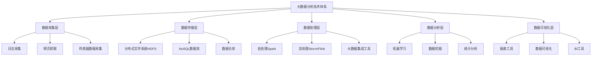

# 大数据分析 原理与代码实例讲解

## 1. 背景介绍

### 1.1 问题的由来

在当今数字时代，数据的产生和积累呈现出前所未有的规模和速度。无论是企业的交易记录、社交媒体上的用户行为数据,还是物联网设备收集的海量信息,都构成了大数据的重要来源。然而,如何从这些海量heterogeneous异构数据中发掘有价值的信息和知识,并将其转化为可行的决策,已经成为各行业面临的一大挑战。

传统的数据处理和分析方法已经难以满足当前大数据带来的需求,主要体现在以下几个方面:

1. **数据量大**:单个组织或系统所拥有的数据量已经达到PB(Petabyte)甚至EB(Exabyte)级别,远远超出了传统数据库和分析工具的处理能力。

2. **种类多样**:数据来源极其heterogeneous异构,包括结构化数据(如关系数据库)、半结构化数据(如XML文件)和非结构化数据(如文本、图像、视频等)。

3. **产生速度快**:尤其是在物联网、社交媒体等领域,数据的产生速度已经达到每秒千万甚至亿级别的记录增长。

4. **价值密度低**:有价值的数据被淹没在大量的冗余和无用数据中,如何快速发现有价值的数据成为一大挑战。

### 1.2 研究现状

为了解决上述问题,大数据分析(Big Data Analytics)作为一种新兴的数据处理范式应运而生。它集成了多种先进的技术,包括大规模并行处理(Massively Parallel Processing, MPP)、分布式文件系统(Distributed File System)、机器学习(Machine Learning)等,旨在高效地从大规模异构数据中发现深层次的知识和洞见。

目前,大数据分析技术在多个领域得到了广泛应用,例如:

- **电子商务**:分析用户行为数据,进行个性化推荐和营销策略优化。
- **金融服务**:检测欺诈行为,评估信贷风险,优化投资组合。
- **医疗保健**:整合患者数据,发现疾病模式,提高诊断和治疗质量。
- **制造业**:分析传感器数据,优化生产流程,提高设备利用率。
- **交通运输**:通过车载传感器数据分析,优化交通路线规划和拥堵管理。

### 1.3 研究意义

大数据分析技术的发展不仅能够帮助企业和组织从海量数据中发现隐藏的商业价值,还能为科学研究提供新的视角和方法。通过分析大规模的观测数据、实验数据和模拟数据,科学家们可以获得前所未有的洞见,推进各个学科的发展。

此外,大数据分析在政府决策、社会管理、公共安全等领域也扮演着越来越重要的角色。通过分析市民的出行数据、能源消耗数据等,政府可以制定更加科学的政策,提高城市运营效率和公共服务质量。

然而,大数据分析技术的发展也带来了一些新的挑战,例如数据隐私和安全、算法公平性、技术伦理等问题,需要技术人员和决策者的高度重视。

### 1.4 本文结构

本文将全面介绍大数据分析的核心概念、关键技术和实践案例。具体来说,第2章将阐述大数据分析涉及的基本概念和技术体系;第3章重点讲解常用的大数据分析算法原理和实现步骤;第4章将建立相应的数学模型,并推导核心公式;第5章将通过实际的代码实例,演示大数据分析在实践中的应用;第6章将介绍大数据分析在不同领域的应用场景;第7章将推荐相关的学习资源和开发工具;最后第8章将总结大数据分析的发展趋势和面临的挑战。

## 2. 核心概念与联系

在深入探讨大数据分析的具体技术之前,我们有必要先了解一些核心概念,为后续的学习打下基础。

### 2.1 大数据(Big Data)

所谓大数据,指的是那些无法使用传统数据库软件工具在合理时间内获取、管理和处理的数据集。大数据具有4V特征:

1. **Volume(大量)**: 数据量大到超出了传统数据库系统的处理能力。
2. **Variety(多样)**: 数据类型heterogeneous异构,包括结构化、半结构化和非结构化数据。
3. **Velocity(高速)**: 数据的产生、传输和处理速度极快。
4. **Veracity(价值密度低)**: 大量数据缺乏可信度和价值,需要进行深入的分析和处理。

### 2.2 大数据分析(Big Data Analytics)

大数据分析是指对大规模、heterogeneous异构的数据集进行探索性的数据分析,以发现有价值的模式、趋势和规律。它集成了多种先进技术,包括:

- **大规模并行处理(MPP)**: 利用大量计算节点同时处理数据,提高计算效率。
- **分布式文件系统(Distributed File System)**: 在多个节点上存储和管理海量数据。
- **机器学习(Machine Learning)**: 自动从数据中提取模式,并用于预测和决策。
- **数据挖掘(Data Mining)**: 发现数据中隐藏的有用模式和关系。
- **可视化技术(Data Visualization)**: 以图形化方式呈现分析结果,便于理解。

### 2.3 大数据分析技术体系

大数据分析技术体系通常包括以下几个层次:



1. **数据采集层**: 从各种数据源(如网络日志、社交媒体、传感器等)收集原始数据。
2. **数据存储层**: 使用分布式文件系统(如HDFS)和NoSQL数据库存储海量数据。
3. **数据处理层**: 利用大数据计算框架(如Spark、Storm)对数据进行清洗、转换和集成。
4. **数据分析层**: 使用机器学习、数据挖掘等算法从数据中发现知识和模式。
5. **数据可视化层**: 通过报表、仪表板等形式直观呈现分析结果。

## 3. 核心算法原理 & 具体操作步骤

在大数据分析中,常用的算法有很多,本章我们将重点介绍其中几种核心算法的原理和实现步骤。

### 3.1 算法原理概述

#### 3.1.1 MapReduce算法

MapReduce是一种分布式计算模型,用于在大规模计算集群上并行处理大数据。它将计算过程分为两个阶段:Map阶段和Reduce阶段。

在Map阶段,输入数据被分割为多个数据块,并分发到多个计算节点上进行处理。每个计算节点会对分配到的数据块执行用户自定义的Map函数,生成中间结果(Key-Value对)。

在Reduce阶段,MapReduce框架会对Map阶段产生的中间结果进行合并和排序,然后将具有相同Key的Value值传递给同一个Reduce任务进行处理。每个Reduce任务会对其接收到的Value值执行用户自定义的Reduce函数,生成最终结果。

MapReduce算法的优势在于它能够自动实现并行化和容错,适合处理大规模数据集。但它也存在一些缺陷,如不擅长处理迭代计算和实时数据流等。

#### 3.1.2 K-Means聚类算法

K-Means是一种常用的无监督学习算法,用于对数据进行聚类分析。它的基本思想是将n个数据对象划分为k个聚类,使得同一个聚类内的数据对象相似度较高,不同聚类之间的数据对象相似度较低。

算法的具体步骤如下:

1. 随机选取k个数据对象作为初始聚类中心。
2. 对于每个数据对象,计算它与各个聚类中心的距离,将其划分到最近的那个聚类中。
3. 对于每个聚类,重新计算它的聚类中心。
4. 重复步骤2和3,直到聚类中心不再发生变化。

K-Means算法的优点是简单高效,缺点是对初始聚类中心的选择比较敏感,并且难以处理非凸形状的聚类。

#### 3.1.3 PageRank算法

PageRank是谷歌公司用于网页排名的核心算法之一。它的基本思想是,一个网页的重要性不仅取决于它被多少其他网页链接,还取决于链接它的网页的重要性。

具体来说,PageRank算法会为每个网页赋予一个重要性分数(PR值),并通过迭代计算的方式不断更新每个网页的PR值,直到收敩。在每一轮迭代中,网页的PR值由链接它的所有其他网页的PR值决定。

PageRank算法的数学模型可以表示为:

$$PR(p_i) = (1-d) + d \sum_{p_j \in M(p_i)} \frac{PR(p_j)}{L(p_j)}$$

其中:
- $p_i$表示第i个网页
- $PR(p_i)$表示网页$p_i$的PR值
- $M(p_i)$表示所有链接到$p_i$的网页集合
- $L(p_j)$表示网页$p_j$的出链接数量
- $d$是一个阻尼系数,通常取值0.85

PageRank算法的优点是能够较好地评估网页的重要性和质量,缺点是容易受到链接spam的影响。

### 3.2 算法步骤详解

#### 3.2.1 MapReduce实现WordCount

WordCount是MapReduce编程的经典示例,它统计给定文本文件中每个单词出现的次数。我们以Hadoop MapReduce为例,具体实现步骤如下:

**Map阶段**:

1. 输入是文本文件的每一行。
2. 将每一行拆分为单个单词。
3. 对于每个单词,输出键值对(word, 1)。

**Reduce阶段**:

1. 输入是Map阶段输出的键值对(word, 1)列表,根据键word进行分组。
2. 遍历每个键对应的值列表,将值相加得到单词的总计数。
3. 输出键值对(word, count)。

**代码实现**:

```java
// Map阶段
public static class TokenizerMapper extends Mapper<Object, Text, Text, IntWritable>{
    
    private final static IntWritable one = new IntWritable(1);
    private Text word = new Text();
       
    public void map(Object key, Text value, Context context) throws IOException, InterruptedException {
        StringTokenizer itr = new StringTokenizer(value.toString());
        while (itr.hasMoreTokens()) {
            word.set(itr.nextToken());
            context.write(word, one);
        }
    }
}

// Reduce阶段 
public static class IntSumReducer extends Reducer<Text,IntWritable,Text,IntWritable> {
    private IntWritable result = new IntWritable();

    public void reduce(Text key, Iterable<IntWritable> values, Context context) throws IOException, InterruptedException {
        int sum = 0;
        for (IntWritable val : values) {
            sum += val.get();
        }
        result.set(sum);
        context.write(key, result);
    }
}
```

上述代码实现了WordCount的Map和Reduce函数。在Map阶段,我们将输入文本拆分为单词,并为每个单词输出键值对(word, 1)。在Reduce阶段,我们对于每个单词,将它对应的值列表相加,得到该单词的总计数,最后输出(word, count)。

#### 3.2.2 K-Means聚类实现

我们以Spark MLlib为例,介绍K-Means聚类算法的