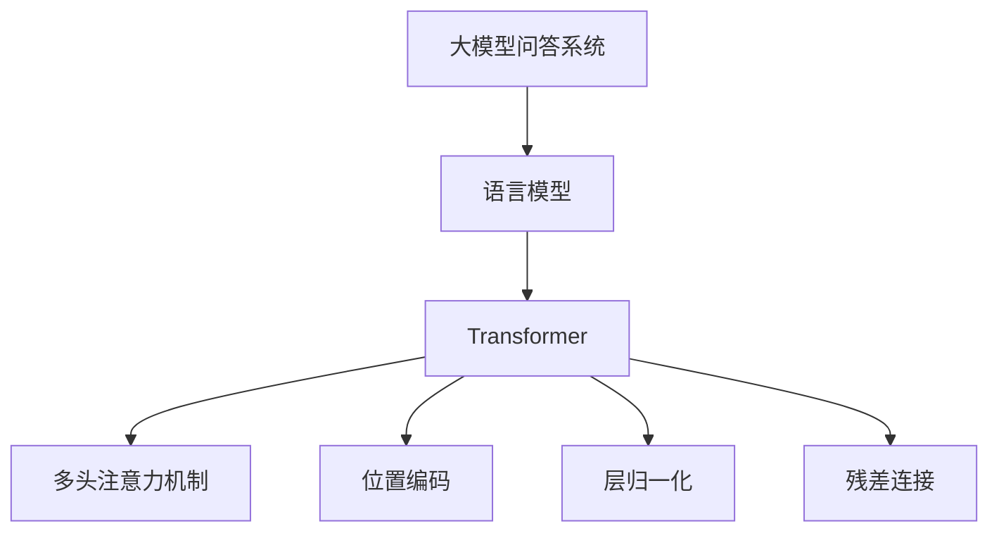
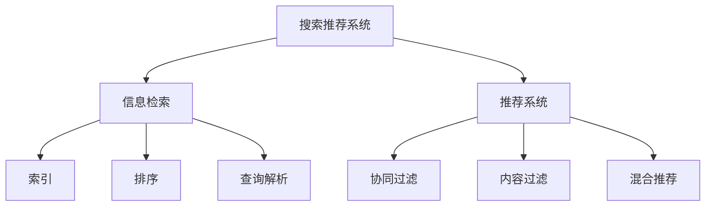
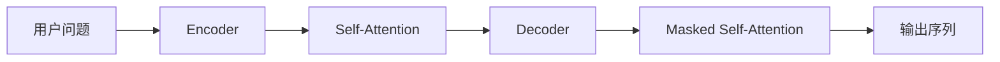
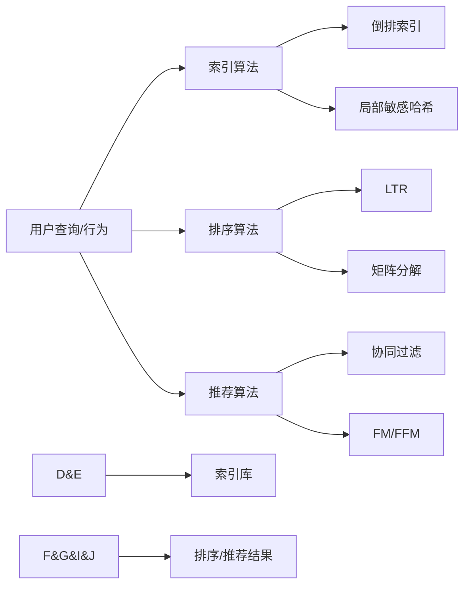
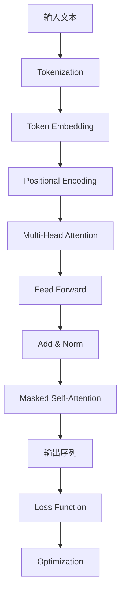

# 大模型问答机器人与搜索推荐的比较

## 1. 背景介绍

### 1.1 问题的由来

在当今信息时代,人们每天都会产生大量的信息需求,需要快速、准确地获取所需的知识和信息。传统的信息检索方式如搜索引擎、知识库等虽然功能强大,但存在一些痛点:

1. **信息孤岛**:信息来源分散,难以整合多源异构数据。
2. **查询能力有限**:只能通过关键词搜索,无法处理复杂查询。
3. **结果缺乏上下文**:返回的是独立的片段信息,缺乏连贯性。

为了解决这些问题,大模型问答系统(Large Model QA)和搜索推荐系统应运而生。它们是基于人工智能技术的新一代信息服务,具有强大的理解和生成能力,可以为用户提供更加智能化和个性化的服务。

### 1.2 研究现状

**大模型问答系统**是近年来兴起的一种基于大规模语言模型的智能问答系统。代表性模型包括GPT-3、ChatGPT、PanGu-Alpha等。这些系统通过预训练海量文本数据,学习丰富的自然语言知识,能够理解并生成连贯、流畅的自然语言响应,为用户提供准确、全面的答复。

**搜索推荐系统**则是传统信息检索技术的升级版,融合了大数据、机器学习等技术。代表性系统包括谷歌搜索引擎、亚马逊推荐系统等。这些系统通过分析用户行为,构建个性化用户模型,从海量数据中智能匹配、推荐最相关的信息。

两种系统在应用场景、技术路线等方面存在明显差异,但也有一些共同点,如都需要处理大规模数据、提供个性化服务等。研究它们的异同,有助于更好地发挥各自优势,为用户提供更优质的信息服务体验。

### 1.3 研究意义

比较大模型问答系统和搜索推荐系统,有以下重要意义:

1. **明确发展方向**:了解两种系统的优缺点,有助于制定合理的技术发展路线。
2. **优化系统设计**:深入分析差异,可以优化系统架构,提升性能和用户体验。
3. **促进技术融合**:探索两种技术的结合,可以实现能力互补,发挥协同优势。
4. **拓展应用场景**:发现新的应用需求,为系统的创新升级提供新思路。

### 1.4 本文结构

本文将从以下几个方面对比分析大模型问答系统和搜索推荐系统:

1. 核心概念与联系
2. 核心算法原理与具体操作步骤
3. 数学模型和公式详细讲解与案例分析  
4. 项目实践:代码实例和详细解释
5. 实际应用场景
6. 工具和资源推荐
7. 总结:未来发展趋势与挑战
8. 附录:常见问题与解答

## 2. 核心概念与联系

### 2.1 大模型问答系统

大模型问答系统的核心是**大规模语言模型**(Large Language Model, LLM)。LLM是一种基于深度学习的自然语言处理模型,通过预训练海量文本数据,学习自然语言的语义和语法知识。

LLM的主要特点包括:

1. **大规模参数**:模型参数量通常在亿到万亿级,拥有强大的表示能力。
2. **自回归生成**:可以根据上文生成下文,实现自然语言生成。
3. **上下文理解**:能够捕捉长距离上下文信息,理解复杂语义。
4. **无监督预训练**:通过无监督学习获取通用语言知识。

常见的LLM架构包括Transformer、BERT、GPT等,其中Transformer是最核心的组件,用于建模序列数据。

### 2.2 搜索推荐系统

搜索推荐系统的核心是**信息检索**(Information Retrieval, IR)和**推荐系统**(Recommender System, RS)技术。

**信息检索**技术用于从海量数据中快速检索相关信息,包括:

1. **索引**:对数据进行分词、去重等预处理,构建倒排索引。
2. **排序**:根据相关性打分模型对结果排序,如TF-IDF、BM25等。
3. **查询解析**:分析用户查询意图,进行查询改写和扩展。

**推荐系统**技术则用于为用户个性化推荐感兴趣的信息,主要方法有:

1. **协同过滤**:基于用户的历史行为,找到兴趣相似的其他用户/物品。
2. **内容过滤**:基于物品内容特征,匹配用户兴趣偏好。
3. **混合推荐**:综合多种推荐策略,提高推荐质量。

### 2.3 联系与区别

大模型问答系统和搜索推荐系统在核心概念上存在一些联系:

1. 都需要处理大规模数据,对数据进行索引、表示和压缩。
2. 都需要对查询/问题进行理解和分析,提取用户意图。
3. 都需要根据用户需求进行个性化响应/推荐。

但是,两者在具体技术路线上也有明显区别:

1. **模型范式**:前者基于大规模语言模型,后者基于检索和推荐算法。
2. **知识来源**:前者主要从预训练语料中获取知识,后者从现有数据库中检索。  
3. **响应形式**:前者生成自然语言响应,后者返回现有文档/物品列表。
4. **应用场景**:前者更适合回答开放性问题,后者更适合查找特定信息。

## 3. 核心算法原理与具体操作步骤

### 3.1 算法原理概述

#### 3.1.1 大模型问答算法

大模型问答系统的核心算法是**序列到序列生成**(Sequence-to-Sequence Generation),基于自回归语言模型实现。

1. **输入表示**:将用户问题转化为Token序列,送入Encoder。
2. **上下文编码**:Encoder通过Self-Attention捕获输入的上下文信息。
3. **自回归生成**:Decoder结合输入编码,通过Masked Self-Attention自回归生成输出序列。
4. **损失函数**:以最大似然估计为目标,最小化输入与输出序列之间的负对数似然损失。

#### 3.1.2 搜索推荐算法

搜索推荐系统则结合了多种算法:

1. **索引**:基于倒排索引、局部敏感哈希等算法,实现高效索引。
2. **排序**:基于学习到排序(LTR)、矩阵分解等算法,对结果进行排序。
3. **推荐**:基于协同过滤、FM/FFM等算法,实现个性化推荐。

### 3.2 算法步骤详解

#### 3.2.1 大模型问答算法步骤

以GPT模型为例,大模型问答算法的具体步骤如下:

1. **Tokenization**:将输入文本切分为Token序列。
2. **Token Embedding**:将Token映射为embedding向量表示。
3. **Positional Encoding**:添加位置编码,赋予序列位置信息。
4. **Multi-Head Attention**:计算Query、Key、Value的注意力分数。
5. **Feed Forward**:对注意力输出进行前馈网络变换。
6. **Add & Norm**:残差连接和层归一化,融合信息流。
7. **Masked Self-Attention**:遮掩未生成Token,自回归生成输出。
8. **Loss Function**:计算输出与标签序列的负对数似然损失。
9. **Optimization**:基于损失函数,对模型参数进行优化。

#### 3.2.2 搜索推荐算法步骤

搜索推荐系统则涉及多个子系统,算法步骤较为复杂:

**索引算法步骤**:

1. **数据预处理**:对原始数据进行分词、去重、归一化等预处理。
2. **特征抽取**:提取文本的关键词、主题等特征。
3. **构建正排索引**:将数据按特定方式组织,构建正排索引。
4. **构建倒排索引**:为每个特征项构建对应的倒排索引列表。

**排序算法步骤**:

1. **查询解析**:分析查询语义,进行查询改写和扩展。
2. **获取候选集**:通过倒排索引检索获取初始候选集。
3. **特征工程**:提取查询-文档相关性特征,构建样本。
4. **学习排序模型**:基于样本训练排序模型,如RankNet、LambdaRank等。
5. **生成排序结果**:将候选集根据排序模型打分,生成最终排序结果。

**推荐算法步骤**:

1. **数据预处理**:对用户行为/物品内容数据进行清洗和特征工程。
2. **构建用户模型**:基于协同过滤等算法,构建用户兴趣模型。
3. **构建物品模型**:基于内容过滤等算法,构建物品特征模型。
4. **个性化排序**:将用户模型和物品模型相结合,为用户生成个性化排序列表。

### 3.3 算法优缺点

#### 3.3.1 大模型问答算法

**优点**:

1. 具有强大的自然语言理解和生成能力,可回答开放性问题。
2. 无需事先构建知识库,知识来自于预训练语料,知识面广泛。
3. 响应形式灵活,可根据场景需求生成定制化的自然语言输出。

**缺点**:

1. 模型训练成本高昂,需要大量计算资源和高质量语料。
2. 生成的响应可能不够准确或存在偏差,需要进一步优化。
3. 缺乏明确的因果推理能力,推理过程不够透明可解释。
4. 存在潜在的安全和伦理风险,需要进行审查和控制。

#### 3.3.2 搜索推荐算法

**优点**:

1. 能够快速从海量数据中检索目标信息,检索效率高。
2. 推荐结果个性化,可满足不同用户的个性化需求。
3. 算法可解释性较强,便于理解和优化调整。
4. 可基于现有数据和系统进行改进,技术相对成熟。

**缺点**:

1. 无法很好地处理开放性、复杂的查询和问题。
2. 知识来源有限,难以涵盖所有领域的知识。
3. 检索结果缺乏连贯性,难以生成流畅的自然语言响应。
4. 