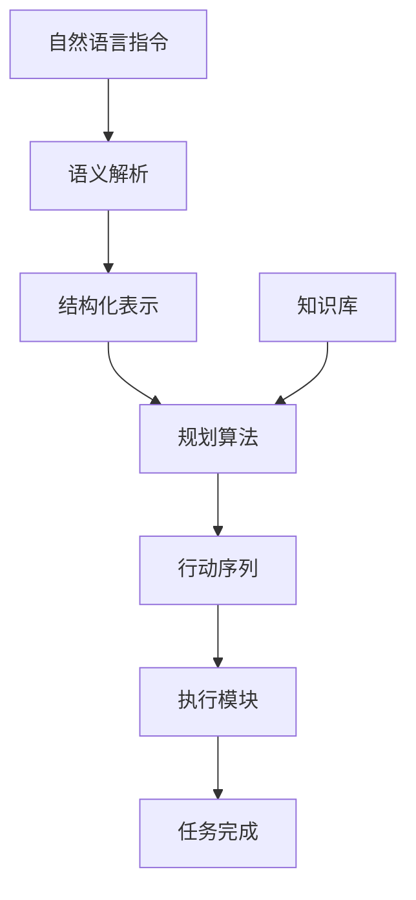

以下是对《大模型问答机器人的任务执行》这一主题的技术博客文章正文部分的撰写。

# 大模型问答机器人的任务执行

## 1. 背景介绍

### 1.1 问题的由来

随着人工智能技术的不断发展,大型语言模型在自然语言处理领域展现出了卓越的能力。这些模型通过学习海量文本数据,掌握了丰富的语言知识和上下文理解能力,使得人机对话系统的性能得到了极大的提升。然而,要构建一个真正"智能"的对话系统并非易事。仅依赖语言模型生成的响应往往缺乏逻辑连贯性和任务导向性,无法满足用户的实际需求。

因此,如何赋予大型语言模型任务执行能力,成为了当前人工智能领域的一个重要课题。任务执行是指根据用户的指令,机器能够计划和执行一系列行动以完成特定目标。这不仅需要模型具备出色的语义理解能力,还需要掌握相关的知识库、规划算法和操作技能,从而将自然语言指令转化为可执行的动作序列。

### 1.2 研究现状  

目前,已有多项研究探索了赋予大型语言模型任务执行能力的方法。一种主要方法是通过构建结构化的知识库和规则系统,将自然语言指令映射到预定义的操作集合。这种方法需要大量的人工标注和知识库构建工作,且难以应对开放域的多样化任务。

另一种方法是基于强化学习,将任务执行过程建模为马尔可夫决策过程,通过与环境交互来学习最优策略。这种方法具有较强的泛化能力,但需要大量的在线试错训练,且策略的可解释性较差。

近年来,基于大型语言模型的指令学习(Instruction Learning)方法受到了广泛关注。该方法通过构建包含大量任务指令和示例的数据集,对语言模型进行指令精调(Instruction Tuning),使其能够直接从自然语言指令生成相应的输出序列,从而实现任务执行。这种方法利用了大型语言模型强大的语义理解和生成能力,且具有较好的泛化性和可解释性。

### 1.3 研究意义

赋予大型语言模型任务执行能力,将极大拓展人工智能系统的应用场景。智能助手不再局限于简单的问答交互,而是能够根据用户的自然语言指令执行各种复杂任务,如文本编辑、代码生成、数据分析等,从而为人类的工作和生活带来巨大便利。

此外,任务执行能力也是通向通用人工智能(Artificial General Intelligence, AGI)的关键一步。一个真正"智能"的系统,不仅需要掌握丰富的知识,还需要能够灵活运用知识解决实际问题。任务执行正是将知识转化为行动的桥梁,是人工智能系统从"知"到"行"的重要环节。

因此,研究大型语言模型的任务执行能力,不仅具有重要的理论价值,也蕴含着广阔的应用前景。

### 1.4 本文结构

本文将首先介绍任务执行的核心概念和与其相关的关键技术,如语义解析、规划算法、知识库构建等。接下来,我们将重点阐述基于大型语言模型的指令学习方法的原理和具体实现步骤,并分析其优缺点和适用场景。

然后,我们将介绍任务执行中所涉及的数学模型和公式,如序列到序列模型、注意力机制等,并通过案例分析加深理解。

在项目实践部分,我们将提供一个基于指令学习的任务执行系统的代码示例,并对关键模块进行详细解释。

最后,我们将探讨任务执行在实际应用中的场景,如智能助手、代码生成等,并对未来的发展趋势和挑战进行展望。

## 2. 核心概念与联系

任务执行是一个复杂的过程,涉及多个关键概念和技术模块,如语义解析、规划算法、知识库构建等。这些模块相互关联,共同推动了任务执行能力的实现。

上图展示了任务执行的典型流程:

1. **语义解析(Semantic Parsing)**: 将自然语言指令转换为结构化的语义表示,如逻辑形式、语义框架等。这是理解指令意图的关键步骤。

2. **规划算法(Planning Algorithm)**: 基于语义表示和知识库,生成一系列操作动作以完成任务目标。常见的规划算法包括启发式搜索、层次规划等。

3. **知识库(Knowledge Base)**: 存储与任务相关的结构化知识,如实体、关系、规则等,为规划算法提供支持。

4. **执行模块(Execution Module)**: 根据生成的行动序列,执行相应的操作,如文本编辑、数据处理等,最终完成任务。

在上述传统的任务执行框架中,语义解析和规划算法是关键环节,需要大量的人工标注和知识库构建工作。而基于大型语言模型的指令学习方法,则试图直接从自然语言指令生成所需的输出序列,端到端地实现任务执行,从而降低了人工成本和知识获取难度。

## 3. 核心算法原理 & 具体操作步骤

### 3.1 算法原理概述

基于大型语言模型的指令学习方法,主要思想是将任务执行视为一个序列到序列(Sequence-to-Sequence)的生成问题。给定一个自然语言指令作为输入序列,模型需要生成一个对应的输出序列,以完成指定的任务。

该方法的核心是利用大型语言模型强大的上下文建模能力,通过学习大量的指令-输出对,让模型掌握将自然语言指令转化为所需输出的映射规律。具体来说,算法主要包括以下几个步骤:

1. **数据集构建**: 收集大量的任务指令和对应的输出序列,构建指令-输出对的数据集。

2. **数据预处理**: 对指令和输出序列进行标记化(Tokenization)、填充(Padding)等预处理,以适应模型的输入格式。

3. **模型精调(Instruction Tuning)**: 基于构建的数据集,对预训练的大型语言模型(如GPT、T5等)进行指令精调,使其学习将指令映射到输出序列的能力。

4. **推理(Inference)**: 在推理阶段,将用户的自然语言指令输入到精调后的模型,模型将生成对应的输出序列,即任务的执行结果。

该方法的优点在于,它充分利用了大型语言模型强大的语言理解和生成能力,避免了复杂的语义解析和规划算法,且具有较好的泛化性和可解释性。但同时,它也面临着一些挑战,如输出质量的稳定性、长期记忆和推理能力的局限性等。

### 3.2 算法步骤详解

我们将详细解释指令学习算法的具体实现步骤:

1. **数据集构建**:
   - 收集各种任务领域的自然语言指令,如文本编辑、代码生成、数据分析等。
   - 对每个指令,由人工或程序自动生成对应的输出序列作为标注。
   - 将指令-输出对组织成标准的数据集格式,如JSON或TSV文件。

2. **数据预处理**:
   - 使用模型的Tokenizer将指令和输出序列转换为token序列。
   - 对token序列进行填充(Padding),使其长度统一,满足模型的输入要求。
   - 添加特殊标记(Special Tokens),如`<bos>`和`<eos>`等,标记序列的开始和结束。

3. **模型精调**:
   - 选择一个适当的预训练语言模型,如GPT、T5等,作为基础模型。
   - 将预处理后的数据集输入到模型中,以指令序列作为输入,输出序列作为标签。
   - 使用监督学习的方式,最小化模型在数据集上的损失函数(如交叉熵损失),进行模型参数的微调。
   - 可采用各种优化策略,如学习率调度、梯度裁剪等,以提高收敛速度和模型性能。

4. **推理**:
   - 将用户的自然语言指令输入到精调后的模型。
   - 模型将根据学习到的映射规律,自回归(Autoregressive)地生成对应的输出token序列。
   - 对生成的token序列进行解码(Decoding),得到最终的输出序列,即任务的执行结果。

需要注意的是,在实际应用中,我们还需要考虑一些额外的因素,如输出质量控制、人机交互等,以提供更好的用户体验。我们将在后续章节中进一步探讨这些问题。

### 3.3 算法优缺点

基于大型语言模型的指令学习方法具有以下优缺点:

**优点**:

1. **泛化能力强**:由于利用了大型语言模型强大的语言理解和生成能力,该方法能够较好地泛化到看不见的指令和输出形式,适用范围广。

2. **可解释性好**:生成的输出序列是自然语言形式,具有较好的可解释性,便于人类理解和调试。

3. **开发效率高**:避免了复杂的语义解析和规划算法,开发周期较短,部署维护相对便捷。

4. **知识获取成本低**:不需要大规模的人工标注和知识库构建,只需收集指令-输出对的数据集即可。

**缺点**:

1. **输出质量不稳定**:生成的输出序列质量参差不齐,存在错误、偏差和不连贯的情况,需要进一步的质量控制措施。

2. **长期记忆和推理能力有限**:大型语言模型擅长捕捉局部信号,但难以建立长期的记忆和进行复杂的推理,限制了其处理长期和复杂任务的能力。

3. **数据质量依赖性强**:模型性能很大程度上依赖于训练数据的质量和多样性,如果数据覆盖面不够全面,容易导致模型偏差。

4. **幻觉和不确定性**:语言模型存在一定程度的幻觉(Hallucination)和不确定性,生成的输出可能缺乏事实根据或自相矛盾。

5. **计算资源需求高**:训练和推理大型语言模型需要大量的计算资源,对硬件设施和算力有较高要求。

因此,在实际应用中,我们需要根据具体场景权衡利弊,并采取相应的策略来缓解这些缺点,如输出质量控制、知识增强、人机交互等,以提高系统的可靠性和用户体验。

### 3.4 算法应用领域

基于大型语言模型的指令学习方法,由于其通用性和泛化能力,可以应用于多个领域的任务执行场景,包括但不限于:

1. **智能助手**:可用于构建多功能的智能助手系统,如文本编辑、日程管理、信息查询等。

2. **代码生成**:根据自然语言描述,生成对应的代码片段或完整程序,提高开发效率。

3. **数据分析**:执行数据提取、转换、可视化等分析任务,辅助数据科学工作流程。

4. **创作辅助**:根据用户的创作意图,生成文本内容,如新闻稿、故事情节等,为内容创作提供辅助。

5. **问答系统**:除了简单的问答外,还可执行更复杂的任务,如数学计算、逻辑推理等。

6. **自动化运维**:根据自然语言指令执行系统配置、部署、监控等运维操作。

7. **教育辅助**:生成练习题目、解题步骤等,为教学和自学提供支持。

8. **语音交互**:将语音指令转化为可执行操作,实现语音控制和交互。

总的来说,只要是可以用自然语言描述的任务,