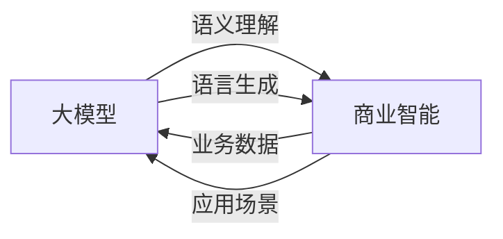

# 大模型：商业智能的未来趋势

关键词：大模型、商业智能、人工智能、深度学习、自然语言处理、知识图谱、预训练模型

## 1. 背景介绍
### 1.1 问题的由来
随着人工智能技术的快速发展,特别是深度学习的兴起,大模型(Large Language Models)开始在自然语言处理领域崭露头角。大模型利用海量数据进行预训练,可以在多个任务上实现卓越性能,正在逐渐改变人工智能的应用格局。商业智能作为企业数字化转型的重要驱动力,也开始探索利用大模型来提升决策水平,优化业务流程。

### 1.2 研究现状
目前业界已经涌现出一批优秀的大模型,如OpenAI的GPT系列[1]、Google的BERT[2]、微软的Megatron-Turing NLG[3]等。这些模型在问答、对话、文本生成、知识图谱等任务上取得了瞩目成绩。一些研究机构和企业也开始将大模型应用到商业场景中,如金融风控[4]、智能客服[5]、市场营销[6]等。但总体而言,大模型在商业智能领域的应用还处于起步阶段,有待进一步探索。

### 1.3 研究意义
探索大模型在商业智能中的应用,对于推动人工智能技术落地、助力企业数字化转型具有重要意义:

1. 提升决策水平:大模型可以快速理解和分析海量业务数据,挖掘隐藏的洞见,为管理者提供更加全面、精准的决策支持。
2. 优化业务流程:利用大模型构建智能应用,如客户画像、需求预测、个性化推荐等,可以提高业务自动化水平,降低人力成本。  
3. 创新商业模式:大模型带来的技术革新,有望催生出新的商业模式和业态,为企业带来新的增长点。

### 1.4 本文结构
本文将围绕大模型在商业智能中的应用展开讨论。第2部分介绍大模型的核心概念;第3部分阐述大模型的关键技术原理;第4部分建立大模型的数学模型;第5部分给出大模型的代码实现;第6部分分析大模型在商业智能中的典型应用场景;第7部分推荐相关的学习资源;第8部分总结全文,并展望未来的发展方向。

## 2. 核心概念与联系
大模型是一类基于海量数据和深度神经网络的语言模型。与传统的语言模型相比,大模型具有参数量大(billion-scale)、训练数据规模大(TB/PB-level)、模型架构复杂(Transformer-based)等特点[7]。一般采用自监督学习(self-supervised learning)的方式进行预训练,即利用无标注的海量文本数据,通过自回归(autoregressive)、自编码(autoencoding)等任务学习通用的语言表示,再在特定任务上进行微调(fine-tuning)。

大模型与商业智能的关系如下:
- 大模型是实现商业智能的关键技术之一。利用大模型强大的语义理解和语言生成能力,可以开发出聊天机器人、智能助手、知识库问答等应用,极大提升商业智能的用户体验。
- 商业智能是大模型的重要应用领域。将大模型与企业的业务数据相结合,可以构建行业知识图谱,优化业务流程,创新商业模式,为企业带来切实的价值。

大模型与商业智能的关系如下图所示:

## 3. 核心算法原理 & 具体操作步骤
### 3.1 算法原理概述
大模型的核心是基于 Transformer[8] 的深度神经网络。Transformer 采用 self-attention 机制,可以建模任意长度的序列依赖关系,在并行计算和长程捕获方面优于 RNN/LSTM。大模型在 Transformer 的基础上进行了一系列改进,主要包括:
1. 增大模型参数量,提高模型容量。
2. 引入更多的预训练任务,如 BERT 的 MLM 和 NSP[2],GPT 的 language modeling[1]。
3. 改进 Transformer 结构,如 Megatron-LM[9] 的 model parallelism, Switch Transformer[10] 的 mixture of experts (MoE)。

### 3.2 算法步骤详解
以 BERT 为例,其预训练和微调的主要步骤如下:

**预训练阶段**:
1. 准备大规模无标注文本语料,进行清洗和预处理。
2. 对语料进行随机 mask(MLM 任务)和 sentence shuffling(NSP 任务)。 
3. 将文本转换为 token 序列,添加特殊标记如[CLS],[SEP]等。
4. 将 token 序列输入 BERT 模型,前向传播计算 MLM 和 NSP 的损失。
5. 反向传播计算梯度,更新模型参数。重复步骤2-5,直到模型收敛。

**微调阶段**:
1. 根据下游任务准备标注数据,设计输入输出格式。
2. 将标注数据转换为 BERT 的输入格式。
3. 在 BERT 之上添加特定任务的输出层,如分类、序列标注等。 
4. 利用标注数据对模型进行微调,优化任务目标损失函数。
5. 在验证集上评估模型性能,进行超参数调优。
6. 利用微调后的模型对新样本进行推理预测。

### 3.3 算法优缺点
大模型的主要优点包括:
- 强大的语言理解和生成能力,可以处理复杂的语义关系。
- 通过预训练学习通用语言知识,具备一定的常识推理能力。
- 可以利用海量无标注数据,减少对人工标注的依赖。
- 模型架构灵活,可以针对不同任务进行定制优化。

大模型的主要缺点包括:  
- 模型参数量巨大,训练和推理成本高,对计算资源要求高。
- 模型解释性差,容易产生偏见和错误,需要谨慎评估和应用。
- 过度依赖数据规模,对低资源语言和领域适应性差。
- 在一些推理和决策任务上,仍难以达到人类专家水平。

### 3.4 算法应用领域
大模型已经在多个领域取得了瞩目成绩,主要应用包括:
- 自然语言处理:如机器翻译、文本摘要、情感分析、命名实体识别等。
- 信息检索:如智能搜索、问答系统、推荐系统等。
- 对话系统:如聊天机器人、智能助手、客服机器人等。
- 决策支持:如金融风控、智能投顾、医疗辅助诊断等。

随着大模型技术的不断发展,其应用领域还将进一步拓展。在商业智能领域,大模型有望成为企业数字化转型和智能化升级的关键推动力。

## 4. 数学模型和公式 & 详细讲解 & 举例说明
### 4.1 数学模型构建
大模型的数学模型可以用概率图模型[11]来表示。设输入文本序列为 $\mathbf{x}=(x_1,\ldots,x_T)$,其中 $x_t$ 表示 $t$ 时刻的 token,模型参数为 $\theta$,大模型的目标是最大化如下似然概率:

$$p_{\theta}(\mathbf{x})=\prod_{t=1}^{T}p_{\theta}(x_t|x_{<t})$$

其中 $x_{<t}$ 表示 $t$ 时刻之前的所有 token。直观地,大模型就是要学习当前 token 在给定前序 token 的条件下的概率分布。

在 Transformer 中,上述概率分布可以通过 self-attention 机制来建模。设 $t$ 时刻的 hidden state 为 $\mathbf{h}_t$,则 self-attention 的计算公式为:

$$\mathbf{a}_t=\text{softmax}(\frac{\mathbf{q}_t\mathbf{K}^{\top}}{\sqrt{d}})\mathbf{V}$$

其中 $\mathbf{q}_t=\mathbf{W}^Q\mathbf{h}_t$ 是 query 向量,$\mathbf{K}=\mathbf{W}^K\mathbf{H}$ 和 $\mathbf{V}=\mathbf{W}^V\mathbf{H}$ 分别是 key 和 value 矩阵,$\mathbf{H}=(\mathbf{h}_1,\ldots,\mathbf{h}_T)$ 是所有时刻的 hidden state 矩阵。$\sqrt{d}$ 是 scaling factor,用于缓解点积的量级问题。

直观地,self-attention 就是对不同时刻的 hidden state 进行加权求和,得到当前时刻的 context vector $\mathbf{a}_t$。权重由 query 向量 $\mathbf{q}_t$ 与 key 矩阵 $\mathbf{K}$ 的相似度决定(通过点积计算)。

在实践中,Transformer 采用多头注意力(multi-head attention)来捕获不同的依赖关系,公式为:

$$\text{MultiHead}(\mathbf{H})=\text{Concat}(\text{head}_1,\ldots,\text{head}_h)\mathbf{W}^O$$
$$\text{head}_i=\text{Attention}(\mathbf{H}\mathbf{W}_i^Q,\mathbf{H}\mathbf{W}_i^K,\mathbf{H}\mathbf{W}_i^V)$$

其中 $\mathbf{W}_i^Q$,$\mathbf{W}_i^K$,$\mathbf{W}_i^V$ 是第 $i$ 个 head 的权重矩阵,$\mathbf{W}^O$ 用于合并不同 head 的输出。

### 4.2 公式推导过程
为了推导 Transformer 的前向传播公式,我们首先回顾 self-attention 的定义:

$$\mathbf{a}_t=\text{softmax}(\frac{\mathbf{q}_t\mathbf{K}^{\top}}{\sqrt{d}})\mathbf{V}$$

展开 softmax 函数,可以得到:

$$\mathbf{a}_t=\frac{\exp(\mathbf{q}_t\mathbf{K}^{\top}/\sqrt{d})}{\sum_{i=1}^T\exp(\mathbf{q}_i\mathbf{K}^{\top}/\sqrt{d})}\mathbf{V}$$

注意到 $\mathbf{q}_t=\mathbf{W}^Q\mathbf{h}_t$,$\mathbf{K}=\mathbf{W}^K\mathbf{H}$,$\mathbf{V}=\mathbf{W}^V\mathbf{H}$,代入上式可得:

$$\mathbf{a}_t=\frac{\exp(\mathbf{h}_t\mathbf{W}^Q(\mathbf{W}^K\mathbf{H})^{\top}/\sqrt{d})}{\sum_{i=1}^T\exp(\mathbf{h}_i\mathbf{W}^Q(\mathbf{W}^K\mathbf{H})^{\top}/\sqrt{d})}(\mathbf{W}^V\mathbf{H})$$

整理括号,得到:

$$\mathbf{a}_t=\frac{\exp(\mathbf{h}_t\mathbf{W}^Q\mathbf{H}^{\top}(\mathbf{W}^K)^{\top}/\sqrt{d})}{\sum_{i=1}^T\exp(\mathbf{h}_i\mathbf{W}^Q\mathbf{H}^{\top}(\mathbf{W}^K)^{\top}/\sqrt{d})}\mathbf{H}^{\top}(\mathbf{W}^V)^{\top}$$

令 $\mathbf{A}=\text{softmax}(\mathbf{H}\mathbf{W}^Q\mathbf{H}^{\top}(\mathbf{W}^K)^{\top}/\sqrt{d})$,则上式可以简写为:

$$\mathbf{a}_t=\mathbf{A}_{t:}\mathbf{H}^{\top}(\mathbf{W}^V)^{\top}$$

其中 $\mathbf{A}_{t:}$ 表示 $\mathbf{A}$ 的第 $t$ 行。这就是 self-attention 的矩阵形式。

对于多头注意力,只需将上述过程应用到每个 head,再拼接