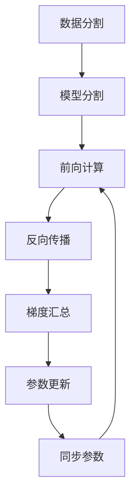

# 大规模语言模型从理论到实践 LLaMA分布式训练实践

## 1. 背景介绍

### 1.1 问题的由来

在当今的人工智能领域,大规模语言模型已经成为了一个备受关注的热门话题。随着数据量的快速增长和计算能力的不断提升,训练大规模语言模型变得越来越重要和有价值。然而,训练这些庞大的模型需要耗费大量的计算资源,这对于单机系统来说无疑是一个巨大的挑战。因此,如何高效地训练大规模语言模型成为了一个迫切需要解决的问题。

### 1.2 研究现状 

为了解决这一问题,研究人员提出了多种分布式训练方法,其中包括数据并行、模型并行和管道并行等。这些方法通过在多个计算节点之间并行化训练过程,从而大大提高了训练效率。然而,实现高效的分布式训练并非一蹴而就,需要解决诸如通信开销、数据不平衡等一系列挑战。

### 1.3 研究意义

本文将重点探讨大规模语言模型LLaMA(Longform Language Model with Attention)的分布式训练实践。LLaMA是一种新型的大规模语言模型,专门设计用于处理长文本输入,在自然语言处理、文本生成等领域具有广阔的应用前景。通过深入研究LLaMA的分布式训练方法,我们可以更好地理解和优化大规模语言模型的训练过程,从而推动人工智能技术的发展。

### 1.4 本文结构

本文将首先介绍LLaMA模型的核心概念和原理,然后详细阐述其分布式训练算法的理论基础和具体实现步骤。接下来,我们将构建数学模型并推导相关公式,并通过实例对其进行详细讲解。随后,我们将展示一个实际的项目实践,包括代码实现、运行结果等。最后,我们将探讨LLaMA模型在实际应用场景中的使用,并对未来的发展趋势和挑战进行展望。

## 2. 核心概念与联系

LLaMA(Longform Language Model with Attention)是一种专门设计用于处理长文本输入的大规模语言模型。它基于Transformer架构,采用了自注意力(Self-Attention)机制,能够有效捕捉长距离依赖关系,从而更好地理解和生成长文本。

LLaMA模型的核心概念包括:

1. **自注意力机制(Self-Attention Mechanism)**: 自注意力机制是Transformer架构的核心,它允许模型在计算每个单词的表示时,关注整个输入序列中的所有其他单词,从而捕捉长距离依赖关系。

2. **多头注意力(Multi-Head Attention)**: 多头注意力是自注意力机制的扩展,它将注意力分成多个"头"(Head),每个头对输入序列进行不同的注意力计算,最后将所有头的结果进行合并。这种方式可以增强模型对不同位置关系的建模能力。

3. **位置编码(Positional Encoding)**: 由于Transformer模型没有像RNN那样的递归结构,因此需要通过位置编码来提供单词在序列中的位置信息。

4. **掩码机制(Masking Mechanism)**: 在训练过程中,LLaMA模型采用掩码机制,即随机将一部分输入单词替换为特殊的掩码标记,然后让模型预测这些被掩码的单词。这种自监督学习方式可以有效利用大量的未标注数据进行训练。

5. **长文本分块(Longform Text Chunking)**: 为了处理长文本输入,LLaMA模型将长文本分成多个块(Chunk),并采用一种特殊的注意力掩码方式,使模型能够关注当前块以及之前所有块的信息,从而捕捉长距离依赖关系。

这些核心概念相互关联、相辅相成,共同构建了LLaMA模型强大的长文本建模能力。

## 3. 核心算法原理与具体操作步骤

### 3.1 算法原理概述

LLaMA模型的分布式训练算法基于数据并行和模型并行相结合的思路。具体来说,它将训练数据均匀分割到多个计算节点上,每个节点负责处理一部分数据。同时,模型参数也被分割到不同的节点上,每个节点只需要存储和更新一部分参数。在每个训练迭代中,各个节点首先在本地计算出梯度,然后通过通信操作将梯度汇总,最后使用汇总后的梯度更新模型参数。

该算法的核心思想是将计算和存储分散到多个节点上,从而克服了单机系统的计算能力和内存限制。通过巧妙地划分数据和模型,算法能够在保持并行效率的同时,最大限度地利用集群中的计算资源。

### 3.2 算法步骤详解

LLaMA模型的分布式训练算法可以分为以下几个主要步骤:

1. **数据分割**: 将训练数据集均匀分割成多个子集,每个计算节点负责处理一个子集。

2. **模型分割**: 将模型参数按照层(Layer)或列(Column)的方式划分到不同的节点上。每个节点只需要存储和更新一部分参数。

3. **前向计算**: 每个节点基于本地数据和参数,进行前向计算,得到输出和损失值。

4. **反向传播**: 每个节点基于本地数据和参数,计算出相应的梯度。

5. **梯度汇总**: 使用特殊的通信操作(如AllReduce),将所有节点的梯度进行汇总。

6. **参数更新**: 使用汇总后的梯度,并采用优化算法(如Adam),更新模型参数。

7. **同步参数**: 将更新后的参数分发到所有节点,以确保参数的一致性。

该算法通过将计算和存储分散到多个节点上,可以有效地利用集群中的计算资源,从而加速大规模语言模型的训练过程。同时,算法还采用了一些优化策略,如梯度压缩、混合精度训练等,进一步提高了训练效率和内存利用率。

### 3.3 算法优缺点

LLaMA模型的分布式训练算法具有以下优点:

1. **高效利用计算资源**: 通过将计算和存储分散到多个节点上,可以有效利用集群中的计算资源,加速训练过程。

2. **良好的可扩展性**: 算法可以轻松地扩展到更多的计算节点上,从而支持更大规模的模型和数据集。

3. **通信开销可控**: 算法采用了梯度压缩等优化策略,可以有效减少通信开销,提高训练效率。

4. **支持混合精度训练**: 算法可以与混合精度训练相结合,进一步节省内存并加速计算。

然而,该算法也存在一些缺点和挑战:

1. **通信瓶颈**: 虽然算法采取了一些优化措施,但是在大规模集群环境下,通信开销仍然可能成为训练效率的瓶颈。

2. **数据不平衡**: 由于训练数据被均匀分割到不同节点上,可能会导致数据分布不平衡,影响模型的收敛性和泛化能力。

3. **参数同步开销**: 在每个训练迭代中,都需要进行参数同步操作,这可能会带来额外的开销。

4. **故障恢复机制**: 在分布式环境下,需要考虑节点故障的情况,并设计相应的故障恢复机制,以确保训练过程的可靠性和容错性。

### 3.4 算法应用领域

LLaMA模型的分布式训练算法可以广泛应用于各种大规模语言模型的训练过程中,包括但不限于:

1. **自然语言处理(NLP)**: 用于训练大规模语言模型,以支持各种NLP任务,如机器翻译、文本摘要、问答系统等。

2. **对话系统**: 训练大规模对话模型,用于构建智能对话代理、虚拟助手等应用。

3. **文本生成**: 训练大规模文本生成模型,用于创作小说、新闻报道、营销文案等各种长文本内容。

4. **知识图谱构建**: 利用大规模语言模型从海量文本中提取结构化知识,构建知识图谱。

5. **多模态学习**: 将大规模语言模型与视觉、音频等其他模态相结合,实现多模态学习和理解。

总的来说,随着人工智能技术的不断发展,大规模语言模型在各个领域都扮演着越来越重要的角色。高效的分布式训练算法将为这些应用提供强大的计算支持。

## 4. 数学模型和公式详细讲解与举例说明

### 4.1 数学模型构建

在构建LLaMA模型的数学模型时,我们需要考虑以下几个关键因素:

1. **自注意力机制(Self-Attention Mechanism)**
2. **多头注意力(Multi-Head Attention)**
3. **位置编码(Positional Encoding)**
4. **掩码机制(Masking Mechanism)**
5. **长文本分块(Longform Text Chunking)**

首先,我们定义输入序列 $X = (x_1, x_2, \dots, x_n)$,其中 $x_i$ 表示第 $i$ 个单词的embedding向量。

对于自注意力机制,我们计算查询(Query)、键(Key)和值(Value)向量:

$$
Q = X W^Q \\
K = X W^K \\
V = X W^V
$$

其中 $W^Q$、$W^K$ 和 $W^V$ 分别表示查询、键和值的权重矩阵。

然后,我们计算注意力分数矩阵 $A$:

$$
A = \text{softmax}\left(\frac{QK^T}{\sqrt{d_k}}\right)
$$

其中 $d_k$ 是缩放因子,用于防止注意力分数过大或过小。

最后,我们计算自注意力输出 $Z$:

$$
Z = AV
$$

对于多头注意力机制,我们将上述过程重复执行 $h$ 次,每次使用不同的权重矩阵 $W^Q_i$、$W^K_i$ 和 $W^V_i$,得到 $h$ 个注意力头的输出 $Z_1, Z_2, \dots, Z_h$。然后,我们将这些输出进行拼接和线性变换,得到最终的多头注意力输出:

$$
\text{MultiHead}(X) = \text{Concat}(Z_1, Z_2, \dots, Z_h) W^O
$$

其中 $W^O$ 是输出权重矩阵。

为了引入位置信息,我们使用位置编码矩阵 $P$,将其与输入embedding相加:

$$
X' = X + P
$$

掩码机制则通过在注意力分数矩阵 $A$ 中设置特定位置的值为 $-\infty$,从而阻止模型关注被掩码的单词。

最后,对于长文本分块,我们将长文本分成多个块 $B_1, B_2, \dots, B_m$,并采用特殊的注意力掩码方式,使模型能够关注当前块以及之前所有块的信息。

通过上述数学模型,我们可以形式化地描述LLaMA模型的核心机制,为后续的训练和优化奠定理论基础。

### 4.2 公式推导过程

在上一节中,我们给出了LLaMA模型的核心数学公式,但并未详细阐述它们的推导过程。在这一节中,我们将逐步推导这些公式,以加深对模型原理的理解。

首先,我们从自注意力机制的计算开始。给定输入序列 $X = (x_1, x_2, \dots, x_n)$,我们需要计算每个单词的注意力权重,即它对其他单词的关注程度。

对于第 $i$ 个单词 $x_i$,我们将其embedding向量分别与查询矩阵 $W^Q$、键矩阵 $W^K$ 和值矩阵 $W^V$ 相乘,得到查询向量 $q_i$、键向量