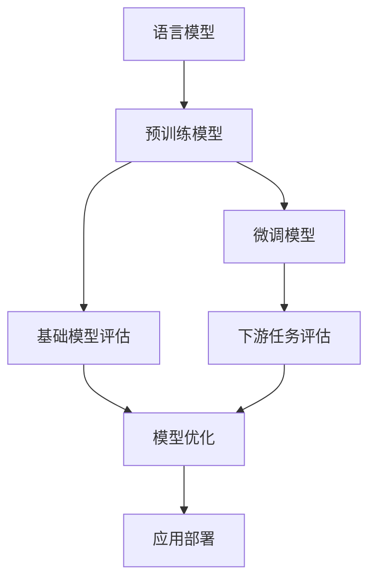

# 大规模语言模型从理论到实践 基础模型评估

## 1. 背景介绍

### 1.1 问题的由来

随着深度学习和人工智能技术的快速发展,大规模语言模型已成为自然语言处理领域的重要研究方向。近年来,通过利用海量文本数据和强大的计算能力训练出的大型语言模型(如GPT、BERT等)展现出了令人惊叹的语言理解和生成能力,在机器翻译、问答系统、文本摘要等多个应用场景中取得了突破性进展。

然而,训练出高质量的大规模语言模型并非易事。模型的性能很大程度上取决于训练数据的质量、模型架构的合理性、训练策略的有效性等多个因素。此外,大规模语言模型往往包含数十亿甚至上千亿参数,训练和推理过程的计算资源消耗巨大,给模型的工业化部署带来了挑战。

### 1.2 研究现状

目前,学术界和工业界都在持续推进大规模语言模型的研究和应用。一方面,研究人员不断探索更高效的模型架构、训练策略和优化方法,以提高模型的性能和泛化能力;另一方面,工程师们致力于降低模型的计算复杂度,实现高效的模型压缩和部署。

在模型评估方面,研究人员通常采用标准的基准测试集(如GLUE、SuperGLUE等)来评估模型在不同任务上的性能表现。然而,这些评估方法存在一定的局限性,难以全面反映模型的真实能力。

### 1.3 研究意义  

全面、客观地评估大规模语言模型的性能对于模型的持续优化和实际应用都至关重要。科学的评估方法不仅可以指导模型的改进方向,还能帮助用户选择最合适的模型以满足特定的应用需求。

此外,评估过程中发现的模型缺陷和局限性,将推动研究人员深入探讨语言模型的本质,促进相关理论的发展。通过不断地评估和改进,我们将能够训练出更加强大、鲁棒和可解释的语言模型,为人工智能系统的发展做出重要贡献。

### 1.4 本文结构

本文将系统地介绍大规模语言模型的评估方法,包括基本概念、评估指标、评估流程等内容。我们将探讨评估中的关键问题,分析现有方法的优缺点,并提出改进建议。此外,文中还将介绍一些实用的评估工具和资源,为读者提供全面的参考。

## 2. 核心概念与联系

在深入讨论大规模语言模型评估之前,我们需要先了解一些核心概念及其相互关系。

1. **语言模型(Language Model)**:语言模型是自然语言处理中的一种基本模型,旨在捕捉语言的统计规律,预测下一个词或字符的概率。

2. **预训练模型(Pre-trained Model)**:通过在大规模语料库上进行无监督预训练,获得通用的语言表示能力。预训练模型可用于下游任务,也可直接用于生成等应用。

3. **微调模型(Fine-tuned Model)**:在特定任务上对预训练模型进行进一步的监督微调训练,以获得针对该任务的专门模型。

4. **基础模型评估(Base Model Evaluation)**:评估预训练模型在通用任务上的性能表现,如掌握语言的理解和生成能力。

5. **下游任务评估(Downstream Task Evaluation)**:评估微调模型在特定任务上的性能,如文本分类、机器翻译等。

6. **模型优化(Model Optimization)**:根据评估结果对模型进行优化,包括调整模型架构、训练策略等。

7. **应用部署(Application Deployment)**:将优化后的模型部署到实际应用系统中,为用户提供服务。

上述概念相互关联,构成了大规模语言模型从理论到实践的完整流程。基础模型评估是确保预训练模型质量的关键环节,对后续的模型优化和应用部署至关重要。

## 3. 核心算法原理与具体操作步骤

### 3.1 算法原理概述

大规模语言模型的评估过程可以概括为以下几个核心步骤:

1. **数据准备**:构建高质量的评估数据集,包括文本数据和人工标注的参考答案。

2. **指标选择**:根据评估目标,选择合适的评估指标,如困惑度(Perplexity)、BLEU分数等。

3. **模型推理**:使用待评估的语言模型对评估数据进行推理,生成模型输出结果。

4. **结果评估**:将模型输出与参考答案进行对比,计算评估指标的分数。

5. **分析总结**:综合分析评估结果,发现模型的优缺点,为后续优化提供依据。

其中,第2步和第4步是评估过程中最为关键的环节,需要针对不同的评估目标选择合理的指标和评估方法。

### 3.2 算法步骤详解

下面我们将详细介绍大规模语言模型评估的具体操作步骤。

#### 3.2.1 数据准备

高质量的评估数据集是保证评估结果可信的基础。构建评估数据集通常包括以下步骤:

1. **数据采集**:从可靠的来源(如网络、书籍等)收集原始文本数据。

2. **数据清洗**:去除数据中的噪音、错误和冗余信息。

3. **数据标注**:邀请人工标注员为文本数据添加参考答案或标签。

4. **数据划分**:将数据划分为训练集、开发集和测试集。

5. **数据检查**:检查数据质量,确保标注的一致性和准确性。

在数据准备过程中,需要注意以下几点:

- 数据量要足够大,以覆盖语言的多样性。
- 数据应具有代表性,能够反映模型在实际应用场景中的表现。
- 标注质量对评估结果有重大影响,应确保标注的一致性和准确性。
- 数据集应包含不同难度级别的样本,以全面评估模型的能力。

#### 3.2.2 指标选择

评估指标的选择取决于评估目标和任务类型。常用的评估指标包括:

1. **困惑度(Perplexity)**:衡量语言模型在语料库上的概率预测能力。困惑度越低,模型的预测效果越好。

2. **BLEU分数(Bilingual Evaluation Understudy)**:用于评估机器翻译系统的输出质量,通过比较译文与参考译文的相似度来计算。

3. **精确率(Precision)、召回率(Recall)、F1分数(F1 Score)**:常用于评估分类、命名实体识别等任务的性能。

4. **准确率(Accuracy)**:计算模型预测正确的样本占总样本的比例。

5. **ROUGE分数(Recall-Oriented Understudy for Gisting Evaluation)**:用于评估文本摘要任务的性能。

6. **人工评分**:邀请人工评估员对模型输出进行主观评分,如流畅性、相关性等。

在实际评估中,通常需要结合多种指标进行综合评估,以全面了解模型的性能表现。此外,对于新兴的任务类型,可能需要设计新的评估指标。

#### 3.2.3 模型推理

在获得评估数据集和确定评估指标后,接下来需要使用待评估的语言模型对评估数据进行推理,生成模型输出结果。

对于生成类任务(如机器翻译、文本摘要等),模型推理的过程是:

1. 将评估数据的输入文本序列输入到语言模型。
2. 语言模型基于输入,自回归地生成输出序列。
3. 对输出序列进行必要的后处理(如去除特殊标记等)。

对于理解类任务(如文本分类、命名实体识别等),模型推理的过程是:

1. 将评估数据的输入文本序列输入到语言模型。
2. 语言模型输出对应的标签或概率分布。
3. 对模型输出进行必要的后处理(如概率阈值过滤等)。

在推理过程中,需要注意以下几点:

- 保证推理环境(如硬件、软件版本等)的一致性,以获得可重复的结果。
- 对于生成类任务,可以调整模型的生成策略(如topk、topp等)以获得更好的输出质量。
- 对于大规模语言模型,推理过程可能需要消耗大量计算资源,应采取合理的加速策略。

#### 3.2.4 结果评估

获得模型输出结果后,下一步是将其与参考答案进行对比,计算预先选定的评估指标的分数。

以BLEU分数为例,其计算过程如下:

1. 将模型输出的译文切分为n-gram序列。
2. 计算每个n-gram在参考译文中出现的次数。
3. 计算修剪的n-gram精确度。
4. 计算语料库的BLEU分数(结合不同n-gram的精确度)。

对于其他评估指标,计算方式也类似,都需要基于模型输出和参考答案进行统计和比较。

在评估过程中,需要注意以下几点:

- 对于某些指标(如BLEU),存在多种变体和计算方式,应选择合适的版本。
- 评估过程应当自动化,避免人工操作引入错误。
- 对于部分任务,可以结合多种评估指标进行综合评分。
- 除了自动评估外,也可以引入人工评估作为辅助和交叉验证。

#### 3.2.5 分析总结

完成评估指标的计算后,需要综合分析评估结果,发现模型的优缺点,为后续优化提供依据。

分析的重点包括:

1. **总体性能**:模型在不同任务和评估指标上的整体表现如何?与其他模型相比,性能是否有优势?

2. **细分分析**:模型在不同数据子集(如不同长度、不同主题等)上的表现是否存在差异?哪些类型的数据是模型的弱项?

3. **误差分析**:统计模型的典型错误类型,如语法错误、语义不连贯等,分析错误根源。

4. **能力分析**:评估模型在语言理解、推理、生成等不同能力方面的表现,找出需要加强的部分。

5. **效率分析**:评估模型的计算效率,包括推理速度、内存占用等,为工业化部署提供参考。

通过全面的分析,我们可以清晰地了解模型的现有水平,并为后续的模型优化和应用部署制定合理的策略。

### 3.3 算法优缺点

大规模语言模型评估算法具有以下优点:

1. **系统性**:评估过程分为数据准备、指标选择、模型推理、结果评估和分析总结等明确的步骤,具有很强的系统性和操作性。

2. **客观性**:基于定量的评估指标和参考答案,评估结果具有较高的客观性和可重复性。

3. **全面性**:通过构建多样化的评估数据集,并结合多种评估指标,可以全面评估模型在不同场景下的表现。

4. **指导性**:评估结果可以清晰地反映出模型的优缺点,为后续的模型优化提供明确的指导方向。

同时,该算法也存在以下缺点:

1. **标注成本高**:构建高质量的评估数据集需要大量的人工标注工作,耗时耗力。

2. **指标局限性**:现有评估指标难以完全捕捉语言的丰富性和复杂性,存在一定的局限性。

3. **参考答案偏差**:参考答案由人工标注获得,可能存在主观偏差,影响评估结果的准确性。

4. **计算资源消耗大**:对于大规模语言模型,评估过程需要消耗大量的计算资源,给工业化部署带来挑战。

5. **评估范围有限**:目前的评估方法主要关注