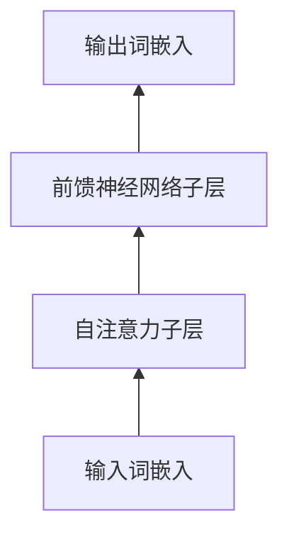

# 大规模语言模型从理论到实践 大语言模型的构建流程

关键词：大规模语言模型, 预训练, 微调, 迁移学习, Transformer, 自然语言处理, 深度学习

## 1. 背景介绍
### 1.1  问题的由来
随着人工智能技术的飞速发展,自然语言处理(NLP)领域也取得了长足的进步。其中,大规模语言模型的出现,为NLP带来了革命性的突破。这些模型能够从海量文本数据中学习语言知识,并应用于各种下游任务,如机器翻译、问答系统、情感分析等。然而,构建高质量的大规模语言模型并非易事,需要深入理解其背后的理论基础和实践经验。

### 1.2  研究现状
目前,业界已经提出了多种大规模语言模型,如GPT系列[1]、BERT[2]、XLNet[3]等。这些模型在多个NLP基准测试中取得了state-of-the-art的结果。研究人员不断探索新的模型架构和训练方法,以进一步提升模型性能。同时,大规模语言模型也面临一些挑战,如计算资源消耗大、训练时间长、模型解释性差等问题,仍需要学术界和工业界的共同努力来解决。

### 1.3  研究意义 
深入研究大规模语言模型的构建流程,对于推动NLP技术的发展具有重要意义。一方面,梳理语言模型的理论基础,有助于研究人员更好地理解其内在机制,为模型改进提供新的思路。另一方面,总结构建大模型的实践经验,可以指导工程师更高效地开发和部署语言模型,促进其在实际场景中的应用。此外,探讨语言模型面临的挑战,也为未来研究指明了方向。

### 1.4  本文结构
本文将全面介绍大规模语言模型的构建流程,从理论到实践,深入剖析其关键技术和方法。第2节阐述语言模型的核心概念和理论基础。第3节详细讲解语言模型的训练算法。第4节介绍语言模型常用的数学模型和公式。第5节以代码实例演示语言模型的实现过程。第6节讨论语言模型的实际应用场景。第7节推荐语言模型相关的工具和学习资源。第8节总结语言模型的研究现状和未来发展趋势。第9节附录语言模型常见问题解答。

## 2. 核心概念与联系
大规模语言模型的核心是利用深度神经网络,从大规模文本语料中学习语言知识和模式。其基本假设是:一个单词出现的概率,可以由其上下文(即周围的单词)决定。因此,语言模型的目标是估计一个句子或文本片段的概率分布:

$P(w_1, w_2, ..., w_n) = \prod_{i=1}^n P(w_i | w_1, ..., w_{i-1})$

其中,$w_1, w_2, ..., w_n$为句子中的单词序列。大规模语言模型通过学习单词的向量表示,刻画单词之间的语义关系,并基于这些表示计算条件概率。

当前主流的大规模语言模型基于Transformer[4]架构,利用自注意力机制建模单词之间的长距离依赖关系。一个典型的Transformer语言模型包含多个编码器层,每个编码器层由自注意力(Self-Attention)和前馈(Feed-Forward)两个子层组成:



多个编码器层堆叠而成深层网络,使模型能够学习到更加抽象和高层次的语言表示。

大规模语言模型的训练过程通常分为两个阶段:预训练(Pre-training)和微调(Fine-tuning)。预训练阶段在大规模无标注语料上训练模型,学习通用的语言知识。微调阶段在特定任务的标注数据上训练模型,使其适应具体应用。这种"预训练-微调"范式也被称为迁移学习(Transfer Learning),极大地提升了模型的性能和泛化能力。

## 3. 核心算法原理 & 具体操作步骤
### 3.1  算法原理概述
大规模语言模型的训练算法主要基于极大似然估计(Maximum Likelihood Estimation, MLE)。给定训练语料$\mathcal{D} = \{x_1, x_2, ..., x_N\}$,语言模型的目标是最大化如下似然函数:

$\mathcal{L}(\theta) = \prod_{i=1}^N P(x_i; \theta)$

其中,$\theta$为模型参数。在实践中,我们通常最大化似然函数的对数形式,即最小化负对数似然损失:

$\mathcal{J}(\theta) = -\frac{1}{N}\sum_{i=1}^N \log P(x_i; \theta)$

最小化该损失函数的过程,就是语言模型的训练过程。我们通过随机梯度下降(Stochastic Gradient Descent, SGD)等优化算法,迭代更新模型参数,使损失函数不断减小,直到收敛。

### 3.2  算法步骤详解
大规模语言模型的训练算法可分为以下步骤:

1. 数据准备:收集大规模无标注文本语料,进行清洗、分词、构建词表等预处理操作。
2. 模型构建:定义Transformer等语言模型的网络结构,初始化模型参数。
3. 模型预训练:
   - 从语料中采样一个批次(batch)的文本序列。 
   - 将文本序列转换为词嵌入向量,输入语言模型。
   - 前向计算模型输出,计算损失函数。
   - 反向传播梯度,更新模型参数。
   - 重复上述步骤,直到遍历完所有训练数据。
4. 模型微调:
   - 在下游任务的标注数据上,重复预训练过程。
   - 根据任务的评价指标,选择最优的模型参数。
5. 模型评估:在测试集上评估模型性能,分析错误样例,识别模型的局限性。
6. 模型部署:将训练好的模型集成到实际系统中,提供在线预测服务。

在超大规模语料上训练语言模型,对计算资源要求很高。因此,训练过程通常在多个GPU上并行进行,利用数据并行(Data Parallelism)和模型并行(Model Parallelism)的方式加速训练。

### 3.3  算法优缺点
大规模语言模型的优点包括:
- 从海量无标注数据中学习通用语言知识,减少对人工标注数据的依赖。
- 可迁移至各种下游NLP任务,显著提升任务性能。
- 生成的文本流畅自然,接近人类书写水平。

其缺点包括:  
- 模型参数量巨大,训练和推理成本高。
- 模型是黑盒子,缺乏可解释性。
- 学习到的语言模式可能带有偏见,产生不恰当的内容。

### 3.4  算法应用领域
大规模语言模型已在众多NLP任务中取得成功,包括但不限于:
- 机器翻译:将一种语言的文本翻译成另一种语言。
- 问答系统:根据给定问题生成自然语言答案。  
- 文本摘要:将长文本压缩成简洁的摘要。
- 对话系统:与用户进行多轮对话交互。
- 情感分析:判断文本所表达的情感倾向。

随着语言模型的不断发展,其应用领域也在不断扩展,为人机交互带来更多可能性。

## 4. 数学模型和公式 & 详细讲解 & 举例说明
### 4.1  数学模型构建
大规模语言模型的核心是Transformer架构。Transformer的创新在于引入自注意力机制,建模文本序列中元素之间的依赖关系。形式化地,Transformer的数学模型可表示为:

$\text{Transformer}(X) = \text{Softmax}(H^{(L)}W_o)$

其中,$X \in \mathbb{R}^{n \times d}$为输入序列的词嵌入矩阵,$n$为序列长度,$d$为词嵌入维度。$H^{(L)}$为$L$层Transformer编码器的输出,$W_o \in \mathbb{R}^{d \times V}$为输出层的权重矩阵,$V$为词表大小。

每一层Transformer编码器可表示为:

$H^{(l)} = \text{LayerNorm}(F^{(l)} + \text{Dropout}(\text{FFN}(F^{(l)})))$

$F^{(l)} = \text{LayerNorm}(H^{(l-1)} + \text{Dropout}(\text{SelfAttention}(H^{(l-1)})))$

其中,LayerNorm为层归一化,Dropout为随机失活,FFN为前馈神经网络,SelfAttention为自注意力机制。

自注意力机制捕捉序列元素之间的相关性,其数学形式为:

$\text{SelfAttention}(Q, K, V) = \text{softmax}(\frac{QK^T}{\sqrt{d_k}})V$

其中,$Q, K, V \in \mathbb{R}^{n \times d}$分别为查询(Query)、键(Key)、值(Value)矩阵,$d_k$为缩放因子。

### 4.2  公式推导过程
下面以Transformer编码器的前向传播过程为例,推导其数学公式。

首先,输入序列$X$通过词嵌入层和位置编码层,得到初始隐状态$H^{(0)}$:

$H^{(0)} = \text{Embedding}(X) + \text{PositionalEncoding}(X)$

然后,初始隐状态经过$L$层Transformer编码器,逐层更新隐状态。在第$l$层编码器中,先通过自注意力机制更新隐状态:

$F^{(l)} = \text{LayerNorm}(H^{(l-1)} + \text{Dropout}(\text{SelfAttention}(H^{(l-1)})))$

自注意力机制将上一层隐状态$H^{(l-1)}$分别作为查询矩阵$Q$、键矩阵$K$和值矩阵$V$,计算注意力权重:

$\text{SelfAttention}(H^{(l-1)}) = \text{softmax}(\frac{H^{(l-1)}W_q(H^{(l-1)}W_k)^T}{\sqrt{d_k}})H^{(l-1)}W_v$

其中,$W_q, W_k, W_v \in \mathbb{R}^{d \times d}$为可学习的权重矩阵。注意力输出经过Dropout和残差连接,再通过层归一化得到$F^{(l)}$。

接着,$F^{(l)}$经过前馈神经网络FFN,再次更新隐状态:

$H^{(l)} = \text{LayerNorm}(F^{(l)} + \text{Dropout}(\text{FFN}(F^{(l)})))$

其中,FFN由两层全连接网络组成:

$\text{FFN}(x) = \text{ReLU}(xW_1 + b_1)W_2 + b_2$

最后,第$L$层编码器的输出$H^{(L)}$通过Softmax层,得到最终的预测概率分布:

$P(y|X) = \text{Softmax}(H^{(L)}W_o)$

其中,$y$为预测的目标词。

### 4.3  案例分析与讲解
下面以一个简单的例子,说明Transformer语言模型的工作原理。假设我们有以下输入序列:

```
<s> The cat sat on the mat . </s>
```

其中,`<s>`和`</s>`分别为句首和句尾标记。将该序列转换为词嵌入向量,输入Transformer模型。

在第一层编码器中,自注意力机制计算每个词与其他词之间的相关性。例如,对于词`cat`,自注意力机制会识别出与其语义相关的词,如`sat`和`mat`,并赋予较大的注意力权重。经过多层编码器,模型能够学习到词与词之间的长距离依赖关系。

最后,模型基于编码器的输出,预测下一个词。例如,给定前缀`The cat sat on the`,模型会预测下一个词最可能是`mat`,因为在训练语料中,`mat`经常出现在`sat on the`之后。

通过这种自注意力机制和深层网络结构,Transformer语言模型