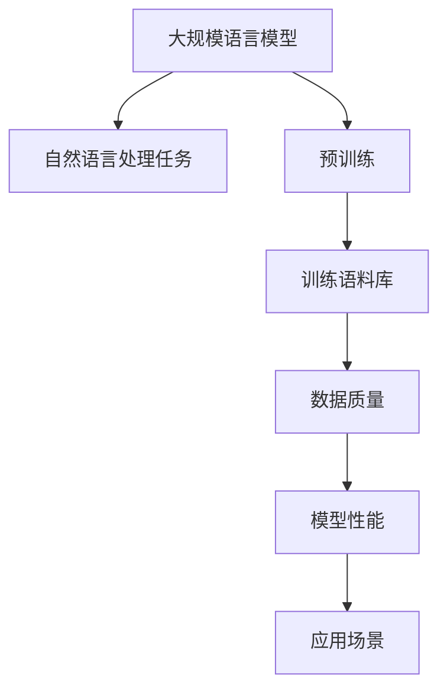

# 大规模语言模型从理论到实践：数据质量

## 1. 背景介绍

### 1.1 问题的由来

在过去几年中,大规模语言模型(Large Language Models, LLMs)在自然语言处理(NLP)领域掀起了一场革命。这些模型通过在海量文本数据上进行预训练,展现出惊人的泛化能力,可以应用于广泛的下游任务,例如机器翻译、问答系统、文本生成等。然而,训练这些庞大的语言模型需要消耗大量的计算资源,而且模型的性能在很大程度上取决于训练数据的质量。

随着模型规模的不断扩大,数据质量问题变得更加突出。低质量的训练数据不仅会导致模型性能下降,还可能引入不良偏见,产生有害或不当的输出。因此,确保训练数据的高质量对于构建可靠、公平和有效的大规模语言模型至关重要。

### 1.2 研究现状

目前,数据质量问题已经受到了广泛关注,研究人员提出了多种方法来评估和改进训练数据的质量。常见的方法包括:

1. **数据清洗**: 通过去除重复、错误和噪声数据,提高数据质量。
2. **数据平衡**: 确保训练数据在不同类别、主题或语言之间保持平衡,避免模型产生偏差。
3. **数据增强**: 通过数据扩充、翻译或其他技术,扩大训练数据的覆盖面和多样性。
4. **人工标注**: 通过人工标注,提高训练数据的准确性和一致性。
5. **数据质量评估指标**: 开发各种指标来量化数据质量,例如多样性、一致性和相关性等。

然而,由于大规模语言模型所需的训练数据规模巨大,上述方法在实践中仍然面临诸多挑战,例如人工标注的高成本、数据增强的局限性等。因此,需要开发更有效、可扩展的数据质量评估和改进方法,以满足大规模语言模型训练的需求。

### 1.3 研究意义

提高大规模语言模型训练数据的质量,对于构建更加准确、公平和可靠的自然语言处理系统具有重要意义。高质量的训练数据不仅可以提升模型的性能,还能减少模型在实际应用中产生有害或不当输出的风险。此外,优质的训练数据也有助于模型更好地捕捉语言的多样性和复杂性,从而提高模型的泛化能力。

因此,研究大规模语言模型训练数据的质量评估和改进方法,对于推动自然语言处理技术的发展、提高人工智能系统的可靠性和公平性具有重要意义。

### 1.4 本文结构

本文将全面探讨大规模语言模型训练数据的质量问题,包括以下主要内容:

1. 介绍大规模语言模型的核心概念和原理,以及它们与训练数据质量之间的关系。
2. 详细阐述核心算法和数学模型,用于评估和改进训练数据的质量。
3. 提供实际项目实践中的代码示例和解释,帮助读者更好地理解和应用相关技术。
4. 探讨大规模语言模型在实际应用场景中的数据质量挑战和解决方案。
5. 推荐相关工具、资源和未来发展趋势,为读者提供更多学习和实践的机会。

## 2. 核心概念与联系

在探讨大规模语言模型训练数据的质量问题之前,我们需要先了解一些核心概念和它们之间的联系。

1. **大规模语言模型(LLMs)**: 指具有数十亿甚至上万亿参数的庞大神经网络模型,通过在海量文本数据上进行预训练,学习语言的统计规律和语义信息。常见的大规模语言模型包括GPT、BERT、T5等。

2. **自然语言处理(NLP)任务**: 大规模语言模型可以应用于各种自然语言处理任务,如机器翻译、文本生成、问答系统、情感分析等。

3. **预训练**: 大规模语言模型通过在海量文本数据上进行无监督预训练,学习通用的语言表示,从而获得强大的泛化能力。

4. **训练语料库**: 用于预训练大规模语言模型的海量文本数据集,通常来自互联网、书籍、新闻等多种来源。

5. **数据质量**: 训练语料库的质量对模型性能有着重大影响,包括数据的准确性、多样性、一致性、相关性等多个方面。

6. **模型性能**: 高质量的训练数据可以提升大规模语言模型在各种下游任务上的性能表现。

7. **应用场景**: 大规模语言模型在诸如机器翻译、问答系统、内容创作等多个领域都有广泛的应用前景。

可以看出,训练语料库的质量是影响大规模语言模型性能的关键因素之一。因此,评估和改进训练数据的质量对于构建高性能、可靠的大规模语言模型至关重要。

## 3. 核心算法原理及具体操作步骤

### 3.1 算法原理概述

评估和改进大规模语言模型训练数据的质量,通常需要综合运用多种算法和技术。这些算法主要涉及以下几个方面:

1. **数据清洗**: 通过去除重复、错误和噪声数据,提高训练语料库的质量。常用的算法包括基于规则的过滤、近重复检测、异常值检测等。

2. **数据平衡**: 确保训练语料库在不同类别、主题或语言之间保持平衡,避免模型产生偏差。可以使用过采样、欠采样等算法实现数据平衡。

3. **数据增强**: 通过数据扩充、翻译或其他技术,扩大训练语料库的覆盖面和多样性。常见的数据增强技术包括回译、上采样、数据合成等。

4. **数据质量评估**: 开发各种指标来量化训练语料库的质量,例如多样性、一致性和相关性等。这些指标可以用于监控和优化数据质量。

5. **主动学习**: 通过主动学习算法,智能地选择最有价值的数据进行人工标注,从而提高训练语料库的质量和覆盖面。

6. **迁移学习**: 利用已有的高质量数据集,通过迁移学习技术,将知识迁移到目标训练语料库,提高其质量。

这些算法和技术可以单独使用,也可以相互结合,形成一个完整的数据质量评估和改进流程。下面我们将详细介绍其中的核心算法原理和具体操作步骤。

### 3.2 算法步骤详解

#### 3.2.1 数据清洗算法

数据清洗是提高训练语料库质量的基础步骤。常用的数据清洗算法包括:

1. **基于规则的过滤**:
   - 步骤1: 定义一系列规则,例如过滤包含特定关键词、长度超过阈值的数据等。
   - 步骤2: 遍历训练语料库,对每条数据应用规则进行过滤。
   - 步骤3: 保留符合规则的数据,过滤掉不符合规则的数据。

2. **近重复检测**:
   - 步骤1: 计算训练语料库中每对数据之间的相似度。
   - 步骤2: 设置相似度阈值,将相似度超过阈值的数据对视为近重复。
   - 步骤3: 从每个近重复数据对中保留一条数据,过滤掉其他数据。

3. **异常值检测**:
   - 步骤1: 对训练语料库进行特征提取,例如提取文本长度、词频等特征。
   - 步骤2: 使用异常检测算法(如基于距离的方法、基于密度的方法等)识别异常值。
   - 步骤3: 过滤掉识别出的异常值数据。

通过上述算法,我们可以有效地去除训练语料库中的重复、错误和噪声数据,提高数据质量。

#### 3.2.2 数据平衡算法

为了避免大规模语言模型产生偏差,我们需要确保训练语料库在不同类别、主题或语言之间保持平衡。常用的数据平衡算法包括:

1. **过采样**:
   - 步骤1: 统计训练语料库中每个类别的数据量。
   - 步骤2: 对于数据量较少的类别,通过随机复制现有数据,增加该类别的数据量。
   - 步骤3: 重复步骤2,直到所有类别的数据量达到平衡。

2. **欠采样**:
   - 步骤1: 统计训练语料库中每个类别的数据量。
   - 步骤2: 对于数据量较多的类别,随机删除部分数据,减少该类别的数据量。
   - 步骤3: 重复步骤2,直到所有类别的数据量达到平衡。

3. **生成式数据增强**:
   - 步骤1: 针对数据量较少的类别,使用生成式模型(如GPT)生成新的合成数据。
   - 步骤2: 将生成的合成数据添加到训练语料库中,增加该类别的数据量。
   - 步骤3: 重复步骤1和2,直到所有类别的数据量达到平衡。

通过上述算法,我们可以有效地实现训练语料库的数据平衡,减少大规模语言模型产生偏差的风险。

### 3.3 算法优缺点

上述算法在评估和改进大规模语言模型训练数据的质量方面具有一定的优缺点:

**优点**:

1. 可以有效地去除训练语料库中的重复、错误和噪声数据,提高数据质量。
2. 通过数据平衡和增强技术,可以扩大训练语料库的覆盖面和多样性,减少模型偏差。
3. 主动学习和迁移学习等算法可以智能地选择高质量数据,提高数据质量和覆盖面。
4. 各种数据质量评估指标可以量化和监控训练语料库的质量,为优化提供依据。

**缺点**:

1. 一些算法(如人工标注、数据合成等)可能存在高成本或质量不稳定的问题。
2. 某些算法(如数据增强)可能会引入新的噪声或偏差,需要谨慎使用。
3. 评估数据质量的指标可能存在局限性,无法全面反映数据质量。
4. 算法的参数设置和组合需要大量的实验和调优,增加了工作量。

因此,在实际应用中,需要根据具体情况选择合适的算法组合,并进行充分的实验和调优,以获得最佳的数据质量改进效果。

### 3.4 算法应用领域

上述算法可以广泛应用于各种需要大规模语言模型的自然语言处理任务,包括但不限于:

1. **机器翻译**: 通过提高训练数据的质量,可以提升机器翻译系统的准确性和流畅度。
2. **文本生成**: 高质量的训练数据可以帮助语言模型生成更加连贯、多样和相关的文本内容。
3. **问答系统**: 优质的训练数据有助于构建更加准确和全面的问答知识库,提高问答系统的性能。
4. **情感分析**: 通过平衡和增强情感数据,可以提高情感分析模型对不同情感类别的识别能力。
5. **语音识别**: 高质量的语音转文本数据可以提升语音识别系统的准确率和鲁棒性。
6. **自动摘要**: 优质的训练数据有助于生成更加准确、连贯和信息丰富的文本摘要。

总的来说,提高大规模语言模型训练数据的质量对于各种自然语言处理任务都具有重要意义,可以显著提升模型的性能和可靠性。

## 4. 数学模型和公式详细讲解