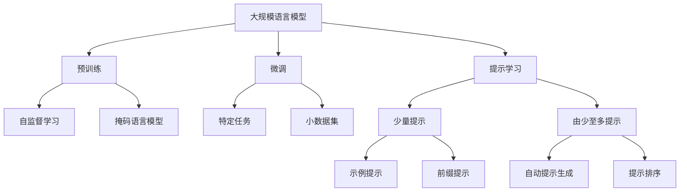

# 大规模语言模型从理论到实践 由少至多提示

## 1. 背景介绍

### 1.1 问题的由来

随着人工智能技术的不断发展,大规模语言模型在自然语言处理领域取得了令人瞩目的成就。这些模型通过在海量文本数据上进行预训练,能够捕捉到丰富的语义和上下文信息,从而在下游任务中表现出惊人的泛化能力。然而,训练这些大规模语言模型需要消耗大量的计算资源,并且存在一些潜在的风险和挑战,例如模型偏差、隐私和安全性问题等。

### 1.2 研究现状

目前,一些科技巨头和研究机构已经开发出了多种大规模语言模型,如OpenAI的GPT系列、谷歌的BERT、微软的Turing NLG等。这些模型在自然语言生成、理解、问答等任务中表现出色,推动了自然语言处理技术的发展。然而,训练这些大规模模型需要消耗大量的计算资源,导致了高昂的能源和碳排放成本。同时,由于模型训练所使用的数据可能存在偏差,因此生成的输出也可能具有潜在的偏差和不当内容。

### 1.3 研究意义

优化大规模语言模型的训练过程,提高模型的性能和效率,降低计算资源的消耗,是当前自然语言处理领域的一个重要研究课题。通过探索新的训练方法和策略,如少量提示(Few-shot prompting)、由少至多提示(From-Few-to-More prompting)等,我们可以在保持模型性能的同时,大幅降低训练成本和计算资源的消耗。同时,这些新的训练策略也可以帮助缓解模型偏差和不当内容的问题,提高模型的鲁棒性和可解释性。

### 1.4 本文结构

本文将从理论和实践两个角度,深入探讨大规模语言模型的训练策略,重点关注少量提示和由少至多提示等新兴方法。我们将介绍这些方法的基本原理和算法流程,分析它们的优缺点和适用场景。同时,我们也将提供具体的代码实现和案例分析,帮助读者更好地理解和掌握这些技术。最后,我们将总结未来的发展趋势和面临的挑战,为读者提供一个全面的视角。

## 2. 核心概念与联系

在深入探讨大规模语言模型的训练策略之前,我们需要先了解一些核心概念和它们之间的联系。

1. **大规模语言模型**：指具有数十亿甚至上百亿参数的巨大神经网络模型,通过在大量文本数据上进行预训练,能够捕捉丰富的语义和上下文信息。
2. **预训练**：使用自监督学习方法(如掩码语言模型)在大规模文本语料库上对模型进行初始化训练,获得通用的语言表示能力。
3. **微调**：在预训练的基础上,使用特定任务的小数据集对模型进行进一步调整和优化,以适应特定的下游任务。
4. **提示学习**：一种新兴的训练范式,通过设计特定的文本提示,引导语言模型生成所需的输出,避免了传统的从头训练或微调的方式。
5. **少量提示**：在提示学习中,使用少量的示例数据作为提示,引导模型生成所需的输出。
6. **由少至多提示**：一种提示学习的变体,通过自动生成和排序多个提示,并逐步增加提示数量,以提高模型的性能和泛化能力。

这些概念相互关联,共同构建了大规模语言模型的训练和应用框架。预训练为模型提供了通用的语言表示能力,而微调和提示学习则使模型能够适应特定的下游任务。少量提示和由少至多提示等新兴方法旨在优化模型的训练过程,提高效率和性能。

## 3. 核心算法原理与具体操作步骤

### 3.1 算法原理概述

**少量提示(Few-shot prompting)**和**由少至多提示(From-Few-to-More prompting)**是两种新兴的大规模语言模型训练策略,旨在提高模型的效率和性能。它们属于提示学习(Prompting)的范畴,通过设计特定的文本提示,引导语言模型生成所需的输出,避免了传统的从头训练或微调的方式。

**少量提示**的核心思想是使用少量的示例数据作为提示,引导模型生成所需的输出。这种方法的优点是可以在小数据集上快速适应新任务,避免了昂贵的从头训练或微调过程。但是,由于示例数据的数量有限,模型的性能和泛化能力可能受到影响。

**由少至多提示**则是少量提示的一种变体和扩展。它的核心思想是通过自动生成和排序多个提示,并逐步增加提示数量,以提高模型的性能和泛化能力。这种方法结合了少量提示的高效性和大量数据训练的优势,旨在在保持高效的同时,提高模型的性能和鲁棒性。

### 3.2 算法步骤详解

#### 3.2.1 少量提示算法步骤

1. **准备示例数据**：从任务数据集中选择少量的示例数据作为提示。
2. **设计提示格式**：根据任务的性质,设计合适的提示格式,将示例数据转换为文本提示。常见的提示格式包括示例提示(Example Prompting)和前缀提示(Prefix Prompting)。
3. **模型推理**：将设计好的文本提示输入到预训练的语言模型中,让模型根据提示生成所需的输出。
4. **输出后处理**：对模型生成的输出进行必要的后处理,如去除特殊标记、格式化等。

#### 3.2.2 由少至多提示算法步骤

1. **准备示例数据**：从任务数据集中选择一定数量的示例数据作为初始提示。
2. **自动提示生成**：使用特定的策略(如模板、规则、机器学习等)自动生成多个不同的提示。
3. **提示排序**：根据一定的评估指标(如模型置信度、损失函数等),对生成的提示进行排序。
4. **迭代训练**：
    a. 使用排序后的前几个提示,对模型进行推理和评估。
    b. 根据评估结果,逐步增加使用的提示数量,重复进行推理和评估。
    c. 直到达到预设的提示数量或性能阈值,停止迭代。
5. **输出后处理**：对最终模型生成的输出进行必要的后处理。

### 3.3 算法优缺点

#### 少量提示算法

**优点**：
- 高效性:避免了昂贵的从头训练或微调过程,可以快速适应新任务。
- 数据效率:只需少量示例数据,即可引导模型生成所需的输出。
- 可解释性:通过设计合理的提示格式,可以提高模型的可解释性。

**缺点**：
- 性能限制:由于示例数据的数量有限,模型的性能和泛化能力可能受到影响。
- 提示设计:设计高质量的提示格式需要一定的经验和技巧。
- 任务依赖:不同任务可能需要不同的提示格式,缺乏通用性。

#### 由少至多提示算法

**优点**：
- 性能提升:通过逐步增加提示数量,可以提高模型的性能和泛化能力。
- 高效性:相比从头训练或微调,仍然具有较高的数据和计算效率。
- 自动化:提示生成和排序过程可以自动化,降低人工成本。

**缺点**：
- 计算开销:虽然比从头训练或微调更高效,但仍需要一定的计算资源进行迭代训练。
- 超参数调优:需要调整提示生成、排序和迭代训练的各种超参数。
- 噪声敏感:自动生成的提示可能包含噪声,影响模型的性能。

### 3.4 算法应用领域

少量提示和由少至多提示算法可以应用于各种自然语言处理任务,如文本分类、机器翻译、问答系统、文本生成等。它们尤其适用于以下场景:

- **小数据集任务**:当任务数据集较小时,传统的从头训练或微调方法可能会导致过拟合,而少量提示和由少至多提示算法可以更好地利用小数据集。
- **快速适应新任务**:当需要快速适应新的任务或领域时,这些算法可以避免昂贵的从头训练或微调过程,提高效率。
- **可解释性要求**:通过设计合理的提示格式,可以提高模型的可解释性,满足一些应用场景的需求。
- **计算资源受限**:当计算资源受限时,这些算法可以在保持一定性能的同时,大幅降低计算和能源成本。

## 4. 数学模型和公式详细讲解与举例说明

在探讨少量提示和由少至多提示算法时,我们需要了解一些相关的数学模型和公式,以更好地理解它们的原理和实现方式。

### 4.1 数学模型构建

#### 4.1.1 语言模型

语言模型是自然语言处理任务的基础,它旨在学习文本序列的概率分布。给定一个文本序列 $X = (x_1, x_2, \dots, x_n)$,语言模型的目标是估计该序列的概率 $P(X)$。根据链式法则,我们可以将 $P(X)$ 分解为:

$$P(X) = \prod_{i=1}^{n} P(x_i | x_1, \dots, x_{i-1})$$

其中 $P(x_i | x_1, \dots, x_{i-1})$ 表示在给定前 $i-1$ 个词的情况下,第 $i$ 个词出现的条件概率。

神经网络语言模型通常采用自回归(Autoregressive)的方式,使用前馈神经网络或循环神经网络等模型结构来估计上述条件概率。

#### 4.1.2 掩码语言模型

掩码语言模型(Masked Language Model, MLM)是一种自监督学习方法,常用于预训练大规模语言模型。它的基本思想是在输入序列中随机掩码一部分词,然后让模型根据上下文预测这些被掩码的词。

具体来说,给定一个输入序列 $X = (x_1, x_2, \dots, x_n)$,我们随机选择一些位置进行掩码,得到掩码后的序列 $\tilde{X} = (\tilde{x}_1, \tilde{x}_2, \dots, \tilde{x}_n)$,其中被掩码的位置用特殊标记 [MASK] 替代。模型的目标是最大化被掩码位置的词的条件概率:

$$\max_{\theta} \sum_{i=1}^{n} \log P(x_i | \tilde{X}, \theta)$$

其中 $\theta$ 表示模型参数。通过这种方式,模型可以学习到丰富的语义和上下文信息,为下游任务奠定基础。

### 4.2 公式推导过程

在少量提示和由少至多提示算法中,我们需要计算模型对于给定提示的输出概率,以便进行提示排序和模型评估。下面我们将推导这一概率公式。

假设我们有一个提示 $P = (p_1, p_2, \dots, p_m)$,期望模型生成一个目标输出序列 $Y = (y_1, y_2, \dots, y_n)$。根据语言模型的定义,我们可以将输出序列的概率表示为:

$$P(Y | P) = \prod_{i=1}^{n} P(y_i | P, y_1, \dots, y_{i-1})$$

进一