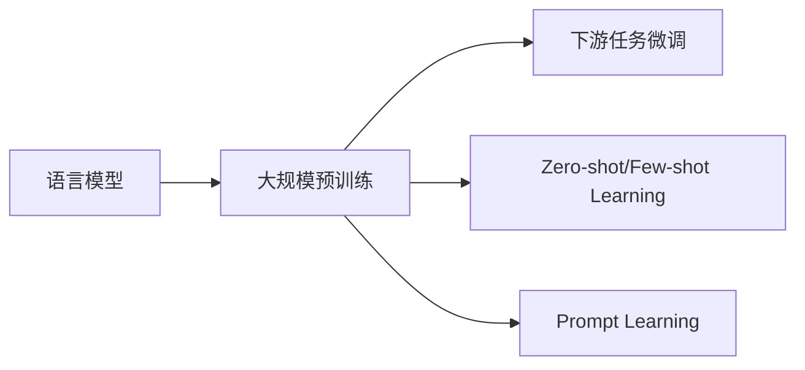

# 大规模语言模型从理论到实践 知识与能力

作者：禅与计算机程序设计艺术 / Zen and the Art of Computer Programming

## 1. 背景介绍
### 1.1 问题的由来
近年来，随着深度学习技术的飞速发展，大规模语言模型(Large Language Models, LLMs)已经成为自然语言处理(Natural Language Processing, NLP)领域的研究热点和前沿方向。LLMs通过在海量文本数据上进行预训练，能够学习到丰富的语言知识和通用语言表示，在机器翻译、对话系统、文本摘要、问答系统等诸多NLP任务上取得了显著的性能提升。然而，如何从理论到实践有效构建和应用LLMs仍面临诸多挑战，亟需系统性的研究和探索。

### 1.2 研究现状
学术界和工业界围绕LLMs开展了广泛而深入的研究。从理论角度，研究人员提出了一系列创新的模型架构和训练范式，如Transformer[1]、GPT[2]、BERT[3]等，极大地推动了LLMs的发展。从实践角度，谷歌、OpenAI、微软等科技巨头通过构建超大规模语料库和先进的计算平台，训练出了性能卓越的LLMs，如GPT-3[4]、PaLM[5]、Megatron-Turing NLG[6]等，展现了LLMs在实际应用中的巨大潜力。

### 1.3 研究意义
系统性地研究LLMs从理论到实践的关键技术和方法，对于推动NLP乃至人工智能的发展具有重要意义。一方面，有助于加深对语言认知和机器学习本质的理解，促进人工智能基础理论的创新。另一方面，研究成果可以指导构建高质量、高性能的LLMs，提升其在实际场景中的适用性和有效性，为智能对话、知识图谱、语义搜索等应用提供关键支撑，产生显著的经济和社会效益。

### 1.4 本文结构
本文将系统梳理LLMs从理论到实践的核心知识与关键能力。第2节介绍LLMs的核心概念与内在联系。第3节重点阐述LLMs的核心算法原理和具体操作步骤。第4节深入剖析LLMs涉及的数学模型和公式。第5节通过代码实例和详细解释，展示如何实践实现LLM。第6节讨论LLMs的实际应用场景。第7节推荐LLMs相关的工具和学习资源。第8节总结全文并展望未来。第9节附录了常见问题解答。

## 2. 核心概念与联系
大规模语言模型的核心概念包括：

- **语言模型(Language Model)**：刻画自然语言中词语/字符序列概率分布的数学模型。给定上文，语言模型能够预测下一个最可能出现的词语/字符。常见的语言模型有N-gram、RNN、Transformer等。

- **预训练(Pre-training)**：在大规模无标注语料上，通过自监督学习任务训练通用语言表示的过程。预训练使模型学习到语言的基本规律和知识，为下游任务提供良好的初始化参数。代表性的预训练模型有BERT、GPT、T5等。

- **微调(Fine-tuning)**：在预训练的基础上，使用任务特定的标注数据对模型进行进一步训练，使其适应具体任务的过程。微调能够充分利用预训练模型学习到的通用语言知识，显著提升模型在下游任务上的性能。

- **Zero-shot/Few-shot Learning**：模型无需或仅需极少的任务特定训练样本，即可在新任务上取得良好性能的能力。得益于在海量语料上学习到的丰富知识，大规模预训练语言模型具备较强的零样本/少样本学习能力。

- **Prompt Learning**：通过设计恰当的输入提示(Prompt)来引导语言模型执行特定任务的范式。它将任务转化为语言模型的文本生成问题，充分利用其在预训练阶段习得的语言知识。

这些核心概念之间有着密切的内在联系。大规模语言模型通过预训练习得通用语言知识和表示，再经微调适应下游任务。得益于强大的语言建模能力，它们展现出优异的零样本/少样本学习能力。Prompt Learning则是一种巧妙利用语言模型知识的新范式。这些概念和技术共同推动了大规模语言模型的蓬勃发展。

## 3. 核心算法原理 & 具体操作步骤
### 3.1 算法原理概述
大规模语言模型的核心算法主要基于Transformer[1]架构和自监督学习范式。Transformer使用自注意力机制建模文本序列内和序列间的依赖关系，相比RNN/CNN等模型，能够更有效地捕捉长距离依赖和全局语义。在自监督预训练中，常用的目标函数包括：

- **Language Modeling (LM)**：对文本序列的下一个词进行预测。给定上文 $x_1,\dots,x_t$，最大化下一个词 $x_{t+1}$ 的条件概率 $P(x_{t+1}|x_1,\dots,x_t)$。
- **Masked Language Modeling (MLM)**：随机Mask掉文本序列中的部分词，并训练模型预测被Mask词。例如BERT[3]使用这一目标函数。
- **Permuted Language Modeling (PLM)**：将文本序列按照某种策略打乱顺序，预测下一个词。例如XLNet[7]使用这一目标函数。
- **Denoising Autoencoder (DAE)**：对输入文本施加噪声(如删除、替换、置换词)，训练模型恢复原始文本。例如BART[8]使用这一目标函数。

### 3.2 算法步骤详解
以BERT为例，其预训练的具体步骤如下：

**输入表示：**
1. 将输入文本 $\mathbf{x} = [x_1,\dots,x_n]$ 转化为词嵌入向量 $\mathbf{E} = [\mathbf{e}_1,\dots,\mathbf{e}_n]$。
2. 添加位置嵌入向量 $\mathbf{P} = [\mathbf{p}_1,\dots,\mathbf{p}_n]$，编码每个词的位置信息。
3. 对于句子对任务，添加段落嵌入向量 $\mathbf{S} = [\mathbf{s}_1,\dots,\mathbf{s}_n]$，区分两个句子。
4. 将上述嵌入向量相加，得到最终的输入表示 $\mathbf{H}^{(0)} = \mathbf{E} + \mathbf{P} + \mathbf{S}$。

**Transformer编码：**
1. 多头自注意力(Multi-Head Self-Attention)：将 $\mathbf{H}^{(l-1)}$ 线性变换为查询矩阵 $\mathbf{Q}$、键矩阵 $\mathbf{K}$、值矩阵 $\mathbf{V}$，按下式计算注意力输出。其中 $h$ 为注意力头数，$d_k$ 为每个头的维度。
$$
\text{head}_i = \text{Attention}(\mathbf{Q}_i, \mathbf{K}_i, \mathbf{V}_i) = \text{softmax}(\frac{\mathbf{Q}_i\mathbf{K}_i^T}{\sqrt{d_k}})\mathbf{V}_i
$$
$$
\text{MultiHead}(\mathbf{Q}, \mathbf{K}, \mathbf{V}) = \text{Concat}(\text{head}_1,\dots,\text{head}_h)\mathbf{W}^O
$$

2. 前馈全连接层(Feed-Forward Networks)：经过两层全连接和非线性激活，增强特征交互和非线性表达能力。
$$
\text{FFN}(\mathbf{x}) = \text{ReLU}(\mathbf{x}\mathbf{W}_1 + \mathbf{b}_1)\mathbf{W}_2 + \mathbf{b}_2
$$

3. 层归一化(Layer Normalization)和残差连接(Residual Connection)：稳定训练过程，避免梯度消失/爆炸。

**预训练目标：**
1. MLM：随机选择 15% 的词进行 Mask，其中 80% 替换为 [MASK] 符号，10% 替换为随机词，10% 保持不变。训练模型预测这些 Mask 位置的原始词。
2. Next Sentence Prediction (NSP)：输入句子对 (A,B)，训练模型判断 B 是否为 A 的下一句。正样本为语料中连续的句子对，负样本为随机采样的不相关句子对。

在大规模无标注语料上预训练后，模型习得了丰富的语言知识和上下文表示能力，可用于下游NLP任务。

### 3.3 算法优缺点
大规模语言模型的优点包括：
- 通过预训练习得强大的语言理解和生成能力，可用于各类NLP任务。
- 充分利用无标注语料，减少对人工标注数据的依赖。
- 具备一定的常识推理和语言泛化能力。

其缺点包括：
- 模型参数量巨大，训练和推理成本高。
- 语言知识获取难以解释，存在偏见风险。
- 在某些任务上仍需大量标注数据微调。
- 对低资源语言和特定领域的适应性有待提高。

### 3.4 算法应用领域
大规模语言模型已在多个NLP任务上取得SOTA性能，广泛应用于：
- 机器翻译：将源语言文本转换为目标语言文本。
- 智能对话：人机交互、客服聊天、虚拟助手等。
- 文本分类：情感分析、主题分类、意图识别等。
- 信息抽取：实体识别、关系抽取、事件抽取等。
- 文本生成：写作助手、数据增强、风格迁移等。
- 语义匹配：相似问题检索、句子匹配、文本蕴含等。
- 阅读理解：片段抽取式/自由式问答。

## 4. 数学模型和公式 & 详细讲解 & 举例说明
### 4.1 数学模型构建
大规模语言模型的数学基础是统计语言模型。给定文本序列 $\mathbf{x} = [x_1,\dots,x_n]$，语言模型的目标是估计其概率分布 $P(\mathbf{x})$。根据概率链式法则，这可以分解为一系列条件概率乘积：

$$
P(\mathbf{x}) = \prod_{t=1}^n P(x_t|x_1,\dots,x_{t-1})
$$

其中 $P(x_t|x_1,\dots,x_{t-1})$ 表示在给定上文 $x_1,\dots,x_{t-1}$ 的条件下，当前词 $x_t$ 的条件概率。语言模型的任务就是学习这个条件概率分布。

Transformer作为大规模语言模型的主流架构，其核心是自注意力机制和前馈全连接层。对于第 $l$ 层第 $i$ 个注意力头，其数学表达为：

$$
\text{head}_i^{(l)} = \text{Attention}(\mathbf{Q}_i^{(l)}, \mathbf{K}_i^{(l)}, \mathbf{V}_i^{(l)}) = \text{softmax}(\frac{\mathbf{Q}_i^{(l)}(\mathbf{K}_i^{(l)})^T}{\sqrt{d_k}})\mathbf{V}_i^{(l)}
$$

其中 $\mathbf{Q}_i^{(l)}, \mathbf{K}_i^{(l)}, \mathbf{V}_i^{(l)}$ 分别为查询矩阵、键矩阵、值矩阵，由上一层输出 $\mathbf{H}^{(l-1)}$ 线性变换得到：

$$
\mathbf{Q}_i^{(l)} = \mathbf{H}^{(l-1)}\mathbf{W}_i^{Q(l)}, \quad
\mathbf{K}_i^{(l)} = \mathbf{H}^{(l-1)}\mathbf{W}_i^{K(l)}, \quad
\mathbf{V}_i^{(l)} = \mathbf{H}^{(l-1)}\mathbf{W}_i^{V(l)}
$$

多头注意力的输出为各头输出的拼接：

$$
\text{MultiHea