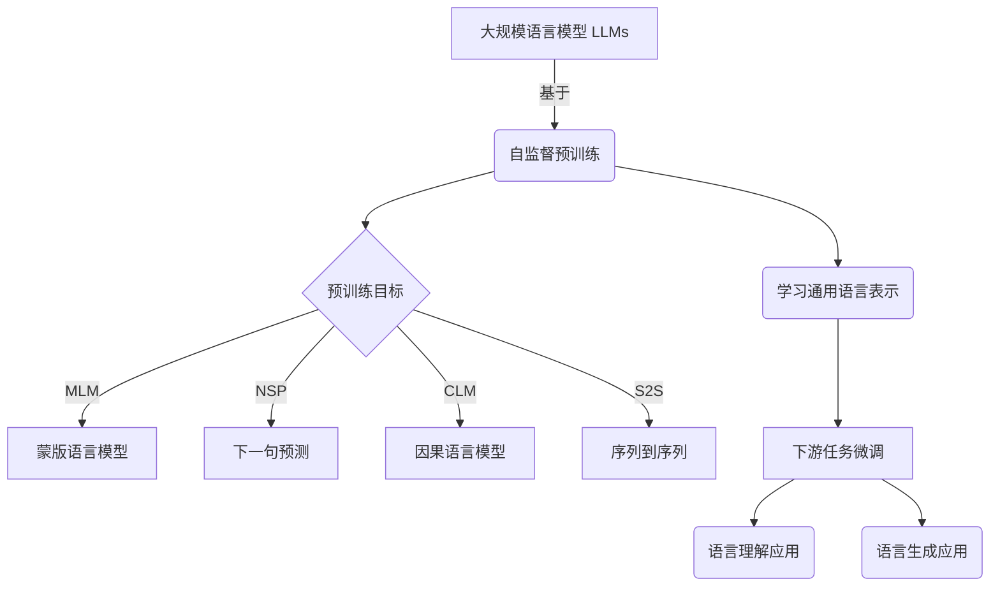

以下是《大规模语言模型从理论到实践 绪论》的正文内容：

# 大规模语言模型从理论到实践 绪论

## 1. 背景介绍

### 1.1 问题的由来

随着人工智能技术的不断发展,大规模语言模型(Large Language Models, LLMs)已经成为自然语言处理领域的关键技术之一。LLMs是一种基于深度学习的语言模型,能够从大量文本数据中学习语言的模式和规则,从而生成看似人类编写的自然语言。

传统的语言模型通常基于n-gram或者其他统计方法,其性能受到数据规模和计算能力的限制。而近年来,由于硬件计算能力的飞速提升和海量文本数据的积累,使得训练大规模神经网络语言模型成为可能。这些LLMs能够捕捉更丰富的语义和语法信息,大大提高了语言理解和生成的质量。

### 1.2 研究现状

目前,学术界和工业界都在积极研究和应用LLMs。代表性的LLMs包括GPT(Generative Pre-trained Transformer)系列、BERT(Bidirectional Encoder Representations from Transformers)、XLNet、T5等。这些模型通过在大规模无标注语料库上进行预训练,学习到通用的语言表示,然后可以针对不同的下游任务(如文本生成、机器翻译、问答等)进行微调,取得了令人瞩目的成绩。

### 1.3 研究意义 

LLMs的出现为自然语言处理领域带来了革命性的变化。它们不仅在学术研究中发挥着重要作用,也正在推动着诸多实际应用的发展,例如:

- 智能写作辅助:LLMs能够生成流畅、连贯的文本,为写作提供有力支持。
- 智能客服系统:基于LLMs的对话系统能够更好地理解用户的意图并作出恰当回复。  
- 知识图谱构建:LLMs可以从大量非结构化文本中提取结构化知识。
- 内容审核和分析:LLMs能够对文本内容进行分类、情感分析等。

总的来说,LLMs正在为人工智能系统赋予更强大的语言理解和生成能力,有望推动人机交互迈上新的台阶。

### 1.4 本文结构

本文将从理论和实践两个角度系统地介绍大规模语言模型。理论部分将重点阐述LLMs的核心概念、数学原理和训练算法;实践部分将详细讲解如何构建和应用LLMs,并分享相关的开发工具和学习资源。最后,我们将总结LLMs的发展趋势和面临的挑战。

## 2. 核心概念与联系

大规模语言模型(LLMs)是一种基于深度学习的语言模型,旨在从海量文本数据中学习语言的内在规律和语义信息。LLMs通常采用Transformer等注意力机制网络结构,能够有效捕捉长距离依赖关系,更好地建模语言。

LLMs的核心思想是"自监督预训练",即在大规模无标注语料库上进行预训练,学习通用的语言表示,然后将这些表示迁移到下游任务中进行微调。常见的预训练目标包括:

1. **蒙版语言模型(Masked Language Modeling, MLM)**: 随机掩蔽部分输入token,模型需要预测被掩蔽的token。
2. **下一句预测(Next Sentence Prediction, NSP)**: 判断两个句子是否为连续句子。
3. **因果语言模型(Causal Language Modeling, CLM)**: 给定前缀,预测下一个token。
4. **序列到序列(Sequence-to-Sequence)**: 将输入序列映射到输出序列,如机器翻译任务。

预训练后的LLMs能够在下游任务上取得良好的表现,同时大大缩短了任务特定的微调时间。LLMs已成为自然语言处理领域的基础模型,为各种应用提供了强大的语言理解和生成能力。

## 3. 核心算法原理 & 具体操作步骤

### 3.1 算法原理概述

LLMs通常基于Transformer等注意力机制网络结构,能够有效捕捉长距离依赖关系。Transformer的核心思想是利用自注意力(Self-Attention)机制,使每个位置的表示能够充分融合其他位置的信息。

在训练过程中,LLMs采用自监督学习的范式,以最大化语料库中的token序列概率为目标进行训练。常见的训练目标包括蒙版语言模型(MLM)、下一句预测(NSP)、因果语言模型(CLM)等。通过预训练,LLMs能够学习到通用的语言表示,为下游任务提供良好的初始化。

在推理阶段,LLMs可以根据不同的任务目标生成或理解文本。对于生成任务,模型会自回归地预测下一个token;对于理解任务,则需要根据输入序列计算目标的概率分布。

### 3.2 算法步骤详解

以下是LLMs训练的一般步骤:

1. **数据预处理**: 收集并清洗大规模语料库数据,构建词表(vocabulary)。

2. **模型初始化**: 初始化Transformer等模型结构的参数。

3. **数据批处理**: 将语料按批次组织,并执行必要的数据增强(如随机mask)。

4. **前向传播**: 将输入序列传入模型,计算对应的目标函数(如MLM的交叉熵损失)。

5. **反向传播**: 基于目标函数的梯度,利用优化器(如AdamW)更新模型参数。

6. **模型评估**: 在验证集上评估模型性能,如困惑度(Perplexity)等指标。

7. **模型保存**: 保存具有良好性能的模型参数,用于下游任务的微调。

此外,还需注意以下几点:

- 采用适当的正则化策略(如dropout、权重衰减)以防止过拟合。
- 利用梯度裁剪等技术来处理梯度爆炸/消失问题。  
- 在训练过程中动态调整学习率,以加速收敛。
- 可采用模型并行、数据并行等策略,利用多GPU/TPU加速训练。

### 3.3 算法优缺点

**优点**:

- 能够从大规模无标注数据中学习到丰富的语言知识。
- 通过迁移学习,可快速适应新的下游任务。  
- 生成的文本质量较高,具有较强的连贯性和流畅度。
- 具有很强的泛化能力,可处理多种形式的语言输入。

**缺点**:

- 需要大量计算资源进行预训练,训练成本较高。
- 存在潜在的安全隐患,如生成有害、不实内容。
- 可能会复制并放大语料库中的偏见和不当内容。
- 对于某些特定领域,仍需要大量的任务数据进行微调。

### 3.4 算法应用领域

LLMs由于其强大的语言理解和生成能力,在诸多领域都有广泛的应用前景:

- 智能写作辅助: 协助撰写文章、文案、代码等。
- 对话系统: 构建智能客服、问答等交互系统。  
- 文本摘要: 自动生成文档、新闻等的摘要。
- 机器翻译: 作为强大的语言模型,提升翻译质量。
- 知识图谱构建: 从非结构化文本中抽取结构化知识。
- 内容审核: 对文本进行分类、情感分析等。
- 等等

## 4. 数学模型和公式 & 详细讲解 & 举例说明

### 4.1 数学模型构建

LLMs通常基于Transformer等注意力机制网络结构进行建模。以Transformer为例,其核心思想是利用Self-Attention机制捕捉输入序列中token之间的长距离依赖关系。

对于长度为n的输入序列 $\boldsymbol{x} = (x_1, x_2, \ldots, x_n)$,我们首先将每个token $x_i$映射为其对应的词向量表示 $\boldsymbol{e}_i \in \mathbb{R}^{d_\text{model}}$,得到嵌入矩阵:

$$\boldsymbol{E} = (\boldsymbol{e}_1, \boldsymbol{e}_2, \ldots, \boldsymbol{e}_n)$$

然后,Self-Attention机制会为每个位置 $i$ 计算一个注意力向量 $\boldsymbol{\alpha}_i \in \mathbb{R}^n$,表示当前位置对其他位置的注意力分布:

$$\boldsymbol{\alpha}_i = \text{softmax}\left(\frac{\boldsymbol{q}_i^\top \boldsymbol{K}}{\sqrt{d_k}}\right)$$

其中, $\boldsymbol{q}_i$、$\boldsymbol{K}$ 分别为查询向量和键矩阵,通过线性变换得自 $\boldsymbol{E}$;$d_k$ 为缩放因子。

接下来,利用注意力向量 $\boldsymbol{\alpha}_i$ 对值矩阵 $\boldsymbol{V}$ 进行加权求和,得到位置 $i$ 的注意力表示 $\boldsymbol{z}_i$:  

$$\boldsymbol{z}_i = \sum_{j=1}^n \alpha_{ij} \boldsymbol{v}_j$$

最后,对所有位置的注意力表示进行残差连接和层规范化,得到Transformer的输出表示。

基于上述Self-Attention机制,Transformer能够灵活地融合不同位置的信息,从而更好地建模长距离依赖关系。通过堆叠多个Transformer编码器层,LLMs可以学习到更高层次的语义表示。

### 4.2 公式推导过程

LLMs的训练目标是最大化语料库中所有token序列的概率。具体来说,对于长度为 $n$ 的序列 $\boldsymbol{x} = (x_1, x_2, \ldots, x_n)$,其概率可以通过链式法则分解为:

$$\begin{aligned}
P(\boldsymbol{x}) &= P(x_1, x_2, \ldots, x_n) \\
                &= P(x_1)P(x_2 | x_1)P(x_3 | x_1, x_2) \cdots P(x_n | x_1, \ldots, x_{n-1}) \\
                &= \prod_{t=1}^n P(x_t | x_1, \ldots, x_{t-1})
\end{aligned}$$

其中,我们利用LLM模型 $f_\theta$ 来估计条件概率 $P(x_t | x_1, \ldots, x_{t-1})$:

$$P(x_t | x_1, \ldots, x_{t-1}) \approx f_\theta(x_t | x_1, \ldots, x_{t-1})$$

因此,对数似然目标函数可以表示为:

$$\mathcal{L}(\theta) = -\sum_{\boldsymbol{x} \in \mathcal{D}} \log P(\boldsymbol{x}) = -\sum_{\boldsymbol{x} \in \mathcal{D}} \sum_{t=1}^n \log f_\theta(x_t | x_1, \ldots, x_{t-1})$$

其中, $\mathcal{D}$ 为训练语料库。

在实际训练中,我们通常采用负交叉熵损失函数来优化上述目标:

$$\ell_\text{NLL}(\boldsymbol{x}, \theta) = -\sum_{t=1}^n \log P(x_t | x_1, \ldots, x_{t-1}; \theta)$$

通过最小化损失函数,LLM模型 $f_\theta$ 的参数 $\theta$ 将被不断优化,使其能够更好地估计语料库中序列的概率分布。

### 4.3 案例分析与讲解

以蒙版语言模型(MLM)为例,我们来具体分析LLMs的训练过程。

假设我们有一个输入序列"The cat sat on the [MASK] mat."。在MLM预训练中,我们会随机用特