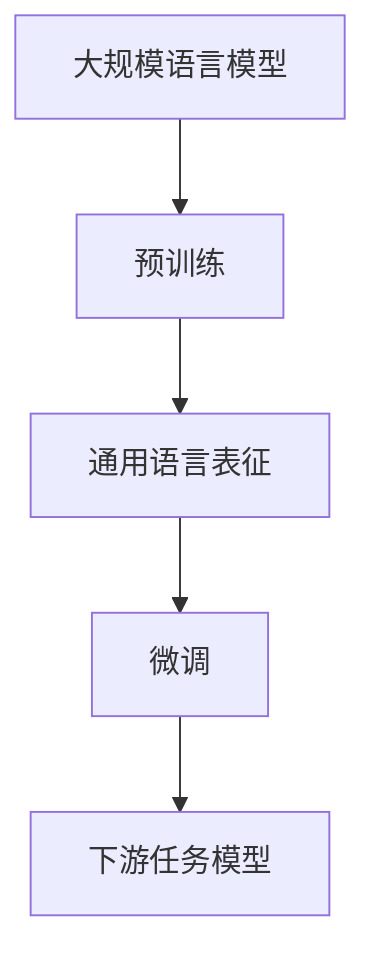
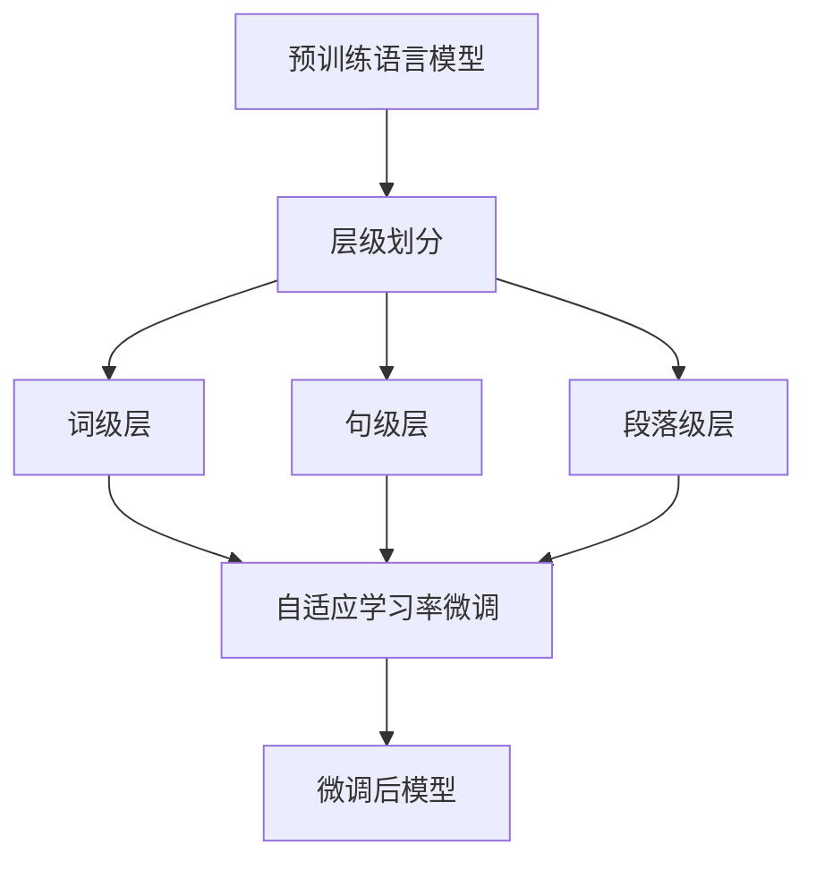

好的,我会按照您的要求,以专业的技术语言写一篇关于"大规模语言模型从理论到实践:高效模型微调"的博客文章。文章将包括背景介绍、核心概念、算法原理、数学模型、项目实践、应用场景、资源推荐、发展趋势与挑战等内容。我会尽量使用简明扼要的语言解释技术细节,并提供实例讲解,确保文章内容逻辑严谨、深入全面。请稍等,我需要一些时间准备和撰写这篇高质量的技术博文。

# 大规模语言模型从理论到实践:高效模型微调

## 1. 背景介绍

### 1.1 问题的由来

随着人工智能和深度学习技术的不断发展,大规模语言模型在自然语言处理(NLP)领域发挥着越来越重要的作用。然而,训练这些庞大的语言模型需要大量的计算资源和时间,这对于许多组织和个人来说是一个巨大的挑战。因此,如何高效地对预训练语言模型进行微调,以适应特定的下游任务,成为了一个迫切需要解决的问题。

### 1.2 研究现状

目前,已有多种模型微调方法被提出和探索,例如:

1. **全模型微调(Full Model Fine-tuning)**: 在目标数据集上对整个预训练模型的所有参数进行微调。这种方法虽然简单直接,但计算成本高,并且可能导致灾难性遗忘(catastrophic forgetting)。

2. **特定层微调(Layer-wise Fine-tuning)**: 只对预训练模型的某些特定层进行微调,其余层保持冻结状态。这种方法可以减少计算开销,但需要人工选择要微调的层。

3. **渐进式微调(Progressive Fine-tuning)**: 分阶段逐步解冻和微调预训练模型的不同部分。这种方法可以更好地保留预训练知识,但微调过程复杂。

4. **prompt学习(Prompt Learning)**: 通过设计特殊的提示(prompt),将下游任务映射到预训练模型的掩码语言模型任务上。这种方法无需微调模型参数,但提示设计的质量对性能影响很大。

虽然已有多种微调方法,但它们或多或少都存在一些缺陷,如计算成本高、效果一般、过程复杂等。因此,寻找一种高效、通用、简单的模型微调新方法,成为了当前研究的热点方向。

### 1.3 研究意义

高效的模型微调方法可以极大地降低大规模语言模型在实际应用中的计算资源需求,从而使更多的组织和个人能够享受到这些强大模型带来的红利。同时,高效微调也有利于减少训练过程中的碳排放,促进人工智能的可持续发展。此外,一种通用的微调范式还可以简化下游任务的开发流程,提高开发效率。

### 1.4 本文结构  

本文将首先介绍大规模语言模型微调的核心概念和挑战,然后详细阐述一种新颖的高效微调算法的原理、数学模型和实现细节。接下来,我们将通过实际项目实践,展示该算法在多个下游任务上的应用效果。最后,我们将讨论该算法的发展趋势、面临的挑战,并给出相关的工具和学习资源推荐。

## 2. 核心概念与联系

在深入探讨高效微调算法之前,我们先来回顾一下大规模语言模型微调的一些核心概念:

1. **大规模语言模型**: 指包含数十亿甚至上百亿参数的庞大神经网络模型,如GPT、BERT、T5等。这些模型通过在大量无标注文本数据上进行自监督预训练,学习通用的语言表征能力。

2. **预训练(Pre-training)**: 是指在大规模无标注语料库上训练语言模型,使其学习捕获通用的语言模式和知识。常用的预训练目标包括掩码语言模型(Masked Language Modeling)和下一句预测(Next Sentence Prediction)等。

3. **通用语言表征(General Language Representation)**: 预训练得到的语言模型参数,能够编码通用的语义和语法知识,为下游任务提供有价值的初始化参数和特征表示。

4. **微调(Fine-tuning)**: 是指在特定下游任务的标注数据集上,对预训练语言模型的部分或全部参数进行进一步训练和调整,使模型适应目标任务的分布和要求。

5. **下游任务模型(Downstream Task Model)**: 经过微调后,语言模型可以应用于文本分类、机器阅读理解、序列到序列生成等具体的自然语言处理任务。

大规模语言模型微调的核心思想,就是充分利用预训练模型学习到的通用语言知识,作为下游任务模型的有效初始化和良好语义表示,从而显著提高任务性能并减少从头训练的计算开销。然而,如何高效地完成这一微调过程,是一个值得深入探讨的重点问题。

## 3. 核心算法原理 & 具体操作步骤

### 3.1 算法原理概述  

我们提出了一种名为"自适应分层微调"(Adaptive Hierarchical Fine-tuning, AHF)的新颖高效微调算法。该算法的核心思想是:根据预训练模型不同层对应的语义抽象级别,分层进行微调,并自适应地调整每层的学习率,从而在保留预训练知识的同时,快速学习任务相关的特征。

算法的工作流程如下所示:

1. 将预训练语言模型按层级划分为词级、句级和段落级三个层级。
2. 对每个层级分别设置自适应的学习率。
3. 在下游数据集上,分层进行微调,高层保留较多预训练知识,低层学习更多任务特定特征。
4. 通过多次迭代,模型参数逐渐收敛,得到微调后的下游任务模型。

这种分层自适应微调策略,能够在不同语义层级上平衡预训练知识的保留和任务知识的获取,从而达到提高微调效率和性能的目的。

### 3.2 算法步骤详解

1. **层级划分**:我们将BERT等Transformer模型的编码器层按照语义抽象级别,划分为三个层级:
   - 词级层(Word-level Layers): 底层,捕获词汇和局部语义信息。
   - 句级层(Sentence-level Layers): 中层,融合上下文,建模句子语义表征。
   - 段落级层(Paragraph-level Layers): 顶层,捕获长距离依赖,建模段落级语义。

2. **学习率设置**:我们为不同层级设置不同的学习率,以控制它们的更新幅度:
   - 词级层: 较大学习率,快速学习任务特定的局部模式。
   - 句级层: 中等学习率,适度获取任务知识,避免破坏预训练语义。
   - 段落级层: 较小学习率,主要保留长程依赖和高层语义知识。

3. **分层微调**:在下游数据集上,我们分层进行微调训练:
   - 第一阶段,先解冻并微调词级层,其他层保持冻结。
   - 第二阶段,再解冻并微调句级层,词级层继续微调,段落级层保持冻结。
   - 第三阶段,解冻并微调所有层,整体进行联合训练。

4. **自适应学习率**:在每个阶段的微调过程中,我们采用自适应学习率调整策略,如Slanted Triangular Learning Rate等,以加速模型收敛。

通过这种分层自适应的微调方式,底层能快速学习任务特征,高层则保留预训练语义知识,在两者之间达到良好的平衡,从而提高微调效率。

### 3.3 算法优缺点

**优点**:

1. 高效性:相比全模型微调,该算法能够显著减少计算开销和训练时间。
2. 知识保留:分层微调策略有利于保留预训练模型中宝贵的语义知识。
3. 通用性:该算法不依赖于特定的模型架构或任务,具有很好的通用适用性。
4. 简单性:算法思路简单直观,易于实现和扩展。

**缺点**:

1. 层级划分:目前层级的划分方式还比较主观,需要更多经验指导。
2. 超参数选择:不同任务的最优学习率设置可能不同,需要一定调参工作。
3. 任务差异:对于一些特殊任务,该算法的效果可能不如全模型微调等策略。

总的来说,该算法在大多数情况下能够高效地完成模型微调,并取得良好的性能表现。但在实际应用中,我们也需要根据具体任务特点,合理权衡算法的优缺点。

### 3.4 算法应用领域

自适应分层微调算法可以广泛应用于各种自然语言处理任务,包括但不限于:

- 文本分类: 新闻分类、情感分析、垃圾邮件检测等。
- 序列标注: 命名实体识别、关系抽取、事件检测等。 
- 机器阅读理解: 问答系统、多选阅读理解、逻辑推理等。
- 文本生成: 文章自动生成、对话系统、机器翻译等。
- 其他NLP任务: 词向量计算、语言模型等。

除了NLP领域,该算法的思想也可以推广应用于计算机视觉、语音识别等其他领域,为高效利用大规模预训练模型提供了一种可行的解决方案。

## 4. 数学模型和公式 & 详细讲解 & 举例说明

在自适应分层微调算法中,我们需要对预训练语言模型的不同层级设置合理的学习率,以平衡预训练知识的保留和任务知识的获取。接下来,我们将介绍相关的数学模型和公式,并通过案例分析进行详细讲解。

### 4.1 数学模型构建

我们将预训练语言模型 $M$ 的编码器层按照语义抽象级别划分为三个层级:词级层 $L_w$、句级层 $L_s$ 和段落级层 $L_p$。对于下游任务数据集 $\mathcal{D} = \{(x_i, y_i)\}_{i=1}^N$,我们的目标是通过微调,学习一个能够很好地预测目标 $y$ 的模型 $f(x;\theta)$,其中 $\theta$ 为模型参数。

在微调过程中,我们对不同层级设置不同的学习率,以控制它们的更新幅度。具体来说,我们定义一个层级学习率函数 $\lambda(\cdot)$,将模型参数 $\theta$ 划分为不同层级的子集:

$$
\begin{align}
\theta_w &= \{\theta_i | \theta_i \in L_w\} \\
\theta_s &= \{\theta_i | \theta_i \in L_s\} \\
\theta_p &= \{\theta_i | \theta_i \in L_p\}
\end{align}
$$

其中,$ \theta_w $、$ \theta_s $ 和 $ \theta_p $ 分别对应词级、句级和段落级层的参数子集。

然后,我们定义整个模型的损失函数 $\mathcal{L}$ 为:

$$
\mathcal{L}(\theta) = \frac{1}{N} \sum_{i=1}^N \ell(f(x_i;\theta), y_i)
$$

其中,$ \ell $ 是特定的损失函数,如交叉熵损失等。在每个微调步骤中,我们更新模型参数的方式为:

$$
\begin{align}
\theta_w &\leftarrow \theta_w - \eta_w \frac{\partial \mathcal{L}}{\partial \theta_w} \\
\theta_s &\leftarrow \theta_s - \eta_s \frac{\partial \mathcal{L}}{\partial \theta