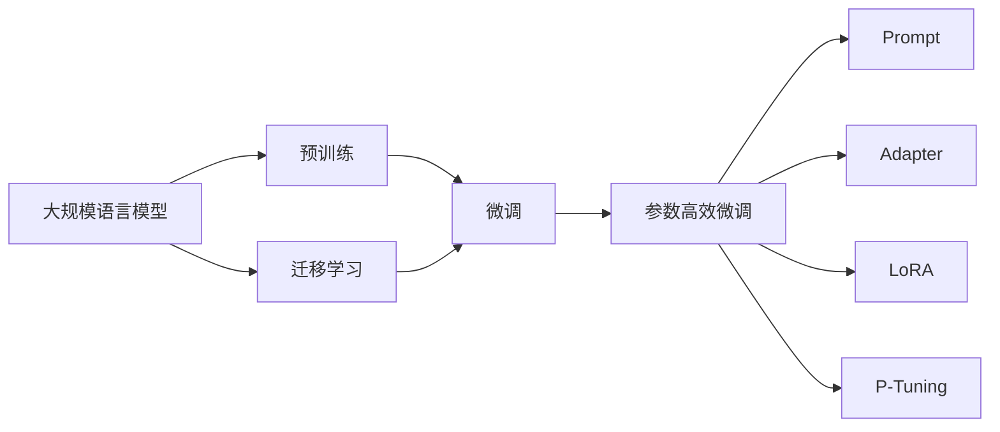

# 大规模语言模型从理论到实践 高效模型微调

关键词：大规模语言模型、预训练、微调、迁移学习、Prompt、Adapter、LoRA、P-Tuning、数据增强

## 1. 背景介绍
### 1.1  问题的由来
近年来，随着深度学习技术的飞速发展，大规模语言模型(Large Language Models, LLMs)在自然语言处理(Natural Language Processing, NLP)领域取得了突破性进展。从ELMo、BERT到GPT-3，语言模型的规模不断增大，性能也持续提升。然而，训练这些大规模语言模型需要消耗大量的计算资源和时间成本，对于许多研究者和开发者来说是一个巨大的挑战。

### 1.2  研究现状
为了解决上述问题，业界提出了许多优化大规模语言模型训练和应用的方法。其中，模型微调(Fine-tuning)是一种简单有效的方法，通过在预训练模型的基础上，使用少量下游任务数据对模型进行微调，可以显著提升模型在特定任务上的性能。此外，Prompt、Adapter、LoRA、P-Tuning等参数高效微调方法也被广泛研究，它们通过引入额外的可学习参数，在固定预训练模型参数的情况下，实现高效的模型微调。

### 1.3  研究意义
研究高效的大规模语言模型微调方法具有重要意义：
1. 降低计算资源需求，使更多研究者和开发者能够使用大规模语言模型。
2. 提高模型微调效率，加速模型在下游任务上的迭代优化。
3. 探索参数高效微调方法，为构建更加通用和鲁棒的语言模型提供新思路。

### 1.4  本文结构
本文将从以下几个方面对大规模语言模型高效微调进行深入探讨：
1. 介绍大规模语言模型微调的核心概念与联系。 
2. 详细讲解几种主流的高效微调算法原理和具体操作步骤。
3. 构建数学模型，推导相关公式，并结合案例进行分析讲解。
4. 提供项目实践，包括代码实例和详细解释说明。
5. 分析实际应用场景，展望未来应用前景。
6. 推荐相关学习资源、开发工具和研究论文。
7. 总结全文，分析未来发展趋势与面临的挑战。

## 2. 核心概念与联系

- 大规模语言模型：指参数量巨大(通常在数亿到上千亿量级)的深度神经网络模型，通过在大规模文本语料上进行预训练，可以学习到丰富的语言知识和通用语义表示。代表模型有BERT、GPT、T5、Switch Transformer等。

- 预训练(Pre-training)：指在大规模无监督语料上对模型进行自监督学习，使其掌握语言的基本规律和语义信息。预训练阶段通常使用语言建模、掩码语言建模等任务。

- 微调(Fine-tuning)：指在预训练模型的基础上，使用下游任务的有标注数据对模型进行监督学习，使其适应特定任务。微调阶段通常使用任务特定的损失函数，如分类、序列标注等。

- 迁移学习(Transfer Learning)：指将在源任务(如预训练阶段)上学习到的知识迁移到目标任务(如下游任务)中，提高模型泛化能力和学习效率的方法。大规模语言模型的预训练-微调范式就是迁移学习的典型应用。

- 参数高效微调(Parameter-Efficient Fine-tuning)：指在固定预训练模型参数的情况下，通过引入少量额外的可学习参数对模型进行微调的方法。代表方法有Prompt、Adapter、LoRA、P-Tuning等。

- Prompt：指通过设计模板(template)和答案映射(answer mapping)的方式，将下游任务转化为预训练阶段的格式，从而实现零样本(zero-shot)或少样本(few-shot)学习。

- Adapter：指在预训练模型的每一层中插入少量可学习参数(如MLP)，在微调阶段只更新这些参数，而保持原始模型参数不变。Adapter可以显著减少微调参数量。

- LoRA(Low-Rank Adaptation)：指在预训练模型的每一层上添加低秩分解矩阵，在微调阶段只更新这些低秩矩阵，同样可以大幅减少微调参数量。

- P-Tuning(Prompt Tuning)：指只微调输入端的embedding层参数，通过可学习的连续prompt向量引导语言模型生成任务特定的输出。

下图展示了这些核心概念之间的联系：



## 3. 核心算法原理 & 具体操作步骤

### 3.1  算法原理概述

本节将重点介绍几种参数高效微调算法的原理，包括Prompt、Adapter、LoRA和P-Tuning。

#### 3.1.1 Prompt

Prompt的核心思想是将下游任务转化为预训练阶段的格式，通过设计合适的模板和答案映射，让语言模型在零样本或少样本的情况下也能完成任务。具体来说，Prompt分为以下几个步骤：

1. 模板设计：根据任务类型，设计自然语言模板，将任务输入转化为语言模型的输入形式。常见的模板形式有：
   - 填空型(cloze)：如"[X] is a [MASK] of [Y]."
   - 问答型(QA)：如"Question: [X] Answer: [Z]"
   - 分类型(classification)：如"[X] It was [MASK]."

2. 答案映射：将任务的标签空间映射到语言模型的词表空间，建立标签和词表之间的对应关系。常见的映射方式有：
   - 人工定义：如 "positive"→"great", "negative"→"terrible"
   - 词向量相似度：如与标签词向量最相似的Top-K个词
   - 连续化映射：如将离散标签映射到连续向量空间

3. 推理：将任务输入按照模板格式化，输入语言模型，让模型预测[MASK]位置的词，再根据答案映射得到最终的任务输出。

#### 3.1.2 Adapter

Adapter的核心思想是在预训练模型的每一层中插入少量可学习参数，在微调阶段只更新这些参数，而保持原始模型参数不变。具体来说，Adapter的结构如下：

```
[预训练模型层]
      ↓
[Adapter层] (可学习参数)
      ↓ 
[预训练模型层]
```

其中，Adapter层通常由两个全连接层(down-projection和up-projection)组成，形式如下：

$$
\begin{aligned}
\mathbf{h} &= \text{PretrainedLayer}(\mathbf{x}) \\
\mathbf{z} &= \text{Activation}(\mathbf{W}_{down}\mathbf{h}) \\
\mathbf{o} &= \mathbf{W}_{up}\mathbf{z} + \mathbf{h}
\end{aligned}
$$

其中$\mathbf{W}_{down} \in \mathbb{R}^{d \times r}, \mathbf{W}_{up} \in \mathbb{R}^{r \times d}$是可学习的参数矩阵，$d$是预训练模型的隐藏层维度，$r$是Adapter的瓶颈维度(通常$r \ll d$)，$\text{Activation}$是非线性激活函数(如ReLU)。

在微调阶段，只更新Adapter层的参数$\mathbf{W}_{down}, \mathbf{W}_{up}$，而预训练模型的参数保持不变。这样可以大大减少微调参数量，同时还能保持预训练模型的通用语义表示能力。

#### 3.1.3 LoRA 

LoRA(Low-Rank Adaptation)的核心思想与Adapter类似，也是在预训练模型的每一层中插入额外的可学习参数。不同之处在于，LoRA使用低秩矩阵分解的方式来参数化这些额外参数，进一步减少参数量。

具体来说，LoRA在预训练模型的权重矩阵上添加一个低秩分解矩阵：

$$
\mathbf{W}_{LoRA} = \mathbf{W} + \mathbf{A} \mathbf{B}
$$

其中$\mathbf{W} \in \mathbb{R}^{d \times d}$是预训练模型的权重矩阵，$\mathbf{A} \in \mathbb{R}^{d \times r}, \mathbf{B} \in \mathbb{R}^{r \times d}$是LoRA引入的低秩矩阵(秩为$r$，通常$r \ll d$)。在微调阶段，只更新$\mathbf{A}, \mathbf{B}$矩阵，而$\mathbf{W}$保持不变。

通过这种方式，LoRA可以将微调参数量从$O(d^2)$降低到$O(dr)$，大大提高了微调效率。同时，由于$\mathbf{A}, \mathbf{B}$是通过加法融合到原始权重矩阵中的，因此LoRA也能很好地保持预训练模型的通用语义表示能力。

#### 3.1.4 P-Tuning

P-Tuning(Prompt Tuning)的核心思想是只微调输入端的embedding层参数，通过可学习的连续prompt向量引导语言模型生成任务特定的输出。

具体来说，P-Tuning在输入端引入一组可学习的prompt向量$\mathbf{P} = [\mathbf{p}_1, \mathbf{p}_2, \cdots, \mathbf{p}_m] \in \mathbb{R}^{m \times d}$，其中$m$是prompt长度，$d$是embedding维度。在微调阶段，将prompt向量与任务输入拼接在一起，输入语言模型：

$$
\mathbf{X} = [\mathbf{P}; \mathbf{E}(\text{input})]
$$

其中$\mathbf{E}$是预训练模型的embedding层，$\text{input}$是任务输入。在训练过程中，只更新prompt向量$\mathbf{P}$，而预训练模型的参数(包括embedding层)保持不变。

通过这种方式，P-Tuning可以将微调参数量降低到$O(md)$，比Adapter和LoRA更加参数高效。同时，由于prompt向量是通过拼接的方式引入的，因此P-Tuning也能很好地保持预训练模型的通用语义表示能力。

### 3.2  算法步骤详解

本节将以Adapter为例，详细介绍其具体的算法步骤。

#### 3.2.1 模型结构设计

首先，需要在预训练模型的每一层(如Transformer的每个自注意力层和前馈层)中插入Adapter层。以Transformer为例，插入Adapter后的结构如下：

```
[Self-Attention层]
      ↓
[Adapter层] (可学习参数)
      ↓ 
[Feed-Forward层]
      ↓
[Adapter层] (可学习参数)
      ↓
[Layer Norm层]
```

其中，Adapter层的结构如3.1.2节所述，由两个全连接层组成，中间加入激活函数。

#### 3.2.2 模型初始化

在微调开始前，需要对Adapter层的参数进行初始化。通常采用Xavier初始化方法，即从均值为0，方差为$\frac{2}{d_{in}+d_{out}}$的高斯分布中采样，其中$d_{in}, d_{out}$分别为全连接层的输入和输出维度。

#### 3.2.3 模型微调

在微调阶段，冻结预训练模型的所有参数，只更新Adapter层的参数。具体的训练过程与普通的微调类似，使用下游任务的有标注数据，根据任务类型设计损失函数(如交叉熵损失)，利用优化算法(如Adam)对Adapter参数进行迭代更新。

值得注意的是，由于Adapter层的参数量远小于预训练模型，因此可以使用更大的学习率和更少的训练轮数，加快训练速度。

#### 3.2.4 模型推理

在推理阶段，将微调后的Adapter层插入到预训练模型中，即可得到完整的微调模型。对于给定的任务输入，将其传入微调后的模型，得到输出结果。

需