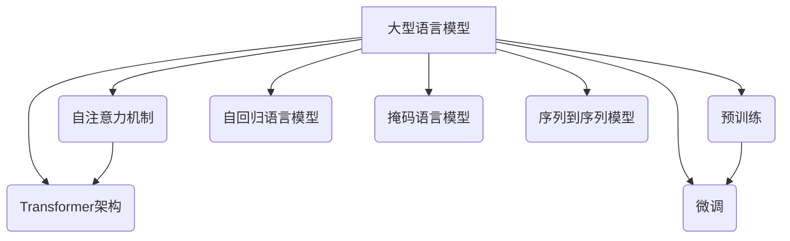

# 大语言模型 原理与代码实例讲解

## 1. 背景介绍

### 1.1 问题的由来

在过去的几年里,自然语言处理(NLP)领域取得了令人瞩目的进展,这在很大程度上归功于大型神经网络模型的出现,尤其是大型语言模型(Large Language Models, LLMs)。这些模型通过在海量文本数据上进行预训练,学习了丰富的语言知识和上下文关联,从而展现出惊人的语言理解和生成能力。

大型语言模型的兴起源于2018年谷歌发布的Transformer模型,该模型采用了自注意力(Self-Attention)机制,显著提高了序列建模的性能。随后,OpenAI、谷歌、微软等科技巨头纷纷投入巨资研发更大更强的语言模型,如GPT、BERT、T5等,模型规模从数十亿参数扩展到数万亿参数。这些模型在广泛的自然语言处理任务中表现出色,推动了NLP技术的飞速发展。

### 1.2 研究现状

目前,大型语言模型已经成为自然语言处理领域的主导范式,在机器翻译、文本摘要、问答系统、对话系统等多个领域发挥着关键作用。一些知名的大型语言模型包括:

- **GPT系列(GPT、GPT-2、GPT-3)**: 由OpenAI开发,基于Transformer解码器,擅长生成任务。GPT-3拥有1750亿个参数,是目前最大的语言模型。
- **BERT系列(BERT、RoBERTa、ALBERT等)**: 由谷歌开发,基于Transformer编码器,擅长理解和表示任务。
- **T5(Text-to-Text Transfer Transformer)**: 由谷歌开发,将所有NLP任务统一为"Text-to-Text"的形式,支持多任务学习。
- **GPT-NeoX**: 由微软和英伟达联合开发,拥有2万亿参数,是目前最大的语言模型。

虽然大型语言模型取得了巨大成功,但它们也面临一些挑战,如需要大量计算资源、存在偏见和不确定性、缺乏解释性等。研究人员正在探索如何提高模型的效率、可解释性和可控性。

### 1.3 研究意义 

大型语言模型的研究对于推进自然语言处理技术发展具有重要意义:

1. **强大的语言理解和生成能力**: 大型语言模型能够捕捉丰富的语义和上下文信息,生成高质量、连贯的自然语言文本,这为构建智能对话系统、自动写作辅助等应用奠定了基础。

2. **通用知识表示**: 预训练语言模型能够从海量文本中学习通用的语言知识表示,这种通用表示可以转移到下游任务中,提高任务性能并减少数据需求。

3. **推动NLP技术发展**: 大型语言模型的出现推动了NLP技术的飞速发展,催生了一系列突破性的模型和应用,为该领域注入了新的活力。

4. **促进人工智能发展**: 语言是人类智能的重要体现,大型语言模型的研究有助于探索通用人工智能的路径,为构建通用人工智能系统贡献经验。

5. **产业应用前景广阔**: 大型语言模型在自然语言处理的众多应用领域具有巨大的商业价值,如智能客服、智能写作、内容审核等,为相关产业发展带来新的机遇。

### 1.4 本文结构

本文将全面介绍大型语言模型的原理和实践。首先阐述大型语言模型的核心概念和关键技术,包括自注意力机制、Transformer架构、预训练和微调等。然后深入探讨大型语言模型的核心算法原理,包括自回归语言模型、掩码语言模型、序列到序列模型等。接下来详细讲解大型语言模型背后的数学模型和公式推导过程。之后,我们将通过代码实例演示如何开发和应用大型语言模型。最后,本文将分析大型语言模型在实际应用中的场景,介绍相关工具和资源,并总结未来发展趋势和面临的挑战。

## 2. 核心概念与联系

大型语言模型涉及多个核心概念和关键技术,它们相互关联、环环相扣,共同构建了这一强大的自然语言处理范式。下面我们将逐一介绍这些核心概念。

### 2.1 自注意力机制(Self-Attention)

自注意力机制是大型语言模型的核心基础,它能够捕捉输入序列中任意两个位置之间的关联关系,从而更好地建模长距离依赖。与传统的RNN和CNN不同,自注意力机制不存在递归计算或卷积核滑动窗口的限制,可以并行计算,更加高效。

在自注意力计算中,每个位置的表示是所有位置的表示的加权和,权重由位置之间的相似性决定。这种灵活的关联捕捉方式赋予了模型强大的表示能力。多头自注意力(Multi-Head Self-Attention)进一步增强了这种能力。

### 2.2 Transformer架构

Transformer是第一个全面采用自注意力机制的序列模型,由编码器(Encoder)和解码器(Decoder)组成。编码器捕捉输入序列的表示,解码器则基于编码器的输出生成目标序列。

Transformer架构中还引入了位置编码(Positional Encoding)来注入序列位置信息,以及层归一化(Layer Normalization)和残差连接(Residual Connection)来加速训练。这些设计使Transformer在长序列建模任务上表现出色。

### 2.3 预训练(Pre-training)

大型语言模型通常采用预训练与微调(Pre-training and Fine-tuning)的范式。在预训练阶段,模型在大规模无监督文本数据上学习通用的语言表示,捕捉丰富的语义和上下文知识。预训练任务包括自回归语言模型(如GPT)和掩码语言模型(如BERT)等。

预训练过程通常需要消耗大量计算资源,但一旦完成,这些通用语言表示就可以为各种下游任务所重用,从而节省数据标注和模型训练的成本。

### 2.4 微调(Fine-tuning)

在完成通用预训练后,大型语言模型需要针对特定的下游任务进行微调(Fine-tuning),以学习任务特定的模式和知识。微调过程通常只需要调整模型的部分参数,并在较小的任务数据集上进行训练,从而避免了从头开始训练的巨大计算开销。

微调策略包括全模型微调、仅微调部分层、预测头微调等。合理的微调策略可以提高模型在下游任务上的性能表现。

### 2.5 自回归语言模型(Autoregressive Language Model)

自回归语言模型是大型语言模型的一种核心范式,主要用于生成类任务,如机器翻译、文本摘要、对话生成等。该模型根据之前的文本生成下一个词或标记,以这种自回归的方式生成整个序列。

GPT系列模型就是基于自回归语言模型的典型代表。这种模型在生成流畅、连贯的文本方面表现出色,但也存在一定的缺陷,如无法并行生成、展示单向偏置等。

### 2.6 掩码语言模型(Masked Language Model)

掩码语言模型是另一种核心范式,主要用于理解和表示类任务,如文本分类、命名实体识别、关系抽取等。该模型在输入序列中随机掩蔽部分词或标记,并学习预测被掩蔽部分的目标。

BERT及其变体就是基于掩码语言模型的典型代表。这种模型擅长捕捉双向上下文信息,在理解类任务上表现优异,但在生成类任务上相对逊色。

### 2.7 序列到序列模型(Sequence-to-Sequence Model)

序列到序列模型将输入序列映射到输出序列,可以同时处理理解和生成任务。该模型由编码器(Encoder)和解码器(Decoder)组成,编码器捕捉输入序列的表示,解码器则根据编码器输出生成目标序列。

T5模型就是一种序列到序列的大型语言模型,它将所有NLP任务统一为"Text-to-Text"的形式,支持多任务学习和迁移。序列到序列模型具有更强的通用性和灵活性。

## 3. 核心算法原理与具体操作步骤

在了解了大型语言模型的核心概念之后,我们将深入探讨其核心算法原理和具体操作步骤。

### 3.1 算法原理概述

大型语言模型的核心算法原理可以概括为以下三个方面:

1. **自注意力机制(Self-Attention Mechanism)**: 自注意力机制是大型语言模型的核心基础,它能够捕捉输入序列中任意两个位置之间的关联关系,从而更好地建模长距离依赖。

2. **Transformer架构**: Transformer是第一个全面采用自注意力机制的序列模型,由编码器(Encoder)和解码器(Decoder)组成。编码器捕捉输入序列的表示,解码器则基于编码器的输出生成目标序列。

3. **预训练与微调范式(Pre-training and Fine-tuning)**: 大型语言模型通常采用预训练与微调的范式。在预训练阶段,模型在大规模无监督文本数据上学习通用的语言表示。在微调阶段,模型针对特定的下游任务进行调整和优化。

这三个核心原理相互关联、环环相扣,共同构建了大型语言模型的强大能力。

### 3.2 算法步骤详解

大型语言模型的训练和应用过程可以分为以下几个关键步骤:

#### 步骤1: 数据预处理

在训练大型语言模型之前,需要对原始文本数据进行预处理,包括分词、标记化、构建词表等。这一步骤对于提高模型的性能和效率至关重要。

#### 步骤2: 模型架构设计

设计大型语言模型的架构,包括确定编码器和解码器的层数、注意力头数、嵌入维度等超参数。常见的架构包括GPT、BERT、T5等。

#### 步骤3: 预训练

在大规模无监督文本数据上进行预训练,学习通用的语言表示。预训练任务包括自回归语言模型(如GPT)、掩码语言模型(如BERT)和序列到序列模型(如T5)等。预训练过程通常需要消耗大量计算资源。

#### 步骤4: 微调

针对特定的下游任务,在相应的任务数据集上对预训练模型进行微调,学习任务特定的模式和知识。微调策略包括全模型微调、仅微调部分层、预测头微调等。

#### 步骤5: 模型评估

在验证集或测试集上评估微调后模型的性能,根据特定任务的评估指标(如准确率、F1分数等)来衡量模型的表现。

#### 步骤6: 模型部署

将训练好的大型语言模型部署到实际的应用系统中,用于执行自然语言处理任务,如机器翻译、文本摘要、对话系统等。

#### 步骤7: 模型优化

根据模型在实际应用中的表现,持续优化模型架构、训练策略和超参数,以提高模型的性能和效率。

需要注意的是,大型语言模型的训练和应用过程通常需要大量的计算资源,包括GPU、TPU等专用硬件加速器。此外,针对不同的任务和场景,可能需要调整和优化上述步骤。

### 3.3 算法优缺点

大型语言模型算法具有以下优点:

1. **强大的语言理解和生成能力**: 通过在海量文本数据上预训练,大型语言模型能够学习丰富的语言知识和上下文关联,从而展现出惊人的语言理解和生成能力。

2. **通用知识表示**: 预训练