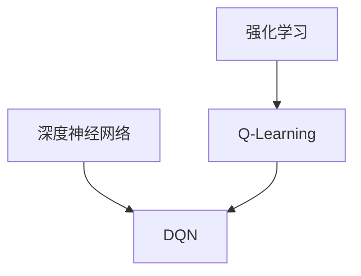

# 大语言模型原理与工程实践：DQN 训练：基本思想

## 1. 背景介绍

### 1.1 问题的由来

在人工智能领域中,强化学习(Reinforcement Learning)是一种重要的机器学习范式,它旨在让智能体(Agent)通过与环境(Environment)的交互来学习如何采取最优策略,从而最大化预期的长期回报。强化学习广泛应用于机器人控制、游戏AI、自动驾驶等诸多领域。

然而,传统的强化学习算法在处理高维状态空间和连续动作空间时往往会遇到维数灾难(Curse of Dimensionality)的问题,导致学习效率低下。为了解决这一挑战,深度强化学习(Deep Reinforcement Learning)应运而生,它将深度神经网络与强化学习相结合,利用神经网络的强大函数逼近能力来近似状态-动作值函数或策略函数,从而能够更好地处理高维输入。

### 1.2 研究现状

深度强化学习领域中,深度Q网络(Deep Q-Network,DQN)是一种里程碑式的算法,它成功地将深度神经网络应用于强化学习中的Q-Learning算法,并在多个经典的Atari游戏中取得了超越人类水平的表现。DQN的提出为深度强化学习的发展奠定了坚实的基础,并催生了一系列优秀的算法,如双重深度Q网络(Double DQN)、优先经验回放(Prioritized Experience Replay)、多步Bootstrap目标(Multi-step Bootstrap Targets)等。

### 1.3 研究意义

深入理解DQN的基本思想及其训练过程对于掌握深度强化学习的核心原理至关重要。DQN不仅在理论上具有重要意义,更为实际应用提供了有力的技术支持。通过学习DQN,我们可以更好地理解如何将深度学习与强化学习相结合,并为解决实际问题提供有价值的启发。

### 1.4 本文结构

本文将全面介绍DQN的基本思想、核心算法原理、数学模型推导、代码实现细节以及实际应用场景。我们将从背景知识出发,逐步深入探讨DQN的各个方面,并分享相关的最佳实践和未来发展趋势。通过本文的学习,读者将能够全面掌握DQN的理论基础和工程实践,为进一步探索深度强化学习领域奠定坚实的基础。

## 2. 核心概念与联系

在深入探讨DQN之前,我们需要先了解一些核心概念和它们之间的联系。

**强化学习(Reinforcement Learning)**是一种基于奖赏机制的机器学习范式,其目标是通过与环境的交互来学习一个最优策略,使得在给定的马尔可夫决策过程(Markov Decision Process,MDP)中能够最大化预期的长期回报。强化学习包括四个核心要素:智能体(Agent)、环境(Environment)、状态(State)和奖励(Reward)。

**Q-Learning**是一种基于时间差分(Temporal Difference,TD)的强化学习算法,它旨在学习一个最优的状态-动作值函数Q(s,a),该函数能够估计在当前状态s下采取动作a之后所能获得的预期长期回报。通过不断更新Q值,Q-Learning算法最终能够找到一个近似最优的策略。

**深度神经网络(Deep Neural Network,DNN)**是一种强大的机器学习模型,它由多层神经元组成,能够对输入数据进行层层抽象和特征提取,从而学习到高层次的特征表示。深度神经网络具有强大的函数逼近能力,可以用于近似复杂的非线性函数。

**深度Q网络(Deep Q-Network,DQN)**将深度神经网络与Q-Learning算法相结合,使用神经网络来近似状态-动作值函数Q(s,a)。通过训练神经网络,DQN能够直接从高维原始输入(如图像、视频等)中学习出最优的Q值,从而避免了手工设计特征的需求,大大提高了强化学习在复杂环境中的应用能力。

这些核心概念之间的联系如下所示:

强化学习是一种范式,Q-Learning是其中的一种算法;深度神经网络是一种强大的机器学习模型;而DQN则将Q-Learning和深度神经网络相结合,成为了深度强化学习领域的一个里程碑式算法。

## 3. 核心算法原理 & 具体操作步骤

### 3.1 算法原理概述

DQN算法的核心思想是使用一个深度神经网络来近似状态-动作值函数Q(s,a),从而避免了手工设计特征的需求,并能够直接从高维原始输入中学习出最优的Q值。

在传统的Q-Learning算法中,我们需要维护一个Q表来存储每个状态-动作对的Q值。然而,当状态空间和动作空间变得非常大时,Q表将变得难以存储和更新。DQN通过使用神经网络来近似Q函数,从而克服了这一限制。

具体来说,DQN算法将当前状态s作为输入,输出一个向量,其中每个元素对应于在该状态下采取不同动作a的Q值Q(s,a)。通过不断优化神经网络的参数,DQN算法可以逐步学习出一个近似最优的Q函数。

为了提高训练的稳定性和效率,DQN算法引入了几种关键技术,包括经验回放(Experience Replay)、目标网络(Target Network)和双重Q学习(Double Q-Learning)等。这些技术有助于减少训练过程中的噪声和不稳定性,从而加快收敛速度。

### 3.2 算法步骤详解

DQN算法的训练过程可以概括为以下几个步骤:

1. **初始化**:初始化一个主网络(主Q网络)和一个目标网络(目标Q网络),两个网络的权重参数初始相同。同时,初始化一个经验回放池(Experience Replay Buffer)用于存储智能体与环境交互过程中的经验数据。

2. **与环境交互**:智能体根据当前状态s和主Q网络的输出,选择一个动作a执行。环境根据这个动作转移到下一个状态s',并返回一个即时奖励r。将这个经验(s,a,r,s')存储到经验回放池中。

3. **采样经验数据**:从经验回放池中随机采样一批经验数据,用于训练主Q网络。

4. **计算目标Q值**:对于每个采样的经验(s,a,r,s'),计算其目标Q值y,作为主Q网络的监督目标。目标Q值的计算公式为:

$$y = r + \gamma \max_{a'} Q_{target}(s', a')$$

其中,$ \gamma $是折扣因子,$ Q_{target} $是目标Q网络的输出。

5. **更新主Q网络**:使用采样的经验数据和对应的目标Q值,通过优化算法(如梯度下降)更新主Q网络的参数,使其输出的Q值尽可能接近目标Q值。

6. **更新目标Q网络**:每隔一定步数,将主Q网络的权重参数复制到目标Q网络,确保目标Q网络的参数相对稳定,避免训练过程中的振荡。

7. **重复步骤2-6**,直到算法收敛或达到预设的最大训练步数。

在上述过程中,经验回放池的作用是打破经验数据之间的相关性,提高数据的利用效率;目标Q网络的作用是稳定训练过程,避免主Q网络的参数快速变化导致的不稳定性。此外,DQN算法还可以结合其他技术,如双重Q学习、优先经验回放等,进一步提高训练效率和性能。

### 3.3 算法优缺点

**优点**:

1. 避免了手工设计特征的需求,能够直接从高维原始输入中学习出最优策略。
2. 通过引入经验回放和目标网络等技术,提高了训练的稳定性和效率。
3. 算法通用性强,可以应用于各种强化学习任务和环境。
4. 算法性能优异,在多个经典的Atari游戏中取得了超越人类水平的表现。

**缺点**:

1. 训练过程相对复杂,需要调节多个超参数(如学习率、折扣因子、探索率等)。
2. 对于连续动作空间的任务,DQN算法的性能可能会受到一定影响。
3. 算法收敛速度较慢,需要大量的训练数据和计算资源。
4. 在一些复杂的环境中,DQN算法可能会遇到局部最优的问题。

### 3.4 算法应用领域

DQN算法及其变体广泛应用于以下领域:

- **游戏AI**:DQN算法最初就是在Atari游戏环境中取得了突破性的成果,之后也被应用于各种其他游戏,如国际象棋、围棋、星际争霸等。
- **机器人控制**:DQN算法可以用于控制机器人在复杂环境中执行各种任务,如导航、抓取、操作等。
- **自动驾驶**:DQN算法可以应用于自动驾驶场景,根据实时传感器数据学习出最优的驾驶策略。
- **金融交易**:DQN算法可以用于金融市场的交易决策,根据历史数据和市场信息学习出最优的交易策略。
- **能源管理**:DQN算法可以应用于智能电网、数据中心等场景,优化能源的分配和利用。
- **工业控制**:DQN算法可以用于控制各种工业过程,如化工生产、机床加工等。

总的来说,DQN算法及其变体适用于任何需要从高维输入中学习出最优决策策略的场景,具有广阔的应用前景。

## 4. 数学模型和公式 & 详细讲解 & 举例说明

### 4.1 数学模型构建

在介绍DQN算法的数学模型之前,我们首先需要了解强化学习的数学基础——马尔可夫决策过程(Markov Decision Process,MDP)。

MDP是一种描述序列决策过程的数学框架,它由以下几个要素组成:

- 状态集合S:环境可能处于的所有状态的集合。
- 动作集合A:智能体可以执行的所有动作的集合。
- 转移概率P(s'|s,a):在状态s下执行动作a后,转移到状态s'的概率。
- 奖励函数R(s,a,s'):在状态s下执行动作a并转移到状态s'时获得的即时奖励。
- 折扣因子γ:用于权衡即时奖励和长期回报的重要性。

在MDP框架下,强化学习的目标是找到一个最优策略π*,使得在任意初始状态s0下,按照该策略执行动作序列能够最大化预期的长期回报:

$$\max_{\pi} \mathbb{E}\left[\sum_{t=0}^{\infty} \gamma^t R(s_t, a_t, s_{t+1}) | s_0, \pi\right]$$

其中,t表示时间步长,R(s_t,a_t,s_{t+1})是在时间步t下执行动作a_t并从状态s_t转移到s_{t+1}时获得的即时奖励。

Q-Learning算法旨在学习一个最优的状态-动作值函数Q*(s,a),该函数能够估计在当前状态s下执行动作a之后所能获得的预期长期回报。Q*(s,a)满足贝尔曼最优方程:

$$Q^*(s, a) = \mathbb{E}_{s' \sim P(\cdot|s,a)}\left[R(s, a, s') + \gamma \max_{a'} Q^*(s', a')\right]$$

其中,$ \mathbb{E}_{s' \sim P(\cdot|s,a)} $表示对下一个状态s'的期望,$ \gamma $是折扣因子,$ \max_{a'} Q^*(s', a') $表示在状态s'下执行最优动作时能获得的最大预期长期回报。

DQN算法的核心思想就是使用一个深度神经网络来近似这个最优的Q函数Q*(s,a)。具体来说,DQN算法将当前状态s作为神经网络的输入,输出一个向量Q(s,a;θ),其中每个元素对应于在该状态下执行不同动