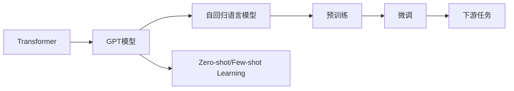

# 大语言模型原理与工程实践：GPT 系列模型的发展

## 1. 背景介绍

### 1.1 问题的由来

近年来,自然语言处理(NLP)领域取得了突飞猛进的发展。其中,大语言模型(Large Language Model,LLM)的出现标志着 NLP 技术进入了一个新的阶段。LLM 能够在海量语料上进行无监督预训练,学习到语言的底层规律和知识,并可以应用于各种下游 NLP 任务,展现出强大的泛化能力。而 GPT(Generative Pre-trained Transformer)系列模型则是 LLM 发展历程中的重要里程碑。

GPT 模型由 OpenAI 公司提出,通过 Transformer 网络架构和自回归语言建模,在大规模无标注语料上进行预训练,并通过迁移学习应用于下游任务,在多个 NLP 基准测试中取得了 SOTA 成绩。从 GPT-1、GPT-2 到 GPT-3,模型规模和性能不断提升,引领了 NLP 技术的发展方向。

### 1.2 研究现状

目前,GPT 系列模型已经发展到了第三代 GPT-3,其参数量高达 1750 亿,是当前最大规模的语言模型之一。GPT-3 展现出了令人惊叹的语言理解和生成能力,在机器翻译、问答、摘要、写作等任务上都取得了优异的表现,甚至在一些推理和常识问答任务上也有不俗的成绩。

除了 GPT 系列,业界还涌现出了一批优秀的大语言模型,如谷歌的 BERT、T5,Facebook 的 RoBERTa,微软的 Megatron-LM 等。这些模型在架构、训练方法、应用场景等方面各有特色,共同推动了 NLP 技术的进步。

### 1.3 研究意义

大语言模型代表了 NLP 技术的前沿,对学术界和工业界都有重要意义:

1. 在学术研究方面,LLM 为探索语言智能奠定了基础。海量语料的预训练使模型学习到了丰富的语言知识,这为研究语言的本质、理解人类认知机制提供了新的视角。同时,LLM 也为构建更高级的 AI 系统,如通用人工智能(AGI)铺平了道路。

2. 在工业应用方面,LLM 大大拓展了 NLP 技术的应用场景。传统的 NLP 任务如机器翻译、信息检索、语义理解等,都可以基于 LLM 实现性能的大幅提升。一些新兴应用如智能写作、虚拟助手、知识问答等,更是直接受益于 LLM 强大的语言生成能力。LLM 有望成为未来 NLP 产业化的核心技术。

### 1.4 本文结构

本文将重点介绍 GPT 系列模型的原理和实践。全文分为以下几个部分:

- 第 2 节介绍 GPT 模型涉及的核心概念,如 Transformer、自回归语言模型、预训练与微调等。
- 第 3 节详细讲解 GPT 模型的核心算法原理,包括模型架构、训练目标、生成策略等。
- 第 4 节给出 GPT 模型涉及的数学模型与公式,并举例说明。 
- 第 5 节通过代码实例,演示如何基于开源框架实现 GPT 模型。
- 第 6 节讨论 GPT 模型在实际场景中的应用。
- 第 7 节推荐 GPT 相关的学习资源和开发工具。
- 第 8 节总结全文,并展望 GPT 模型未来的发展趋势和挑战。
- 第 9 节列举一些常见问题,并给出解答。

## 2. 核心概念与联系

在深入讲解 GPT 模型原理之前,我们先来了解几个核心概念:

- **Transformer**: 一种基于注意力机制(Attention)的神经网络架构,最初应用于机器翻译任务。Transformer 抛弃了传统的循环神经网络(RNN),改用 Self-Attention 机制来捕捉文本中的长距离依赖关系。它的编码器和解码器都由多个 Self-Attention 层和前馈层组成。GPT 模型就是基于 Transformer 解码器构建的。

- **自回归语言模型(Auto-regressive Language Model)**: 一种基于概率图模型的语言生成模型。它通过最大化文本序列的联合概率来学习语言的统计规律。给定前 t 个 token,模型预测下一个 token 的条件概率。GPT 模型采用单向的 Transformer 解码器作为自回归语言模型的主干网络。

- **预训练(Pre-training)**: 在大规模无标注语料上,以自监督学习的方式训练通用语言表示模型的过程。预训练阶段通常采用特定的训练目标,如自回归语言建模(GPT)、去噪自编码(BERT)等。预训练使模型学习到语言的一般性知识,为下游任务做好准备。

- **微调(Fine-tuning)**: 在下游任务的标注数据上,通过梯度下降等优化算法,调整预训练模型参数的过程。微调阶段通常会引入任务特定的输入输出层,冻结或解冻部分预训练参数。微调使预训练模型适应特定任务,提高性能。

- **Zero-shot/Few-shot Learning**: 指在缺乏大量标注数据的情况下,模型仍能很好地完成任务。Zero-shot 表示不需要该任务的训练数据,Few-shot 表示只需要很少的训练样本。得益于强大的语言理解能力,GPT-3 在许多 NLP 任务上展现出优秀的 Zero-shot/Few-shot 学习能力。

下图展示了这些概念之间的关系:

## 3. 核心算法原理 & 具体操作步骤

### 3.1 算法原理概述

GPT 模型的核心是基于 Transformer 解码器的自回归语言模型。给定一个文本序列 $X=(x_1,x_2,...,x_T)$,GPT 模型学习如下的条件概率分布:

$$P(X)=\prod_{t=1}^T P(x_t|x_1,...,x_{t-1})$$

其中 $x_t$ 表示序列的第 $t$ 个 token,$P(x_t|x_1,...,x_{t-1})$ 表示在给定前 $t-1$ 个 token 的条件下,第 $t$ 个 token 为 $x_t$ 的条件概率。

模型采用最大似然估计(MLE)的方法,最大化上述条件概率对数似然:

$$L(X)=\sum_{t=1}^T \log P(x_t|x_1,...,x_{t-1})$$

模型的训练目标是最小化负对数似然(NLL),即最小化以下损失函数:

$$J(\theta)=-\frac{1}{|C|}\sum_{X\in C}L(X)=-\frac{1}{|C|}\sum_{X\in C}\sum_{t=1}^T \log P(x_t|x_1,...,x_{t-1})$$

其中 $C$ 表示训练语料,$\theta$ 为模型参数。

### 3.2 算法步骤详解

GPT 模型的训练分为两个阶段:预训练和微调。下面详细介绍每个阶段的步骤。

#### 预训练阶段

1. 语料准备:收集大规模无标注文本语料,进行清洗和预处理,如去除特殊字符、统一大小写、分词等。

2. 词表构建:统计语料中的词频,选取频率最高的 N 个词构建词表。一般还会添加一些特殊符号,如 `[CLS]`、`[SEP]`、`[MASK]` 等。

3. 文本编码:将语料中的每个 token 映射为词表中的 ID,得到数值化的文本序列。为了控制序列长度,通常会设置一个最大长度 `max_len`,超过该长度的部分会被截断。

4. 搭建模型:根据 Transformer 解码器的结构搭建 GPT 模型。主要包括以下组件:
   - Input Embedding:将输入 token 的 ID 映射为稠密向量。
   - Positional Embedding:为每个位置的 token 添加位置编码,使模型能够捕捉序列的顺序信息。
   - Transformer Decoder:由多个 Decoder Layer 组成,每个 Layer 包括 Multi-Head Self-Attention、Layer Normalization、前馈神经网络等子层。
   - Output Layer:将 Transformer 解码器的输出向量映射为词表大小的 logits,用于预测下一个 token。

5. 模型训练:使用带 Teacher Forcing 的自回归语言建模任务训练模型。具体步骤如下:
   - 从语料中采样一个 batch 的文本序列。
   - 将序列输入模型,计算负对数似然损失。
   - 计算损失对参数的梯度,使用优化器(如 Adam)更新模型参数。
   - 重复上述步骤,直到模型收敛或达到预设的训练轮数。

#### 微调阶段

1. 任务数据准备:根据具体的下游任务,准备相应的标注数据。对于每个任务,都需要定义输入输出格式。

2. 搭建任务适配层:在预训练模型的基础上,根据任务的输入输出格式,添加相应的任务适配层,如分类头、生成头等。

3. 模型训练:使用下游任务的标注数据微调预训练模型。具体步骤如下:
   - 从任务数据中采样一个 batch。
   - 将数据输入模型,计算任务目标的损失函数(如交叉熵)。
   - 计算损失对参数的梯度,使用优化器更新模型参数。一般只更新任务适配层和 Transformer 解码器最后几层的参数,其余层的参数保持不变。
   - 重复上述步骤,直到模型收敛或达到预设的训练轮数。

4. 模型评估:在任务的验证集/测试集上评估微调后的模型性能,计算准确率、F1 等指标。根据评估结果,可以进一步调整超参数、改进模型结构。

### 3.3 算法优缺点

GPT 模型的优点主要有:

1. 强大的语言理解和生成能力。得益于在海量语料上的预训练,GPT 模型学习到了丰富的语言知识,能够生成流畅、连贯的文本。

2. 优秀的迁移学习能力。GPT 模型可以方便地迁移到各种下游 NLP 任务,通过简单的微调就能达到很好的效果,大大减少了任务特定数据的需求。

3. 支持 Zero-shot/Few-shot Learning。GPT 模型在许多任务上展现出了 Zero-shot/Few-shot 的能力,即在缺乏标注数据的情况下也能很好地完成任务。

4. 计算高效。与 BERT 等双向语言模型相比,GPT 采用单向的 Transformer 解码器,在推理阶段可以利用上文信息进行高效的并行计算。

GPT 模型的缺点主要有:

1. 难以学习双向信息。由于 GPT 采用单向语言建模,模型只能利用上文信息,难以学习下文对当前词的影响。这在一些强依赖双向信息的任务(如命名实体识别)上可能会限制性能。

2. 预训练成本高。GPT 模型通常参数量巨大,在海量语料上进行预训练需要消耗大量的计算资源和时间。

3. 易产生有害内容。如果预训练语料中包含偏见、歧视等有害内容,GPT 模型可能会放大这些偏见,产生不恰当的文本。因此需要在训练过程中加强数据过滤和模型监管。

### 3.4 算法应用领域

GPT 模型可以应用于 NLP 的各个领域,主要包括:

1. 文本生成:如对话生成、故事创作、新闻写作等。

2. 语言理解:如文本分类、情感分析、语义匹配、自然语言推理等。

3. 信息抽取:如命名实体识别、关系抽取、事件抽取等。

4. 机器翻译:GPT 模型可以用于构建